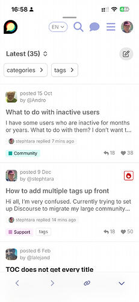
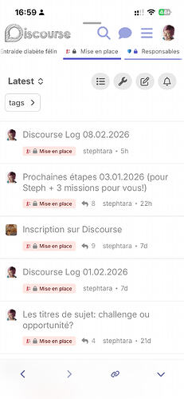
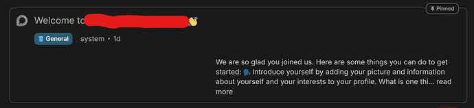
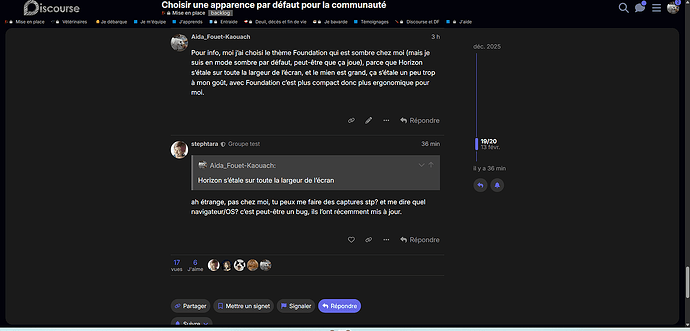
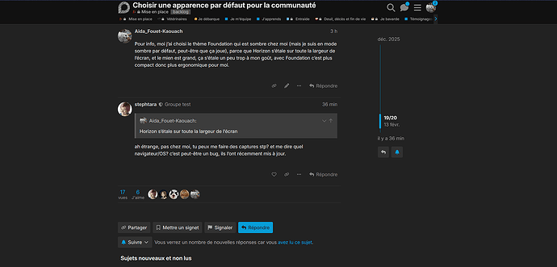
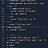
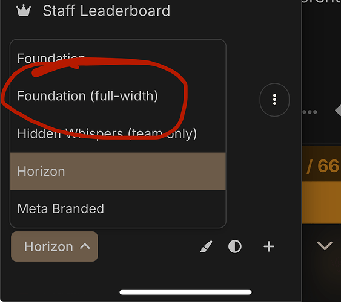

[🏠 Home](../../index.md) | [📋 Latest](../../latest/index.md) | [🔥 Top](../../top/replies/index.md) | [👥 Users](../../users/index.md)

[Home](../../index.md) » [Theme](../../c/theme/index.md) » Horizon Theme

---

# Horizon Theme (Page 2 of 2)

> **Category:** Theme
> **Author:** ばこん
> **Created:** 2025-04-07 17:53

[← Previous](360486.md) | **Page 2 of 2** | Next →

---

### Post #57 by [ばこん](../../users/ばこん.md)
*Posted: 2026-02-08 13:03*

  
while participating in a group

  
When not participating in a group

* * *

The header and sidebar designs appear to have changed due to the modernization of the Foundation theme.

---

### Post #58 by [stephtara](../../users/stephtara.md)
*Posted: 2026-02-08 16:02*

I don’t know if this is the right place to post this but I like the way Horizon on Meta displays a couple of lines of each topic in category view. I can’t seem to reproduce it in my side and I’m not sure where to start looking. Thanks!!

---

### Post #59 by [Lilly](../../users/Lilly.md)
*Posted: 2026-02-08 16:35*

can read about it here

[Horizon: High Context Topic Cards](https://meta.discourse.org/t/horizon-high-context-topic-cards/393470) [Announcements](/c/announcements/67)

> What’s new in Horizon? We’re happy to announce the next iteration for the Horizon theme: high-context topic cards. These cards surface key signals at a glance, pulling in data from familiar favourites: [Solved](https://meta.discourse.org/t/discourse-solved/30155) (1) [Topic Voting](https://meta.discourse.org/t/discourse-topic-voting/40121) (2) [Assign](https://meta.discourse.org/t/discourse-assign/58044) (3) Good old tags (4) Excerpts We have also rearranged the layout, refined spacing and typography, and expanded the last-reply preview; aiming for a balanced experience. Desktop [[CleanShot 2026-01-14 at 19.12.48@2x]](../../../assets/images/360486/eadd37184899de57d2ffc5622d33dc9b4ee4a077.jpeg "CleanShot 2026-01-14 at 19.12.48@2x") Mobile [[CleanShot 2026-01-14 at 19.19.0…](../../../assets/images/360486/4a331f22645a0ee5c4ad7d1e9fecf09ee2598560.jpeg "CleanShot 2026-01-14 at 19.19.04@2x")

---

### Post #60 by [chapoi](../../users/chapoi.md)
*Posted: 2026-02-11 15:07*

9 posts were split to a new topic: [RTL issue with @ placement in user names](/t/rtl-issue-with-placement-in-user-names/395810)

---

### Post #61 by [chapoi](../../users/chapoi.md)
*Posted: 2026-02-16 16:16*

2 posts were split to a new topic: [Compact/Expanded view not working on Horizon](/t/compact-expanded-view-not-working-on-horizon/396206)

---

### Post #64 by [NateDhaliwal](../../users/NateDhaliwal.md)
*Posted: 2026-02-12 04:51*

Globally pinned topics have its excerpt right-aligned (this is on my free forum):

---

### Post #65 by [chapoi](../../users/chapoi.md)
*Posted: 2026-02-14 09:47*

2 posts were split to a new topic: [Horizon interaction with Brand Header](/t/horizon-interaction-with-brand-header/396096)

---

### Post #67 by [chapoi](../../users/chapoi.md)
*Posted: 2026-02-14 09:49*

A post was split to a new topic: [Flair issues on Horizon](/t/flair-issues-on-horizon/396097)

---

### Post #69 by [chapoi](../../users/chapoi.md)
*Posted: 2026-02-16 16:11*

A post was split to a new topic: [Two-Level Subcategories Display Issue](/t/two-level-subcategories-display-issue/396203)

---

### Post #70 by [stephtara](../../users/stephtara.md)
*Posted: 2026-02-14 20:28*

I’m not sure if this is about Horizon or the [Header Categories Navbar](https://meta.discourse.org/t/header-categories-navbar/249179) component. It was pointed out to me that the menu bar on Horizon starts far left, unlike in other themes (Foundation for comparison), which is weird on wide monitors.

Horizon:

Foundation:

Is this desired? Or something that might need fixing? I have to say that if the content width is constrained, it would seem logical to me not to have the menu bar start all the way over there to the left.

---

### Post #71 by [chapoi](../../users/chapoi.md)
*Posted: 2026-02-16 16:05*

 NateDhaliwal:

> Globally pinned topics have its excerpt right-aligned (this is on my free forum):

Can you still repro this? Atm I can’t locally.

---

### Post #72 by [chapoi](../../users/chapoi.md)
*Posted: 2026-02-16 16:08*

 stephtara:

> Is this desired?

Horizon uses the full-width component, so if you would use Foundation (full-width) theme, you’d see the same I think.

So while I agree it isn’t the best-looking layout, this is currently expected for all themes that use a full-width layout yes.

---

### Post #73 by [stephtara](../../users/stephtara.md)
*Posted: 2026-02-16 18:13*

Screenshots provided shows it’s different in Horizon and Foundation 

Or am I missing something?

---

### Post #74 by [chapoi](../../users/chapoi.md)
*Posted: 2026-02-16 18:15*

Is the screenshot from foundation or foundation-full-width?

---

### Post #75 by [stephtara](../../users/stephtara.md)
*Posted: 2026-02-16 18:16*

Oh! Need to check that. Didn’t know there was a distinction!

---

### Post #76 by [stephtara](../../users/stephtara.md)
*Posted: 2026-02-16 18:53*

I don’t seem to have installed Foundation full-width, tried searching on meta and didn’t come up?

---

### Post #77 by [chapoi](../../users/chapoi.md)
*Posted: 2026-02-16 19:24*

Its not a specific theme, it’s this component: [Discourse Full-width component](https://meta.discourse.org/t/discourse-full-width-component/292496)

---

[← Previous](360486.md) | **Page 2 of 2** | Next →
