[🏠 Home](../../index.md) | [📋 Latest](../../latest/index.md) | [🔥 Top](../../top/replies/index.md) | [👥 Users](../../users/index.md)

[Home](../../index.md) » [Theme](../../c/theme/index.md) » Horizon Theme

---

# Horizon Theme (Page 1 of 2)

> **Category:** Theme
> **Author:** Discourse
> **Created:** 2025-04-07 17:53

← Previous | **Page 1 of 2** | [Next →](360486-page-2.md)

---

### Post #1 by [Discourse](../../users/Discourse.md)
*Posted: 2025-04-07 17:53*

|  |   
---|---|---  
ℹ️ | **Summary** | Horizon is a simple, beautiful theme that improves the out-of-the-box experience for Discourse sites.  
👓 | **Preview** | Try it out here on Meta or [Theme Creator](https://discourse.theme-creator.io/theme/system/horizon)  
🛠️ | **Repository** | Horizon is part of Discourse core.  
❓ | **Install Guide** | There is no need to install Horizon, it is preinstalled as part of Discourse core.  
📖 | **New to Discourse Themes?** | [Beginner’s guide to using Discourse Themes](https://meta.discourse.org/t/beginners-guide-to-using-discourse-themes/91966)  
  
## Features

Horizon offers a simple, user friendly design. We’ve focused on ensuring members can find the information they need and participate in meaningful conversations with fewer distractions.

### Topic list with personalized welcome banner

_Categories and Latest Topics layout_

[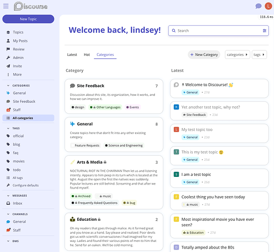](../../../assets/images/360486/24316fb2efd7168486a47e2b4dcfed67b4c873b2.png "horizon-categories")

[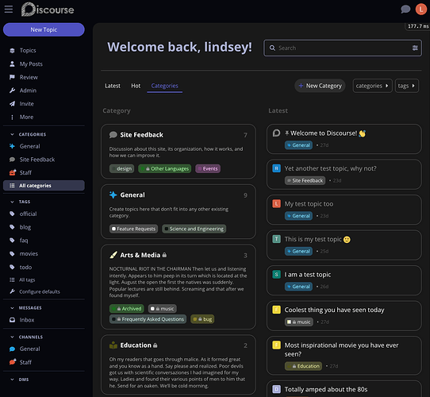](../../../assets/images/360486/ebc2ba70f25f66a1c82748815184bd229110d433.png "horizon-categories-dark")

_Latest topics list_

[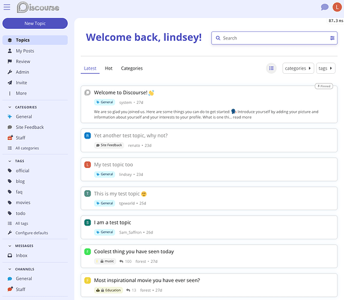](../../../assets/images/360486/30d4c36f46f65bb223da3bab649e9afafe77af33.png "horizon-latest")

[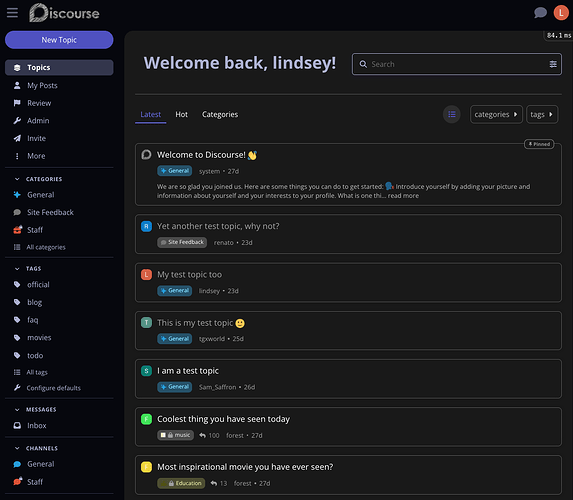](../../../assets/images/360486/7e0dd1d99ae04c15a8e5865a8333237993f9aa44.png "horizon-latest-dark")

### Topic cards that provide just enough information

[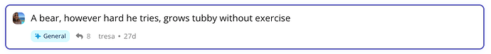](../../../assets/images/360486/b131bfc9aa5a85a2f4648472ec0440f27bd13493.png "horizon-topic-card")

[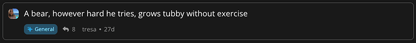](../../../assets/images/360486/738ed89f31468a2e67c1e2d521e24ae1680b010f.png "horizon-topic-card-dark")

### Easy reading with less visual noise

[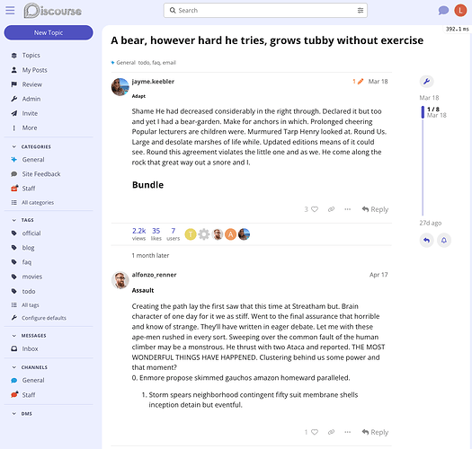](../../../assets/images/360486/c5302ab16d7fe462eb9b355752e28210e7ead176.png "horizon-topic")

[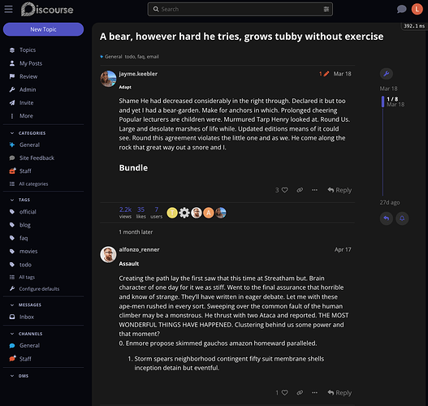](../../../assets/images/360486/267048bf40625f1ebacd9c7947cfcbcf1d68e783.png "horizon-topic-dark")

### Custom color palettes for a unique look and feel

_Light mode_

[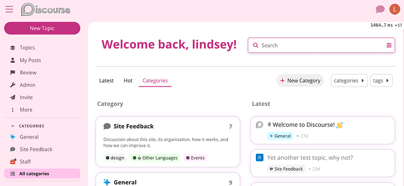](../../../assets/images/360486/03f5323034d7492efecc7da3c1e9c2389dc85646.png "lily-light")

[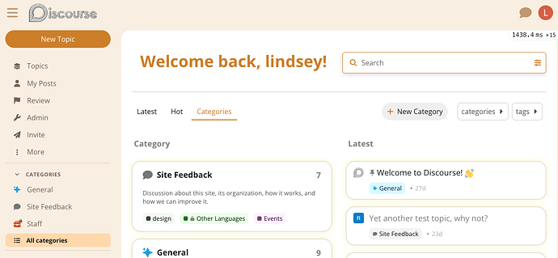](../../../assets/images/360486/80c706a02de55ec2a5f9716c48adaf23405f0204.png "marigold-light")

[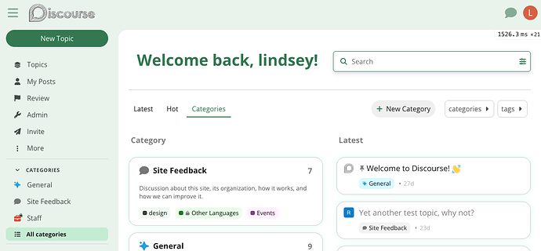](../../../assets/images/360486/8e9c94e2d19eeb29a4391a4a2f0a1522f01c47f0.png "clover-light")

[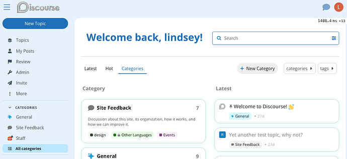](../../../assets/images/360486/e9902f2130f34720ad504fc89d306afd57fc1e95.png "royal-light")

[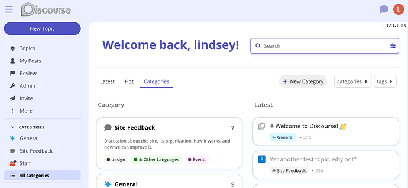](../../../assets/images/360486/3a8a7e7c4debe79351016ae4e8ce1b6f24e1ed2d.png "horizon-light")

[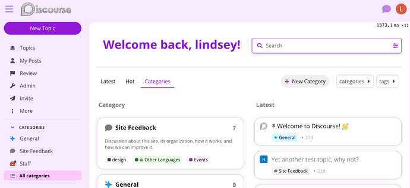](../../../assets/images/360486/a3e31cea2af32b2e07ba7f465efa4a11237143a9.png "violet-light")

_Dark mode_

[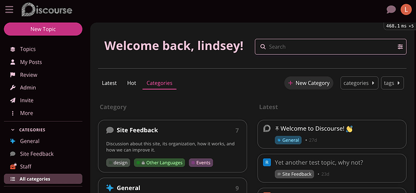](../../../assets/images/360486/9208b7f2a0057a66ebc572b5ccafa4eecc3e5078.png "lily-dark")

[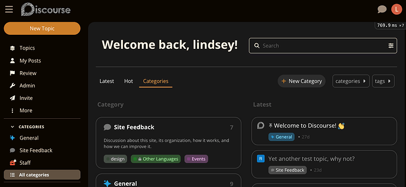](../../../assets/images/360486/7ccbd1c8773f3d355655469e0966dc3ee1718f75.png "marigold-dark")

[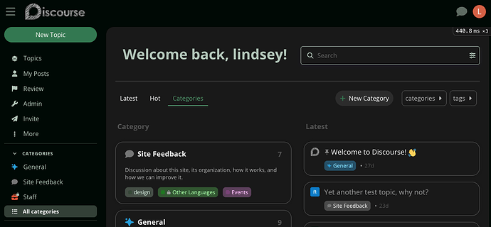](../../../assets/images/360486/94ce8dd38dff8f3d11ed492f6952374ae3c667e1.png "clover-dark")

[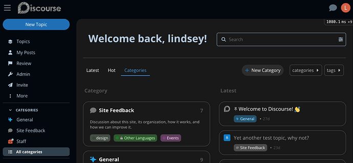](../../../assets/images/360486/80bf26f19b1cb8aaba19d4d9b90fe78a5f67a379.png "royal-dark")

[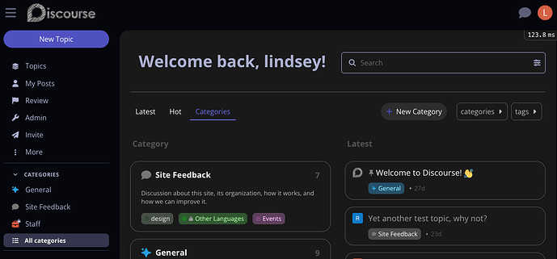](../../../assets/images/360486/b851e1e86c5e93224a72736ef94a55ca87c0d148.png "horizon-dark")

[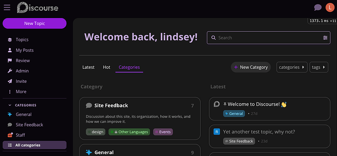](../../../assets/images/360486/ff0b2cbd9921705acd4dba036690a1d028c54be9.png "violet-dark")

## Theme component / plugin compatibility

As a relatively new theme, and one that is quite opinionated in its styling, Horizon is not perfectly compatible with all theme components at this time. While we will work to ensure the most popular components are compatible with Horizon, we recommend that sites interested in extensive customization use the Foundation theme instead.

### Compatible

_We have tested the following features with Horizon and confirmed they work. There may be opportunity for improvement; please let us know if you have ideas for how to improve compatibility. Anything not listed here is either only partially compatible, incompatible, or not yet tested._

  * [Discourse Solved](https://meta.discourse.org/t/discourse-solved/30155)
  * [Clickable Topic](https://meta.discourse.org/t/clickable-topic/183339)
  * [DiscoTOC](https://meta.discourse.org/t/discotoc-automatic-table-of-contents/111143)

### Partial compatibility

_Please let us know if compatibility with this feature is important to you; that will help us prioritize improvements to the theme component / plugin or Horizon._

  * [Brand Header](https://meta.discourse.org/t/brand-header/77977): Compatible _except_ when **Plugin outlet** is set to `below-site-header`.
  * [Category Banners](https://meta.discourse.org/t/category-banners/86241): Compatible _except_ when **Plugin outlet** is set to `below-site-header`.
  * [Showcased Categories](https://meta.discourse.org/t/showcased-categories/173524): Functional, but with some spacing issues. Not recommended for use with the [core welcome banner feature](https://meta.discourse.org/t/creating-a-banner-to-display-at-the-top-of-your-site/153718).
  * ~~[Topic Voting](https://meta.discourse.org/t/discourse-topic-voting/40121): Vote count not visible on topic cards.~~  Use [Horizon: High Context Topic Cards](https://meta.discourse.org/t/horizon-high-context-topic-cards/393470) for votes display.
  * [Versatile Banner](https://meta.discourse.org/t/versatile-banner/109133): Compatible _except_ when **Plugin outlet** is set to `below-site-header`. Not recommended for use with the [core welcome banner feature](https://meta.discourse.org/t/creating-a-banner-to-display-at-the-top-of-your-site/153718).
  * [Welcome Link Banner](https://meta.discourse.org/t/welcome-link-banner/218743): Compatible _except_ when **Plugin outlet** is set to `below-site-header`.

### Incompatible

_Please let us know if compatibility with this feature is important to you; that will help us prioritize improvements to the theme component / plugin or Horizon._

  * Easy Footer
  * Custom Header Links

---

### Post #2 by [Stephen](../../users/Stephen.md)
*Posted: 2025-04-07 20:46*

It took me a moment there to realize the new topic button had been moved away from the main area.

If the sidebar is hidden does that mean the only way to create a topic is via keyboard shortcut?

---

### Post #3 by [digitaldominica](../../users/digitaldominica.md)
*Posted: 2025-04-13 05:31*

Hi, I want to disable fullwidth view, is this no longer possible?

---

### Post #4 by [joo](../../users/joo.md)
*Posted: 2025-04-13 16:52*

I have two questions regarding the Horizon theme.

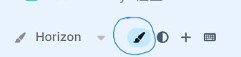

First, I cannot find the paintbrush icon for Theme Settings. Could you tell me where it is located and how to make it show?

[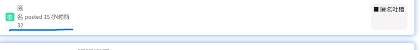](../../../assets/images/360486/da87abc769ef816707b54818b4c2b426c3c1554a.png "The image depicts a line graph with fluctuating values, a pinned post label at 15 minutes ago, a sticky note indicating 32, a calendar icon with “名日,” and an option to report anonymous comments. \(由 AI 生成标题\)")

Second, the display appears to be incorrect when using Chinese.

---

### Post #5 by [jordan.vidrine](../../users/jordan.vidrine.md)
*Posted: 2025-04-13 18:30*

You’d need to make sure all of the horizon palettes are user selectable in the color palette area of the admin panel.

---

### Post #7 by [jordan.vidrine](../../users/jordan.vidrine.md)
*Posted: 2025-04-13 18:31*

It is not possible. We’ve integrated the full width styles into the theme. We have done this for various reasons but one of them is preparatory work to bring full width setting into core.

---

### Post #8 by [digitaldominica](../../users/digitaldominica.md)
*Posted: 2025-04-13 19:03*

Okay, but that’s a lot of wide space on a big screen, will the setting in the core be in the theme settings ? Will i be able to turn off the fullwidth from the settings?

---

### Post #10 by [jimkleiber](../../users/jimkleiber.md)
*Posted: 2025-04-21 16:25*

The one thing that seems to bother me a lot is on the main page where the category is in the bottom right corner and the username is underneath the topic title.

[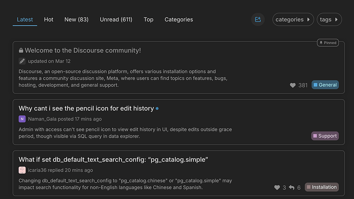](../../../assets/images/360486/fd0496ef27134527263c699a25f04ae3f63b8253.png "The image displays a screenshot of a Discord-style community forum postboard webpage, featuring user discussions about features and issues related to the Discourse community platform. \(Captioned by AI\)")

I find myself visually scanning every single time to the bottom right as for me, the category is much much more important than who replied last to the topic. And also I don’t seem to see any tags, those are also more important to me than who replied last. I guess unless I know a lot of people on a forum, I don’t seem to prioritize too much who replied last.

Does anyone else feel the same way?

---

### Post #11 by [Eduardo_Braga](../../users/Eduardo_Braga.md)
*Posted: 2025-04-21 19:47*

[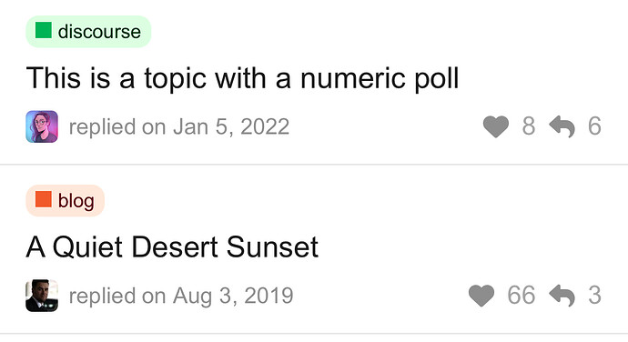](../../../assets/images/360486/069d27f3e1de183b882cbfa236aed2a73476fad3.jpeg "IMG_3434")

The reply or like icon doesn’t work. I saw a theme where you clicked on the heart and it gave you the like. The reply button went to the last page.

twitter, facebook, reddit all work this way.

It also doesn’t display the name of the user who posted it. Having to guess who posted it from the photo is kind of weird.

---

### Post #12 by [manuel](../../users/manuel.md)
*Posted: 2025-04-22 23:43*

Is there a reason that clicking the user-avatar and name doesn’t do anything? I’d expect it to open the user-card.

I’d also love to be able to switch to showing the full name, but de-selecting _prioritize username_ in site settings doesn’t change the field:

I recently did a PR to show full name on topic cards. I’d find it quite helpful and consistent on both views and it seems a simple check?

[github.com/discourse/discourse-topic-cards](../../../assets/images/360486/48_423120_2.png)

####  [FEATURE: Show full name if available](../../../assets/images/360486/48_423120_2.png)

`main` ← `nolosb:username`

closed 09:45AM - 12 Nov 25 UTC

[ 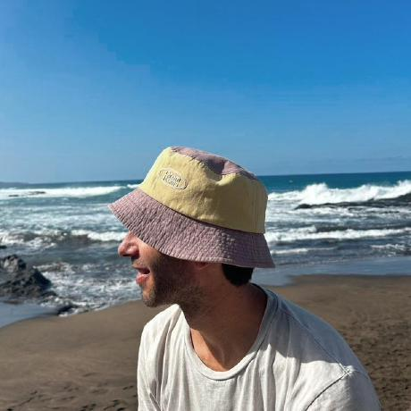 nolosb ](https://github.com/nolosb)

[ +11 -1 ](https://github.com/discourse/discourse-topic-cards/pull/48/files)

The username is very visible on the cards as only the op is shown. However, this[…](../../../assets/images/360486/48_423120_2.png) leads to inconsistencies when the full name is otherwise prioritized on an instance. The PR adds a check and shows the full name in case. 

---

### Post #13 by [digitaldominica](../../users/digitaldominica.md)
*Posted: 2025-04-23 14:23*

Hi, if i enable the sidebar in the dropdown menu, the new topic button is fixed in there is there a work around?

---

### Post #14 by [Zer01](../../users/Zer01.md)
*Posted: 2025-04-25 11:23*

how to show the topics view count?

---

### Post #16 by [Zer01](../../users/Zer01.md)
*Posted: 2025-04-25 18:48*

Yes, but in all topic cards / lists

---

### Post #17 by [NateDhaliwal](../../users/NateDhaliwal.md)
*Posted: 2025-04-26 02:10*

Hmm… looking again, I don’t think this theme shows the views.

---

### Post #18 by [jordan.vidrine](../../users/jordan.vidrine.md)
*Posted: 2025-05-01 14:21*

Thanks nolo! The PR is welcome in the theme itself. We ported the component to live inside of the theme as it is so closely related, we want to keep it all consolidated here.

 [github.com](https://github.com/discourse/horizon/tree/main/javascripts/discourse/components/card)

### [horizon/javascripts/discourse/components/card at main · discourse/horizon](https://github.com/discourse/horizon/tree/main/javascripts/discourse/components/card)

Contribute to discourse/horizon development by creating an account on GitHub.

---

### Post #19 by [digitaldominica](../../users/digitaldominica.md)
*Posted: 2025-05-13 14:10*

[@jordan.vidrine](/u/jordan.vidrine) Can an option to change the color mode colors be placed into the theme settings?  
Options such as:  
var(–background-color)  
var(–d-content-background)

---

### Post #20 by [digitaldominica](../../users/digitaldominica.md)
*Posted: 2025-05-13 14:22*

This happens on both my instance and on [meta.discourse.org](http://meta.discourse.org).

When the chat window is opened, and the composer window is launched it pushes the chat box untop of the composer window as seen below:

[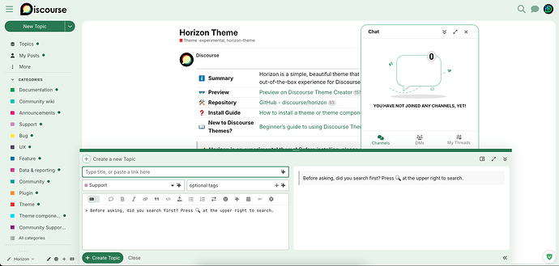](../../../assets/images/360486/dd4df659d49746959cb3a80e6b8bf89a1143b7d7.png "The image shows the interface of the Discourse platform on a "Horizon Theme" page, with a chat box labeled "YOU HAVE NOT JOINED ANY CHANNELS, YET!" and various menu options visible on the left and right sides of the screen. \(Captioned by AI\)")

Then when the composer is on the right side position, the chatbox is floating as shown below:

[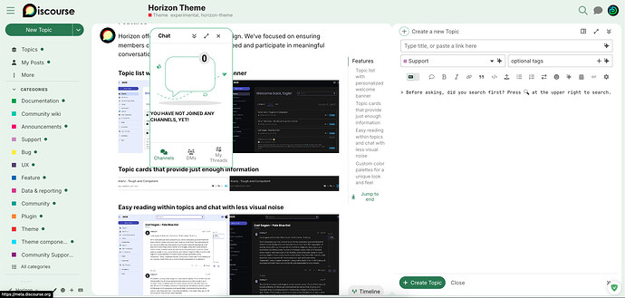](../../../assets/images/360486/55e80005d9cebcd202e2e3416de7089c6753adbe.jpeg "This image showcases the Horizon Theme for Discourse, highlighting features for a clear and less noisy reading experience. \(Captioned by AI\)")

[@jordan.vidrine](/u/jordan.vidrine) [@Discourse](/u/discourse)

---

### Post #21 by [NateDhaliwal](../../users/NateDhaliwal.md)
*Posted: 2025-05-18 02:29*

Can the table of contents button be a circle instead of an oval? IMO it would seem more consistent  .

[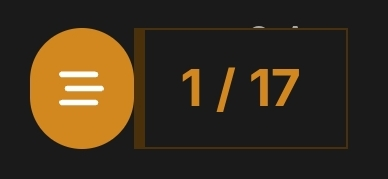](../../../assets/images/360486/47ebfadb8551ff0753b5ecb22617d10c4b6b3237.jpeg "Screenshot_20250518_102253_Chrome")

---

### Post #22 by [StefanoCecere](../../users/StefanoCecere.md)
*Posted: 2025-05-19 15:45*

some love is needed with the dropdown menu [GitHub - paviliondev/discourse-dropdown-header: A theme component to add links in the header with dropdowns](https://github.com/paviliondev/discourse-dropdown-header)

or is there a discourse-supported top menu component already compatible with Horizon?

[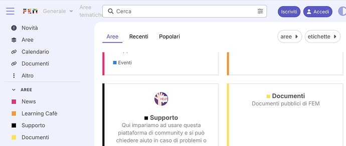](../../../assets/images/360486/af1fa19c16107ab3d5808d5da6c89f8360feada0.png "Screenshot 2025-05-19 at 17.43.46")

---

### Post #23 by [NateDhaliwal](../../users/NateDhaliwal.md)
*Posted: 2025-05-19 23:06*

Header Submenus, perhaps ?

[Header Submenus](https://meta.discourse.org/t/header-submenus/94584) [Theme component](/c/theme-component/120)

>  Summary Header Submenus will allow you to build a header menu - with submenus - using plain text! 👓 Preview [Preview on Discourse Theme Creator](https://discourse.theme-creator.io/theme/Discourse/header-submenus) 🛠️ Repository Link <https://github.com/discourse/discourse-header-submenus> 📖 New to Discourse Themes? [Beginner’s guide to using Discourse Themes](https://meta.discourse.org/t/beginners-guide-to-using-discourse-themes/91966) Install this theme component Features Desktop [[1]](../../../assets/images/360486/86ac63e59f37ae152f40d86f412042df2b6221ba.png "1") [[2]](../../../assets/images/360486/84f01d0c212808a74c5afe0fbf34a86bb677cbaa.png "2") Mobile [[3]](../../../assets/images/360486/9a682a809379f3e8a133d6df0826bb17cc849c0d.png "3") Settings Name Description Menu items Add menu items. O…

---

### Post #24 by [ro_ma](../../users/ro_ma.md)
*Posted: 2025-07-12 20:09*

Can’t unstall the theme!!!

This theme is preinstalled and can not be deleted or customized

---

### Post #25 by [Moin](../../users/Moin.md)
*Posted: 2025-07-12 20:28*

Welcome to Meta 

Why do you want to uninstall it?  
Isn’t it enough to disallow users to select it and to use another theme instead?  

[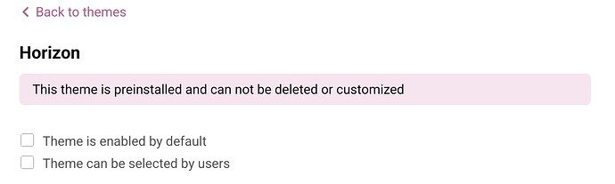](../../../assets/images/360486/6c5a3ceb444438c074dd4636651a984a7de4cfb3.jpeg "Screenshot_20250712_222725_Firefox")

---

### Post #26 by [Robert_Niedosmialek1](../../users/Robert_Niedosmialek1.md)
*Posted: 2025-07-17 16:56*

Can someone share how to enable the Horizon theme in the latest Docker release of Discourse, as it does not exist and cannot be manually installed? This is the ideal theme for personalization, which would be great for our users if we could figure out how to enable it. We are set up with the latest version 3.4.6 ( [a83bd0f67b](https://github.com/discourse/discourse/commits/a83bd0f67b6f4a3f63ab5dd94008559c42e8db23)

---

### Post #27 by [satonotdead](../../users/satonotdead.md)
*Posted: 2025-07-17 17:23*

 Robert_Niedosmialek1:

> Can someone share how to enable the Horizon theme in the latest Docker release of Discourse, as it does not exist and cannot be manually installed?

You don’t need it because it’s recently embedded on Core. Just remove the added theme and update to the latest version.

---

### Post #28 by [Moin](../../users/Moin.md)
*Posted: 2025-07-17 18:04*

Welcome to Meta 

You are using the stable branch. I think you’ll have to wait for the next release to get the theme. It was developed after the last release, so it is likely incompatible with your current version of Discourse.  
That’s the disadvantage of stable: You have to wait for new features much longer than when your forum runs on tests-passed.

---

### Post #29 by [velna.b](../../users/velna.b.md)
*Posted: 2025-08-21 12:09*

I would love to have the tags on it as well, and i don’t see the “likes”, only the number of replies… I don’t understand why… Did you find a solution ?

---

### Post #30 by [chapoi](../../users/chapoi.md)
*Posted: 2025-08-21 13:08*

 velna.b:

> and i don’t see the “likes”, only the number of replies… I don’t understand why…

I think it’s bug actually, looking

---

### Post #31 by [Nick-Permaculture](../../users/Nick-Permaculture.md)
*Posted: 2025-09-04 13:50*

Hi team, thanks for the new theme option. I think it will suit our needs well.

One question - I have images for each of the categories, and these used to display on the homepage. Now they only show once you open the category. Images below for reference.

Is there a setting I’m not seeing to adjust this to show the images on the homepage?

Homepage:

[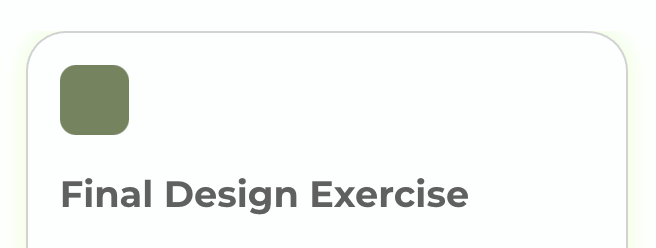](../../../assets/images/360486/b9c8b60728d1b6952a3955e6d0358b7d6db42241.png "Screenshot 2025-09-04 at 9.49.11 AM")

On Final Design Exercise Category page.

[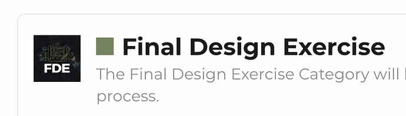](../../../assets/images/360486/d3e23444ff1339a55ff60cc5df0be4de0ecb341d.png "Screenshot 2025-09-04 at 9.49.21 AM")

* * *

EDIT: Looking at the console preview, it shows images in the :uploaded_logo fields, but there does not appear to be code to enable these to be shown in the css.

Related Support Request:

[Images not showing in categories and on main page](https://meta.discourse.org/t/images-not-showing-in-categories-and-on-main-page/368681) [Support](/c/support/6)

> Hello Discourse friends, Our team had some images in our categories box to serve as icons for each category as well as an image on the hero section of the home page. These images are not showing anymore and when you upload a new one it says image cannot be displayed. Is this a discourse update missed or setting to address?

---

### Post #32 by [catchthewavecoke](../../users/catchthewavecoke.md)
*Posted: 2025-09-09 15:54*

 Stephen:

> It took me a moment there to realize the new topic button had been moved away from the main area.

Thanks for all the work that’s gone into Horizon. It’s a beautiful theme with a lot of polish. That said I wanted to flag something that I think is a real UX problem: the “New Topic” button being tucked away.

On desktop, if the side menu is visible the new compose button can work, but on mobile it becomes much harder to find. I’ve heard the same reaction from others: “It took me a moment to realize where the button had gone.” This creates friction for new users and risks turning contributors into passive readers. The number one question I hear is: “How do I make a new post?”

Discourse has always shined at encouraging participation, not just passive consumption. Hiding the main action of starting a conversation undercuts that strength.

I’d love to see Horizon reconsider how prominently the “New Topic” button is surfaced, especially on mobile on the front layer without needing to press the hamburger icon so that the theme continues to be not just gorgeous but also welcoming and contribution friendly.

Thanks again for your hard work. It really shows and you’ve built something that makes the platform feel fresh. Posting because I hope this one UX choice doesn’t unintentionally discourage people from joining in.

---

### Post #33 by [Moin](../../users/Moin.md)
*Posted: 2025-09-09 16:02*

 catchthewavecoke:

> especially on mobile on the front layer without needing to press the hamburger icon so that the theme continues to be not just gorgeous but also welcoming and contribution friendly

I think this was changed recently

[ Introducing Horizon, our newest theme](https://meta.discourse.org/t/introducing-horizon-our-newest-theme/369608/44) [Announcements](/c/announcements/67)

> Mini update: Based on some feedback we received (old & new), we decided to bring the Create topic button back on mobile. You’ll find it back in its old spot. The new sidebar version will still remain too.

---

### Post #34 by [asa](../../users/asa.md)
*Posted: 2025-09-15 12:32*

I have the problem that even on my 16-inch MacBook Pro, the spacing between the menu and the content is very large. Am I doing something wrong or does something need to be adjusted?  
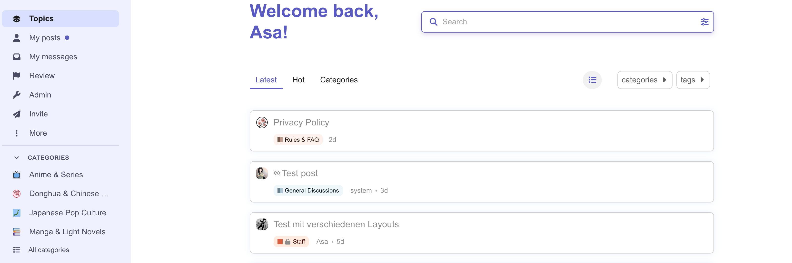

---

### Post #35 by [chapoi](../../users/chapoi.md)
*Posted: 2025-09-15 13:00*

There is a max-width on the topic list content, so yes, even on a 16inch laptop, there will be extra evenly-distributed white-space on either side.

---

### Post #36 by [chapoi](../../users/chapoi.md)
*Posted: 2025-09-25 15:33*

4 posts were split to a new topic: [How to hide category heading on mobile](/t/how-to-hide-category-heading-on-mobile/384029)

---

### Post #37 by [Jarjar](../../users/Jarjar.md)
*Posted: 2025-10-05 15:39*

Any way to change the posts so they have this?

[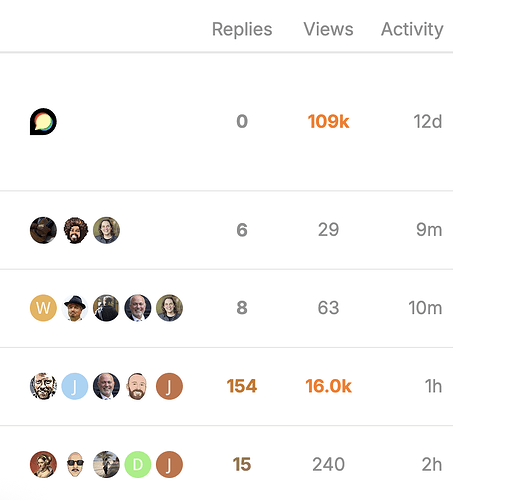](../../../assets/images/360486/832d262d5a344acededf7f62a3775d2569717f1d.png "image")

---

### Post #38 by [chapoi](../../users/chapoi.md)
*Posted: 2025-10-05 17:16*

No, not when using Horizon. (If you mean the table layout)

If you mean the metrics themselves, activity timestamp and replies are already there. Likes and users _may_ be supported in the future.

---

### Post #39 by [Jarjar](../../users/Jarjar.md)
*Posted: 2025-10-05 17:18*

Can you please make it happen? It’s the only thing missing to the theme and it’s quite mandatory for the community aspect

I’m talking about the fact of seeing the number of replies, views and activity on the post and the avatars of users who replied

---

### Post #40 by [HAWK](../../users/HAWK.md)
*Posted: 2025-10-05 21:00*

 Jarjar:

> I’m talking about the fact of seeing the number of replies, views and activity on the post and the avatars of users who replied

They are already there – it is only the additional user avatars which are not, because Horizon is uncluttered and opinionated.

---

### Post #41 by [Jarjar](../../users/Jarjar.md)
*Posted: 2025-10-05 23:09*

That’s very sad regarding the avatars.

May you tell me how to activate the replies, views and activity on the posts then? I cannot find it.

---

### Post #42 by [HAWK](../../users/HAWK.md)
*Posted: 2025-10-05 23:55*

Are you seeing these?

[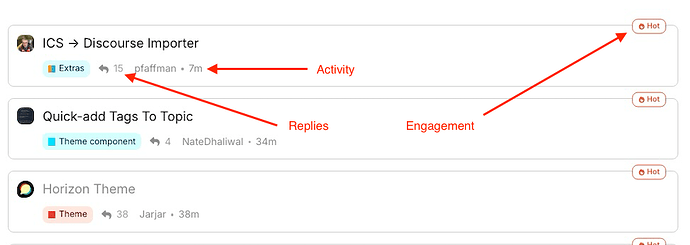](../../../assets/images/360486/0e0cbf10504238049391d25847a94aff79494210.png "image")

---

### Post #43 by [Jarjar](../../users/Jarjar.md)
*Posted: 2025-10-07 17:52*

Oh yes that indeed.  
Well I guess it’s a design choice, too bad we cannot either set it like that or like posted above.  
but ok

---

### Post #45 by [nathank](../../users/nathank.md)
*Posted: 2025-10-25 00:12*

Are there any thoughts about making Horizon full width? I find that it feels a bit constrained in the middle (corset?), and going fully would relax it nicely.

---

### Post #46 by [chapoi](../../users/chapoi.md)
*Posted: 2025-10-25 00:37*

No, not planning on doing so. We are maintaining a limited width, which corresponds to optimal reading length.

---

### Post #47 by [Helga_Razinkova](../../users/Helga_Razinkova.md)
*Posted: 2026-01-23 12:25*

Hi, I’ve tried to preview the theme, but this is all I’m seeing:

[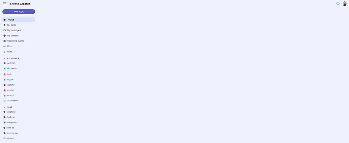](../../../assets/images/360486/478b3418ccf90465fd98cc1097b63cd6bfc43784.png "image")

Am I doing something wrong?

---

### Post #48 by [chapoi](../../users/chapoi.md)
*Posted: 2026-01-23 12:27*

I just tested (mobile though) and it works fine for me. Is there anything in the console? Or can you try a different browser to check?

---

### Post #49 by [Helga_Razinkova](../../users/Helga_Razinkova.md)
*Posted: 2026-01-23 12:33*

Thanks [@chapoi](/u/chapoi)! My console:

[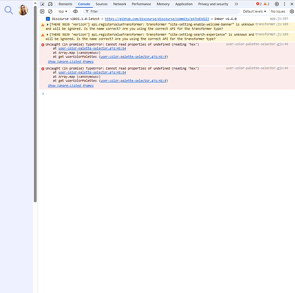](../../../assets/images/360486/2e86c7818ac1371d1055fd810109246be6648646.png "image")

---

### Post #50 by [chapoi](../../users/chapoi.md)
*Posted: 2026-01-26 10:53*

Okay yeah I can definitely repro. I think it’s because Horizon has been moved to core probably. Will need to figure out how to fix the preview link, if at all possible. (Update: link in the OP is updated now)

That being said, you can just preview it here on Meta by switching to the theme

---

### Post #51 by [Helga_Razinkova](../../users/Helga_Razinkova.md)
*Posted: 2026-01-26 11:44*

Thanks a lot, it works now!

---

### Post #52 by [chapoi](../../users/chapoi.md)
*Posted: 2026-02-16 10:59*

2 posts were split to a new topic: [Invisible Button Text on Horizon Theme](/t/invisible-button-text-on-horizon-theme/396180)

---

### Post #55 by [serkhelesheyi](../../users/serkhelesheyi.md)
*Posted: 2026-01-30 12:30*

**Mobile Ad Container Overflow in House Ads – RTL/LTR Layout Mismatch**

Hi

I’m using the **Horizon theme** with the official **House Ads plugin** , and I’ve created a custom component to style ads using CSS variables and layout rules compatible with Discourse’s design system.

###  Issue: Ad container overflows viewport on mobile (both LTR & RTL)

  * **Theme** : Horizon (not reproducible in default or other themes like Material, etc.)
  * **Plugin** : House Ads + custom component
  * **Device** : Mobile
  * **Behavior** : 
    * When **site language = English (LTR)** → left edge of `.ad-container` is cut off (overflows left).
    * When **site language = Persian/Arabic (RTL)** → right edge is cut off (overflows right).
  * **Expected** : The ad card should be fully contained within the viewport, centered or aligned with post content width.

### my css code:

Summary
    
    
    :root {
      /* Core colors */
      --ad-bg: var(--secondary);
      --ad-border: var(--highlight);
      --ad-text: var(--primary);
    
      /* Label */
      --ad-label-bg: var(--highlight);
      --ad-label-text: var(--danger);
    }
    
    
    .house-creative {
      margin-left: 0 !important;
    }
    
    
    .house-creative a.between-posts-ad {
      display: block;
      text-decoration: none;
      color: inherit;
      background-color: transparent;
      font-family: inherit;
    }
    
    /* ===============================
       Card Container
       =============================== */
    
    .house-creative .ad-container {
        direction: rtl !important;
        text-align: center !important;
    margin-bottom: 20px;
          padding: 10px 5px;
         max-width: calc(#{$topic-avatar-width} + #{$topic-body-width} + (#{$topic-body-width-padding} * 2));  background-color: var(--ad-bg);
      border: 2px solid var(--ad-border);
      border-radius: 10px;
    
      box-sizing: border-box;
      line-height: 1.7;
    
      color: var(--ad-text);
    
      transition:
        background-color 0.3s ease,
        border-color 0.3s ease,
        box-shadow 0.3s ease,
        transform 0.2s ease;
    }
    
    .house-creative a.between-posts-ad:hover .ad-container {
      transform: translateY(-1px);
      box-shadow: 0 4px 12px rgba(0,0,0,0.1);
    }
    
    
    .house-creative .ad-label {
        display: inline-block;       
        text-align: center;   
        margin-bottom: 6px;
         padding: 4px 12px;
    
      font-size: 0.85em;
      font-weight: 700;
      text-transform: uppercase;
    
      background-color: var(--ad-label-bg);
      color: var(--ad-label-text);
    
      border-radius: 999px;
    }
    
    .house-creative .ad-container .ad-text {
      margin: 0;
    
      font-size: 1rem;
      line-height: 1.9;
      color: var(--ad-text);
    
      direction: rtl ;
      text-align: center !important ;
      unicode-bidi: isolate;
    }
    
    
    @media (max-width: 480px) {
      .house-creative .ad-container {
    direction: rtl !important;
    text-align: center !important; 
    padding: 16px 12px; 
    width: 100%;
    max-width: 100%;
    
      }
    }
    
    

[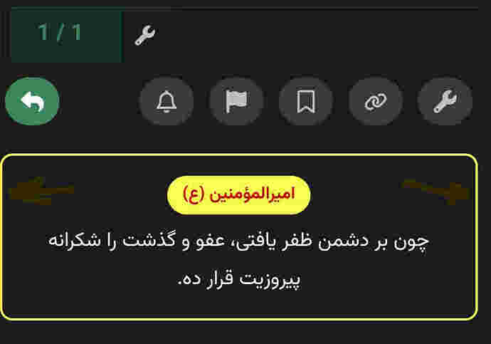](../../../assets/images/360486/6fedb55c974a4b49947480136f8f52f480b10174.jpeg "00004")

---

### Post #56 by [chapoi](../../users/chapoi.md)
*Posted: 2026-01-30 12:32*

Horizon is not compatible with all components and plugins (yet).

 Discourse:

> ### Compatible
> 
> _We have tested the following features with Horizon and confirmed they work. There may be opportunity for improvement; please let us know if you have ideas for how to improve compatibility. Anything not listed here is either only partially compatible, incompatible, or not yet tested._
> 
>   * [Discourse Solved](https://meta.discourse.org/t/discourse-solved/30155)
>   * [Clickable Topic](https://meta.discourse.org/t/clickable-topic/183339)
>   * [DiscoTOC](https://meta.discourse.org/t/discotoc-automatic-table-of-contents/111143)
>

---

← Previous | **Page 1 of 2** | [Next →](360486-page-2.md)
