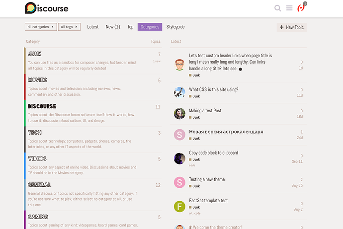
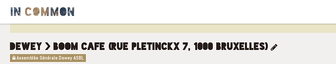
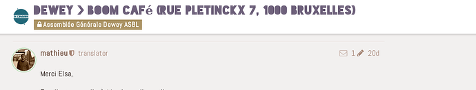

[🏠 Home](../../index.md) | [📋 Latest](../../latest/index.md) | [🔥 Top](../../top/replies/index.md) | [👥 Users](../../users/index.md)

[Home](../../index.md) » [Theme](../../c/theme/index.md) » IN COMMON Theme

---

# IN COMMON Theme

> **Category:** Theme
> **Author:** hellekin
> **Created:** 2018-11-03 19:40

---

### Post #1 by [hellekin](../../users/hellekin.md)
*Posted: 2018-11-03 19:40*

Hello there,

I started developing a – my first – theme for <https://talk.incommon.cc> that you can [preview on the theme creator](https://theme-creator.discourse.org/theme/hellekin/incommon-theme).

It’s not yet used on IN COMMON because I need to fix the JavaScript. [Help and pointers welcome!](https://framagit.org/incommon.cc/discourse-incommon-theme/issues/1 "Link to issue")

Here’s a screenshot:

  *[PR]: Pull Request

---

### Post #2 by [hellekin](../../users/hellekin.md)
*Posted: 2018-11-05 11:35*

I managed to replace accents in category names, but not in cooked posts yet:
    
    
    
    
  *[PR]: Pull Request

---

### Post #3 by [hellekin](../../users/hellekin.md)
*Posted: 2018-11-05 13:06*

Ha! I manage to fix in cooked posts, but then, I lost category names 😛
    
    
     
    

I will let others explain what’s wrong to me, because it’s still Vogon poetry.

Duh. [I give up](https://framagit.org/incommon.cc/discourse-incommon-theme/commits/javascript). <= link to numerous commits to try (and fail) variations… Without understanding anything, I cannot do anything else.

## v0.4.1 update

Right, this is **v0.4.1** of this theme. The accent removal mostly works with a few exceptions that belong to in-page events not covered yet. The code is a bit ugly since it’s redundant. I guess once I figure out the `appEvents` I can use a cleaner way to do my thing.

Here’s an example bug:

  1. We can see the title has been converted to unaccented characters (on café).  

  2. But then when we scroll, the title moves to the banner, and this event is not covered by the `stripAccentsFromTitle` function  

Does anyone have a pointer to a list of `appEvents` and how to use them?

p.s.: I can’t reply to myself more than three times, so I edited this post. Sorry.
  *[PR]: Pull Request

---

### Post #4 by [Remah](../../users/Remah.md)
*Posted: 2019-11-03 06:41*

Interesting but the typeface is not easy to read. Wouldn’t it be easier to get a font that has accented characters?

I usually try to avoid typefaces that are slower to read because slowing reading is better reserved for text where slowing reading can increase comprehension.

P.S. Mainly posted so you get three more posts if you need them.
  *[PR]: Pull Request

---
