[🏠 Home](../../index.md) | [📋 Latest](../../latest/index.md) | [🔥 Top](../../top/replies/index.md) | [👥 Users](../../users/index.md)

[Home](../../index.md) » [Theme](../../c/theme/index.md) » Isabelle, an Animal Crossing inspired theme

---

# Isabelle, an Animal Crossing inspired theme

> **Category:** Theme
> **Author:** awesomerobot
> **Created:** 2020-03-21 01:22

---

### Post #1 by [awesomerobot](../../users/awesomerobot.md)
*Posted: 2020-03-21 01:22*

I think we can all use a bit of an escape this week, so I’ve built a theme based on one of my favorite game series: [Animal Crossing](https://en.wikipedia.org/wiki/Animal_Crossing). This one is specifically inspired by [Pocket Camp](https://ac-pocketcamp.com/en-US/site)’s interface.

This theme features calm earthy colors, rounded corners, and chunky buttons.

[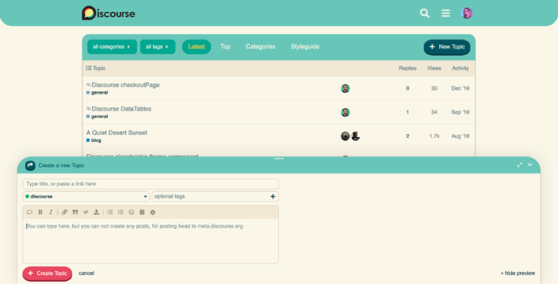](../../../assets/images/145005/4cc437b71d468ba5edb12c0e37e597f523bcce02.png "Screen Shot 2020-03-20 at 9.10.47 PM")

 [Github repo](https://github.com/awesomerobot/discourse-isabelle-theme): `https://github.com/awesomerobot/discourse-isabelle-theme `

🐱 [Preview on Theme Creator](https://theme-creator.discourse.org/theme/awesomerobot/isabelle)

🐶 [Installing a theme or theme component](https://meta.discourse.org/t/how-do-i-install-a-theme-or-theme-component/63682)

There’s still a little more refinement to be done, and I’d like to add some fun background pattern options… but I’m sharing this today to celebrate the release of [New Horizons](https://www.nintendo.com/games/detail/animal-crossing-new-horizons-switch/). ❤️

---

### Post #2 by [codinghorror](../../users/codinghorror.md)
*Posted: 2020-03-21 01:50*

I just finished setting this game up with one of my daughters! Lovely 😍

---

### Post #3 by [franciscom](../../users/franciscom.md)
*Posted: 2020-03-22 01:26*

This theme is so cute! 😍😍

---

### Post #4 by [j.jaffeux](../../users/j.jaffeux.md)
*Posted: 2020-03-23 15:06*

Now we need a topic transform animation when you scroll topic 😛

Amazing work [@awesomerobot](/u/awesomerobot) !

---

### Post #9 by [İyi_Fırsat](../../users/İyi_Fırsat.md)
*Posted: 2020-09-23 09:19*

this is good job , ty.

---

### Post #14 by [IrisBetty](../../users/IrisBetty.md)
*Posted: 2020-11-20 03:14*

HI Kris: I love your theme and have installed it. But I’m a newbie and have a question - I need to remove the share button and I can’t edit the theme. Do yo have a component that does this? Have to remove it as my group is a very private and confidential group. tx for any advice.

---

### Post #15 by [manuel](../../users/manuel.md)
*Posted: 2020-11-20 03:26*

You can go to your Admin Settings and search for ‘share’. The first result shows the post menu. Just remove the share item from the post menu.

---

### Post #16 by [IrisBetty](../../users/IrisBetty.md)
*Posted: 2020-11-20 03:28*

That doesn’t remove it from the bottom of the post unfortunately. Already done that.

---

### Post #17 by [anon23393886](../../users/anon23393886.md)
*Posted: 2020-11-21 17:49*

Wow! This theme is gorgeous! ❤️

---

### Post #18 by [geoff777](../../users/geoff777.md)
*Posted: 2020-11-22 14:53*

#topic-footer-button-share-and-invite { display:none; }

---

### Post #19 by [Ziirahdane](../../users/Ziirahdane.md)
*Posted: 2020-11-25 03:10*

Can editing css/html be enabled? I don’t see the option and would like to make a few tweaks to the theme. :<

---

### Post #20 by [manuel](../../users/manuel.md)
*Posted: 2020-11-25 10:11*

Best practice is not to store your CSS with a remote theme and this has been enforced recently. This post explains the change and how to keep your local css edits:

[Restrict editing of remote themes](https://meta.discourse.org/t/restrict-editing-of-remote-themes/170051) [Announcements](/c/announcements/67)

> For quite a while, best practice has been to avoid editing themes installed from a remote Git repository locally on Discourse. Any changes to theme code or uploads get wiped out when updating the theme from the remote repo. In this commit, we’ve removed the ability to locally edit a remote theme and are now enforcing this best practice in Discourse. What happens if I have a remote theme with local changes? Nothing at this point. Your theme stays as is until you remove it or update it from re…

---

### Post #22 by [anon23393886](../../users/anon23393886.md)
*Posted: 2020-11-25 13:11*

DELETETHISACCOUNT:

> i wonder if someone would make a forza motorsport (or horizon) themed one… 

Or a Minecraft theme… 

---

### Post #34 by [png](../../users/png.md)
*Posted: 2021-05-06 13:49*

Lovely theme! But one question, how many bells do I need to give Tom Nook so I can get it?

---

### Post #35 by [codinghorror](../../users/codinghorror.md)
*Posted: 2021-05-07 05:45*

If you have to ask, you can’t afford it! 😉

---

### Post #36 by [barisbulutdemir](../../users/barisbulutdemir.md)
*Posted: 2021-05-15 14:58*

How can I change font size ?

---

### Post #37 by [Green_Your_Lab](../../users/Green_Your_Lab.md)
*Posted: 2021-07-29 16:19*

Beautiful theme. Love it so much.

I noticed on the TOS, Privacy, FAQ and About pages, you can usually navigate from one to another using the buttons at the top, but they’re missing in this theme. Actually, they’re there if you hover, but how will people know to hover in the exact right spot? Hope you can fix this in the next update.

[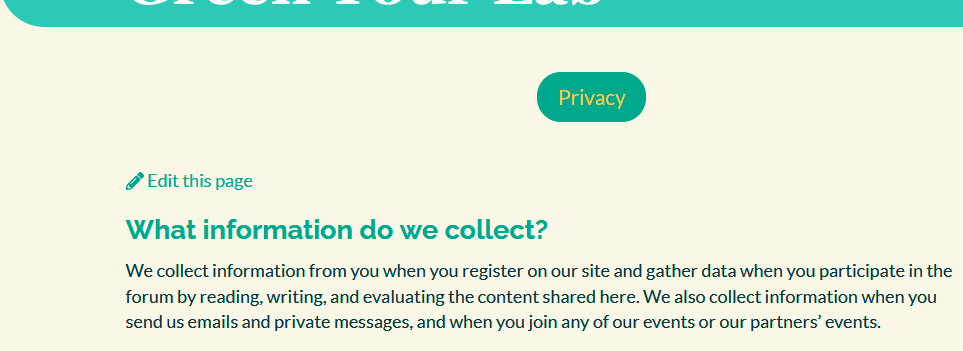](../../../assets/images/145005/b9b80aee9af311604855dd430e3d5516a76e502d.png "image")

---

### Post #38 by [awesomerobot](../../users/awesomerobot.md)
*Posted: 2021-07-30 00:32*

I’ve just made an update with a fix, thanks for reporting it!

---

### Post #39 by [fang](../../users/fang.md)
*Posted: 2022-07-29 16:28*

Such a beautiful theme. 😃

---

### Post #40 by [darkpixlz](../../users/darkpixlz.md)
*Posted: 2022-08-02 00:48*

Looks great!

Maybe the animal crossing font?  
It’s Fink Heavy if you want the name

---

### Post #41 by [bosal](../../users/bosal.md)
*Posted: 2022-11-16 19:58*

Hey, love this theme, but something is wrong with those elemnts in chat:  
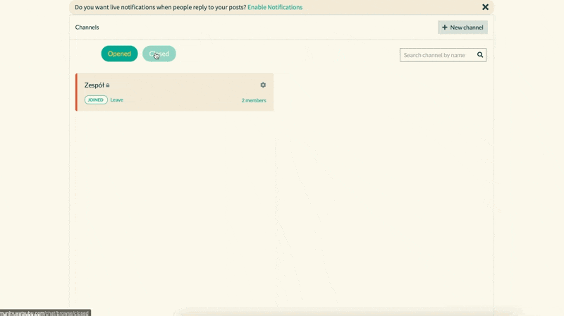

How can i fix that or will there be a update ?

---

### Post #42 by [awesomerobot](../../users/awesomerobot.md)
*Posted: 2022-11-17 18:58*

The theme was built before chat existed, so it will need an update. I can probably get to that soon.

---

### Post #43 by [bosal](../../users/bosal.md)
*Posted: 2022-11-17 19:09*

Oh, great so I also found something else

[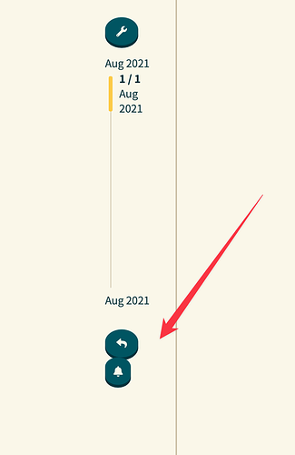](../../../assets/images/145005/2b4c87fdf613818c0878a9a960ab956eef57da23.png "CleanShot 2022-11-17 at 20.07.57@2x")

---

### Post #44 by [patrickemin](../../users/patrickemin.md)
*Posted: 2024-03-22 19:49*

Hi I am setting up a new Discourse instance, has the Chat been enabled on that lovely theme? Thanks.

---

### Post #45 by [Arkshine](../../users/Arkshine.md)
*Posted: 2024-03-23 04:41*

Hi! Discourse includes, by default, the chat and should appear in all themes as long it’s enabled!

---

### Post #46 by [Truest](../../users/Truest.md)
*Posted: 2024-05-19 08:27*

[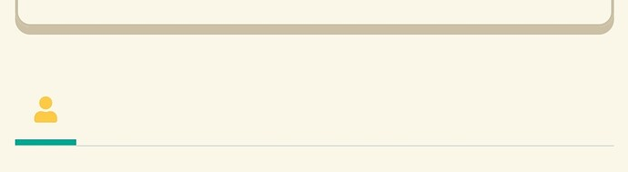](../../../assets/images/145005/09d59deded58a787cce07fe006b157e5171d3d76.jpeg "SmartSelect_20240519_172517_Chrome")

  
On mobile, the menu color becomes the same as the background color and is indistinguishable. Can you please fix this issue?

---

### Post #47 by [awesomerobot](../../users/awesomerobot.md)
*Posted: 2024-05-20 14:18*

Thanks for reporting it! I’ve just made an update to fix this.

---

### Post #48 by [Truest](../../users/Truest.md)
*Posted: 2024-05-20 14:27*

Thanks! And i do not think it is very readable when in dark mode.

---

### Post #49 by [awesomerobot](../../users/awesomerobot.md)
*Posted: 2024-05-20 14:28*

Yes, this theme existed before dark mode and hasn’t been updated to support it yet.

---

### Post #50 by [Truest](../../users/Truest.md)
*Posted: 2024-05-21 11:42*

Everything else is fine in dark mode, but when I go to my profile/account, it looks blurry because there is not enough contrast.

---

### Post #51 by [LaptechInfo](../../users/LaptechInfo.md)
*Posted: 2025-02-08 08:13*

hi, I have installed this theme, Isabelle. after installation the color palettes set to Isabelle, but still not getting the correct colors on the theme on the entire website. what to do ?

Thanaks

[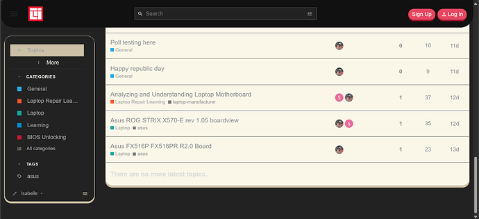](../../../assets/images/145005/9d5f31a06b47a4e68cc8938886eb5134a5e48171.png "The image displays a forum interface showing a list of topics related to laptop repair and motherboard analysis, with options to filter and sort the discussion. \(Captioned by AI\)")

  

[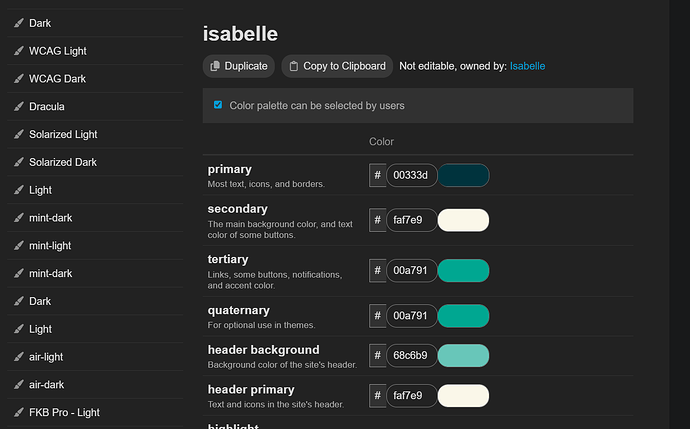](../../../assets/images/145005/ff29f6b04967f862cc72bfb63d8f9069c834bd53.png "The image displays a color palette selection interface for the Isabelle color theme, showcasing various color options categorized by primary, secondary, tertiary, quaternary, header background, and header primary. \(Captioned by AI\)")

---

### Post #52 by [awesomerobot](../../users/awesomerobot.md)
*Posted: 2025-02-12 20:41*

Looks like a dark color palette is being applied (which this theme doesn’t support yet)

Do you have a dark palette set in your site settings? check admin > site settings> Default dark mode color scheme ID

Also check your personal color preferences in `community.example.com/my/preferences/interface`

---

### Post #53 by [LaptechInfo](../../users/LaptechInfo.md)
*Posted: 2025-02-13 03:35*

Yes. now its okay. thank you for your support. I am very new to this forum.  
Thanks again 😍

---

### Post #56 by [LaptechInfo](../../users/LaptechInfo.md)
*Posted: 2025-02-19 02:03*

Hi, Chat looks fully transparent after discourse updated. any fix?  
Thank you  
[@awesomerobot](/u/awesomerobot)

[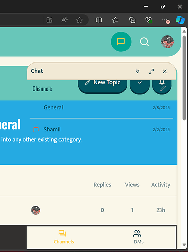](../../../assets/images/145005/45c5663d8a0b7be06e77151d7993f7d1d9b3cd0b.png "A screenshot of a Slack interface showing a channel named "General" with a message from a user named Shamil, dated 2/2/2025. \(Captioned by AI\)")

---

### Post #57 by [awesomerobot](../../users/awesomerobot.md)
*Posted: 2025-02-19 14:18*

sorry about that! I’ve just made an update that will fix it

---

### Post #58 by [LaptechInfo](../../users/LaptechInfo.md)
*Posted: 2025-02-20 04:07*

hi, here is another UI/UX issue.  

[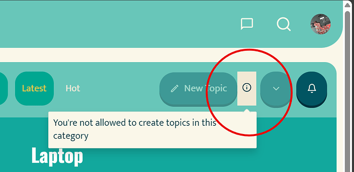](../../../assets/images/145005/e07d5f189d8afe5e81a87686662953daafe265b3.png "image")

  
Thank you  
[@awesomerobot](/u/awesomerobot)

---

### Post #59 by [awesomerobot](../../users/awesomerobot.md)
*Posted: 2025-02-20 14:01*

I’ve updated this as well

[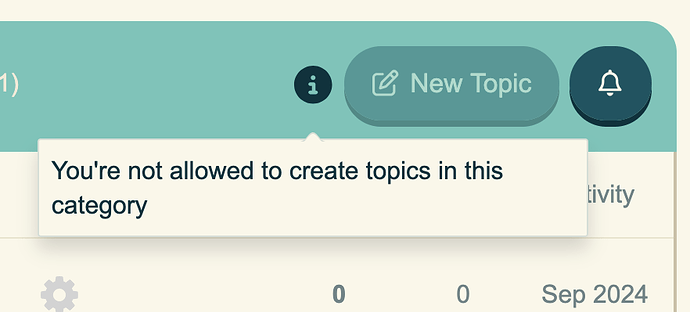](../../../assets/images/145005/886ff5002d4b8591acd1e3f43288a55590e0cd64.png "The image shows a user interface with a "You're not allowed to create topics in this category" error message. \(Captioned by AI\)")

---

### Post #60 by [StryGuardian](../../users/StryGuardian.md)
*Posted: 2025-05-24 06:52*

Awesome theme! There is an issue with text on user cards. I’m using the user card component.

[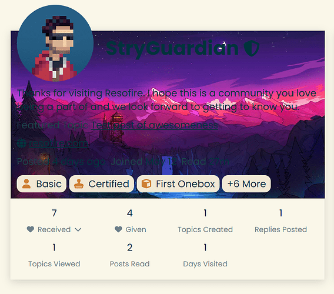](../../../assets/images/145005/9cc57628abd077ccda9cbe189d579720f8a3cefa.png "Screenshot 2025-05-24 014806")

---
