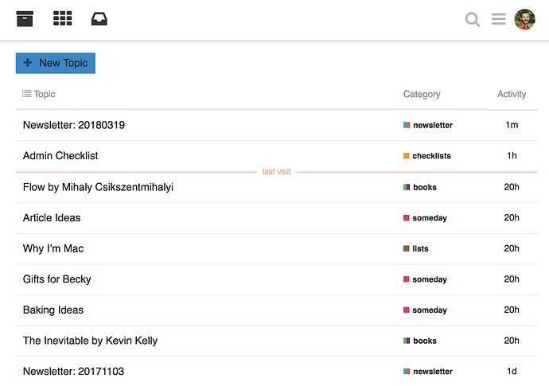
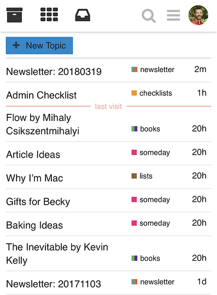
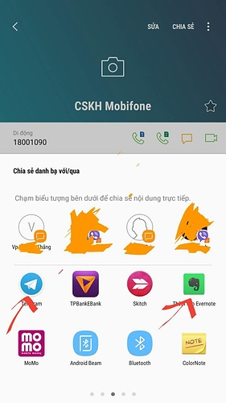

[🏠 Home](../../index.md) | [📋 Latest](../../latest/index.md) | [🔥 Top](../../top/replies/index.md) | [👥 Users](../../users/index.md)

[Home](../../index.md) » [Theme](../../c/theme/index.md) » Joe's Personal Discourse Theme

---

# Joe's Personal Discourse Theme

> **Category:** Theme
> **Author:** joebuhlig
> **Created:** 2018-03-19 20:50

---

### Post #1 by [joebuhlig](../../users/joebuhlig.md)
*Posted: 2018-03-19 20:50*

Here’s what may be a new way to use Discourse. Though I’m sure I’m not the first to think of this, I haven’t seen any posts about it.

I’ve started a new private instance of Discourse that is designed to be a notes app replacement. Think of Evernote or OneNote but it’s Discourse and for only a single person.

It occurred to me that all of these notes apps have things like URLs per note, APIs for interacting with the notes, email in, and the ability to share notes with others. But those are all things that Discourse does. 😄

But there are also a lot of things that Discourse has available that are completely unnecessary as a notes collector. Namely, custom branding, Top/New/Unread, # of posts, etc… These aren’t helpful number/lists when you’re the only one looking at it. Which is what led me to creating this theme.

[github.com](../../../assets/images/83342/personal-discourse-theme)

### [GitHub - joebuhlig/personal-discourse-theme](../../../assets/images/83342/personal-discourse-theme)

Contribute to joebuhlig/personal-discourse-theme development by creating an account on GitHub.

The biggest change is the home logo area. It’s been removed and replaced with three icons:

  * Archive - list of latest
  * Categories
  * Inbox - Uncategorized

The theory is that you’ll typically want to see the topics (notes) you’ve recently edited. Thus, the archive comes first. Buth then you may want to see the categories of notes. And if you just need to get something out quick, you won’t categorize it at all and leave it Uncategorized.

There are a few settings I found helpful to change for this as well. But the big one was the minimum length of title and body. That’s mostly because I sometimes want to capture a quick idea and fill in the details later.

I’m sure this will continue to morph as I use it. So if you have suggestions, I’m all ears. 😉
  *[PR]: Pull Request

---

### Post #2 by [joebuhlig](../../users/joebuhlig.md)
*Posted: 2018-04-11 13:50*

In light of the new [Theme Creator](https://meta.discourse.org/t/theme-creator-create-and-show-themes-without-installing-discourse/84942), I created a share link so you can kick the tires on this a bit. Enjoy! 

 [Theme Creator](https://discourse.theme-creator.io/theme/joebuhlig/joes-personal-discourse-theme) 

### ['Joe's Personal Discourse Theme' by @joebuhlig](https://discourse.theme-creator.io/theme/joebuhlig/joes-personal-discourse-theme)

A customisation for Discourse shared on Discourse Theme Creator
  *[PR]: Pull Request

---

### Post #3 by [blake](../../users/blake.md)
*Posted: 2018-04-11 16:00*

Cool! I might have to try this out. I too have a personal Discourse site that I use for all my notes. Mostly I just hid a couple things with css. I do like to see the reply count though, but probably don’t really need it. I also decreased the minimum title and body length. I think the one other thing I would like to get rid of is the blue popover if I paste a duplicate link or type about a similar topic.
  *[PR]: Pull Request

---

### Post #4 by [joebuhlig](../../users/joebuhlig.md)
*Posted: 2018-04-11 17:28*

 blake:

> I think the one other thing I would like to get rid of is the blue popover if I paste a duplicate link or type about a similar topic.

Good call. I’ve been meaning to remove the composer popups as they drive me nuts. “Of course I haven’t let anyone else respond yet! No one else is here!”

[github.com/joebuhlig/personal-discourse-theme](https://github.com/joebuhlig/personal-discourse-theme/commit/29cfed30587a560d191d85bdb1c16c8759324e65)

####  [Remove composer popup](https://github.com/joebuhlig/personal-discourse-theme/commit/29cfed30587a560d191d85bdb1c16c8759324e65)

committed 04:42PM - 11 Apr 18 UTC

[  joebuhlig ](https://github.com/joebuhlig)

[ +4 -0 ](https://github.com/joebuhlig/personal-discourse-theme/commit/29cfed30587a560d191d85bdb1c16c8759324e65)

I should also note that I’ve tweaked a number of settings to make it more conducive to a single person:

  1. I turned off the badge system. - `enable badges`
  2. Disallow public sign-ups - `invite only`
  3. Remove anon access - `login required`
  4. Let me post things however long I want - `min post length`, `min first post length`, and `min topic title length`
  5. Turn off the not enough topics/posts notice - `show create topics notice`
  6. Let me use as many emoji as I want - `max emojis in title`
  7. I sometimes use similar titles in different categories/tags - `allow duplicate topic titles`
  8. Don’t limit topic title - `title max word length`
  9. I store a lot of code and I’m lazy - `autohighlight all code`
  10. Let me upload whatever I want - `authorized extensions`
  11. No need for digests - `disable digest emails`
  12. Enable all oneboxing - `enable inline onebox on all domains`
  13. I’m in this a lot so I want more backups - `maximum backups` to 10 and `backup frequency` to 1
  14. Remove the bootstrap mode - `bootstrap mode min users`
  15. Yes to tags - `tagging enabled`
  16. I like tag boxes - `tag style`

I’ve also set up the mail-receiver so I can email into the thing as well.
  *[PR]: Pull Request

---

### Post #6 by [scombs](../../users/scombs.md)
*Posted: 2018-06-16 07:50*

Great work.

 joebuhlig:

> I’ve also set up the mail-receiver so I can email into the thing as well.

How did you manage that? I would love to see that feature in core so I can forward info for myself or the forum as a new topic in certain categories.

Plus this feature slated in [releases](/c/releases/30) seems super aggressive from a privacy standpoint:

> Forward long email chains to Discourse, creating posts for each email in a new topic, staging all unknown emails as new users
  *[PR]: Pull Request

---

### Post #7 by [joebuhlig](../../users/joebuhlig.md)
*Posted: 2018-06-16 11:49*

 scombs:

> How did you manage that? I would love to see that feature in core so I can forward info for myself or the forum as a new topic in certain categories.

 [Configure direct-delivery incoming email for self-hosted sites with Mail-Receiver](https://meta.discourse.org/t/straightforward-direct-delivery-incoming-mail/49487) [Self-Hosting](/c/documentation/self-hosting/55)

> Discourse is all about enabling civilized discussion. While plenty of people like a web interface, e-mail is still the “hub” of many people’s online lives. That’s why sending e-mail is so important, and when you’re sending e-mail, you really want to be able to receive it, too. There are several reasons why: If e-mails “bounce” (they can’t be delivered for some reason), you need to know about that. Repeatedly sending e-mails that bounce will get your e-mails flagged as spam. Receiving e-ma… 
  *[PR]: Pull Request

---

### Post #8 by [tophee](../../users/tophee.md)
*Posted: 2018-06-16 23:20*

Cool! But you haven’t gone as far as using discourse as your email client, have you? This is something I’d like to try but haven’t gotten down to yet.
  *[PR]: Pull Request

---

### Post #9 by [joebuhlig](../../users/joebuhlig.md)
*Posted: 2018-06-17 00:06*

I have actually! It’s a different instance that I built for a podcast I cohost. You can see it at [club.bookworm.fm](http://club.bookworm.fm). Every email address runs through Discourse with the mail-receiver. We just create groups for user specific email addresses and shared emails. Works really well.
  *[PR]: Pull Request

---

### Post #10 by [scombs](../../users/scombs.md)
*Posted: 2018-06-17 18:05*

I was referring to forwarding an email (like from another mailing list) into Discourse in a way so that the email doesn’t get truncated. Is there a workaround for that, besides cut and paste the whole thing into a new topic (which doesn’t work well on mobile)?

In the v2.1 “forwarding long email chain” feature, I also have concerns that random people in that email suddenly get staged accounts. I should probably split this off into a new topic but it’s related here because I often want to forward an email into my project list that I keep in a category.
  *[PR]: Pull Request

---

### Post #11 by [thaidb](../../users/thaidb.md)
*Posted: 2018-07-04 04:03*

Hello [@joebuhlig](/u/joebuhlig), can you sync category evernote to category discourse for me?  
Thank!

 [Plugin sync category Evernote to category Discourse](https://meta.discourse.org/t/plugin-sync-category-evernote-to-category-discourse/91465) [marketplace](/c/marketplace/14)

> What would you like done? I wanna Sync a Category evernote to category Discourse When do you need it done? Now! What is your budget, in $ USD that you can offer for this task? My available: 200$ 

I don’t need sync all category, i only wanna sync 1 category, that is uncategory discourse.

i wanna user evernote because, i wanna share number phone detail to app and save it when have a call to me, example: telegram chat or evernote

  *[PR]: Pull Request

---

### Post #12 by [dowo](../../users/dowo.md)
*Posted: 2022-08-22 21:32*

Thank you for the amazing theme. I like it
  *[PR]: Pull Request

---
