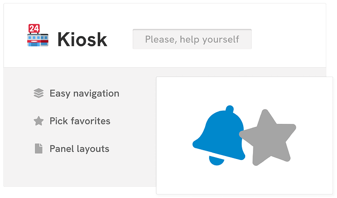
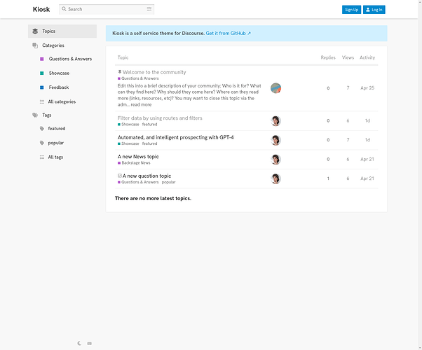
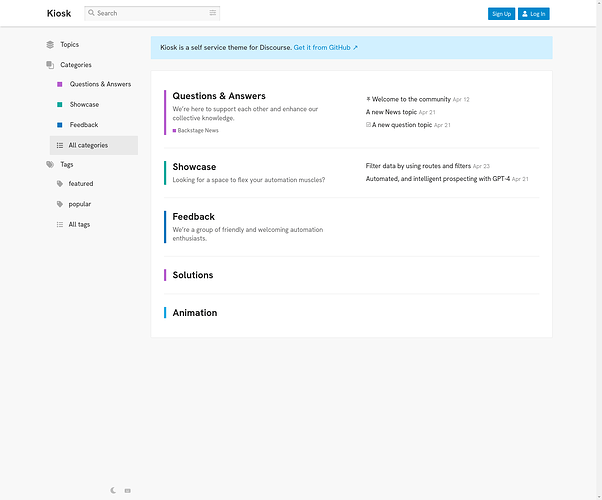
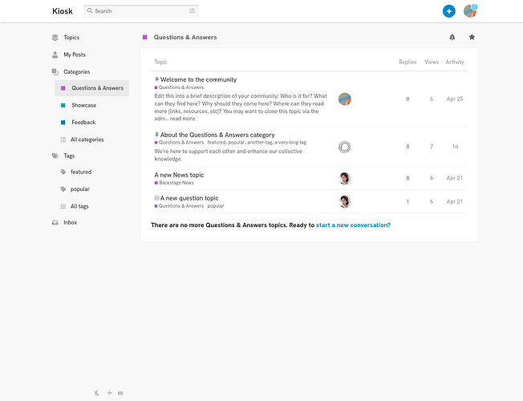
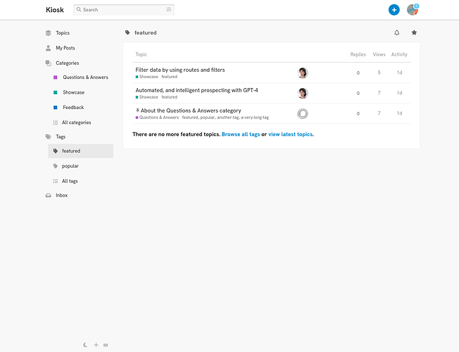
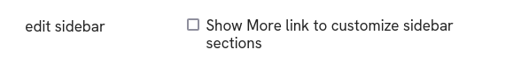
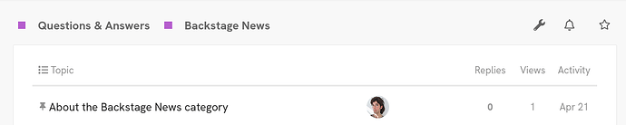
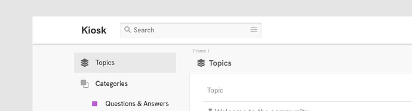

[🏠 Home](../../index.md) | [📋 Latest](../../latest/index.md) | [🔥 Top](../../top/replies/index.md) | [👥 Users](../../users/index.md)

[Home](../../index.md) » [Theme](../../c/theme/index.md) » Kiosk, a self-service theme

---

# Kiosk, a self-service theme

> **Category:** Theme
> **Author:** manuel
> **Created:** 2023-07-10 09:35

---

### Post #1 by [manuel](../../users/manuel.md)
*Posted: 2023-07-10 09:35*

|  |   
---|---|---  
💫 | **Summary** | **Kiosk** has the look of a self-service terminal  
🛠️ | **Repository** | [GitHub - nolosb/discourse-theme-kiosk](https://github.com/nolosb/discourse-theme-kiosk)  
📖 | **New to Discourse Themes?** | [Beginner’s guide to using Discourse Themes](https://meta.discourse.org/t/beginners-guide-to-using-discourse-themes/91966)  
  
Install this theme

  

  

  

## Theme Features

  * **Simple navigation**  
The theme drops most nested or complex navigation features

  * **Pick your favorites**  
Love this on [a reddit-ish theme for Discourse](/t/a-reddit-ish-theme-for-discourse/269466) and copied it as is ✨ Click a star icon to directly add a category or tag to the sidebar.

## Official Components

The theme builds on several official components:

  * **Avatar Component**  
Resizes avatars and the header

  * **Header Search**  
Adds a Search field to the header

  * **New Topic Button**  
Replaces the default button with a persistent New Topic button on the header

  * **Dark-Light Toggle**  
Adds an icon to toggle color schemes.

## Custom Components

It also uses two custom layout components:

  * **Panels**  
Adds a panel layout around the main content container on all routes.

  * **Rounded**  
Rounds a lot of elements. A work in progress..

> ###  Tune the theme
> 
>   * Increase avatar sizes on the _Avatar Component_ so they don’t render blurred. On my live site I’ve set sizes to `medium` and `45`.
> 
>   * On the _Rounded_ component you can smooth edges. On my live site I’ve set the default and button radius to `2px`.
> 
>   * By default the sidebar shows a flat list of links. Toggle this theme setting to show the _More_ dropdown and customize sidebar sections. Only staff will see the dropdown:
> 
> 

> 
> 
> 
>   * Pick `Categories and featured topics` as your category style in admin settings
> 
>   * To use a signage font you can [install HK Grotesk as a component](https://gitlab.com/manuelkostka/discourse/helpers/hk-grotesk.git).
> 
>

---

### Post #2 by [Lilly](../../users/Lilly.md)
*Posted: 2023-07-10 10:20*

nice theme [@manuel](/u/manuel), i love your work. i may use this (or a variation of it 😁) on my current forum because it looks like it would be one a lot of my user demographic would like.

question: is the nav-bar supposed to be gone on all pages? as an admin i get a blank space with one button (admin wrench) on the main categories page and so the space is quite noticeable there - but really who cares because i’m the admin and it looks great for regular users. however, i know quite a number of my users use the nav-bar filter links so a mild suggestion would be to add a setting to unhide it on the categories page.

i like how you moved the new topic button to the header and i love the favorites star.

i know you said work in progress on the rounding and i suspect you are on this, but i would suggest some description for the various settings in that component (like in the avatar TC).

i must be in the minority of those that use the collapsing navigation sidebar menu on desktop because i always miss the hamburger icon and that feature in full-width themes and i seems to be a thing these days - it was my only complaint about the Meta full width theme too ~~(but i notice it’s back now)~~ 

---

### Post #3 by [Canapin](../../users/Canapin.md)
*Posted: 2023-07-10 11:37*

This looks so clean and simple. I love it. 👏

---

### Post #4 by [manuel](../../users/manuel.md)
*Posted: 2023-07-10 15:59*

 Lilly:

> question: is the nav-bar supposed to be gone on all pages?

Actually, what you see as Breadcrumbs on category and tag lists is the nav-bar. It’s just styled so that it only shows selected items, and no drop-downs.

I don’t want to add drop-down filters here because that would pretty much go against the direction of the theme. I do think of having breadcrumbs on all routes though. What I’d like is a look that always repeats the current selection on the sidebar as a breadcrumb indicator. E.g. for the Latest list:

So I hope to add this as an optional component a bit later 

I can totally see that more navigation options make sense on your forum though! The Panels component as such could probably go well with your setup?

---

### Post #5 by [P2W](../../users/P2W.md)
*Posted: 2023-07-16 00:36*

great work!

---

### Post #6 by [jordan.vidrine](../../users/jordan.vidrine.md)
*Posted: 2023-07-20 14:19*

Great work [@manuel](/u/manuel) 🙌

I love the simplicity of this theme 

---
