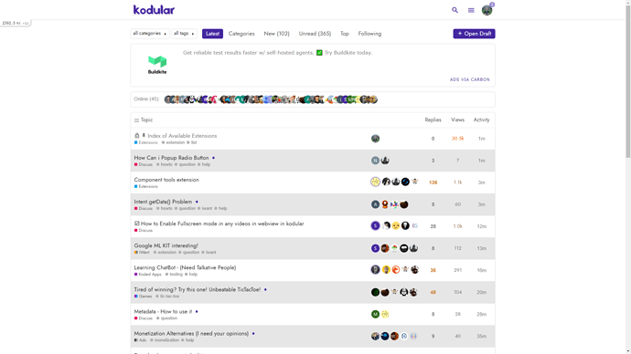
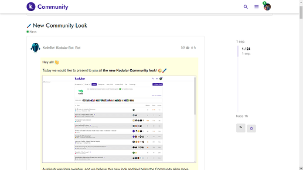
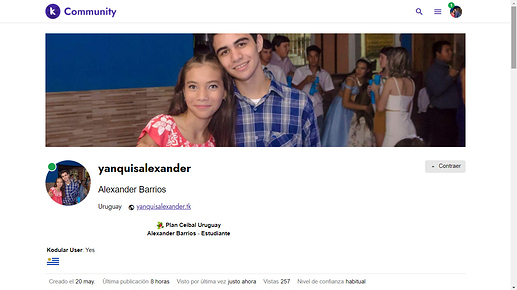
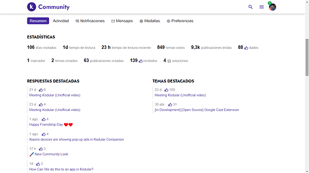
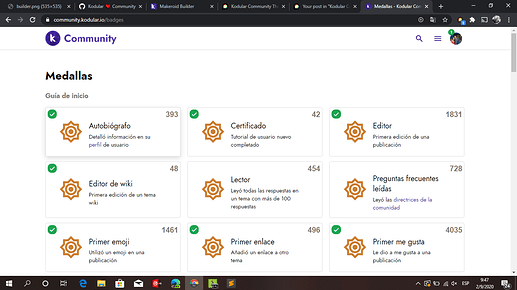
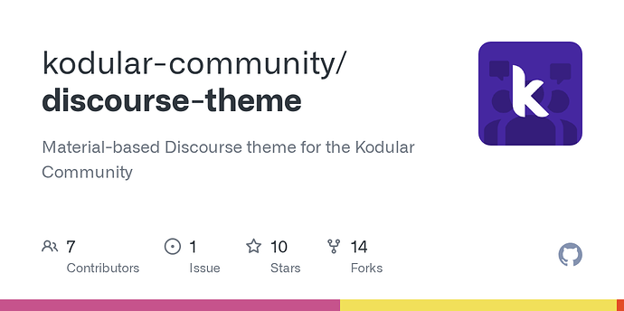

[🏠 Home](../../index.md) | [📋 Latest](../../latest/index.md) | [🔥 Top](../../top/replies/index.md) | [👥 Users](../../users/index.md)

[Home](../../index.md) » [Theme](../../c/theme/index.md) » Kodular Community Theme

---

# Kodular Community Theme

> **Category:** Theme
> **Author:** Alexander
> **Created:** 2020-09-02 00:03

---

### Post #1 by [Alexander](../../users/Alexander.md)
*Posted: 2020-09-02 00:03*

**Hi all! 😃**

**I come to present a theme created by me, for Kodular Community**

* * *

It is a theme based on the interface of Kodular Creator (the main service), which in turn adjusts to the new times using patterns similar to Google Material Design 2

## Latest Topics

## Post

")

## User - Resume

")

")

## Badges

")

* * *

I invite you all to try it on [Kodular Community ](https://community.kodular.io)

### Theme Link:

[github.com](https://github.com/Kodular-Community/Discourse-Theme)

### [GitHub - kodular-community/discourse-theme: Material-based Discourse theme for the Kodular...](https://github.com/Kodular-Community/Discourse-Theme)

Material-based Discourse theme for the Kodular Community

* * *

**#Koded with ❤️, by Community**

---

### Post #2 by [Know_About_IT](../../users/Know_About_IT.md)
*Posted: 2021-07-09 03:59*

Epic and Minimal Theme 😍

---

### Post #3 by [Zeexu](../../users/Zeexu.md)
*Posted: 2021-09-17 22:18*

Hi, How can I remove Ember selector because discourse shows that warning ⚠️

---

### Post #4 by [S_B_2_Go](../../users/S_B_2_Go.md)
*Posted: 2022-02-26 10:54*

This is one of my favorite Discourse themes!

---

### Post #5 by [digitaldominica](../../users/digitaldominica.md)
*Posted: 2023-12-19 17:21*

Hi thanks for the theme, a quick note the reactions icon is out of line with the other post actions buttons, is there anything I can do to align them in sync ?

---

### Post #6 by [LaptechInfo](../../users/LaptechInfo.md)
*Posted: 2025-02-02 15:18*

beautyfully done. Thanks for this 😍

---
