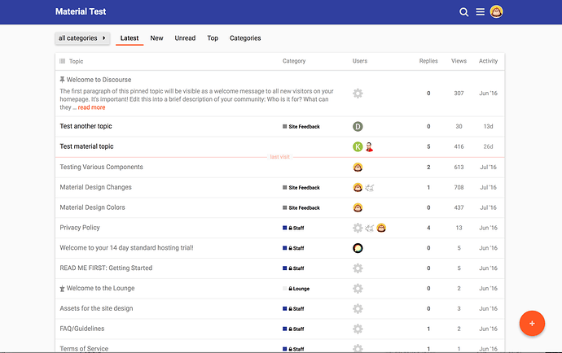
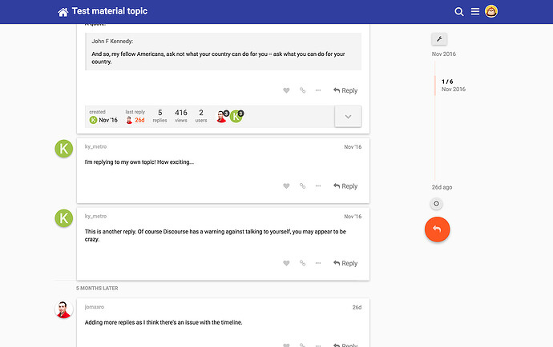
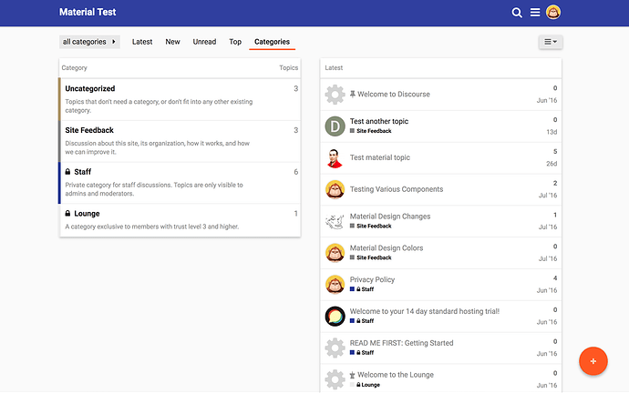
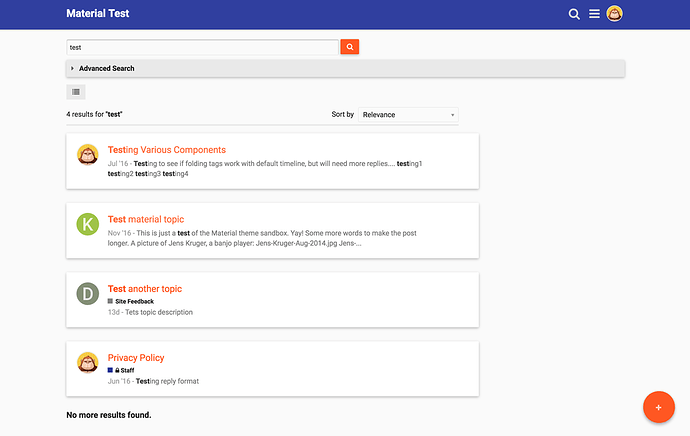
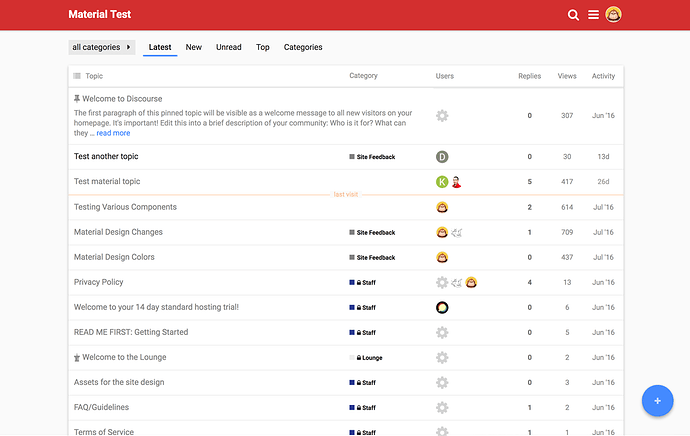
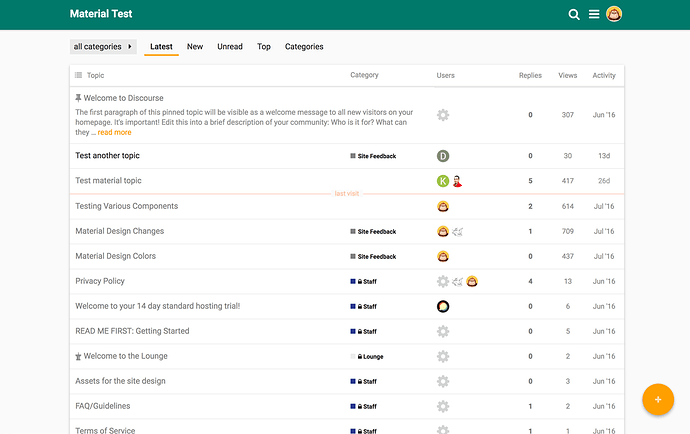
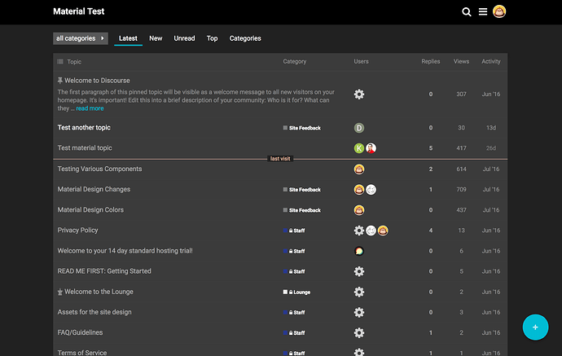
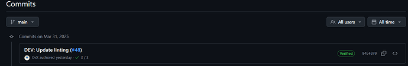
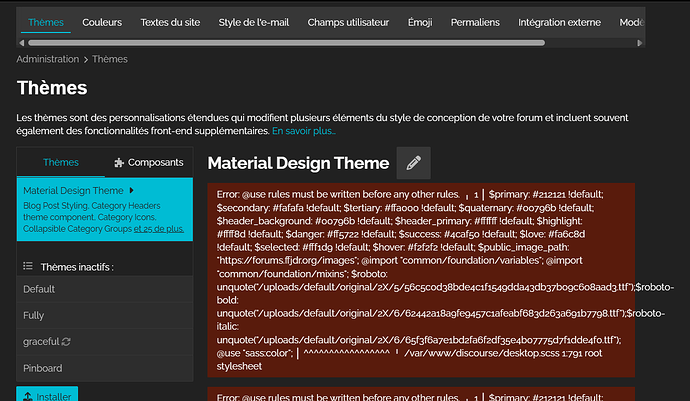
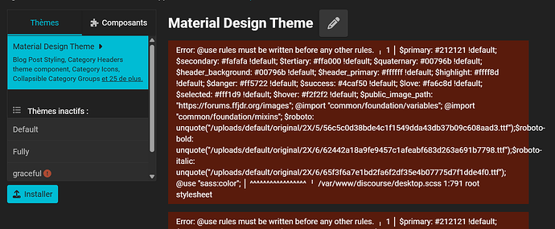

[🏠 Home](../../index.md) | [📋 Latest](../../latest/index.md) | [🔥 Top](../../top/replies/index.md) | [👥 Users](../../users/index.md)

[Home](../../index.md) » [Theme](../../c/theme/index.md) » Material Design Theme

---

# Material Design Theme

> **Category:** Theme
> **Author:** Discourse
> **Created:** 2016-07-12 03:14

---

### Post #1 by [Discourse](../../users/Discourse.md)
*Posted: 2016-07-12 03:14*

|  |   
---|---|---  
 | **Summary** |  **Material Design** has been created to be easily customizable.  
👓 | **Preview** | [Preview on Discourse Theme Creator](https://discourse.theme-creator.io/theme/Discourse/material-design-theme)  
🛠️ | **Repository Link** | <https://github.com/discourse/material-design-stock-theme>  
📖 | **New to Discourse Themes?** | [Beginner’s guide to using Discourse Themes](https://meta.discourse.org/t/beginners-guide-to-using-discourse-themes/91966)  
  
Install this theme

>  As this is an [official](/tag/official) theme maintained by the Discourse team, [Support](/c/support/6) issues, [Bug](/c/bug/1) reports, [UX](/c/ux/9) suggestions, and requests for [Dev](/c/dev/7) advice can be made in the respective categories here on Meta, and tagged with the appropriate theme tag. Click on a link below to get one started. 👍
> 
> ` [❓ **Support**](https://meta.discourse.org/new-topic?category_id=6&tags=material-design-theme "Ask for support on configuring and using the Material Design Theme") ` ` [🐛 **Bug**](https://meta.discourse.org/new-topic?category_id=1&tags=material-deisgn-theme "A bug report means something is broken, preventing normal/typical use of the theme") ` ` [👀 **UX**](https://meta.discourse.org/new-topic?category_id=9&tags=material-design-theme "Discussion about the user interface of the Material Design Theme, and how features are presented \(including language and UI elements\)") ` ` [ **Dev**](https://meta.discourse.org/new-topic?category_id=7&tags=material-design-theme "Advice on how to customise this theme for your site")`

###  Features

###  Color Options

##  Credits

Created by [@rewphus](/u/rewphus)

  

>  **Hosted by us?** Themes are available to use on our Standard, Business, and Enterprise plans.

> Last edited by [@JammyDodger](/u/jammydodger) 2024-06-17T12:23:49Z
> 
> Check documentPerform check on document: 
  *[PR]: Pull Request

---

### Post #413 by [supernaturally](../../users/supernaturally.md)
*Posted: 2022-12-13 07:40*

Excellent. Would love to get just the create topic button as a theme component.
  *[PR]: Pull Request

---

### Post #414 by [Stephane_Roy](../../users/Stephane_Roy.md)
*Posted: 2025-04-01 14:03*

Hello,

Following the latest update of the Materiel Design Theme component

")

I’m encountering an error :

")

Discourse version : 3.5.0.beta1-dev ([402ec6bf5c](https://github.com/discourse/discourse/commits/402ec6bf5c857ddc07be9cb9673734cc7152b7be))

A big THANK YOU for this theme.
  *[PR]: Pull Request

---

### Post #415 by [Arkshine](../../users/Arkshine.md)
*Posted: 2025-04-01 14:22*

If you rebuild Discourse, that should fix the issue.

A fix was merged recently about it: [DEV: Allow stylesheet entrypoints to use `@use` (#31905) · discourse/discourse@b1924c3 · GitHub](https://github.com/discourse/discourse/commit/b1924c352487ab2c85ae50af45c5b3e098589014)

Maybe the theme should be pinned to v3.5.0.beta3-dev.
  *[PR]: Pull Request

---

### Post #416 by [Stephane_Roy](../../users/Stephane_Roy.md)
*Posted: 2025-04-01 18:16*

Thanks for your advice 🙂

I’m updating Discourse (as well as the Theme components and plugins).

I’m now using the Discourse version:

### 3.5.0.beta3-dev

([083082f328](https://github.com/discourse/discourse/commits/083082f32822c1970bcc4a2c98cbbc635839732c))

…but I still get the error message :-/

For now, the forum seems to be displaying correctly…

")
  *[PR]: Pull Request

---

### Post #417 by [Arkshine](../../users/Arkshine.md)
*Posted: 2025-04-01 19:22*

[@Stephane_Roy](/u/stephane_roy)

You’re right. I tested on a _production_ server, and the error is still showing.  
I would wait for the team to take a look. I’m not sure how to fix it at the moment.
  *[PR]: Pull Request

---

### Post #418 by [zhaishis1](../../users/zhaishis1.md)
*Posted: 2025-11-22 14:38*

When will Google MD3 UI be supported, dear amazing developers?
  *[PR]: Pull Request

---

### Post #419 by [mirabilos](../../users/mirabilos.md)
*Posted: 2026-03-02 18:26*

What’s the difference from the “Simple” theme, other than that the font is a bit smaller?
  *[PR]: Pull Request

---
