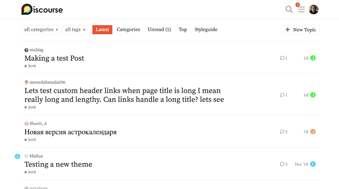
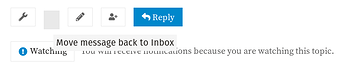
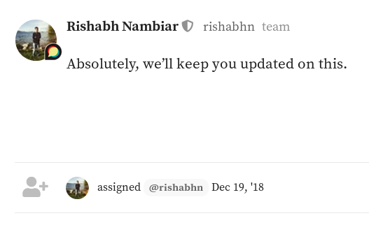
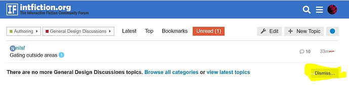
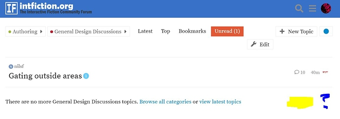
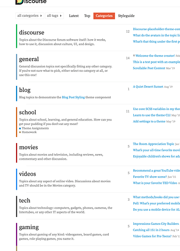
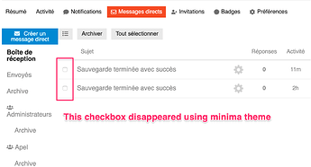
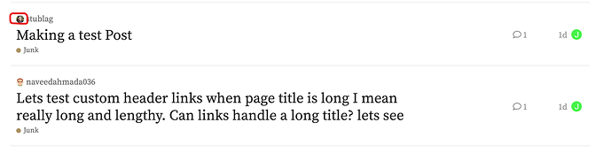
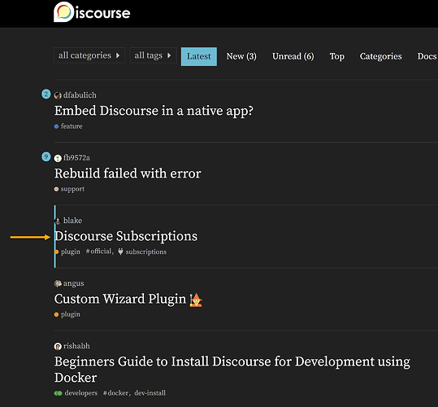
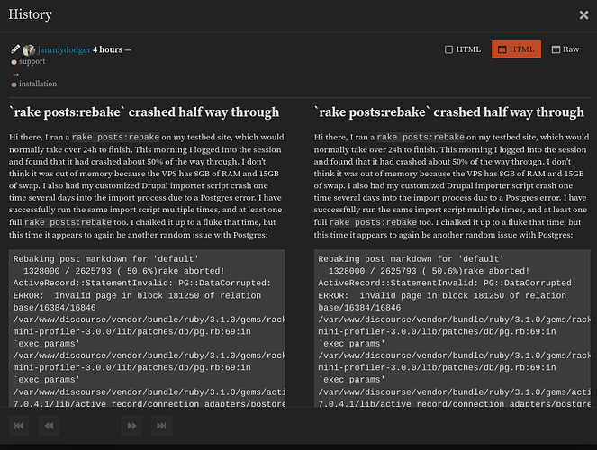

[🏠 Home](../../index.md) | [📋 Latest](../../latest/index.md) | [🔥 Top](../../top/replies/index.md) | [👥 Users](../../users/index.md)

[Home](../../index.md) » [Theme](../../c/theme/index.md) » Minima Theme

---

# Minima Theme

> **Category:** Theme
> **Author:** Discourse
> **Created:** 2019-02-02 01:37

---

### Post #1 by [Discourse](../../users/Discourse.md)
*Posted: 2019-02-02 01:37*

|  |   
---|---|---  
 | **Summary** |  **Minima** \- The goal of this theme is to reduce the UI and focus on the text.  
👓 | **Preview** | [Preview on Discourse Theme Creator](https://discourse.theme-creator.io/theme/Discourse/minima-theme)  
🛠️ | **Repository Link** | <https://github.com/discourse/minima>  
📖 | **New to Discourse Themes?** | [Beginner’s guide to using Discourse Themes](https://meta.discourse.org/t/beginners-guide-to-using-discourse-themes/91966)  
  
Install this theme

>  As this is an [official](/tag/official) theme maintained by the Discourse team, [Support](/c/support/6) issues, [Bug](/c/bug/1) reports, [UX](/c/ux/9) suggestions, and requests for [Dev](/c/dev/7) advice can be made in the respective categories here on Meta, and tagged with the appropriate theme tag. Click on a link below to get one started. 👍
> 
> ` [❓ **Support**](https://meta.discourse.org/new-topic?category_id=6&tags=minima-theme "Ask for support on configuring and using the Minima Theme") ` ` [🐛 **Bug**](https://meta.discourse.org/new-topic?category_id=1&tags=minima-theme "A bug report means something is broken, preventing normal/typical use of the theme") ` ` [👀 **UX**](https://meta.discourse.org/new-topic?category_id=9&tags=minima-theme "Discussion about the user interface of the Minima Theme, and how features are presented \(including language and UI elements\)") ` ` [ **Dev**](https://meta.discourse.org/new-topic?category_id=7&tags=minima-theme "Advice on how to customise this theme for your site")`

###  Features

I’ve gone through and made text larger and removed just about anything redundant (and anything that I don’t use regularly). For example, I know that suggested topics are suggested topics, so I removed the header. I’ve used bulk select on the topic list maybe twice ever, so it’s gone. Views on the topic list? gone. Categories in the hamburger menu? gone.

You get the idea, here’s the theme.

For extra minimalness, I recommend using the `Categories Only` layout for the category page.

  

>  **Hosted by us?** Themes are available to use on our Standard, Business, and Enterprise plans.

> Last edited by [@JammyDodger](/u/jammydodger) 2024-06-17T12:34:17Z
> 
> Check documentPerform check on document: 
  *[PR]: Pull Request

---

### Post #2 by [schleifer](../../users/schleifer.md)
*Posted: 2019-02-06 22:48*

Glorious serifs! I love it.

The desktop 🍔 menu listing all the other themes seems odd to me, though.
  *[PR]: Pull Request

---

### Post #3 by [rishabh](../../users/rishabh.md)
*Posted: 2019-02-08 07:48*

I’m LOVING this theme, especially the topic list, amazing work ❤️

* * *

A couple of tiny issues in PM’s, a missing icon:

and I feel like the small size of the _assigned_ text makes it hard to read, because the text has been made larger for just about everything else (Header, Suggested messages etc.)

  *[PR]: Pull Request

---

### Post #4 by [Stephen](../../users/Stephen.md)
*Posted: 2019-02-08 08:02*

I love it, although losing the theme switcher from the nav on mobile did cause a brief moment of panic!
  *[PR]: Pull Request

---

### Post #5 by [Hanon_Ondricek](../../users/Hanon_Ondricek.md)
*Posted: 2019-02-28 15:24*

One of my users is reporting the Minima theme (which I love very much) does not show the “Dismiss” button when there are unread messages. He verified that Dismiss wasn’t just disappearing because there were no unreads - he said he switched to Minima and back from another theme while showing unreads and the button did not show up.

Is there a setting I might be missing on this, or anything else I should check? Thanks!

I managed to finally reproduce it:

Screenshots

Default board theme  

Minima

  *[PR]: Pull Request

---

### Post #7 by [awesomerobot](../../users/awesomerobot.md)
*Posted: 2019-03-04 16:29*

I’ve added the dismiss button back, you’ll just need to update the theme.
  *[PR]: Pull Request

---

### Post #9 by [Hanon_Ondricek](../../users/Hanon_Ondricek.md)
*Posted: 2019-03-04 17:26*

Thanks so much! I will check it out!
  *[PR]: Pull Request

---

### Post #14 by [tomtjes](../../users/tomtjes.md)
*Posted: 2019-07-27 03:41*

Where can I find the Minima Dark theme?
  *[PR]: Pull Request

---

### Post #15 by [schleifer](../../users/schleifer.md)
*Posted: 2019-07-27 04:49*

Mínima Dark is a copy of Minima but using the color scheme from Material Dark.
  *[PR]: Pull Request

---

### Post #16 by [Pad_Pors](../../users/Pad_Pors.md)
*Posted: 2020-04-21 06:41*

Hi, wondering if it’s possible to show the name in the topic list instead of username, when the option [Prioritizing full name vs username in the UX](https://meta.discourse.org/t/prioritizing-full-name-vs-username-in-the-ux/45415) is active.
  *[PR]: Pull Request

---

### Post #17 by [timebinder](../../users/timebinder.md)
*Posted: 2020-05-23 17:35*

It would be wonderful if we could separate the list of categories as per the white lines I added to demonstrate

  *[PR]: Pull Request

---

### Post #18 by [krishraov](../../users/krishraov.md)
*Posted: 2020-06-12 16:40*

I am following the guide on creating Themes ([Developer’s guide to Discourse Themes](https://meta.discourse.org/t/developer-s-guide-to-discourse-themes/93648)) and it says that to change the templates (like removing the avatars in the listing), you need to touch the .hbr files in Discourse core.

Did you have to do this to remove the avatars? I am a bit confused as to how this theme works and how to use it.

As an example, in the Minima theme, how would I change the look and feel of the Profile page of each user?

Sorry if this is off-topic.
  *[PR]: Pull Request

---

### Post #19 by [awesomerobot](../../users/awesomerobot.md)
*Posted: 2020-06-12 21:23*

 krishraov:

> how would I change the look and feel of the Profile page of each user

It depends on what you’d like to change. If you want to remove or restyle content, it’s likely you can do it with some additional CSS. If you’d like to add information or change the layout dramatically, then you’d need to edit template files.

In the Minima theme, I did edit the template for the topic list to reposition/remove some avatars. You can see that here: <https://github.com/discourse/minima/blob/master/desktop/header.html>

If you’d like to use the Minima theme and add additional customizations, I’d recommend installing Minima and adding your customizations to it by creating a new theme component. This way you can still get updates to Minima without worrying about your changes being overridden.
  *[PR]: Pull Request

---

### Post #20 by [krishraov](../../users/krishraov.md)
*Posted: 2020-06-13 05:49*

Thanks, [@awesomerobot](/u/awesomerobot) \- I will give this a try.

I have a follow-up on the same topic. When Discourse is updated and I need to update the software (assuming I am self-hosting), will this cause problems with themes where the templates have been modified? Or are they not dependent?

Have you experienced anything like this in the past?
  *[PR]: Pull Request

---

### Post #21 by [evantill](../../users/evantill.md)
*Posted: 2020-07-07 13:45*

Using minima theme I can not archive direct messages (checkbox have disappeared).

  *[PR]: Pull Request

---

### Post #22 by [awesomerobot](../../users/awesomerobot.md)
*Posted: 2020-07-10 01:37*

I’ve just made an update to the theme that adds that functionality back in. Thanks for reporting it!
  *[PR]: Pull Request

---

### Post #23 by [paulrudy](../../users/paulrudy.md)
*Posted: 2020-09-12 02:13*

I’m using Minima as a basis for my theme, and I’m scratching my head at one thing: Where does this code come from?
    
    
    

        <a href="" data-user-card="joffreyjaffeux">joffreyjaffeux</a>
      

    

It disappears when I switch to the Light theme. Minima doesn’t have any javascript that might be manipulating the HTML. So confused!
  *[PR]: Pull Request

---

### Post #24 by [Steven](../../users/Steven.md)
*Posted: 2020-09-12 19:08*

I believe this is the avatar on top of the topic title

  *[PR]: Pull Request

---

### Post #25 by [paulrudy](../../users/paulrudy.md)
*Posted: 2020-09-12 20:35*

Yes I understand that. I found the code I quoted by inspecting the avatar. What I’m confused about is where the code comes from. It’s present in Minima, yet nonexistent (not just hidden in CSS) in the Light theme for example. What’s generating the HTML?
  *[PR]: Pull Request

---

### Post #26 by [Steven](../../users/Steven.md)
*Posted: 2020-09-12 20:52*

Oh ok I understand better now

It comes from the header file : <https://github.com/discourse/minima/blob/master/desktop/header.html>

It rewrites the topic list template.

Original template : <https://github.com/discourse/discourse/blob/master/app/assets/javascripts/discourse/app/templates/list/topic-list-item.hbr>
  *[PR]: Pull Request

---

### Post #27 by [paulrudy](../../users/paulrudy.md)
*Posted: 2020-09-12 20:59*

Wow, I can’t believe I didn’t notice the header.html file in desktop/. I somehow thought the theme was entirely css. Problem solved, thank you!
  *[PR]: Pull Request

---

### Post #28 by [amonle](../../users/amonle.md)
*Posted: 2022-02-09 15:25*

Great theme [@awesomerobot](/u/awesomerobot)!

I see that you have deliberately removed the “suggested topics” header but is there a way I can add it back? Many of my readers’ first experience of discourse will be via the comments section of my blog and they may not appreciate what this list is.
  *[PR]: Pull Request

---

### Post #29 by [agungor](../../users/agungor.md)
*Posted: 2022-05-17 17:10*

Love the theme, thank you 

I am experiencing what appears to be a minor margin issue when a topic is selected. Reproducible here on Meta.

  *[PR]: Pull Request

---

### Post #30 by [RGJ](../../users/RGJ.md)
*Posted: 2023-02-03 10:43*

This theme uses hardcoded Google fonts, so it can lead to legal issues when it is used in Germany.

Websites are actively getting fined for this. [Google Fonts lands website privacy fine by German court • The Register](https://www.theregister.com/2022/01/31/website_fine_google_fonts_gdpr/)

Would it be possible to make this optional or at least put up a big warning somewhere?
  *[PR]: Pull Request

---

### Post #31 by [twofoursixeight](../../users/twofoursixeight.md)
*Posted: 2023-02-03 19:59*

I noticed this edit history bug with this theme (Minima Dark) where the ux is wonky. (Discourse Meta)  

  *[PR]: Pull Request

---

### Post #32 by [awesomerobot](../../users/awesomerobot.md)
*Posted: 2023-02-08 23:53*

 Richard - Communiteq:

> Websites are actively getting fined for this

Germany might be the richest country in the world by the end of the year 

I’ve just made an update that adds a little bit of sidebar and chat styles and also includes the fonts as theme assets, so it’s all local now, no more requests to Google
  *[PR]: Pull Request

---

### Post #33 by [Jagster](../../users/Jagster.md)
*Posted: 2023-02-09 08:30*

 Kris:

> Germany might be the richest country in the world by the end of the year

Germany isn’t that much behind California, and totally without Silicon Valley.

But such court cases aren’t that common in Germany either. It is part of acts against huge corporations, and because of that limitations will increase. EU has quite different direction than USA has.

That means we need two options:

  * the base must be builded without Google etc (hate to say it, but without need to use tech where data will be transferred to Russia, China and USA)
  * there can and quite often must be an option to use what big corporations offer, but users must have tools to be anonymized

  *[PR]: Pull Request

---

### Post #34 by [RGJ](../../users/RGJ.md)
*Posted: 2023-02-09 08:43*

 Jakke Flemming:

> But such court cases aren’t that common in Germany either. It is part of acts against huge corporations

If that were true… we have a number of small (< 10 employees) German clients that have been encountering this.
  *[PR]: Pull Request

---

### Post #35 by [sawyerpollard](../../users/sawyerpollard.md)
*Posted: 2023-02-26 18:37*

Anyone have an update on this request?
  *[PR]: Pull Request

---

### Post #36 by [mpaler](../../users/mpaler.md)
*Posted: 2023-09-06 17:42*

Are the user card and profile background/header images removed from this theme?

Thanks,  
Mike
  *[PR]: Pull Request

---

### Post #37 by [mpaler](../../users/mpaler.md)
*Posted: 2023-09-20 23:57*

Also, curious if group based Avatar flair has been removed?
  *[PR]: Pull Request

---

### Post #38 by [mpaler](../../users/mpaler.md)
*Posted: 2023-09-29 17:10*

aaaand another question! 😁

Has anyone gotten [Topic List Thumbails](https://meta.discourse.org/t/topic-list-thumbnails/150602) working on Minima?
  *[PR]: Pull Request

---

### Post #39 by [Renato_Mendes](../../users/Renato_Mendes.md)
*Posted: 2025-02-18 20:42*

Hey, guys! Is there a way for me to change the font on this (or any) theme?
  *[PR]: Pull Request

---

### Post #40 by [satonotdead](../../users/satonotdead.md)
*Posted: 2025-02-19 01:13*

Sure, you can do it in different methods. For instance:

[Google Fonts](https://meta.discourse.org/t/google-fonts/143720) [Theme component](/c/theme-component/120)

>  Summary Google Fonts is a simple theme component that allows you to add a font from [Google Fonts](https://fonts.google.com/) without writing any CSS. 👓 Preview [Preview on Discourse Theme Creator](https://discourse.theme-creator.io/theme/Discourse/google-fonts) 🛠️ Repository Link <https://github.com/discourse/discourse-google-font-component> 📖 New to Discourse Themes? [Beginner’s guide to using Discourse Themes](https://meta.discourse.org/t/beginners-guide-to-using-discourse-themes/91966) Install this theme component Features This component allows you to set the main site font, and optionally … 

[Change the default font on your site](https://meta.discourse.org/t/change-the-default-font-on-your-site/21282) [Site Management](/c/documentation/site-management/53)

> 🔖 This guide explains how to change the default font on your Discourse site, either for specific elements or by using a font library other than Google Fonts.  Required user level: Administrator ℹ️ This guide is only needed if you want to integrate with a font library other than Google Fonts or to change the font of only some elements of the site. If you are using Google Fonts and want to change the font globally across your site, try out this … 

[Include assets (e.g. images, fonts) in themes and components](https://meta.discourse.org/t/include-assets-e-g-images-fonts-in-themes-and-components/62459) [Developer Guides](/c/documentation/developer-guides/56)

> Themes and theme components allow you to handle uploaded assets such as images and fonts. You can control what assets your theme accepts using the site setting: theme authorized extensions Including assets in themes and components For remote themes Remote themes include: Themes and components installed from the Popular list of themes Themes and components installed using the From a git repository method To upload assets to a remote theme or theme component, see [Create and share a font theme …](https://meta.discourse.org/t/create-and-share-a-font-theme-component/62462)
  *[PR]: Pull Request

---
