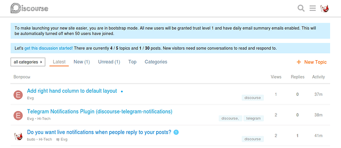
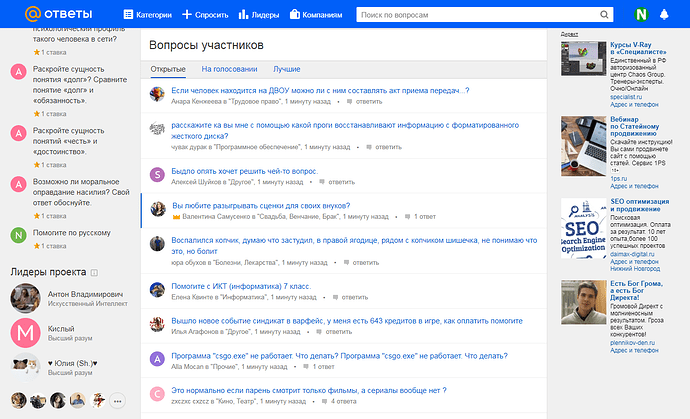
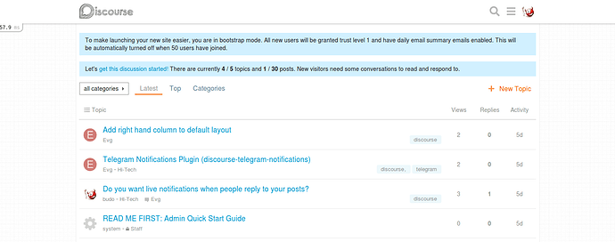

[🏠 Home](../../index.md) | [📋 Latest](../../latest/index.md) | [🔥 Top](../../top/replies/index.md) | [👥 Users](../../users/index.md)

[Home](../../index.md) » [Theme](../../c/theme/index.md) » Minimal, “classic” topic list design

---

# Minimal, “classic” topic list design

> **Category:** Theme
> **Author:** Stranik
> **Created:** 2018-12-08 03:58

---

### Post #1 by [Stranik](../../users/Stranik.md)
*Posted: 2018-12-08 03:58*

Theme Location: <https://github.com/Toxuru/discourse-classic-theme>

In Russia, a very popular site: Answers@Mail

True, the site is not used for answers, but rather for communication.  
(I know that this is not communication, but chat, attacks, spam. But this is what it is.)  😉

In general, site users asked to repeat this design in some places and this was done.

Work on this topic will continue, and with the advent of components, this topic will be redone for them.

**Install guide**

[How to install a theme or theme component](https://meta.discourse.org/t/how-do-i-install-a-theme-or-theme-component/63682)
  *[PR]: Pull Request

---

### Post #2 by [WorldIsMine](../../users/WorldIsMine.md)
*Posted: 2018-12-12 15:43*

Looks awesome. Wish this was a component only and not a full theme 😃
  *[PR]: Pull Request

---

### Post #3 by [Stranik](../../users/Stranik.md)
*Posted: 2018-12-12 17:05*

I think that if we add a background in a simple, classic style, then this component may look more attractive.

Background added 😉
  *[PR]: Pull Request

---
