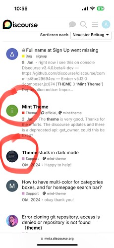
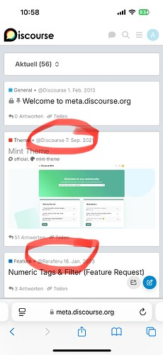
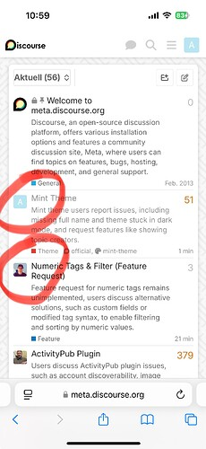
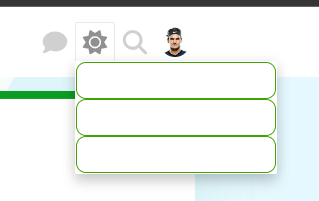
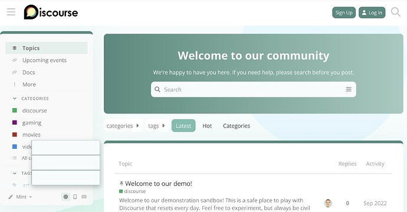
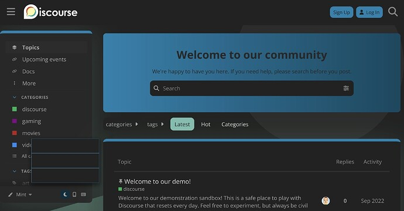
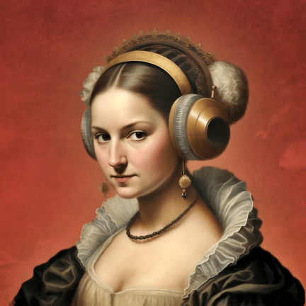
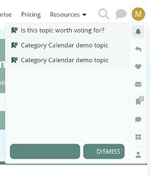
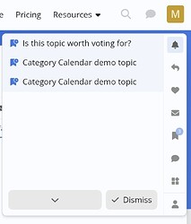
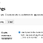

[🏠 Home](../../index.md) | [📋 Latest](../../latest/index.md) | [🔥 Top](../../top/replies/index.md) | [👥 Users](../../users/index.md)

[Home](../../index.md) » [Theme](../../c/theme/index.md) » Mint Theme

---

# Mint Theme (Page 2 of 2)

> **Category:** Theme
> **Author:** ishua_wang
> **Created:** 2021-09-07 12:06

[← Previous](202822.md) | **Page 2 of 2** | Next →

---

### Post #53 by [ishua_wang](../../users/ishua_wang.md)
*Posted: 2025-01-02 00:48*

The theme is very good. Thanks for the efforts. The discourse updates and there is a deprecated api: get_owner, could this be fixed?

---

### Post #54 by [Aurora](../../users/Aurora.md)
*Posted: 2025-02-09 09:58*

I would also like to see in this view who created the topic. Unfortunately, it does not work with most themes.

For example, with Facebook pro theme it is possible.

What can I do so that you can see it in the Mint theme or in the classic theme?

")

")

  

")

---

### Post #55 by [Moin](../../users/Moin.md)
*Posted: 2025-02-09 13:50*

There are some theme components which show the author of the first post on mobile. I haven’t explicitly tested them with this theme, but I would expect them to be compatible

[Show Original Poster Avatars](https://meta.discourse.org/t/show-original-poster-avatars/171346) [Theme component](/c/theme-component/120)

>  Summary Show Original Poster Avatars is a simple theme component that shows the profile picture of the original poster (OP) on the mobile topic list, rather than the latest reply. 👓 Preview [Preview on Discourse Creator](https://discourse.theme-creator.io/theme/Discourse/show-op-avatars) (mobile only) 🛠️ Repository Link <https://github.com/discourse/discourse-mobile-op-avatar-component> 📖 New to Discourse Themes? [Beginner’s guide to using Discourse Themes](https://meta.discourse.org/t/beginners-guide-to-using-discourse-themes/91966) Install this theme component Featu… 

[Show both OP and last reply on mobile](https://meta.discourse.org/t/show-both-op-and-last-reply-on-mobile/267944) [Theme component](/c/theme-component/120)

> ℹ️ Summary This component show topic OP and last reply on mobile 👓 Preview [Theme Creator](https://discourse.theme-creator.io/theme/Lhc_fl/op-and-reply) 🛠️ Repository [Lhcfl/discourse-mobile-topic-op-and-last-reply (github.com)](https://github.com/Lhcfl/discourse-mobile-topic-op-and-last-reply) ❓ Install Guide [How to install a theme or theme component](https://meta.discourse.org/t/how-do-i-install-a-theme-or-theme-component/63682) 📖 New to Discourse Themes? [Beginner’s guide to using Discourse Themes](https://meta.discourse.org/t/beginners-guide-to-using-discourse-themes/91966) Install this theme component This theme component is heavily inspired by [@awesomerobot](/u/awesomerobot)’s [Show Original Poster Avata…](https://meta.discourse.org/t/show-original-poster-avatars/171346)

[Topic List Author](https://meta.discourse.org/t/topic-list-author/269910) [Theme component](/c/theme-component/120)

> ℹ️ Summary Makes the topic author appear instead of posters and allows changing the placement of the author column in topic list pages. 🛠️ Repository <https://github.com/discourse/discourse-topic-list-author> 👓 Preview [Preview on Discourse Theme Creator](https://discourse.theme-creator.io/theme/Discourse/topic-list-author) ❓ Install Guide [How to install a theme or theme component](https://meta.discourse.org/t/how-do-i-install-a-theme-or-theme-component/63682) 📖 New to Discourse Themes? [Beginner’s guide to using Discourse Themes](https://meta.discourse.org/t/beginners-guide-to-using-discourse-themes/91966) Install this theme component …

---

### Post #56 by [Aurora](../../users/Aurora.md)
*Posted: 2025-02-09 22:02*

Thank you!

---

### Post #57 by [tenisforum](../../users/tenisforum.md)
*Posted: 2025-03-14 08:53*

hello! thanks for the theme and guide. I’m having a problem about dark/light/auto button colors. Button text color and background color is always the same, and this makes the text invisible. can you help?  

---

### Post #58 by [Moin](../../users/Moin.md)
*Posted: 2025-05-09 19:06*

I can reproduce the issue on [try.discourse.org](http://try.discourse.org)  

---

### Post #59 by [hanxiao_Pan](../../users/hanxiao_Pan.md)
*Posted: 2025-06-24 02:46*

Why isn’t the advance search banner displayed on this theme? I confirm that the component has been installed and enabled.

---

### Post #60 by [meghna](../../users/meghna.md)
*Posted: 2025-06-24 03:22*

This is a bug in the theme, and I’m working on the fix.

---

### Post #61 by [meghna](../../users/meghna.md)
*Posted: 2025-06-27 04:24*

Updating the theme to the latest version should fix the issue.

---

### Post #62 by [Moin](../../users/Moin.md)
*Posted: 2025-08-04 15:59*

Fixed now by

[github.com/discourse/discourse](https://github.com/discourse/discourse/pull/34070)

####  [UX: remove btn-default class from light-dark toggle](https://github.com/discourse/discourse/pull/34070)

`main` ← `dark-light-toggle-classes`

merged 04:04PM - 04 Aug 25 UTC

[  chapoi ](https://github.com/chapoi)

[ +3 -3 ](https://github.com/discourse/discourse/pull/34070/files)

The dropdown has `btn-default` classes applied, while they aren't button default[…](https://github.com/discourse/discourse/pull/34070)s and thus it's causing styling issues. Example mint theme: * missing icons * awkward border | Before | After | |--------|--------| |  |  |

---

### Post #63 by [Crebekah](../../users/Crebekah.md)
*Posted: 2025-09-24 06:12*

Hi! Is there a way to get rid of the gradient on the banner and just have one solid colour? Also, can you change the background colour but not the boxes? thank you!

---

### Post #64 by [Moin](../../users/Moin.md)
*Posted: 2025-10-03 09:22*

Today, I noticed that the icons in the buttons of the notification menu aren’t visible on [try.discourse.org](http://try.discourse.org). I added a screenshot using the Air theme for comparison. As you can see, the  and the  in front of “dismiss” have the same color as the background.

---

### Post #66 by [meghna](../../users/meghna.md)
*Posted: 2025-10-06 12:08*

Fixed in this commit:

[github.com/discourse/discourse-mint-theme](https://github.com/discourse/discourse-mint-theme/commit/7305bfb59d051e02027e5f5347df969010d9c7bc)

####  [UX: fix icon color](https://github.com/discourse/discourse-mint-theme/commit/7305bfb59d051e02027e5f5347df969010d9c7bc)

committed 12:03PM - 06 Oct 25 UTC

[  MeghnaAJ ](https://github.com/MeghnaAJ)

[ +1 -1 ](https://github.com/discourse/discourse-mint-theme/commit/7305bfb59d051e02027e5f5347df969010d9c7bc)

---

### Post #68 by [hel_Sinki](../../users/hel_Sinki.md)
*Posted: 2025-12-06 03:50*

Hi there,

I ran into an issue when updating the Mint theme from the official Git repo.

**Environment**

  * Discourse version: `3.6.0.beta3-latest` (tests-passed)
  * Theme source: <https://github.com/discourse/discourse-mint-theme> (default branch)
  * Installed via `/admin/customize/themes` → “Install” → “From a git repository URL”

**Issue**

When I click **“Update to latest”** for the Mint theme in the admin UI (`/admin/customize/themes`), the update fails with this error dialog:

> The theme screenshots must be in one of the following formats: .jpg, .jpeg, .gif, .png. The screenshot light.webp has an invalid format.

In `about.json`, the theme currently references:
    
    
    "screenshots": [
      "screenshots/light.webp",
      "screenshots/dark.webp"
    ]
    

However, according to the Discourse theme docs, theme screenshots are only allowed to be jpg, jpeg, gif, or png, so .webp gets rejected by the core validation.

**Steps to reproduce**

  1. Install the Mint theme from the official Git repo in /admin/customize/themes.
  2. Go to the Mint theme entry.
  3. Click **“Update to latest”** .
  4. Observe the error dialog about light.webp having an invalid format.

**Proposed fix**

I opened a PR that converts the screenshots to PNG and updates about.json accordingly:

  * screenshots/light.webp → screenshots/light.png
  * screenshots/dark.webp → screenshots/dark.png
  * about.json updated to:

    
    
    "screenshots": [
      "screenshots/light.png",
      "screenshots/dark.png"
    ]
    

PR: [Use PNG screenshots for Discourse compatibility by ieduer · Pull Request #64 · discourse/discourse-mint-theme · GitHub](https://github.com/discourse/discourse-mint-theme/pull/64)

With this change, the theme updates cleanly in the admin UI and the screenshots display correctly.

Happy to adjust the PR if there is a preferred way to handle screenshots (or if .webp is meant to be supported by core in the future).

---

### Post #69 by [yuriy](../../users/yuriy.md)
*Posted: 2025-12-06 11:03*

[@hel_Sinki](/u/hel_sinki), I am pretty sure your Discourse version doesn’t have this commit included:  
[DEV: enhance file type support for theme and component screenshots (#… · discourse/discourse@a76a443 · GitHub](https://github.com/discourse/discourse/commit/a76a4430c79be28afae425edc7dba6e916c7099f).

You don’t need to convert to `.png`, instead make sure your site is running on the latest version of Discourse.

 hel_Sinki:

> according to the Discourse theme docs, theme screenshots are only allowed to be jpg, jpeg, gif, or png

Which exactly docs are you referring to? Those should be updated to read `.jpeg, .jpg, .png, or .webp`.

---

### Post #70 by [Moin](../../users/Moin.md)
*Posted: 2025-12-06 11:24*

Is there a corresponding entry in the `.discourse-compatibility` file that prevents you from updating the theme without having the required Discourse version? Otherwise, it might be useful to add this.

[Pinning plugin and theme versions for older Discourse installs (.discourse-compatibility)](https://meta.discourse.org/t/pinning-plugin-and-theme-versions-for-older-discourse-installs-discourse-compatibility/272665)

I think there’s something new now based on the new naming of releases. 

---

### Post #71 by [cvx](../../users/cvx.md)
*Posted: 2025-12-08 10:32*

Added the .d-compat entry in [PR #65](https://github.com/discourse/discourse-mint-theme/pull/65) (and did the same for other affected themes)

---

[← Previous](202822.md) | **Page 2 of 2** | Next →
