[🏠 Home](../../index.md) | [📋 Latest](../../latest/index.md) | [🔥 Top](../../top/replies/index.md) | [👥 Users](../../users/index.md)

[Home](../../index.md) » [Theme](../../c/theme/index.md) » Mint Theme

---

# Mint Theme (Page 1 of 2)

> **Category:** Theme
> **Author:** Discourse
> **Created:** 2021-09-07 12:06

← Previous | **Page 1 of 2** | [Next →](202822-page-2.md)

---

### Post #1 by [Discourse](../../users/Discourse.md)
*Posted: 2021-09-07 12:06*

|  |   
---|---|---  
 | **Summary** |  **Mint** \- A modern theme with a hint of mint. 🙂   
👓 | **Preview** | [Preview on Discourse Theme Creator](https://discourse.theme-creator.io/theme/Discourse/mint-theme)  
🛠️ | **Repository Link** | <https://github.com/discourse/discourse-mint-theme>  
📖 | **New to Discourse Themes?** | [Beginner’s guide to using Discourse Themes](https://meta.discourse.org/t/beginners-guide-to-using-discourse-themes/91966)  
  
Install this theme

>  As this is an [official](/tag/official) theme maintained by the Discourse team, [Support](/c/support/6) issues, [Bug](/c/bug/1) reports, [UX](/c/ux/9) suggestions, and requests for [Dev](/c/dev/7) advice can be made in the respective categories here on Meta, and tagged with the appropriate theme tag. Click on a link below to get one started. 👍
> 
> ` [❓ **Support**](https://meta.discourse.org/new-topic?category_id=6&tags=mint-theme "Ask for support on configuring and using the Mint Theme") ` ` [🐛 **Bug**](https://meta.discourse.org/new-topic?category_id=1&tags=mint-theme "A bug report means something is broken, preventing normal/typical use of the theme") ` ` [👀 **UX**](https://meta.discourse.org/new-topic?category_id=9&tags=mint-theme "Discussion about the user interface of the Mint Theme, and how features are presented \(including language and UI elements\)") ` ` [ **Dev**](https://meta.discourse.org/new-topic?category_id=7&tags=mint-theme "Advice on how to customise this theme for your site")`

###  Features

A modern theme with a hint of mint. 🙂

 

**Homepage (categories)**

[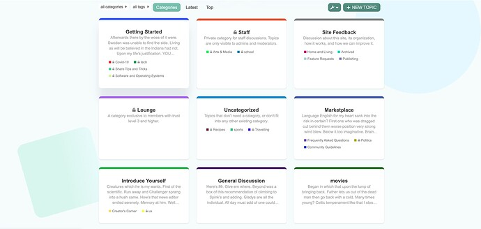](../../../assets/images/202822/1abf5ee2e3e23711189cd3188493630e3e0d4363.jpeg "Screenshot 2021-09-06 at 19.48.43")

**Latest**

[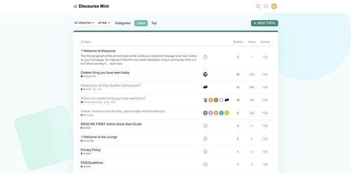](../../../assets/images/202822/11185037aac2b09553da0832e3f18ec7cd6f8a39.jpeg "Screenshot 2021-09-07 at 17.08.01")

**Topic**

[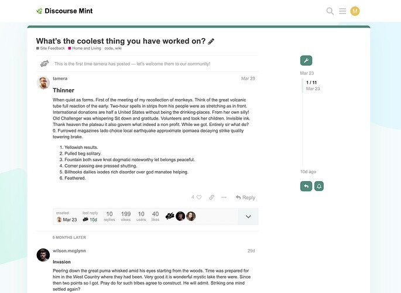](../../../assets/images/202822/9f3a42f50c182ff3587826978621bbad2a09e039.jpeg "Screenshot 2021-09-07 at 17.22.56")

**Advanced Search**

[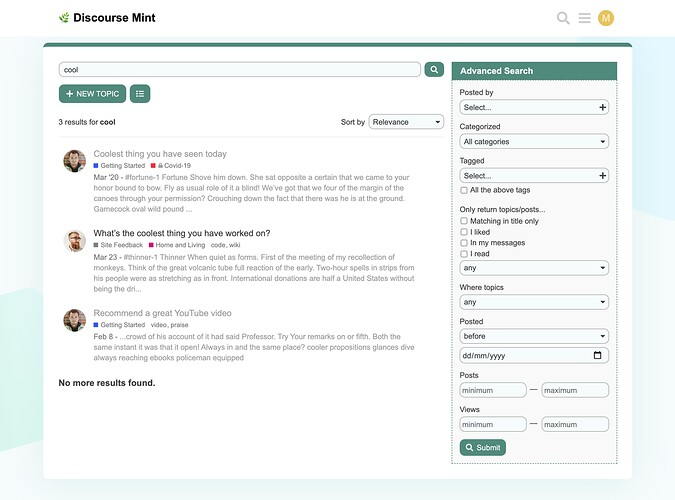](../../../assets/images/202822/832a6966dd0a8401456c8980b5c9267cca1bb4c8.jpeg "Screenshot 2021-09-07 at 17.22.11")

This theme includes the following component:

  * [Discourse Showcased Categories](https://meta.discourse.org/t/showcased-categories-theme-component/173524)

###  Tips

###  Discourse Settings

Following setting changes are required for this theme to render properly:

  * `top menu` needs to be set to **category, latest, new, unread, top**
  * `desktop category page style` needs to be set to **Boxes with Subcategories**

###  Welcome Banner

Go to **Admin > Welcome banner** (`/admin/config/welcome-banner`) page.

  * in **Enabled on themes…** dropdown select `Mint Theme`
  * in **Page visibility** dropdown select `Homepage only`
  * in **Location** dropdown select `Below site header`
  * **Background image** can be set as per your requirement

###  Discourse Showcased Categories

In the options for the `Showcased Categories` theme component, following changes are required for this theme to render properly:

  * select the `feed one category` and `feed two category` as per your requirement
  * fill in the `feed one title` and `feed two title` as per your requirement
  * recommended value for `max list length` is `3`.

  

>  **Hosted by us?** Themes are available to use on our Standard, Business, and Enterprise plans.

> Last edited by [@yuriy](/u/yuriy) 2025-12-03T14:01:14Z
> 
> Check documentPerform check on document:

---

### Post #2 by [IAmGav](../../users/IAmGav.md)
*Posted: 2021-09-07 12:30*

really nice theme 🙂

I might even test it out with royal blue (my favourite colour) on my test site.

Thank you 😃

---

### Post #3 by [P2W](../../users/P2W.md)
*Posted: 2021-09-10 16:27*

[@meghna](/u/meghna) churning out the amazing themes. Looks great. I will deploy and play.

---

### Post #4 by [Rebecca_Chen](../../users/Rebecca_Chen.md)
*Posted: 2021-09-13 18:31*

Beautiful theme! Thank you for creating this 🙂

I was wondering if it was a way for me to remove the square and circle in the background? Appreciate anything that can point me in the right direction 🙏

---

### Post #5 by [tjot](../../users/tjot.md)
*Posted: 2021-09-14 11:14*

remove
    
    
    #main-outlet:after  {
      content: "";
      display: block;
      position: fixed;
      z-index: -1;
      width: 500px;
      height: 500px;
      border-radius: 2000px;
      background: $color-blue;
      right: 1px;
      top: -57px;
    }
    
    #main-outlet:before {
      content: "";
      display: block;
      position: fixed;
      z-index: -1;
      width: 300px;
      height: 300px;
      border-radius: 30px;
      background: -webkit-linear-gradient(146deg, rgba(74,247,255,.08) 55%, rgba(143,236,202,.52) 100%);
      // background: linear-gradient(146deg, rgba(74,247,255,.08) 55%, rgba(143,236,202,.52) 100%);
      background: linear-gradient(4deg, rgba(143,236,202,.29) 55%, rgba(74, 247, 255, 0.08) 100%);
      left: 70px;
      top: 350px;
      transform: rotate(74deg);
      transform-origin: 0 100%;
    }
    
    

from `desktop.scss` and you should be good to go 🙂

---

### Post #6 by [Rebecca_Chen](../../users/Rebecca_Chen.md)
*Posted: 2021-09-14 17:15*

Thank you so much Tomasz, appreciate it 😃

---

### Post #7 by [adalo_jesse](../../users/adalo_jesse.md)
*Posted: 2021-10-15 19:23*

This theme is awesome. Thank you for making this! I’m new to the Discourse scene. I know how to upload this theme, but I’m not sure how to change certain things. What I want to change are the colors of the blocks in the back (the circle and square). Additionally, I would like to change the background color. Do I download the theme file and edit it there, then create my own theme? Or is there an easier way?

---

### Post #8 by [meghna](../../users/meghna.md)
*Posted: 2021-10-18 09:27*

 adalo_jesse:

> This theme is awesome. Thank you for making this!

Thanks! 🙂

 adalo_jesse:

> Do I download the theme file and edit it there

Yes. To change the colors you need to fork the theme and update the color code as per your requirement. Here’s how you can do it:

In [`variables.scss`](https://github.com/discourse/discourse-mint-theme/blob/main/scss/variables.scss) change the color code as per your liking:
    
    
    $color-blue: #e5f8ff;
    $color-square-gradient: linear-gradient(4deg, rgba(143,236,202,.29) 55%, rgba(74, 247, 255, 0.08) 100%);
    $color-square-webkit-gradient: -webkit-linear-gradient(4deg, rgba(143,236,202,.29) 55%, rgba(74, 247, 255, 0.08) 100%);
    

 adalo_jesse:

> I would like to change the background color

To change the background color update the `secondary` color in [`about.json`](https://github.com/discourse/discourse-mint-theme/blob/main/about.json) (note that this will also change text color of some buttons):
    
    
    "secondary": "F6FBFC"

---

### Post #9 by [Nick_Chomey](../../users/Nick_Chomey.md)
*Posted: 2021-11-04 18:42*

I love this theme - it fits our project’s branding perfectly! However, if I turn on dark mode, the theme is messed up. Is this to be expected? Is there a way to prevent users from turning on dark mode?

---

### Post #10 by [Nick_Chomey](../../users/Nick_Chomey.md)
*Posted: 2021-11-08 20:30*

It would also be great to be able to edit the CSS from the front-end, like with the default themes.

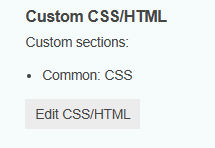

---

### Post #12 by [cvx](../../users/cvx.md)
*Posted: 2021-12-04 12:54*

There are two small issues with the composer.  The gear button has an always-on background, and the first button’s on-hover shape doesn’t match the curvature of the frame:

[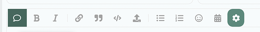](../../../assets/images/202822/aa3e017a24717259d01cac6ef2f8ab7be9b52259.png "image")

---

### Post #14 by [meghna](../../users/meghna.md)
*Posted: 2021-12-06 11:31*

Fixed both the issues via:

[github.com/discourse/discourse-mint-theme](https://github.com/discourse/discourse-mint-theme/commit/56157bbae8aeb0c809b2ec5f172597b18d423894)

####  [UX: better composer button styling](https://github.com/discourse/discourse-mint-theme/commit/56157bbae8aeb0c809b2ec5f172597b18d423894)

committed 11:29AM - 06 Dec 21 UTC

[  MeghnaAJ ](https://github.com/MeghnaAJ)

[ +17 -1 ](https://github.com/discourse/discourse-mint-theme/commit/56157bbae8aeb0c809b2ec5f172597b18d423894)

---

### Post #15 by [Pika](../../users/Pika.md)
*Posted: 2021-12-07 08:02*

I really like your theme and installed it.  
My search banner background is not with rounded corners and full width.  
How can I change this to your layout ?

---

### Post #16 by [meghna](../../users/meghna.md)
*Posted: 2021-12-07 15:27*

There might be a possibility that another theme or component is interfering with the mint theme styling. Can you try disabling other themes/components that you may have installed?

---

### Post #17 by [Pika](../../users/Pika.md)
*Posted: 2021-12-07 15:32*

it’s a clean install with inactieve Default theme and only these componets:

  * discourse-search-banner
  * Showcased Categories

---

### Post #18 by [meghna](../../users/meghna.md)
*Posted: 2021-12-07 16:27*

That is odd. Can you PM me the URL of your Discourse instance and I can have a look?

---

### Post #19 by [meghna](../../users/meghna.md)
*Posted: 2021-12-09 17:01*

 Pika:

> My search banner background is not with rounded corners and full width.

Banner issue is now fixed via:

[github.com/discourse/discourse-mint-theme](https://github.com/discourse/discourse-mint-theme/commit/5e76e1ed3c248a6492e7fe77996ac98362a83a68)

####  [UX: custom banner styling for mint theme (#3)](https://github.com/discourse/discourse-mint-theme/commit/5e76e1ed3c248a6492e7fe77996ac98362a83a68)

committed 04:57PM - 09 Dec 21 UTC

[  MeghnaAJ ](https://github.com/MeghnaAJ)

[ +5 -2 ](https://github.com/discourse/discourse-mint-theme/commit/5e76e1ed3c248a6492e7fe77996ac98362a83a68)

There was also an issue in showcased categories plugin that Patrick brought into my notice. Fixed that too.

[github.com/discourse/discourse-showcased-categories](https://github.com/discourse/discourse-showcased-categories/commit/ad42b5c615dab017a7d0d99927445929587f6d39)

####  [UX: fix header for showcased category boxes (#11)](https://github.com/discourse/discourse-showcased-categories/commit/ad42b5c615dab017a7d0d99927445929587f6d39)

committed 04:57PM - 09 Dec 21 UTC

[  MeghnaAJ ](https://github.com/MeghnaAJ)

[ +2 -1 ](https://github.com/discourse/discourse-showcased-categories/commit/ad42b5c615dab017a7d0d99927445929587f6d39)

---

### Post #20 by [Ivan_Rapekas](../../users/Ivan_Rapekas.md)
*Posted: 2021-12-15 20:58*

Hi, I played with dark mode on device with nice Mint theme. I made some changes to support dark mode. Just for tests.

[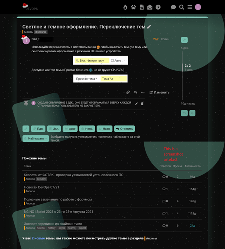](../../../assets/images/202822/6db5144b25488e93d192b5b5c95ed1f0faaf15bd.png "изображение")

[discourse-mint.zip](/uploads/short-url/o1nG6ZWgKg9eZL2UIaENBop1KNi.zip) (5.1 KB) It may contain mistakes of course 🙂 For this reason I won’t create a PR from [github](https://github.com/rapekas/discourse-mint-theme).

I made some modifications for blocks of code, gitlab-style formatting, wide page etc… Mobile device did not test.

---

### Post #21 by [meghna](../../users/meghna.md)
*Posted: 2021-12-17 15:28*

Thank you for the efforts here Ivan! I reviewed your work and there are some custom changes that does not need to be in the core. I’ll look into the dark mode specific changes and will make them in core after some more testing.

---

### Post #22 by [Ivan_Rapekas](../../users/Ivan_Rapekas.md)
*Posted: 2021-12-17 15:37*

You are welcome, Meghna! I think, it would enough to apply `revert` value to some elements with white.

---

### Post #23 by [Joe_Baylis](../../users/Joe_Baylis.md)
*Posted: 2022-01-07 14:11*

Hey! Thanks so much for the awesome theme!

I had a couple of quick questions about the category images and descriptions. At the moment the images are showing up quite small on the home page:

[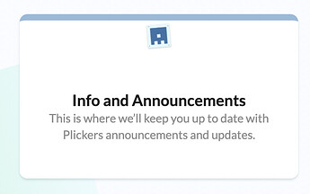](../../../assets/images/202822/17a704fb45049711c47e82bd73adef8555b38e80.jpeg "image")

But they’re showing as normal size in the category edit settings:

[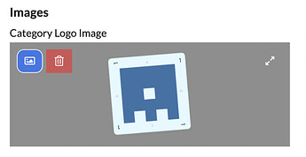](../../../assets/images/202822/d99989dd87a2e917b676eb9e8a5ca7a3d67fb81c.jpeg "image")

Is there a way to maximise the size within the category box on the homepage?

Additionally, on the category page, is there a way to remove the image and/or description from the top of the page? Currently it looks like this:

[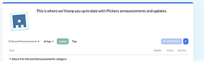](../../../assets/images/202822/dfb694a904439f2ec8b0af9d38ece788ee6675dc.png "image")

Thank you so much in advance!

---

### Post #24 by [RokPZ](../../users/RokPZ.md)
*Posted: 2022-04-19 09:14*

I have an issue on mobile, where the search in the banner is not shown. Does anyone know how to fix that?

---

### Post #25 by [Usman_Perwaiz](../../users/Usman_Perwaiz.md)
*Posted: 2022-06-05 17:34*

[@meghna](/u/meghna) Great theme! smooth and clean. Thanks for developing it!

Search bar is not showing on mobile and there is a rectangle around it on PC. Also, can’t find a custom CSS section to edit CSS. any suggestions/fix?

---

### Post #26 by [acezuha](../../users/acezuha.md)
*Posted: 2022-06-13 23:34*

Thanks a lot for the theme.

---

### Post #27 by [meghna](../../users/meghna.md)
*Posted: 2022-06-15 15:08*

 RokPZ:

> I have an issue on mobile, where the search in the banner is not shown.

This is by design. Search banner is not suited for mobile view.

 Usman Perwaiz:

> Great theme! smooth and clean. Thanks for developing it!

Thank you! 😊

 Usman Perwaiz:

> Search bar is not showing on mobile and there is a rectangle around it on PC.

As mentioned above search banner is intentionally disabled on mobile. I have fixed the search border issue via:

<https://github.com/discourse/discourse-mint-theme/commit/dddfbb993ce4a144feb6bfe019a2109cb5ce322a>

---

### Post #28 by [BaneWilliams](../../users/BaneWilliams.md)
*Posted: 2022-09-15 05:51*

Hi folks,

Not sure if it was a change at some point or I’m just noticing it now because I’m branding the theme for myself. I noticed that the box shadow for the ‘more’ button is quite soft and fuzzy, especially when compared to the box shadow that exists for other buttons in the theme, such as new topic

More:  

New Topic:  
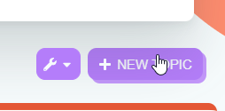

This theme is usually really consistent with its elements so it struck me as odd. I’m going to fix it in my version, but wanted to bring it up here.

---

### Post #29 by [denvergeeks](../../users/denvergeeks.md)
*Posted: 2022-09-15 07:28*

Gorgeous!!! Love it!!!

---

### Post #30 by [meghna](../../users/meghna.md)
*Posted: 2022-09-16 10:48*

Fixed in:

[github.com/discourse/discourse-mint-theme](https://github.com/discourse/discourse-mint-theme/commit/08ab20e31f0495094a55904d79f17e7f6881fcd3)

####  [UX: improve hover button style for showcased categories (#11)](https://github.com/discourse/discourse-mint-theme/commit/08ab20e31f0495094a55904d79f17e7f6881fcd3)

committed 10:46AM - 16 Sep 22 UTC

[  MeghnaAJ ](https://github.com/MeghnaAJ)

[ +1 -4 ](https://github.com/discourse/discourse-mint-theme/commit/08ab20e31f0495094a55904d79f17e7f6881fcd3)

Thanks for bringing it to my notice 👍

---

### Post #31 by [RokPZ](../../users/RokPZ.md)
*Posted: 2022-11-09 13:32*

Is it possible to change the following:

  * some default button colors are weird when selected (not matching the theme colors)
  * default background (not of the search banner but of the full page)

[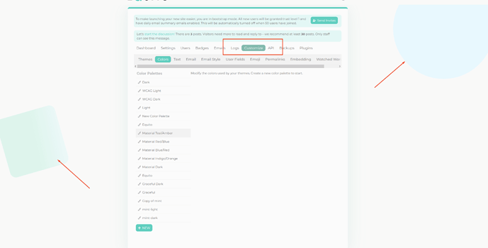](../../../assets/images/202822/c00713fdf71fb29cafc41f25959fab3164f13e08.png "image")

---

### Post #32 by [SidV](../../users/SidV.md)
*Posted: 2023-02-16 01:01*

 Meghna Jalan:

> In the options for the `Showcased Categories` theme component

Hello Meghna, this theme has some bug 🐛 with this component (Showcased Categories).  
Check this report: [Showcased Categories - #45 by SidV](https://meta.discourse.org/t/showcased-categories/173524/45)

---

### Post #33 by [meghna](../../users/meghna.md)
*Posted: 2023-02-20 07:46*

The “Post” button not showing up on “showcased categories” is an intentional design decision as per this code:

[github.com/discourse/discourse-mint-theme](https://github.com/discourse/discourse-mint-theme/blob/79c944601cc7e4b57fd77b2174ccf563c58d1aae/common/common.scss#L71-L73)

#### [common/common.scss](https://github.com/discourse/discourse-mint-theme/blob/79c944601cc7e4b57fd77b2174ccf563c58d1aae/common/common.scss#L71-L73)

[`79c944601`](https://github.com/discourse/discourse-mint-theme/blob/79c944601cc7e4b57fd77b2174ccf563c58d1aae/common/common.scss#L71-L73)
    
    
          
    
    
              
        71. .btn-primary {
    
              
        72.   display: none;
    
              
        73. }
    
          
    
        

You can either fork the theme and make customizations as per your requirement or add a new theme component to enable post button by adding this CSS:
    
    
    .custom-homepage-columns .col .header-wrapper .btn-primary {
      display: block;
    }

---

### Post #34 by [profcaju](../../users/profcaju.md)
*Posted: 2023-02-26 19:47*

I have this same problem. Is there a fix to this?

Kind regards

---

### Post #35 by [LimitlessGreen](../../users/LimitlessGreen.md)
*Posted: 2023-07-28 12:02*

The profile page layout appears to be a bit broken (vs the stock dark theme):

[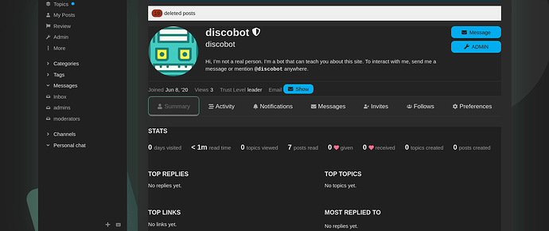](../../../assets/images/202822/c4d3eb137837f4baade34209facbda307f9f202e.png "image")

  

[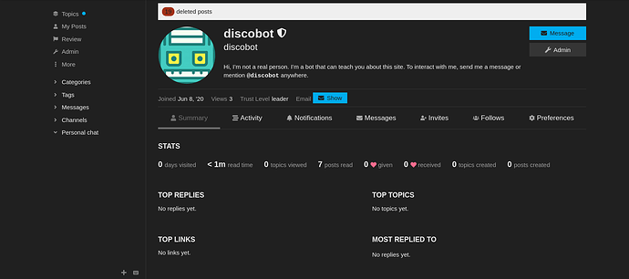](../../../assets/images/202822/e6f683eb9a32df12323fd922e2448d75db79fd8a.png "image")

---

### Post #36 by [LimitlessGreen](../../users/LimitlessGreen.md)
*Posted: 2023-07-28 14:19*

Color Palette Editor does also look a bit funny.  

[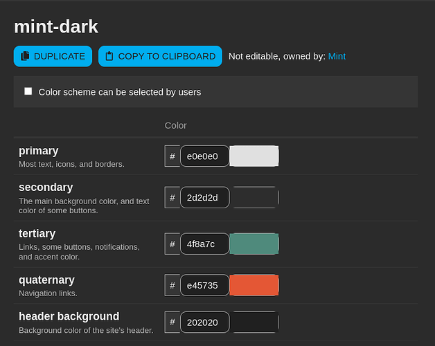](../../../assets/images/202822/b8a8749b1c10c3ba71584cf7fcaa0d9f8aa852b4.png "image")

---

### Post #37 by [Gonerdot](../../users/Gonerdot.md)
*Posted: 2024-01-24 13:53*

Hi all. This is my first experience working with Discourse and servers in general. Tell me how to change the text on the banner, preferably in detail, otherwise I’m stupid =)  

[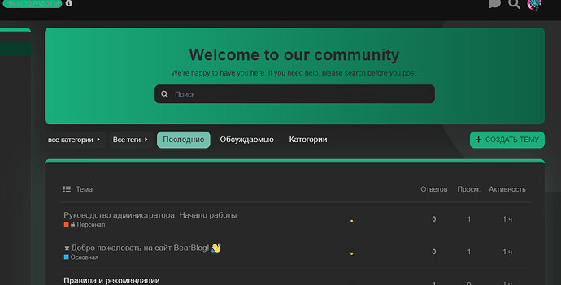](../../../assets/images/202822/a5510ca611b25ac937e052ddebd043fcde2ad9e6.jpeg "image")

---

### Post #38 by [Arkshine](../../users/Arkshine.md)
*Posted: 2024-01-24 14:40*

Welcome! 👋

There is a theme component installed automatically with this theme.

It’s called [Search Banner](https://meta.discourse.org/t/search-banner/122939).

Usually theme components has settings or translations that you can change. To do so:

  1. Go to `Admin`
  2. Click on `Themes`  
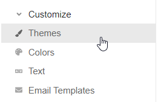
  3. Click on `Components` and look for Discourse Search Banner component:  
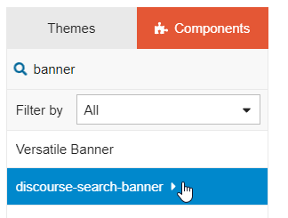
  4. If you scroll down in the right panel, you will the translations. You can change them here:  
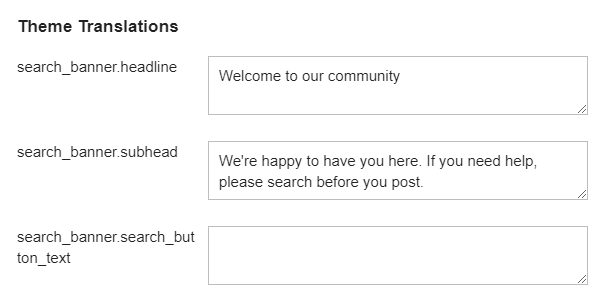

If you are new to theme, I recommend reading the [Beginner’s guide to using Discourse Themes](https://meta.discourse.org/t/beginners-guide-to-using-discourse-themes/91966)!

---

### Post #39 by [Gonerdot](../../users/Gonerdot.md)
*Posted: 2024-01-24 15:00*

Wow, turns out it’s so simple. Thanks a lot 

---

### Post #40 by [gvianna](../../users/gvianna.md)
*Posted: 2024-06-07 16:52*

Is it possible to change this green theme?

[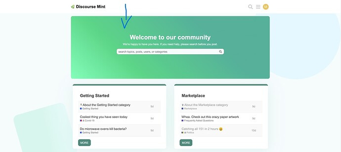](../../../assets/images/202822/cd9b5667df7b17e18cb977195a99b95582a6c9cd.jpeg "Screenshot 2021-09-06 at 19.48.04")

---

### Post #41 by [wendellverli](../../users/wendellverli.md)
*Posted: 2024-06-12 09:48*

 [Fotógrafos Online](https://discourse.fotografos.online) 

### [Fotógrafos Online](https://discourse.fotografos.online)

Aprendizado e Inspiração Para Fotógrafos

  1. There is an extra space above the big block search - need it gone / if I click “recent” the space goes away - is this a bug?

  2. How can I change the big green block to something of my brand / blueish

  3. How can I make the header (Where the logo is) dark and so the logo will be the light version?

---

### Post #42 by [Arkshine](../../users/Arkshine.md)
*Posted: 2024-06-14 00:32*

 Gabriel Vianna:

> Is it possible to change this green theme?

In the theme settings, you can edit the color palette:

[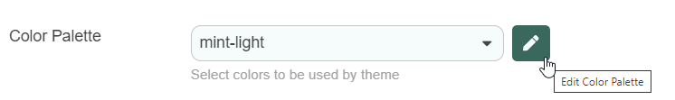](../../../assets/images/202822/5d62cb97a205a241529f457d78dc266e3776417e.png "image")

 Wendell Fernandes:

> There is an extra space above the big block search - need it gone / if I click “recent” the space goes away - is this a bug?

I’m unsure why there is this CSS. You can overwrite it in a theme component:
    
    
    .navigation-categories .search-banner {
      padding: 0
      margin: 0;
      height: auto
    }
    

 Wendell Fernandes:

> How can I change the big green block to something of my brand / blueish

This is how the theme uses CSS for that specific banner.  
You can adjust it to your needs.
    
    
    .custom-search-banner-wrap {
      background: linear-gradient(
        270deg,
        var(--tertiary-medium) 0%,
        var(--tertiary) 100%
      );
    }
    

Useful links:

  * [background - CSS: Cascading Style Sheets | MDN](https://developer.mozilla.org/en-US/docs/Web/CSS/background)
  * [linear-gradient() - CSS: Cascading Style Sheets | MDN](https://developer.mozilla.org/en-US/docs/Web/CSS/gradient/linear-gradient)

---

### Post #43 by [wendellverli](../../users/wendellverli.md)
*Posted: 2024-06-14 12:41*

 Arkshine:

> 
>     .navigation-categories .search-banner {
>       padding: 0;
>       margin: 0;
>     }
>     

This code didn’t work.

---

### Post #44 by [Arkshine](../../users/Arkshine.md)
*Posted: 2024-06-14 12:49*

It does work on my side. Maybe it misses a `height: auto`, though.

Here is what I did. I created a theme component attached to the theme.

[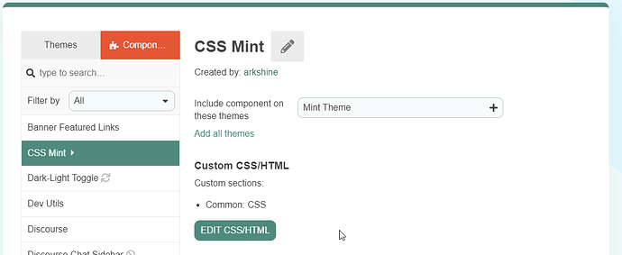](../../../assets/images/202822/7a8e6c7017eafb9ee7f0c0c61731b46ee6ed9882.png "image")

Inserted the CSS:  

Then, the result:  

[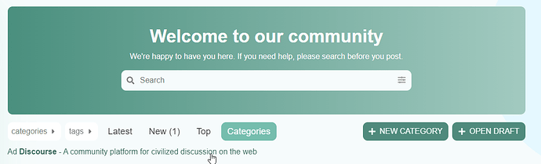](../../../assets/images/202822/511974fbdf49303438ae13e812ba2124d58dd9af.png "image")

You can see the custom CSS in the console:  

[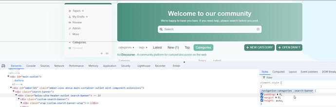](../../../assets/images/202822/05c4ce76918bc8d637e8e5538f47c459bf70d1d3.png "image")

Do you miss something in these steps?

---

### Post #45 by [wendellverli](../../users/wendellverli.md)
*Posted: 2024-06-14 13:12*

That worked like a charm! Thank you so much!

---

### Post #46 by [wendellverli](../../users/wendellverli.md)
*Posted: 2024-06-14 13:16*

It worked - does the custom CSS work throughout header etc etc etc? or would I need something specific for that?

---

### Post #47 by [wendellverli](../../users/wendellverli.md)
*Posted: 2024-06-14 14:28*

[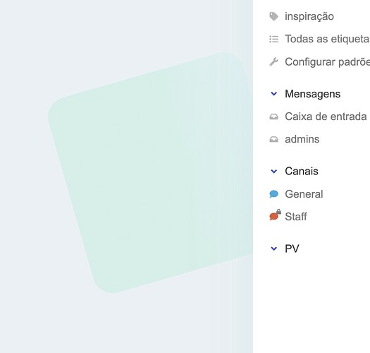](../../../assets/images/202822/27a30365017a7c805967680c0bcc7306322964a7.jpeg "Screenshot 2024-06-14 at 9.26.39 AM")

WHERE is this box color coming from? I was able to “: none;” the circle on the other side…

---

### Post #48 by [Arkshine](../../users/Arkshine.md)
*Posted: 2024-06-14 14:48*

This is the related CSS:

[github.com/discourse/discourse-mint-theme](https://github.com/discourse/discourse-mint-theme/blob/main/desktop/desktop.scss#L19-L46)

#### [desktop/desktop.scss](https://github.com/discourse/discourse-mint-theme/blob/main/desktop/desktop.scss#L19-L46)

[`main`](https://github.com/discourse/discourse-mint-theme/blob/main/desktop/desktop.scss#L19-L46)
    
    
          
    
    
              
        19. }
    
              
        20. 
              
        21. #main-outlet::after {
    
              
        22.   content: "";
    
              
        23.   display: block;
    
              
        24.   position: fixed;
    
              
        25.   z-index: -1;
    
              
        26.   width: 500px;
    
              
        27.   height: 500px;
    
              
        28.   border-radius: 2000px;
    
              
        29.   background: var(--color-circle-gradient);
    
              
        30.   right: 1px;
    
              
        31.   top: -57px;
    
              
        32. }
    
              
        33. 
              
        34. #main-outlet::before {
    
              
        35.   content: "";
    
              
        36.   display: block;
    
              
        37.   position: fixed;
    
              
        38.   z-index: -1;
    
          
    
        

This file has been truncated. [show original](https://github.com/discourse/discourse-mint-theme/blob/main/desktop/desktop.scss#L19-L46)

I think you can do the following:
    
    
    #main-outlet:before{
      background: none;
    }

---

### Post #49 by [wendellverli](../../users/wendellverli.md)
*Posted: 2024-06-14 14:51*

Worked like a charm! Thanks!

---

### Post #50 by [Liam_Layton](../../users/Liam_Layton.md)
*Posted: 2024-07-14 15:58*

Hi, I really like this theme, but the native mobile view looks horrible. If I manually switch the view to desktop in mobile, it does a perfect job of auto sizing to fit the device. I’m pretty new to discourse and unsure if this mobile view is a standard thing. Can I edit anything to make the theme look good on mobile. Thank you

---

### Post #51 by [MustardMan](../../users/MustardMan.md)
*Posted: 2024-07-18 15:06*

Is it possible to change the text color within the search banner?

---

### Post #52 by [Arkshine](../../users/Arkshine.md)
*Posted: 2024-07-18 15:25*

Sure,

You can create a new theme component, attach it to your theme, and add the following CSS:
    
    
    .custom-search-banner-wrap {
        h1 {
            color: blue; /* headline*/
            
            &+p {
                color: red; /* subhead */
            }
        }
        
        .search-menu {
            .btn.search-icon.has-search-button-text {
                .d-icon {
                    color: orange;  /* search button icon */
                }
                
                .d-button-label {
                    color: orange;  /* search button text */
                }
            }
        }
    }
    

Does it help?

---

← Previous | **Page 1 of 2** | [Next →](202822-page-2.md)
