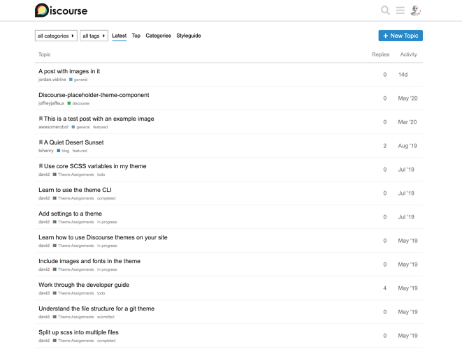
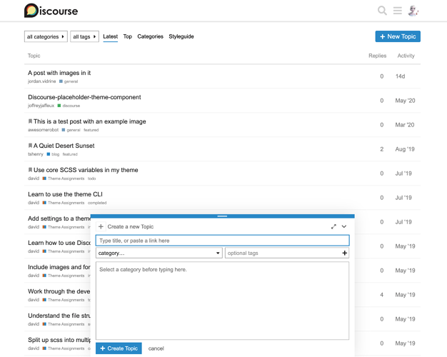
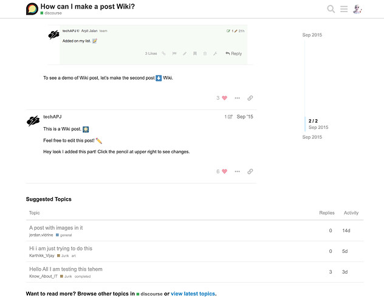
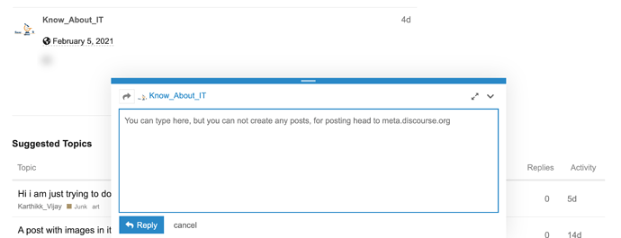

[🏠 Home](../../index.md) | [📋 Latest](../../latest/index.md) | [🔥 Top](../../top/replies/index.md) | [👥 Users](../../users/index.md)

[Home](../../index.md) » [Theme](../../c/theme/index.md) » Modest, a minimal theme for Discourse

---

# Modest, a minimal theme for Discourse

> **Category:** Theme
> **Author:** meghna
> **Created:** 2021-02-25 18:38

---

### Post #1 by [meghna](../../users/meghna.md)
*Posted: 2021-02-25 18:38*

This aims to be an ultra-minimal theme for Discourse. Various elements of the UI has been removed in favour of simplicity.

Some of the removed elements:

  * Homepage (topic list) posters avatar column
  * Homepage (topic list) views column
  * Composer preview pane
  * Composer toolbar
  * Topic map
  * Topic footer buttons
  * Topic timeline footer controls

Homepage:

Homepage with composer open:

Topic page:

Topic reply composer:

Here is the feedback topic I created for this theme – [Envisioning an ultra minimal theme for Discourse](https://meta.discourse.org/t/envisioning-an-ultra-minimal-theme-for-discourse/180844).

Let me know how this theme can be further improved. Enjoy! 🙂

|  |   
---|---|---  
😎 | **Preview** | [Preview on theme creator](https://theme-creator.discourse.org/theme/meghna/modest)  
🔗 | **Github Repo** | [discourse-modest-theme](https://github.com/meghnaAJ/discourse-modest-theme)  
🛠️ | **Install Guide** | [How to install a theme or theme component](https://meta.discourse.org/t/how-do-i-install-a-theme-or-theme-component/63682)

---

### Post #2 by [Falco](../../users/Falco.md)
*Posted: 2021-02-25 18:40*

Maybe it’s worth applying a `max-width: 740px` on the composer to mimic the “Hide Preview” mode?

---

### Post #3 by [meghna](../../users/meghna.md)
*Posted: 2021-02-26 06:05*

Thanks for the suggestion! Made the change in:  
  
[github.com/MeghnaAJ/discourse-modest-theme](https://github.com/MeghnaAJ/discourse-modest-theme/commit/383b0103cd7bb40806085d1386860d54f905aa28)

####  [Fix composer width.](https://github.com/MeghnaAJ/discourse-modest-theme/commit/383b0103cd7bb40806085d1386860d54f905aa28)

committed 05:59AM - 26 Feb 21 UTC

[ +7 -9 ](https://github.com/MeghnaAJ/discourse-modest-theme/commit/383b0103cd7bb40806085d1386860d54f905aa28)

Updated the first post with latest screenshots.

---

### Post #4 by [devporto](../../users/devporto.md)
*Posted: 2021-03-05 19:46*

Nice minimal theme [@meghna](/u/meghna) !

Did find it hard to edit posts without buttons to quote, upload, etc.

---

### Post #5 by [codinghorror](../../users/codinghorror.md)
*Posted: 2021-03-06 07:35*

I suggest hiding the full screen button in the editor as well, which is visible in the above screenshot.

---

### Post #6 by [dax](../../users/dax.md)
*Posted: 2022-01-26 13:54*

This theme is temporary broken with the latest version of Discourse.

Do not install it until we fix the issue.

---

### Post #8 by [awesomerobot](../../users/awesomerobot.md)
*Posted: 2022-01-26 16:09*

I’ve got a PR for some updates here:

[github.com/MeghnaAJ/discourse-modest-theme](../../../assets/images/181150/34d7aedc86d5bc682c08ef81116bed76931270fb_2_1322x1000.png)

####  [REFACTOR: update outdated templates, restructure](../../../assets/images/181150/34d7aedc86d5bc682c08ef81116bed76931270fb_2_1322x1000.png)

`master` ← `awesomerobot:refactor`

merged 12:59AM - 08 Apr 22 UTC

[  awesomerobot ](https://github.com/awesomerobot)

[ +73 -68 ](https://github.com/MeghnaAJ/discourse-modest-theme/pull/3/files)

Fixes an issue where the theme was broken on latest Discourse, and updating stru[…](../../../assets/images/181150/34d7aedc86d5bc682c08ef81116bed76931270fb_2_1322x1000.png)cture.

---
