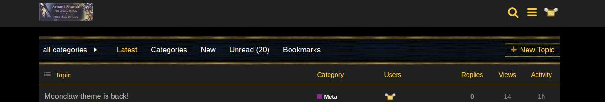
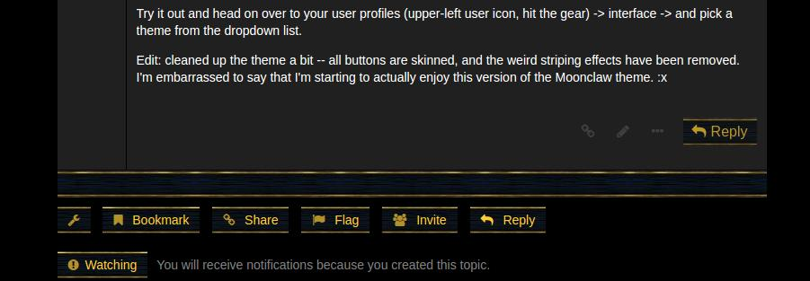
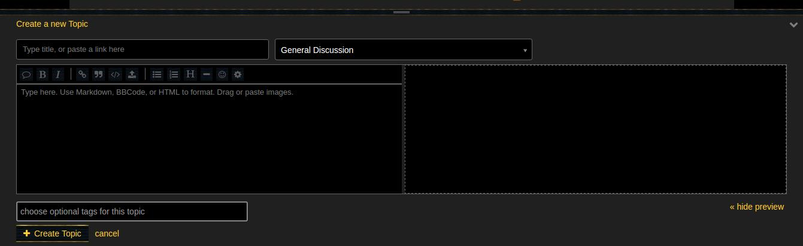
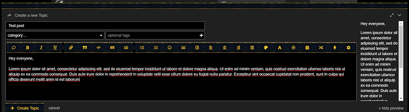
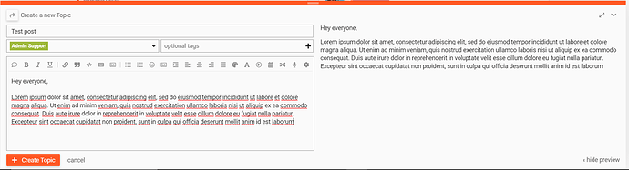
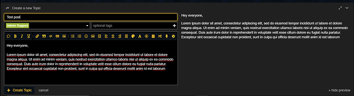

[🏠 Home](../../index.md) | [📋 Latest](../../latest/index.md) | [🔥 Top](../../top/replies/index.md) | [👥 Users](../../users/index.md)

[Home](../../index.md) » [Theme](../../c/theme/index.md) » Moonclaw Theme port

---

# Moonclaw Theme port

> **Category:** Theme
> **Author:** featheredtoast
> **Created:** 2017-05-16 19:27

---

### Post #1 by [featheredtoast](../../users/featheredtoast.md)
*Posted: 2017-05-16 19:27*

I got around to porting an old favorite phpbb theme this weekend for my forum, for nostalgia’s sake. I’ve cleaned it up and thought I’d share it here - Let me know what you guys think!

Installation: Add `https://github.com/featheredtoast/discourse-moonclaw-theme` to your themes, and picking “Moonclaw” as your color scheme. Colors aren’t yet customizable just yet, as many have been hardcoded to get this out the door quickly.

[GitHub - featheredtoast/discourse-moonclaw-theme: moonclaw theme clone from phpbb](https://github.com/featheredtoast/discourse-moonclaw-theme)

Header:  

Footer  

Composer  

### Install guide

[How to install a theme or theme component](https://meta.discourse.org/t/how-do-i-install-a-theme-or-theme-component/63682)
  *[PR]: Pull Request

---

### Post #2 by [M3lvin](../../users/M3lvin.md)
*Posted: 2018-02-24 15:57*

Very nice, bringing some good memories 🙂 . Feels perfect for an rpg community / wow clan etc.
  *[PR]: Pull Request

---

### Post #3 by [GokulNC](../../users/GokulNC.md)
*Posted: 2020-04-25 14:35*

Hey [@featheredtoast](/u/featheredtoast)  
Thanks a lot for the cool theme 🔥

I want to convey the following bug when creating a new topic:  

As you see, the right-side preview pane has become very small because of the large padding sizes for the icons in the formatting toolbar. I don’t have this issue with other themes. (Yes, I have added some extra icons to the toolbar using a plugin)

Can you please look into this?
  *[PR]: Pull Request

---

### Post #4 by [Johani](../../users/Johani.md)
*Posted: 2020-04-25 15:15*

 GokulNC:

> I don’t have this issue with other themes

Are you sure? Adding that many icons to the composer toolbar will cause the same issue on any theme. So, there’s really nothing to fix in this here.

The issue here is that you’ve added too many icons to the toolbar. If you need all of that functionality, then consider moving some of it to the gear menu in the composer.
  *[PR]: Pull Request

---

### Post #5 by [GokulNC](../../users/GokulNC.md)
*Posted: 2020-04-25 15:52*

Screenshot from another theme:  

You can see that it has the same number of icons as in my first screenshot.
  *[PR]: Pull Request

---

### Post #6 by [GokulNC](../../users/GokulNC.md)
*Posted: 2020-04-25 16:09*

I was able to get it working by removing the padding from `btn` CSS class. (Not sure if that’s specific to `d-editor-button-bar` class)

It now exactly matches with that of other themes.  
Can you please make this fix on the theme and push it, if this is the right thing to do? [@Johani](/u/johani)
  *[PR]: Pull Request

---

### Post #7 by [Johani](../../users/Johani.md)
*Posted: 2020-04-25 16:31*

The issue here is still the [same](../../../assets/images/62828/48_182419_2.png). You’ve added too many buttons to the composer toolbar. That breaks the composer layout on both narrow desktop viewports and on mobile - on any theme.

This theme was designed for the default Discourse layout. If your site requires _a lot_ of extra buttons, then it’s up to you to fix it. I think you’ve already figured out how to do it 👍

If you need to override the CSS in this theme, then create a [theme component](https://meta.discourse.org/t/beginners-guide-to-using-discourse-themes/91966) with those overrides and add it to your theme.
  *[PR]: Pull Request

---

### Post #9 by [featheredtoast](../../users/featheredtoast.md)
*Posted: 2020-04-29 22:51*

It’s me you want - Johani doesn’t even have access to my theme! 😉

If you could get it to target just the buttons on the d-editor-button-bar class, I’d take the change. Otherwise, you would lose all the border stylings everywhere!
  *[PR]: Pull Request

---

### Post #10 by [GokulNC](../../users/GokulNC.md)
*Posted: 2020-05-04 09:45*

Can you please do the change when you can find some time? [@featheredtoast](/u/featheredtoast)  
I’m not a front-end guy, so I could mess things up easily. 🙂
  *[PR]: Pull Request

---

### Post #11 by [featheredtoast](../../users/featheredtoast.md)
*Posted: 2020-05-08 04:49*

Try it now

[github.com/featheredtoast/discourse-moonclaw-theme](https://github.com/featheredtoast/discourse-moonclaw-theme/commit/f241623c28f8b2d5fe41e957e9ad976713141f74)

####  [FIX: remove custom padding from reply buttons](https://github.com/featheredtoast/discourse-moonclaw-theme/commit/f241623c28f8b2d5fe41e957e9ad976713141f74)

committed 04:48AM - 08 May 20 UTC

[  featheredtoast ](https://github.com/featheredtoast)

[ +0 -4 ](https://github.com/featheredtoast/discourse-moonclaw-theme/commit/f241623c28f8b2d5fe41e957e9ad976713141f74)
  *[PR]: Pull Request

---
