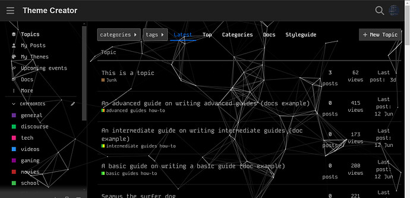
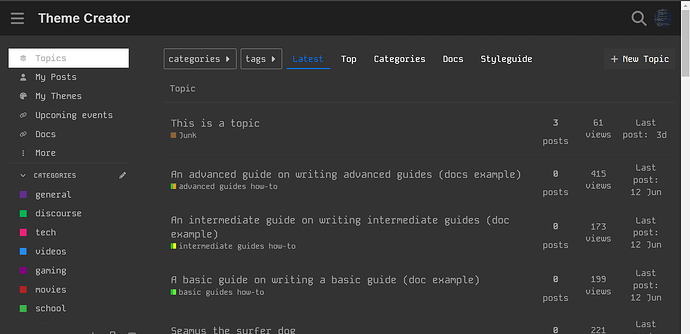
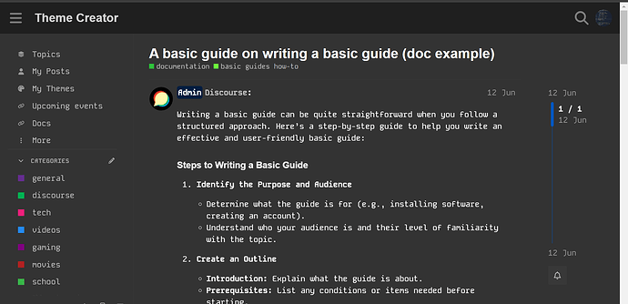
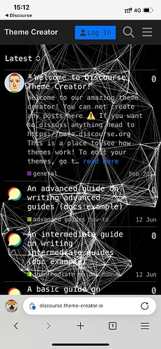

[🏠 Home](../../index.md) | [📋 Latest](../../latest/index.md) | [🔥 Top](../../top/replies/index.md) | [👥 Users](../../users/index.md)

[Home](../../index.md) » [Theme](../../c/theme/index.md) » NateDhaliwal's Theme

---

# NateDhaliwal's Theme

> **Category:** Theme
> **Author:** NateDhaliwal
> **Created:** 2024-10-24 08:57

---

### Post #1 by [NateDhaliwal](../../users/NateDhaliwal.md)
*Posted: 2024-10-24 08:57*

|  |   
---|---|---  
ℹ️ | **Summary** | A simple, functional theme for Discourse.  
👓 | **Preview** | [Theme Creator](https://discourse.theme-creator.io/theme/NateDhaliwal/natedhaliwals-theme)  
🛠️ | **Repository** | [GitHub - NateDhaliwal/NateDhaliwal-s-Theme](https://github.com/NateDhaliwal/NateDhaliwal-s-Theme)  
❓ | **Install Guide** | [How to install a theme or theme component](https://meta.discourse.org/t/how-do-i-install-a-theme-or-theme-component/63682)  
📖 | **New to Discourse Themes?** | [Beginner’s guide to using Discourse Themes](https://meta.discourse.org/t/beginners-guide-to-using-discourse-themes/91966)  
  
The theme puts text in Kode Mono, which is similar to code font. It contains a dark color scheme which is better on the eyes.  
tsParticles’ links animation can also be used as a background instead of the default grey colour.

Admins have a title/badge before their username. In posts, `:` is displayed after the username.

There is also a setting, `background_animation` that is a dropdown. You can choose Either `Links`, `Anemone` (distracting, though), or `Hyperspace` (a 1 second glitch when it loads [1]). If you want neither, the default option, `None`, is available.

Another setting, `display_new_topic_badge` shows a `New!` badge next to new topics. Credits to [@sheng_hualuo](/u/sheng_hualuo) for their post [here](../../../assets/images/332501/22d8c880534a30c10c53570c9dfe13a608206ab2_2_1035x501.png) for the code.

This theme is a dark theme; the colour palette is called ‘NateDhaliwal (dark)’. I am working on a light mode version [2]: look out for that!

* * *

  1. I don’t think this can be helped. ↩︎

  2. Though, as a developer, I can’t imagine _anyone_ using light mode. ↩︎

---

### Post #2 by [ufukayyildiz](../../users/ufukayyildiz.md)
*Posted: 2024-10-26 21:28*

Nice theme. Thanks.

---

### Post #3 by [NateDhaliwal](../../users/NateDhaliwal.md)
*Posted: 2024-11-04 07:08*

2 new background animations added: `Anemone` and `Hyperspace`. Merged into 1 setting: `background_animation`.

---

### Post #4 by [CAX.DO](../../users/CAX.DO.md)
*Posted: 2024-11-04 07:13*

Look good. 👍  
Maybe you could adjust the color depth of the animation because it’s a bit hard to read.  

---

### Post #5 by [NateDhaliwal](../../users/NateDhaliwal.md)
*Posted: 2024-11-04 07:16*

Ah, the animation is very clumped together because of the screen width. It’s fine on desktop, but I can take a look at changing the colour to something a bit darker.

---
