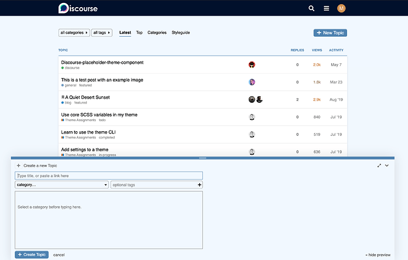

[🏠 Home](../../index.md) | [📋 Latest](../../latest/index.md) | [🔥 Top](../../top/replies/index.md) | [👥 Users](../../users/index.md)

[Home](../../index.md) » [Theme](../../c/theme/index.md) » :snowman_with_snow: Olaf, a Frozen inspired theme for Discourse

---

# :snowman_with_snow: Olaf, a Frozen inspired theme for Discourse

> **Category:** Theme
> **Author:** meghna
> **Created:** 2020-12-11 07:37

---

### Post #1 by [meghna](../../users/meghna.md)
*Posted: 2020-12-11 07:37*

I’ve built a theme based on one of my favourite movie: [Frozen](https://en.wikipedia.org/wiki/Frozen_\(2013_film\)). The theme is inspired by [Frozen official Disney website](https://frozen.disney.com/). ❄️

🔬 [Preview it on the theme creator](https://theme-creator.discourse.org/theme/meghna/olaf)

🔗 [Github repo link](https://github.com/MeghnaAJ/discourse-olaf-theme): ` https://github.com/MeghnaAJ/discourse-olaf-theme`

 [How do I install a theme?](https://meta.discourse.org/t/how-do-i-install-a-theme-or-theme-component/63682)

I’ve also added theme settings to fine-tune logo colors and brightness. These settings were inspired from [@ruidovisual](/u/ruidovisual)’s excellent [Zeronoise](https://meta.discourse.org/t/zeronoise-a-theme-aiming-to-create-a-pleasant-reading-experience/171809) theme.

Developing this theme was an awesome experience! Do let me know how I can further improve this theme. 🙂

---

### Post #2 by [png](../../users/png.md)
*Posted: 2021-05-06 13:40*

“Do you wanna build a snowman”

“No, but I wanna build a forum”

Amazing theme, looks incredible!

---
