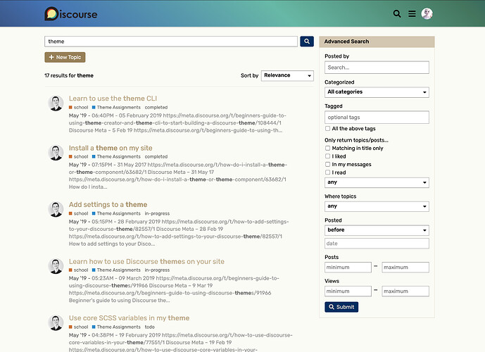
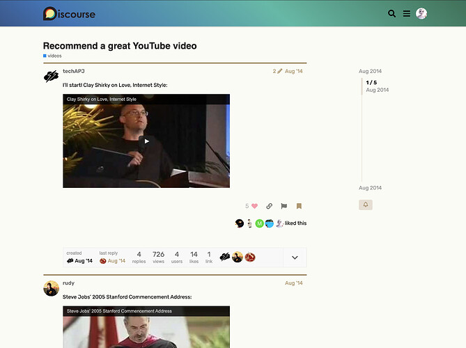

[🏠 Home](../../index.md) | [📋 Latest](../../latest/index.md) | [🔥 Top](../../top/replies/index.md) | [👥 Users](../../users/index.md)

[Home](../../index.md) » [Theme](../../c/theme/index.md) » Peacock, a noble theme for Discourse :peacock:

---

# Peacock, a noble theme for Discourse :peacock:

> **Category:** Theme
> **Author:** meghna
> **Created:** 2021-01-20 04:10

---

### Post #1 by [meghna](../../users/meghna.md)
*Posted: 2021-01-20 04:10*

I’m back with another theme! 

This time I wanted to create a theme that looks subtle and at the same time uplifts spirit. I chose Peacock feather colors because it symbolizes beauty and nobility. I believe we can all use more of morale-boosting in these trying times.

Homepage with composer open:

Full page search:

Topic page:

Let me know how this theme can be further improved. Enjoy! 😃

|  |   
---|---|---  
😎 | **Preview** | [Preview on theme creator](https://theme-creator.discourse.org/theme/meghna/peacock)  
🔗 | **Github Repo** | [discourse-peacock-theme](https://github.com/meghnaAJ/discourse-peacock-theme)  
🛠️ | **Install Guide** | [How to install a theme or theme component](https://meta.discourse.org/t/how-do-i-install-a-theme-or-theme-component/63682)

---
