[🏠 Home](../../index.md) | [📋 Latest](../../latest/index.md) | [🔥 Top](../../top/replies/index.md) | [👥 Users](../../users/index.md)

[Home](../../index.md) » [Theme](../../c/theme/index.md) » Pinboard, a simple UI theme

---

# Pinboard, a simple UI theme

> **Category:** Theme
> **Author:** manuel
> **Created:** 2023-01-20 20:47

---

### Post #1 by [manuel](../../users/manuel.md)
*Posted: 2023-01-20 20:47*

[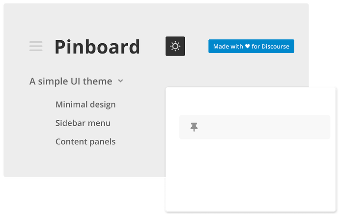](../../../assets/images/252446/8f0dcfc8ee2fa880a8835cc24581c386b0aa2687.png "Cover")

|  |   
---|---|---  
💫 | **Summary** | **Pinboard** is a theme with a simple user interface. It goes well with a flat taxonomy, like a plain list of categories or tags.  
🛠️ | **Repository** | [GitHub - nolosb/discourse-theme-pinboard](https://github.com/nolosb/discourse-theme-pinboard)  
📖 | **New to Discourse Themes?** | [Beginner’s guide to using Discourse Themes](https://meta.discourse.org/t/beginners-guide-to-using-discourse-themes/91966)  
  
Install this theme

[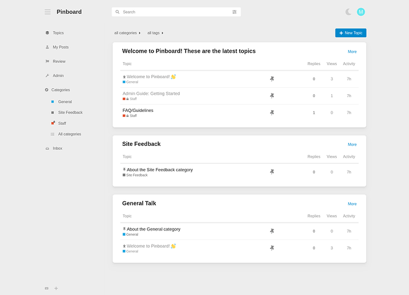](../../../assets/images/252446/a3a9ca55f2afbba46a2560de9544f1acf8e3e519.png "Screenshot 2024-01-11 at 21-06-22 Pinboard")

#  Post install setup

The theme installs a few additional components. Some need adjustments on their settings to tweak the theme look:

  * **Dark/Light Toggle**

    * For the toggle to work, you should set the Light color scheme on the theme settings. And pick the Dark color scheme in general settings (`default dark mode color scheme id`).
    * You can choose to show the toggle icon on the header. By default it shows on the sidebar footer.
  * **Rounded**

    * A style component to round layout elements. On my preview site, the default radius is set to 10px and button radius to 4px.
  * **Panels**

    * Another style component to render list containers as panels. The theme has a shadow style for the panels defined, you can enable it using this `--shadow` variable:

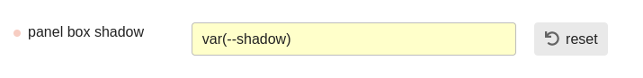

[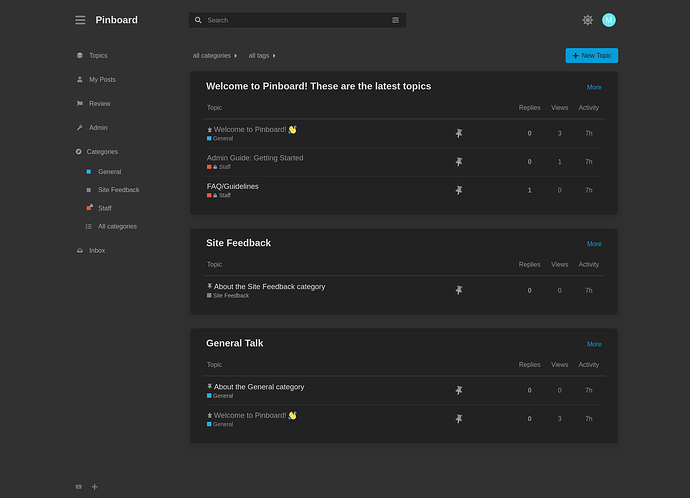](../../../assets/images/252446/d17f9026863a0ed271a8684f39272035b1a85868.png "Screenshot 2024-01-11 at 21-06-52 Pinboard")

# 🎨 Theme Features

### Use with categories or with tags only

You can hide tags or categories from the interface and use only either one.

### Custom homepage

You can build a custom homepage layout similar to the one on the previews.

  * Choose the `custom homepage` option on the theme settings

  * Pick your homepage in your admin settings. E.g. here it’s set to the top-route:  

[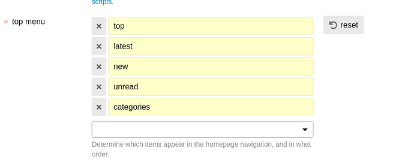](../../../assets/images/252446/a718372ca5a9cec47b1d60b13790cfac324c4e16.png "image")

  * Install [this helper component](https://github.com/nolosb/discourse-homepage-class.git) to add a dedicated homepage class. Set your homepage in the component settings:

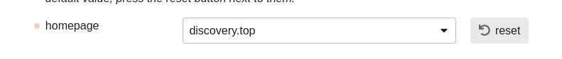

  * On the installed Panels component, choose to render panels on featured lists:  
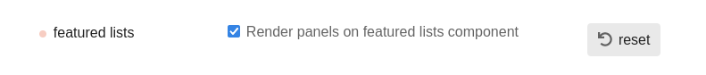

  * Install the [Featured Lists component](https://meta.discourse.org/t/featured-lists/288916) and set it’s outlet position to `discovery-list-container-top`

---

### Post #2 by [awesomerobot](../../users/awesomerobot.md)
*Posted: 2023-01-20 22:17*

This is a very nice theme, I love the simplicity!

---

### Post #3 by [syandriz](../../users/syandriz.md)
*Posted: 2023-01-20 23:36*

nice work brother… 😍

---

### Post #4 by [Melvin20](../../users/Melvin20.md)
*Posted: 2023-01-21 00:23*

Wow! This has a great aesthetic to it

---

### Post #5 by [techAPJ](../../users/techAPJ.md)
*Posted: 2023-01-21 03:39*

The theme looks awesome! Minimal in a good way. Love what you did with the sidebar.

Great work [@manuel](/u/manuel) 👍

---

### Post #6 by [Umashankar_Ankuri](../../users/Umashankar_Ankuri.md)
*Posted: 2023-02-01 02:23*

[@manuel](/u/manuel)

Please help with what setting am I missing here. home page shows outer wrapper for me with topics below. Instead of each pin board

Thank you.

[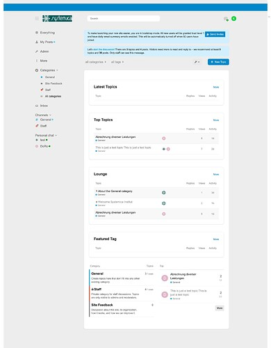](../../../assets/images/252446/a58defefadca93655e8b7b986542c50afe8e4b12.jpeg "screencapture-meta-systemica-institut-de-2023-02-01-07_50_28")

---

### Post #7 by [twofoursixeight](../../users/twofoursixeight.md)
*Posted: 2023-02-01 02:24*

Looks like a productive theme with great simplicity that can easily save you lots of time thanks to its user interface.

---

### Post #8 by [manuel](../../users/manuel.md)
*Posted: 2023-02-01 06:25*

Did you check the option as described above?

 Manuel Kostka:

> Choose the `custom top page` option on the theme

---

### Post #9 by [Umashankar_Ankuri](../../users/Umashankar_Ankuri.md)
*Posted: 2023-02-01 17:44*

Yes. I did select that option.

---

### Post #10 by [manuel](../../users/manuel.md)
*Posted: 2023-02-01 18:46*

You also have to set Top Topics as your homepage. Your homepage is set to the categories list. That’s because this theme setting only shows the pinboard lists and hides the content below. That only works on the top route. We can replace top topics with a pinboard list of top topics if needed. We typically need the categories list or latest topics for the forum to work.

You set the top page to be your home page by making it the first item of the top menu list in your admin settings:  

[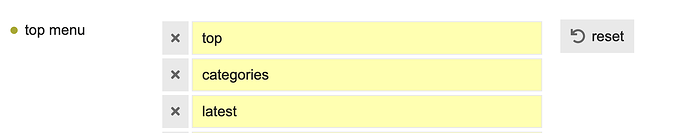](../../../assets/images/252446/a6ebfeaf9a40e79f3160c2ab16f0223bb9edea5c.png "image")

---

### Post #11 by [Umashankar_Ankuri](../../users/Umashankar_Ankuri.md)
*Posted: 2023-02-02 01:46*

[@manuel](/u/manuel) Thank you.  
This is missing exactly. Now it’s fine.

---

### Post #12 by [JackALaing](../../users/JackALaing.md)
*Posted: 2023-04-06 21:32*

Is this theme supposed to hide the top menu (Latest, Top, etc)? Is there a way for us to bring it back?

---

### Post #13 by [manuel](../../users/manuel.md)
*Posted: 2023-04-06 22:40*

Yes, these items are hidden. I’m opinionated about it on this theme because Latest/New/Unread are already available from the sidebar and Top is used for the landing page.

If you want to use the theme _and_ have those items on the navbar, you’d need to override the style declarations of the theme manually.

---

### Post #14 by [JackALaing](../../users/JackALaing.md)
*Posted: 2023-04-06 22:44*

I don’t see Latest/New/Unread in the sidebar, either on my instance of the theme, or the test site, or the screenshots in this post. Can you point me in the right direction?

---

### Post #15 by [manuel](../../users/manuel.md)
*Posted: 2023-04-06 23:12*

_Latest_ is called _Everything_ on the sidebar by default. On my screenshots it’s named _All_.

But yes, it’s true that Unread and New don’t show on the sidebar now. I thought they showed there just as they had before on the hamburger dropdown. Maybe I remember wrong or it has been changed. There’s still constant updates to the sidebar.

The contextual info about new content on the sidebar are notification dots following all menu items that hold new content for the logged-in user:

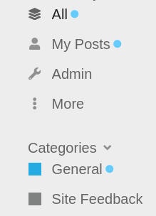

---

### Post #16 by [P2W](../../users/P2W.md)
*Posted: 2023-04-09 17:00*

Big fan of this theme.

For some reason, the Dark/Light Toggle theme component is not appearing the header.

---

### Post #17 by [manuel](../../users/manuel.md)
*Posted: 2023-04-10 13:25*

Thank you ☀️

It doesn’t show for me on the default theme either, so probably related to the component.

Actually, see here: [Dark/Light Mode Toggle - #88 by RGJ](https://meta.discourse.org/t/dark-light-mode-toggle/215585/88) Right now the toggle only shows when a user has automatic color mode switching enabled.

---

### Post #18 by [JacobDK](../../users/JacobDK.md)
*Posted: 2023-05-17 06:51*

[@manuel](/u/manuel) really, really well done. Is the font-sizing deliberately this big (big according to me) ?

[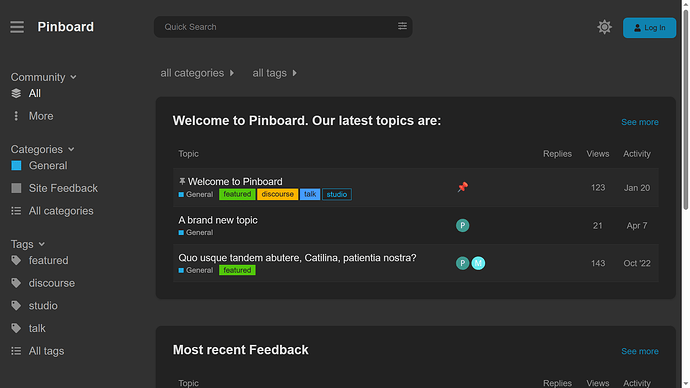](../../../assets/images/252446/3fe27f2740587bc7076e4e22d87f8354dbb77c4a.png "image")

Screenshot is from a laptop 15 inches - It seems out of proportions ?

Have you considered a tabbed solution in stead of displaying the categories in boxes in list-format - i.e. “feedback” would be a tab next to “Welcome to Pinboard” ?

---

### Post #19 by [manuel](../../users/manuel.md)
*Posted: 2024-01-11 20:34*

⚠️ I just pushed a refactor of this theme. There’s only subtle changes on the UI, but the theme code is re-organized and includes a few new components.

If you installed the theme before, you will need to re-adjust components and any style declarations you did on top of it. In case you don’t want to do this right now, you can also pull the theme from it’s v1-branch and stay with the previous setup:

[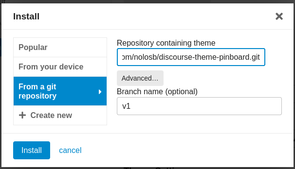](../../../assets/images/252446/3338ee9a874d12bc240d88ea70a7d58d72ad0865.png "image")

For reference here are the post-install details for v1:

## Theme Features

  * **Use with categories or with tags only**  
You can hide tags or categories from the interface and use only either one.

  * **Custom landing page**  
You can build a custom landing page similar to the one on the previews.

    * Install the [Versatile Showcase component](https://meta.discourse.org/t/versatile-showcase/234451) and set it’s outlet position to `discovery-list-container-top`
    * Set your homepage to the `top` route
    * Choose the `custom top page` option on the theme

## Component Features

The theme automatically installs a few additional components:

  * **Dark/Light Toggle**  
Set the Light color scheme on the theme settings. Choose the Dark color scheme in general settings.

  * **Header Search**

  * **Clickable Topics**

  * **Tag Styles**  
To choose color styles for tags.

---

### Post #20 by [cristo](../../users/cristo.md)
*Posted: 2024-08-24 13:36*

Awesome theme, super clean!

I’m just wondering if this theme is best suited for desktop or mobile.

---
