[🏠 Home](../../index.md) | [📋 Latest](../../latest/index.md) | [🔥 Top](../../top/replies/index.md) | [👥 Users](../../users/index.md)

[Home](../../index.md) » [Theme](../../c/theme/index.md) » Pyx's Modern Theme

---

# Pyx's Modern Theme

> **Category:** Theme
> **Author:** darkpixlz
> **Created:** 2025-03-17 23:17

---

### Post #1 by [darkpixlz](../../users/darkpixlz.md)
*Posted: 2025-03-17 23:17*

|  |   
---|---|---  
ℹ️ | **Summary** | Pyx’s Modern Theme is the [successor to darkpixlz’s Modern Theme](https://meta.discourse.org/t/darkpixlzs-modern-theme/232543/127).  
👓 | **Preview** | [Theme Creator](https://discourse.theme-creator.io/theme/darkpixlz/pyx-modern-theme)  
🛠️ | **Repository** | [GitHub - pyxfluff/moderntheme: Modern theme for Discourse.](https://github.com/pyxfluff/moderntheme)  
❓ | **Install Guide** | [How to install a theme or theme component](https://meta.discourse.org/t/how-do-i-install-a-theme-or-theme-component/63682)  
📖 | **New to Discourse Themes?** | [Beginner’s guide to using Discourse Themes](https://meta.discourse.org/t/beginners-guide-to-using-discourse-themes/91966)  
  
Install this theme

[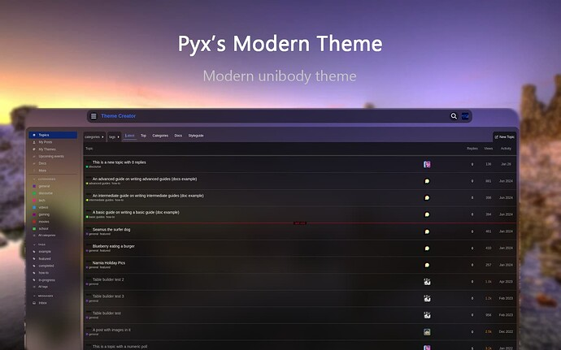](../../../assets/images/357665/cb5a205bbfb12091d4c2fed75b60db6fcb6ad8e9.jpeg "This image showcases a title screen for "Pyx's Modern Theme," a modern and unibody theme design. \(Captioned by AI\)")

Pyx’s Modern Theme is the successor to my old theme, [darkpixlz’s Modern Theme](https://meta.discourse.org/t/darkpixlzs-modern-theme/232543/127), which was a fork of the Air theme. It was roughly 2500 lines and had many issues, so I have rewritten it!

## Screenshots

[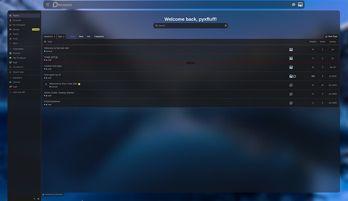](../../../assets/images/357665/424e5482a3eb7a9bdb06f7282b40591f73db1667.jpeg "image")

  

[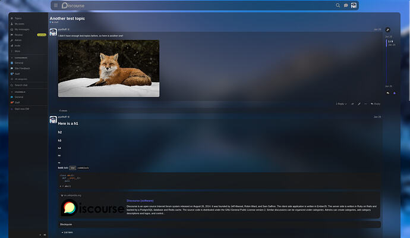](../../../assets/images/357665/095a63bb906d94e80bbce7b9e11962ff925fcbb6.jpeg "image")

  

[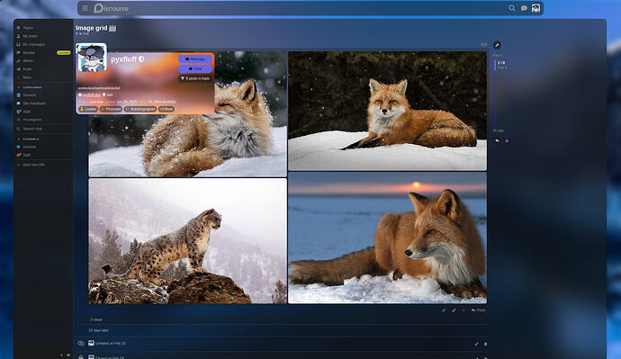](../../../assets/images/357665/c4940faf329fce7f02f4c557d69cbf90a939ad0c.jpeg "image")

  

[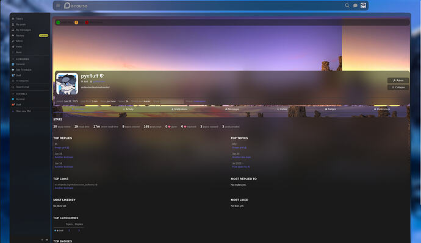](../../../assets/images/357665/8175c5e029c039c339bb398260e0e97482e34034.jpeg "image")

  

[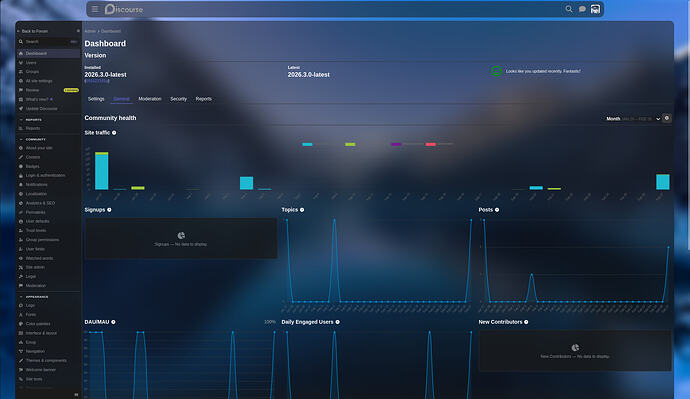](../../../assets/images/357665/642dd2ea2b8862ad009929ef57c95b96afb7c974.jpeg "image")

  

[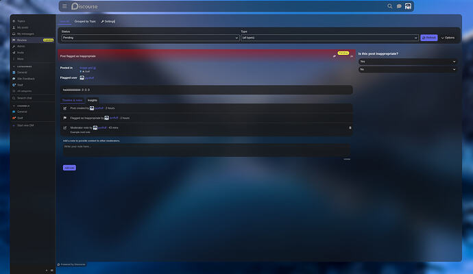](../../../assets/images/357665/298184288e8acbc0bb32b1407f622f4b7c5dca76.jpeg "image")

  

[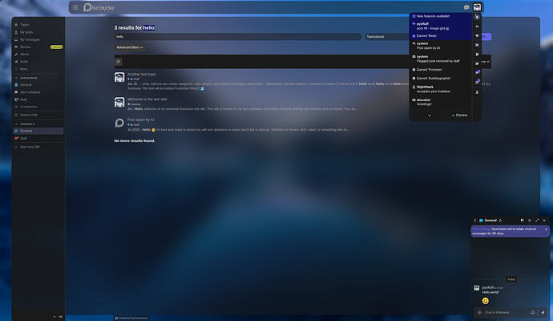](../../../assets/images/357665/e2ed44bde83b27c5ca0547ca228f92efcfb2315d.jpeg "image")

  

[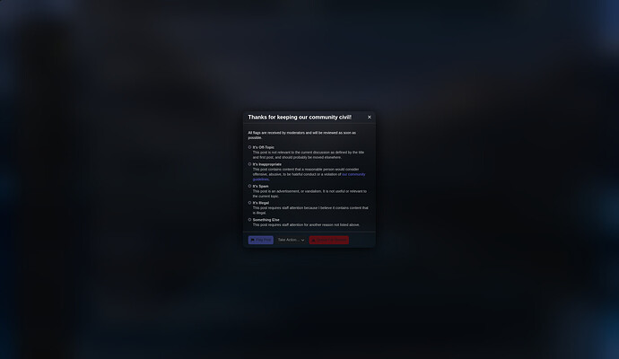](../../../assets/images/357665/a3295f1d0016416501a821480a2b87007cc634f8.jpeg "image")

  

[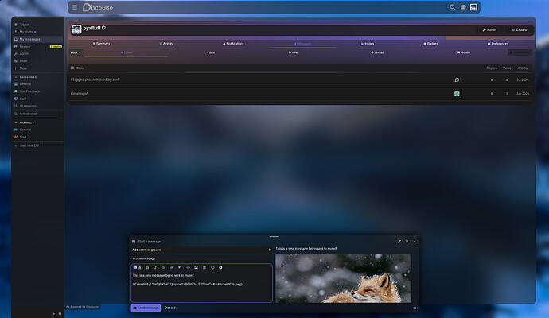](../../../assets/images/357665/d8b21006a5457c3178518b1aedf16f134d3dbae1.jpeg "image")

## Features

  * Supports the full admin interface and review panel
  * Supports almost every modern core feature (new topic map, new upgrade page, chat, …) and some plugins
  * Customizable background image
  * Adds a `--user-bg-url` property for your plugins to read a users background image on profiles
  * Compared to my old theme, way less LOC overall and easier for devices to render

### Known issues

_Nothing at the moment!_

All contributions on the repository are more than welcome and will (probably) be reviewed same-day. Comments or ideas? Drop a reply here. Issues? Make a github issue please.

_Please note that I test all of my styles for Firefox and Firefox only; if Chromium is acting up, please don't hesitate to file a report. I do not test nor verify mobile view at the moment, but support is planned._

That’s it for now - enjoy the theme!

---

### Post #2 by [Monikas](../../users/Monikas.md)
*Posted: 2025-03-18 02:29*

[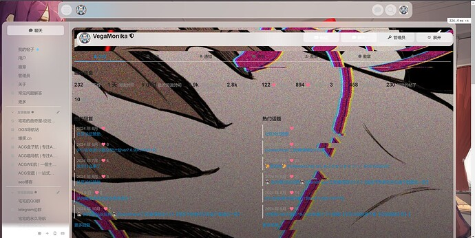](../../../assets/images/357665/98c94f14b3686e85dafda6861fbfba69c9398d39.jpeg "The image depicts a social media or message platform containing a profile page for "VegaMonika," featuring multiple comments and messages in a chat interface. \(由 AI 生成标题\)")

  

[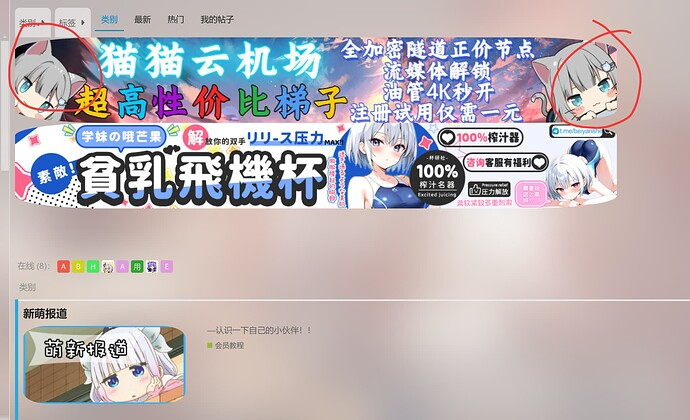](../../../assets/images/357665/63df74e550708195984f03e3798a1763d80c2f67.jpeg "The image appears to be a screenshot from a Japanese streaming platform showing a banner for a game or Dream Tags with animated anime-style characters and Japanese text. \(由 AI 生成标题\)")

Well, there seems to be a problem with not having any components installed, and then it seems to change the CSS of the images, causing a lot of them to become rectangles.

---

### Post #3 by [darkpixlz](../../users/darkpixlz.md)
*Posted: 2025-03-18 02:32*

 Monikas:

> ")

Yep, this was an oversight. I forgot components could add images like this. A fix has been pushed 👍

 Monikas:

> ")

This is intended behavior, I guess it just looks kinda wrong if the banner is closed. I’ll see what I can do.

---

### Post #4 by [Monikas](../../users/Monikas.md)
*Posted: 2025-03-18 02:38*

[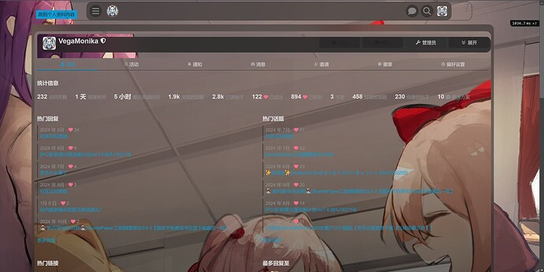](../../../assets/images/357665/f0a7747c2f1ad5c8ca8a4d7688ab705b1eaf5fcb.jpeg "The image shows a user interface of a social media or messaging platform displaying a profile with various metrics and conversation records featuring animated characters. \(由 AI 生成标题\)")

  

[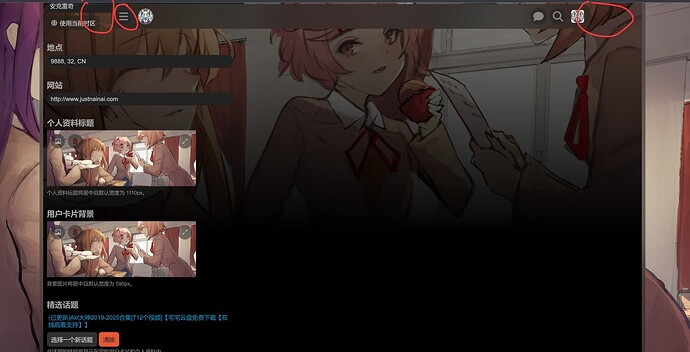](../../../assets/images/357665/5881f4943924e9e12c6e773f3f2fd0bcfd7c8bbb.jpeg "A digital interface displays an anime-style image of two girls, one feeding the other an apple, surrounded by UI elements and image captions in Chinese. \(由 AI 生成标题\)")

I tried a different image and it seemed to be a bit of a problem, but the problem with making the image an oval did go away.

---

### Post #5 by [Monikas](../../users/Monikas.md)
*Posted: 2025-03-18 02:44*

[Discourse Advertising Plugin (Ads)](https://meta.discourse.org/t/discourse-advertising-plugin-ads/33734) [Plugin](/c/plugin/22)

>  Summary Discourse Advertising allows the set up of advertisements on Discourse 📖 Install Guide This plugin is bundled with Discourse core. There is no need to install the plugin separately. ⚠️ AD-BLOCKERS If you are running an ad-blocker in your browser or through a vpn, the contents of your /admin/plugins page may be blanked out. Disabling your adblocker, using an incognito tab, or whitelisting your site should prevent this issue. Features … 

[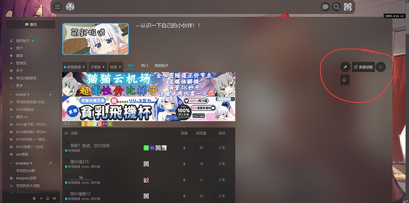](../../../assets/images/357665/d541a4168286ba5c48f395a6d9962f6831bac720.jpeg "A blurred image showing a chat or forum interface with a circular feature and icons to the right, possibly on a gaming or anime site. \(由 AI 生成标题\)")

I wonder if it’s possible to add an adaptive scale? I’d like to have a sidebar component on the right side.

CSS
    
    
    /* Get the user's avatar width and set the maximum width of the ad container */
    
    /* Ad container styles */
    #list-area {
        display: flex;            /* Arrange ads using flexbox */
        flex-direction: column;   /* Display ads vertically */
        gap: 0;                   /* Remove spacing between ad images */
        padding: 0;               /* Remove container padding */
        margin: 0;                /* Ensure no extra margin around the ad container */
        max-width: 812px;         /* Limit the ad container width to a maximum of 812px (avatar width: 48px) */
    }
    
    /* Ad link styles */
    .banner-ad {
        display: block;           /* Make the ad container a block element */
        width: 100%;              /* Ensure the ad container occupies 100% width */
        max-width: 100%;          /* Prevent exceeding the maximum width */
        margin: 0;                /* Remove spacing between ad containers */
    }
    
    /* Responsive ad image styles */
    .ad-image {
        width: 100%;              /* Ensure the image occupies the full width of its parent */
        height: auto;             /* Maintain the original aspect ratio of the image */
        max-width: 100%;          /* Prevent the image from exceeding its container's max width */
        display: block;           /* Fix the empty space issue at the bottom of images */
        margin: 0;                /* Remove any additional space around the image */
    }
    
    /* Responsive Design: Adjust ad display for large and small screens */
    
    /* Adjust ad display on devices with a width less than 768px */
    @media (max-width: 768px) {
        #list-area {
            padding: 0;            /* Ensure no extra padding on mobile devices */
        }
    
        .banner-ad {
            width: 100%;           /* Ensure the ad occupies the full width on small screens */
        }
    
        .ad-image {
            width: 100%;           /* Ensure the image adapts to the container width */
            height: auto;          /* Maintain the image's aspect ratio */
        }
    }
    
    /* Further adjust ad images on very small devices (e.g., phones in portrait mode) */
    @media (max-width: 480px) {
        .ad-image {
            width: 100%;             /* Ensure images adapt to the phone's screen width */
            max-width: 100%;         /* Set the maximum width to 100% to avoid oversizing */
            height: auto;            /* Maintain the image's aspect ratio */
        }
    }
    
    

[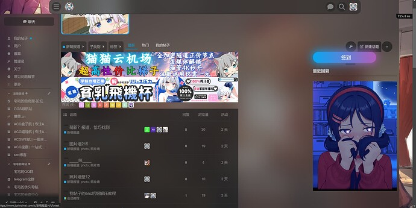](../../../assets/images/357665/9624c3379c58db116956ff2dfaa42eb1efdca57e.jpeg "A screenshot shows an online chat interface with anime-based avatars and a kawaii image on the right, discussing a promotion involving a cat theme and flight machinery. \(由 AI 生成标题\)")

[Right Sidebar Blocks](https://meta.discourse.org/t/right-sidebar-blocks/231067) [Theme component](/c/theme-component/120)

>  Summary Right Sidebar Blocks shows a sidebar to the right of topic lists with a configurable list of blocks. 👓 Preview [Preview on Discourse Theme Creator](https://discourse.theme-creator.io/theme/Discourse/right-sidebar-blocks) 🛠️ Repository Link <https://github.com/discourse/discourse-right-sidebar-blocks> 📖 New to Discourse Themes? [Beginner’s guide to using Discourse Themes](https://meta.discourse.org/t/beginners-guide-to-using-discourse-themes/91966) Install this theme component Features The component includes a few blocks you can display in the sidebar: popular-tags …

---

### Post #6 by [darkpixlz](../../users/darkpixlz.md)
*Posted: 2025-03-18 02:45*

I’ll check on the side component thing tomorrow. No promises on advertising because I cannot test that but for general scaling I should be able to fix that.

---

### Post #7 by [Lilly](../../users/Lilly.md)
*Posted: 2025-03-18 02:51*

Nicely done! 👏  

---

### Post #8 by [darkpixlz](../../users/darkpixlz.md)
*Posted: 2025-03-23 20:40*

Update pushed with many fixes and support for the category edit page and other admin areas!

[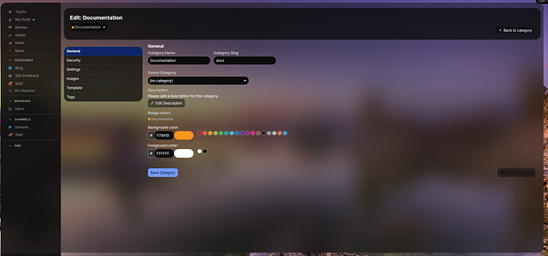](../../../assets/images/357665/df0d2edc57e52a8a88b9a300a148e68288f723ab.jpeg "image")

  

[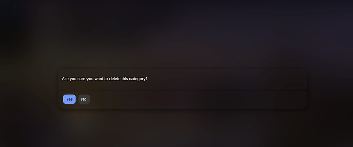](../../../assets/images/357665/b6912da1a3ce2e945815f457750e47e758703246.png "image")

[@Monikas](/u/monikas) your issue with side buttons should also be fixed now.  

[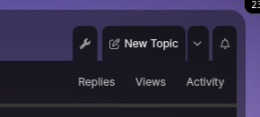](../../../assets/images/357665/64e10e351240bef11b559aee53a7eec234cbb76c.png "image")

---

### Post #9 by [darkpixlz](../../users/darkpixlz.md)
*Posted: 2025-03-29 05:36*

Sorry, I was sick a lot of this week, have also had other things to be doing. Just polished the post stream up, fixed many bugs, and made the composer float!

[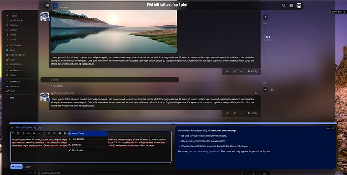](../../../assets/images/357665/c11f78c4cd1b95e7bceb46bb75979f2b579325d5.jpeg "image")

---

### Post #10 by [darkpixlz](../../users/darkpixlz.md)
*Posted: 2025-03-29 05:39*

Also, I noticed that the theme page got reverted to the old version which has summoned a lot of issues. I’m not going to make an effort to fix anything there because I feel like it will be re-added and it will look like intended.

---

### Post #11 by [joshhabka](../../users/joshhabka.md)
*Posted: 2025-04-17 19:42*

Is there a way to have a layout like below:

[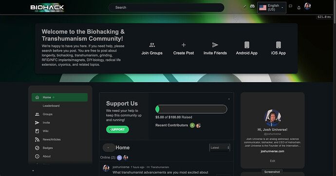](../../../assets/images/357665/f803a87922918ced270948e055599e12f3e803ab.jpeg "Screenshot 2025-04-17 at 3.41.43 PM")

With the nice rendering and stuff of this theme? Like can I have the leaderboard sidebar and stuff too(see below):

[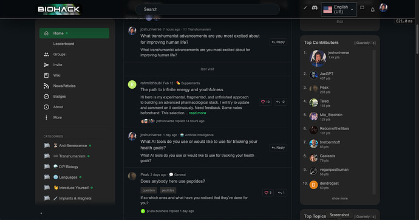](../../../assets/images/357665/a5f2e802cfadf25a2582b5cbd2e950100fca4437.jpeg "Screenshot 2025-04-17 at 3.42.11 PM")

---

### Post #12 by [darkpixlz](../../users/darkpixlz.md)
*Posted: 2025-04-17 19:46*

Unfortunately that’s a little out of scope for this theme because it’s intentionally unibody so I would not adopt a layout where the sidebar is detached. If you’re looking for a design like that I’d recommend these two amazing themes:

[Horizon Theme](https://meta.discourse.org/t/horizon-theme/360486) [Theme](/c/theme/61)

> ℹ️ Summary Horizon is a simple, beautiful theme that improves the out-of-the-box experience for Discourse sites. 👓 Preview [Preview on Discourse Theme Creator](https://discourse.theme-creator.io/theme/Discourse/horizon) 🛠️ Repository Horizon is part of Discourse core. ❓ Install Guide There is no need to install Horizon, it is preinstalled as part of Discourse core. 📖 New to Discourse Themes? [Beginner’s guide to using Discourse Themes](https://meta.discourse.org/t/beginners-guide-to-using-discourse-themes/91966) Features Horizon offers a simple, use… 

[FKB Pro - Social theme](https://meta.discourse.org/t/fkb-pro-social-theme/234323) [Theme](/c/theme/61)

> FKB Pro is a highly modified, detailed, professional social theme, but still user-friendly. 🚀 ⚠️ This theme is quite sensitive and maybe not well compatible with other theme components or plugins you use! Please test it before use. These usually need some css modification. If you have any issue please report and will fix it. Layout On desktop: Three column layout. [[Screenshot 2023-01-02 at 19.53.05]](../../../assets/images/357665/543b344600b8fb6ae6dccc92c77cecc46646b004.jpeg "Screenshot 2023-01-02 at 19.53.05") Sidebar ready [[Screenshot 2023-01-02 at 19.51.55]](../../../assets/images/357665/ae96c37c29d4d946ff2168e63b4b2383fee42ad3.jpeg "Screenshot 2023-01-02 at 19.51.55") On mobile: [[Scre…](../../../assets/images/357665/cb101211f3558a64d8b19ff040c956930e5ac52f.png "Screenshot 2023-01-02 at 19.56.45")

However if the header banner is something you’d like to see supported feel free to give me a site URL and I’ll check out the possibility of supporting it.

---

### Post #13 by [xin_wang](../../users/xin_wang.md)
*Posted: 2025-04-19 07:10*

so cool

---

### Post #14 by [darkpixlz](../../users/darkpixlz.md)
*Posted: 2025-05-15 23:25*

Hi all, sorry for the lack of updates lately! I have just added support for the review queue and docker manager.

[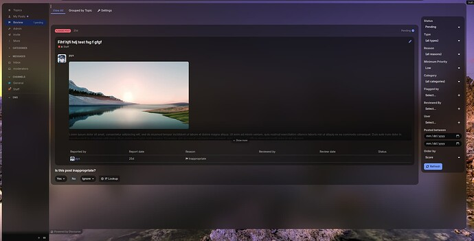](../../../assets/images/357665/d398efd6e040ff4035969848b3cbccec000f132b.jpeg "image")

  

[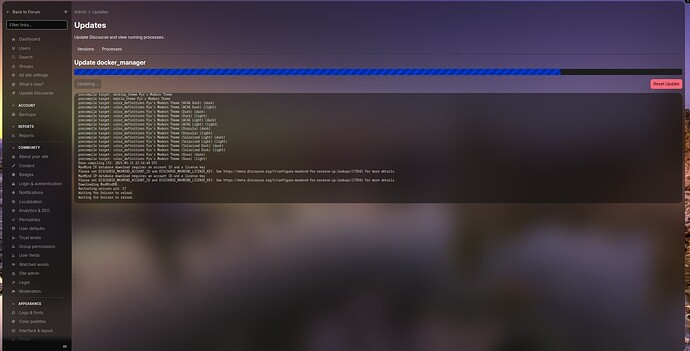](../../../assets/images/357665/efc4a4082a072921fc8326d4d138a1416e55ddaa_2_1035x526.jpeg "image")

  

[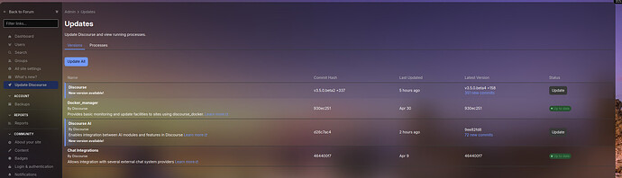](../../../assets/images/357665/2850a8d7b65c9b6c76f99ee4f3b342223cd8dfe6.jpeg "image")

---

### Post #15 by [darkpixlz](../../users/darkpixlz.md)
*Posted: 2025-06-07 18:46*

Hi guys,

Sorry for the slow update, I requested the title to be changed last week and never really followed up. I went to sync the theme on my local site, but I learned about some port conflicts, 8 hours later I have my entire homelab [migrated to Proxmox.](https://bsky.app/profile/pyxfluff.dev/post/3lqnrmj5ozs2v) Mix that and [the week I’ve had with personal projects (documenting 4000 LOC frontend + backend is not easy)](https://github.com/pyxfluff) and you don’t get a lot of spare time 

tl;dr: The theme is now out of the “preview” stage!  I’m confident enough it’ll work for most everybody’s sites and be styled ok. With this new stage, I am no longer looking for bug reports here, please [file GitHub issues](https://github.com/pyxfluff/moderntheme) going forward.

Please keep the feedback coming - any and all is welcome. Thank you for your continued support even if I may be slow :3

---

### Post #16 by [Den](../../users/Den.md)
*Posted: 2025-07-16 05:48*

Brilliant work as always, thanks!

---

### Post #17 by [darkpixlz](../../users/darkpixlz.md)
*Posted: 2025-07-18 05:42*

Hi guys,

Sorry about the deprecation warning at the top of your sites for a few days 😅, it has been fixed now. Everything should be normal again.

---

### Post #18 by [darkpixlz](../../users/darkpixlz.md)
*Posted: 2025-07-18 06:32*

More good news! I just ended up [rewriting the theme again](https://github.com/pyxfluff/moderntheme/commit/efd622be2181775ec4b889914cb98c0d5238be57) so it is no longer one massive common.scss file. It shouldn’t look any different besides some minor fixes I made. Enjoy :3

[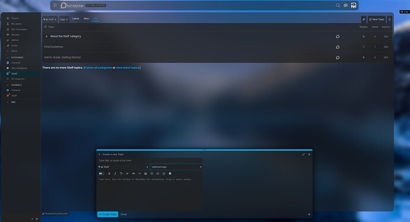](../../../assets/images/357665/115bdc2963834efe70e8024da6e9be540a23aad1.jpeg "image")

  

[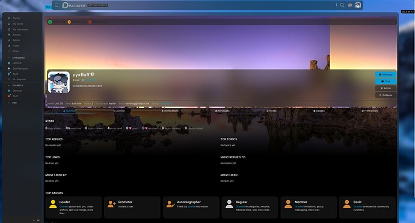](../../../assets/images/357665/a587a75bb1e5b658a579fd202d1b0a50cc18793e.jpeg "image")

---

### Post #19 by [DevTeVe](../../users/DevTeVe.md)
*Posted: 2025-11-01 10:52*

Really liked the theme, but there’s some “artifacts” that unfortunately prevents me from using it 😦

  * The “Profile” page has little button behind the header that says “skip to content”
  * When I try to select a different color palette (as user, on my profile) the dropdown selection shows close to the “skip to content” button i mentioned above (that’s how I realized it was there)

---

### Post #20 by [DevTeVe](../../users/DevTeVe.md)
*Posted: 2025-11-01 17:58*

[@darkpixlz](/u/darkpixlz) I’ve recorded a video because I realize that my feedback may be hard to understand 😃

---

### Post #21 by [darkpixlz](../../users/darkpixlz.md)
*Posted: 2025-11-01 18:21*

Hey - thanks for the report. I just fixed the profile “Skip to content” error and it should be better now!

[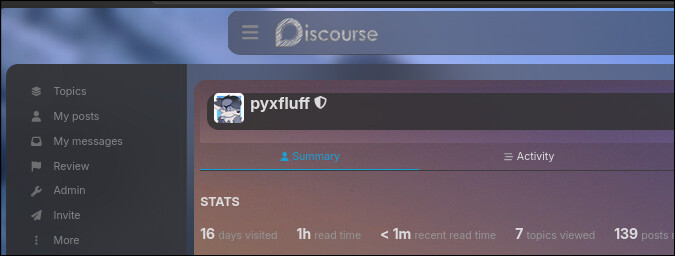](../../../assets/images/357665/421da3f633dd63bbd2597ba5e192c4089bcb6a33.jpeg "image")

[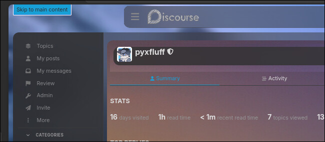](../../../assets/images/357665/cb4a75803fb273e6bc409fe59772c5379dad7def.jpeg "image")

In regards to the dropdown I found the line that was blocking it but when I remove it, it looks like this, so I figured it wasn’t worth it to “fix”.

[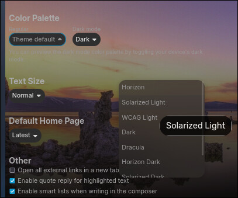](../../../assets/images/357665/b22c0ab4c51f81e62af8788b66c01eb47d365a3c.jpeg "image")

---

### Post #22 by [DevTeVe](../../users/DevTeVe.md)
*Posted: 2025-11-01 18:28*

Thanks !!!

I wonder why does it show, I see the fix was to disappear it from the screen hahaha but do you know what is it used for usually ?

---

### Post #23 by [darkpixlz](../../users/darkpixlz.md)
*Posted: 2025-11-01 18:30*

 DevTeVe:

> do you know what is it used for usually ?

Yes, people (myself included) often use tab for easily navigating pages for either convenience or accessibility reasons. For example, if you’re in a form with a lot of inputs, often instead of moving your mouse over to the next box you can press tab and it’ll go to the next one.

---

### Post #24 by [darkpixlz](../../users/darkpixlz.md)
*Posted: 2025-12-01 01:10*

Small update released to support the lightbox which now has a scrapped lightbox-style background!

[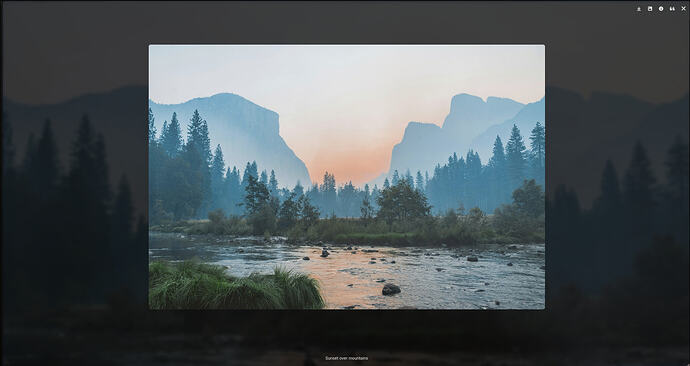](../../../assets/images/357665/de1b834d8f2b3212b6c934ea6584210aca6b081c.jpeg "image")

  

[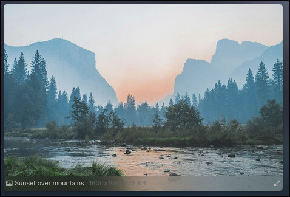](../../../assets/images/357665/330fc896c76488dfe697a7aa258550b18c23d752.jpeg "image")

Support for the search UI has also been added  

[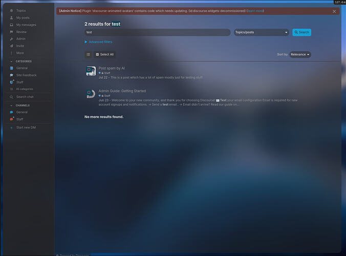](../../../assets/images/357665/2ceefa91c7a2e0571868a877512c03efba3b6447.jpeg "image")

I also made some smaller consistency changes to things like text boxes. Enjoy and let me know your thoughts!

---

### Post #25 by [tpglitch](../../users/tpglitch.md)
*Posted: 2025-12-01 01:43*

I’m trying to change the color pallet entirely but am unable to do so. Using Vivaldi, also confirmed on Google Chrome

---

### Post #26 by [darkpixlz](../../users/darkpixlz.md)
*Posted: 2025-12-01 01:46*

Hi there, are you using a tablet or computer? Working fine (not great but i can click it) for me on Firefox Desktop

[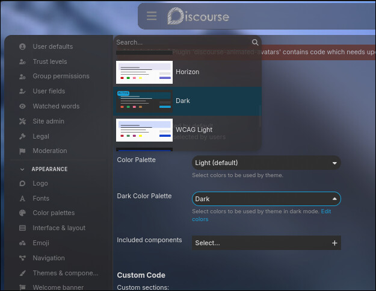](../../../assets/images/357665/6e9c0713c1cd5589d501cdab52a1fa942049312b.jpeg "image")

---

### Post #27 by [tpglitch](../../users/tpglitch.md)
*Posted: 2025-12-01 01:47*

Hello, I am using desktop (Windows 11 24H2). I saw earlier posts showing that the theme select works so I don’t know why this occurs over here. I can download Firefox and test that, however.

---

### Post #28 by [darkpixlz](../../users/darkpixlz.md)
*Posted: 2025-12-01 01:49*

It’s working fine for me on Chromium (Brave) too, so you can try FIrefox or try disabling all of your extensions and userstyles if present.

[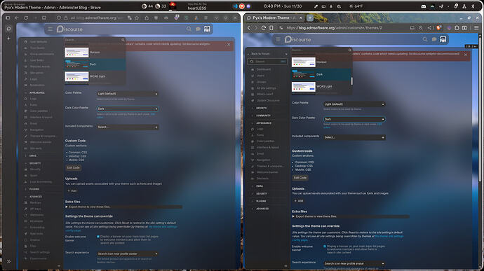](../../../assets/images/357665/8a882f687c9262db37e89931257b24a37d732b55.jpeg "image")

---

### Post #29 by [tpglitch](../../users/tpglitch.md)
*Posted: 2025-12-01 01:53*

Still happens, I don’t know why 😭

---

### Post #30 by [darkpixlz](../../users/darkpixlz.md)
*Posted: 2025-12-01 01:54*

You can try using your phone and making sure Discourse is fully up to date (the theme is always tested against latest tests-passed commit), otherwise I’m not sure what your issue could be, sorry!

---

### Post #31 by [RomeoArabov](../../users/RomeoArabov.md)
*Posted: 2025-12-01 02:12*

the theme look pretty sick honestly thank you for this, do you have a link so i can send it to the admin to add in their theme as well?

thanks

---

### Post #32 by [darkpixlz](../../users/darkpixlz.md)
*Posted: 2025-12-01 02:13*

 RomeoArabov:

> do you have a link so i can send it to the admin to add in their theme as well?

If you mean their site, you can send them the link to this topic and they can click the “Install this theme” button!

[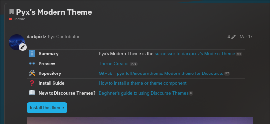](../../../assets/images/357665/a6be06033200db0fff428a932945b1add81185e8.png "image")

---

### Post #33 by [RomeoArabov](../../users/RomeoArabov.md)
*Posted: 2025-12-01 02:14*

oh okay sounds good, i’m on a different community, i will send the link thanks

---

### Post #34 by [RomeoArabov](../../users/RomeoArabov.md)
*Posted: 2025-12-03 01:36*

[@darkpixlz](/u/darkpixlz) is this theme works on ios26.1?

i just check a quick preview of the theme on my phone and wondering if there is any way to make the popup screen blurry like the one from the “search bar “ for the profil, like in the picture, it’s hard to read as you can see, the search bar background is perfectly blur and nice

would be awesome to have the same for on profile, be much easier to read notifications

thanks for your hard work, really like this theme

[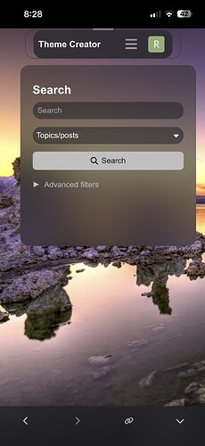](../../../assets/images/357665/47ed5df6bbada7fd6df65d1073b6c0d1aee91fe5.jpeg "IMG_5026")

[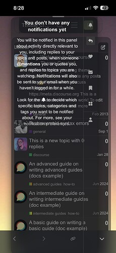](../../../assets/images/357665/f6170b148f78cea7c2f16d991c23593ab394e32f.jpeg "IMG_5025")

---

### Post #35 by [darkpixlz](../../users/darkpixlz.md)
*Posted: 2025-12-03 01:42*

Historically I haven’t tested against mobile, thanks for letting me know about the issues. I’ll look into fixing the user menu, I guess it’s just broken on anything non-Gecko based.

---

### Post #36 by [RomeoArabov](../../users/RomeoArabov.md)
*Posted: 2025-12-03 01:44*

oh okay, no problem,would be really awesome if you can test it when you have time for iOS, would love to see this theme on my Discourse hub app

thank you mate, really appreciate it🙏🏽

---

### Post #37 by [darkpixlz](../../users/darkpixlz.md)
*Posted: 2026-01-27 02:49*

# January Update

Hello all! Just another routine cleaning up of the theme and fixing some existing issues and breakage caused by newer Discourse.

Changelog:

  * Fixed the body being ~5px offcenter
  * Fixed the user menu and many dropdowns
  * Corrected composer warnings for new minified core style
  * Added table builder support
  * Numerous post stream improvements [quotes, onebox, nav buttons, codeboxes]
  * Admin and group page fixes
  * User card improvemenets

[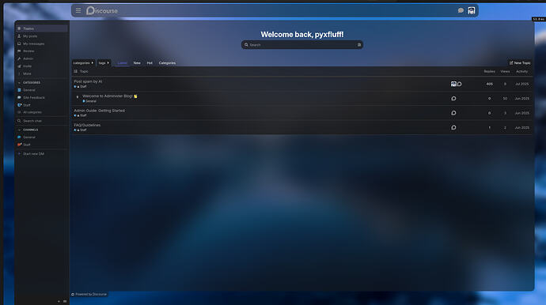](../../../assets/images/357665/4089ba80f97fae2633b09c4e12c110fe9fe278b3.jpeg "image")

  

[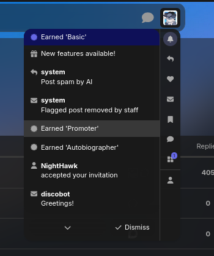](../../../assets/images/357665/b017ad547e99a0a4d10bd13ccff769d94001aa17.png "image")

  

[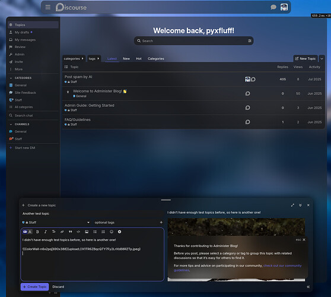](../../../assets/images/357665/ae5487ea7f734595554051114640f762407f5f09.jpeg "image")

  

[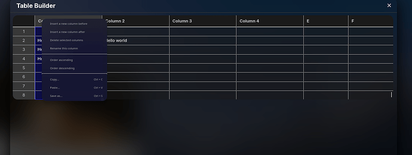](../../../assets/images/357665/d88aa015fb5b7394fcbbb8702b3c0706e5353e27.png "image")

  

[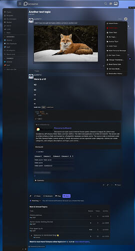](../../../assets/images/357665/c98a5530a9631e2eb96407edbba1548759da521e.jpeg "image")

  

[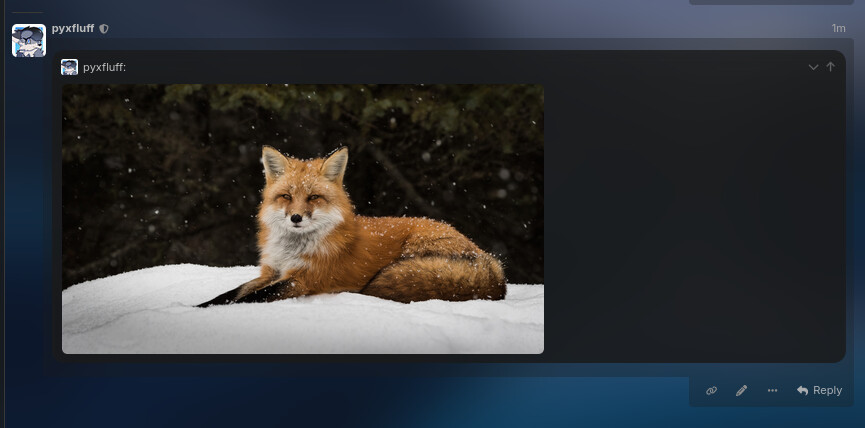](../../../assets/images/357665/711060d2bca53f71c621fdb598d642f519dc1914.jpeg "image")

  
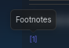  

[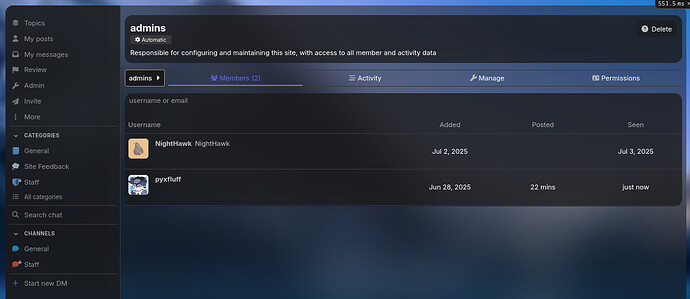](../../../assets/images/357665/ff454213edcd3d41436e127fffe12ed11182ec48.jpeg "image")

  

[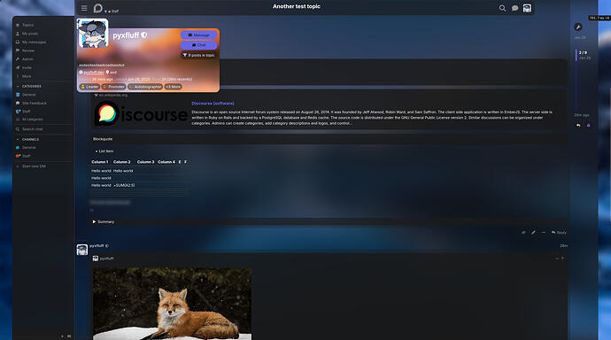](../../../assets/images/357665/8a4fc3882511cd76d23d5e5c4d2941f96d224b51.jpeg "image")

That’s about it for this update, as per usual let me know if you have questions/comments/concerns!! I’m also working on getting GitHub Sponsors up so you can support the theme if you like it, no news on that for the time being due to Stripe but it’s coming.

---

### Post #38 by [RomeoArabov](../../users/RomeoArabov.md)
*Posted: 2026-01-27 19:54*

hey mate, did you had time to test on iOS 26 yet? still wondering how it will look like

thanks

---

### Post #39 by [darkpixlz](../../users/darkpixlz.md)
*Posted: 2026-01-27 22:34*

Hi, I did briefly look at the theme on my iPhone 15 Plus with 26.3 beta something on it. It looks fine and is functional but there is definitely some changes I can make, which I might get around to tonight or sometime this week.

---

### Post #40 by [darkpixlz](../../users/darkpixlz.md)
*Posted: 2026-02-27 04:28*

Hi everybody! Back with some more minor changes but the review queue has been fixed and I changed some other minor things.

[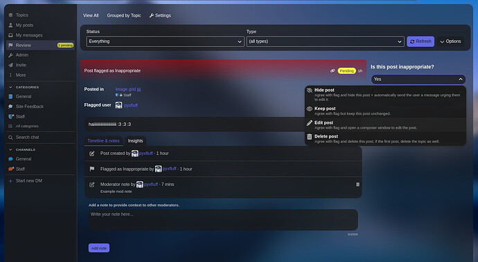](../../../assets/images/357665/277adf657e642d071341baf616ac4431ee441f61.jpeg "image")

  

[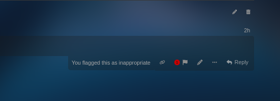](../../../assets/images/357665/ce4586842d85663573e7b0aa701b092e149a1311.png "image")

I also updated the photos in the OP because they were a year old at this point. There’s still more I want to do in the near future (like a mobile layout) so stay tuned for that. I’m also still working on GitHub sposors.

Thanks for your support, enjoy the theme!

---
