[🏠 Home](../../index.md) | [📋 Latest](../../latest/index.md) | [🔥 Top](../../top/replies/index.md) | [👥 Users](../../users/index.md)

[Home](../../index.md) » [Theme](../../c/theme/index.md) » Radiant, an elegant theme for Discourse

---

# Radiant, an elegant theme for Discourse

> **Category:** Theme
> **Author:** meghna
> **Created:** 2021-02-05 14:09

---

### Post #1 by [meghna](../../users/meghna.md)
*Posted: 2021-02-05 14:09*

This theme aims to be minimal and at the same time has modern appeal. The entire styling is implemented via CSS and no image has been used.

 💫 🚀

Homepage:

[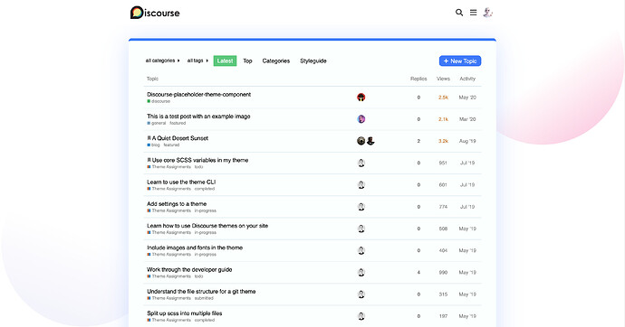](../../../assets/images/178552/b8d4456521731cd16348a2c8144b87bc52c6afa5.jpeg "Screenshot 2021-02-05 at 6.56.13 PM")

Topic page:

[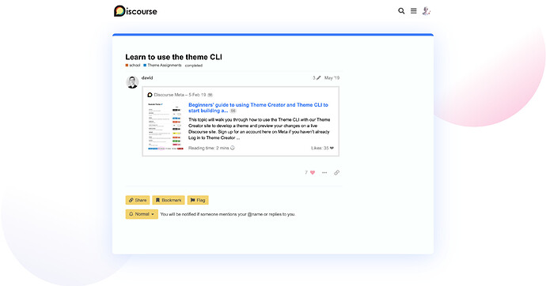](../../../assets/images/178552/9f94ab2a6fa24a5d08ce66faf39119772ab354bc.jpeg "Screenshot 2021-02-10 at 10.49.12 PM")

Full page search:

[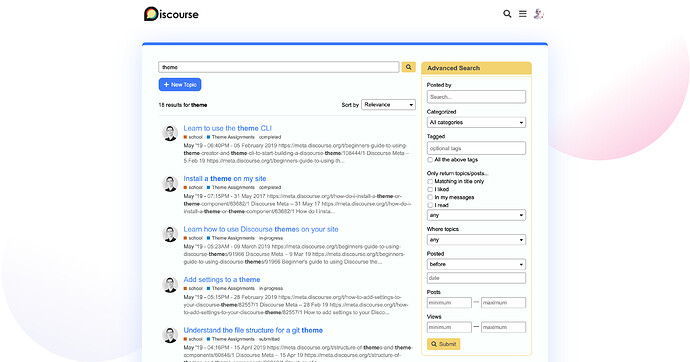](../../../assets/images/178552/8846b873c76984ec12adb81af5944671134d1062.jpeg "Screenshot 2021-02-10 at 10.48.34 PM")

Modal:

[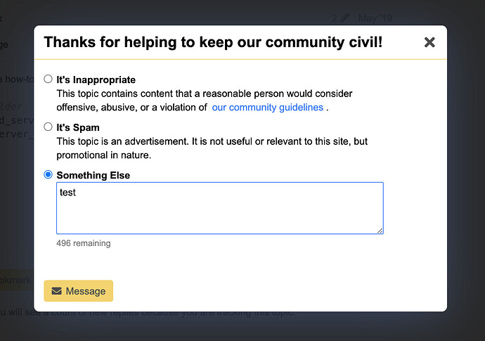](../../../assets/images/178552/87b5da85842036ffd4fc6e731a2c8180f8c4c87a.jpeg "Screenshot 2021-02-10 at 10.51.36 PM")

Let me know how this theme can be further improved. Enjoy! 😃

|  |   
---|---|---  
😎 | **Preview** | [Preview on theme creator](https://theme-creator.discourse.org/theme/meghna/radiant)  
🔗 | **Github Repo** | [discourse-radiant-theme](https://github.com/discourse/discourse-radiant-theme)  
🛠️ | **Install Guide** | [How to install a theme or theme component](https://meta.discourse.org/t/how-do-i-install-a-theme-or-theme-component/63682)

---

### Post #2 by [Jack51](../../users/Jack51.md)
*Posted: 2021-02-06 05:07*

Very nice design!  
  
Is there a way to customize the background shapes/colors? Being able to customize the “glow” of the main body on the background could be useful too.

---

### Post #3 by [Don](../../users/Don.md)
*Posted: 2021-02-06 10:50*

Hello,

Amazing work ❤️ This theme looks pretty cool 😍  
I have one suggestion with uniform rounded corners and shadows. I mean the popups, menu, input fields etc… Will be pretty awesome with the new loading slider 😍

---

### Post #4 by [meghna](../../users/meghna.md)
*Posted: 2021-02-06 12:02*

 Jack51:

> Is there a way to customize the background shapes/colors? Being able to customize the “glow” of the main body on the background could be useful too.

No, the background is made via CSS linear gradients and adding the ability to customize it will add complexity for forum admins.

Feel free to fork the theme to further customize it as per your requirements.

 Don:

> I have one suggestion with uniform rounded corners and shadows. I mean the popups, menu, input fields etc…

Good point. I’ll add it on my list for improvements. 👍

---

### Post #5 by [meghna](../../users/meghna.md)
*Posted: 2021-02-10 17:26*

I have improved the theme to make form inputs, header menu and modal consistent with the theme styling. Updated the first post with latest screenshots. 🙂

---

### Post #6 by [Zup](../../users/Zup.md)
*Posted: 2021-03-16 09:59*

lovely theme. i might be using this soon. thanks, good work.

---

### Post #7 by [derak](../../users/derak.md)
*Posted: 2021-03-23 02:10*

[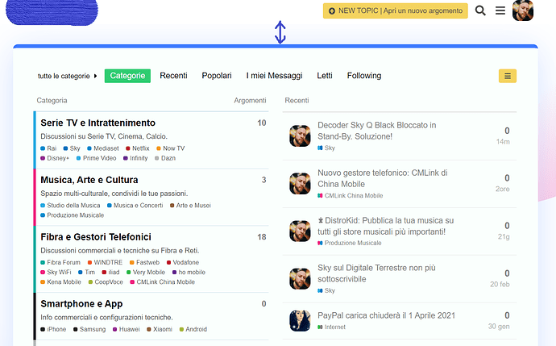](../../../assets/images/178552/f8d71441ddfe807da75850161a1c11c5b1a31efe.png "tempsnip")

Hi, the theme is very good. Is there any way to reduce that space at the top (see arrow)?

---

### Post #8 by [meghna](../../users/meghna.md)
*Posted: 2021-03-23 17:09*

I have reduced the default `margin-top` to `30px`, via:

[github.com/discourse/discourse-radiant-theme](https://github.com/discourse/discourse-radiant-theme/commit/d3eac88041c3e5ebc8529ac79d99193c2d285349)

####  [Decrease header margin.](https://github.com/discourse/discourse-radiant-theme/commit/d3eac88041c3e5ebc8529ac79d99193c2d285349)

committed 04:34PM - 23 Mar 21 UTC

[ +1 -1 ](https://github.com/discourse/discourse-radiant-theme/commit/d3eac88041c3e5ebc8529ac79d99193c2d285349)

Feel free to fork the theme and further customize it as per your requirements. 🙂

---

### Post #9 by [Zup](../../users/Zup.md)
*Posted: 2021-03-24 00:21*

personally i think the smaller margin makes the gradient too noticeable. 😕

could you lead me in the right direction to implement this as the background? <https://codepen.io/chris22smith/pen/RZogMa>

---

### Post #10 by [LucasMZReal](../../users/LucasMZReal.md)
*Posted: 2021-04-26 03:40*

I absolutely love this theme, I would request it to the forum I’m on, just wanted to ask you some stuff.

I’m not someone who uses Discourse to make any forums, I’m the user of these forums, so some stuff might come out wrong, or too obvious, but I never used Discourse to build anything.

Are there any plans to make a Dark Mode version of this? I personally have the ‘Force Dark Mode for Web Contents’ flag on Edge enabled. _It’s also a thing for Chrome._ And it usually helps, these are some of the results I got from it.

[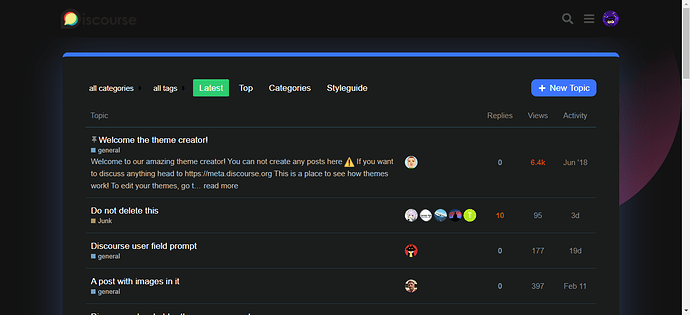](../../../assets/images/178552/74acc65782f441e16fa2af52bc42497d88c4d97b.png "image")

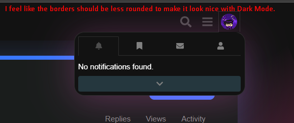

[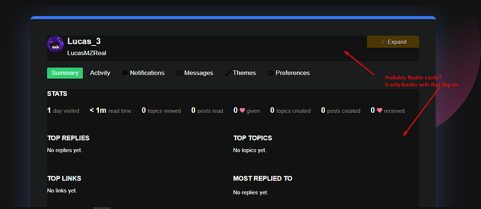](../../../assets/images/178552/b98c351eb4b85d5875e254de8de7967f55f5820c.png "image")

Overall it looks fine with that flag on, but there’s some stuff that looks out of place for no obvious reason, which I would love to see adapted / fixed for Dark Mode if that’s possible :)

You woudn’t necessarily need to modify everything to make a Dark Mode specific version, as long as you fixed the weird color difference on the profile pages, it would pretty much work just fine with the flag enabled.

---

### Post #11 by [meghna](../../users/meghna.md)
*Posted: 2021-04-28 03:37*

 LucasMZReal:

> Are there any plans to make a Dark Mode version of this?

Not yet, but I’ll look into it. I’ll have to go with different color scheme though.

 LucasMZReal:

> Overall it looks fine with that flag on, but there’s some stuff that looks out of place for no obvious reason, which I would love to see adapted / fixed for Dark Mode if that’s possible 🙂

Thanks for the suggestions! I’ll look into them and make the changes if they do not affect the default (original) light version. 🙂

---

### Post #12 by [bentsai](../../users/bentsai.md)
*Posted: 2021-05-11 18:05*

I’ve just set up a Discourse and was itching to customizing it. I’m really glad I found your theme—it’s fresh, colorful, and lovely. Thanks!

– ben

---

### Post #13 by [applebee1558](../../users/applebee1558.md)
*Posted: 2022-05-08 23:08*

Really nice theme, but as of lately, it seems like this theme is incompatible with discourse. The sidebar is completely squished together.

[applebee.host](https://applebee.host/i/zOLpUASUJkaRCw)

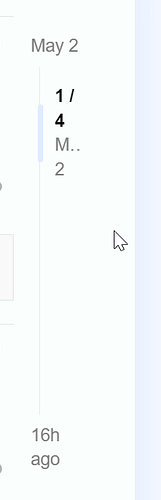

### [msedge_lTaKEIMsyU.png](https://applebee.host/i/zOLpUASUJkaRCw)

Uploaded by applebee on 05/08/2022, 23:07:50 (UTC) (8KB)

`

---

### Post #14 by [meghna](../../users/meghna.md)
*Posted: 2022-05-10 11:12*

Good catch! Now fixed via:

[github.com/discourse/discourse-radiant-theme](https://github.com/discourse/discourse-radiant-theme/commit/5c03967c2f3ad48e6031c49bf92bee411c7d0177)

####  [Fix screen width issues (#4)](https://github.com/discourse/discourse-radiant-theme/commit/5c03967c2f3ad48e6031c49bf92bee411c7d0177)

committed 11:11AM - 10 May 22 UTC

[  MeghnaAJ ](https://github.com/MeghnaAJ)

[ +18 -10 ](https://github.com/discourse/discourse-radiant-theme/commit/5c03967c2f3ad48e6031c49bf92bee411c7d0177)

---

### Post #15 by [applebee1558](../../users/applebee1558.md)
*Posted: 2022-05-11 03:22*

Thanks, looks cool and issue is fixed

---

### Post #16 by [mydnic](../../users/mydnic.md)
*Posted: 2022-06-15 07:47*

Hello

Since the last update it seems all the content is “stuck” on both sides. It’s like the right and left padding/margin are gone

[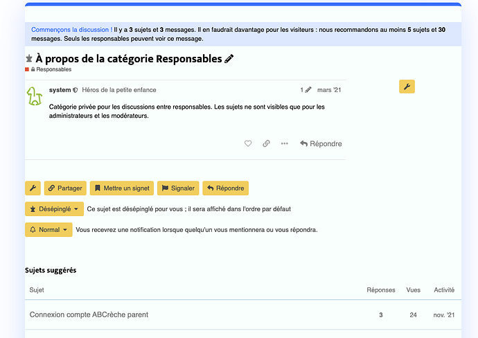](../../../assets/images/178552/39ba8f8379630d5cab91720e8bcf2d6017024fda.png "Screenshot 2022-06-15 at 09.43.46")

Is this intentional ? On the preview images of the theme it’s not like that. How can I fix it ?

Thanks a lot

---

### Post #17 by [meghna](../../users/meghna.md)
*Posted: 2022-06-15 09:59*

This is now fixed:

<https://github.com/discourse/discourse-radiant-theme/pull/5>

Thanks for reporting this issue 👍

---

### Post #18 by [mydnic](../../users/mydnic.md)
*Posted: 2022-06-15 10:15*

I confirm it’s fixed !

That was incredibly fast, thank you so much

Amazing theme btw 🙂

---

### Post #19 by [bitmage](../../users/bitmage.md)
*Posted: 2024-05-31 23:28*

Can you help me understand how to change the color of the blue accent bar at the top?

I see in desktop.scss this is defined:
    
    
    #main-outlet {
      border-top: 8px solid $tertiary;
    }
    

Where `$tertiary` I assume comes from variables defined by Discourse core SCSS, and should pull from the user’s selected color palette.

I can see in devtools the bar is set to `#3977ff` which you can see as the blue bar in the screenshot below. But in my color palette, I have a yellow color set for the “tertiary” and I don’t have a color `#3977ff` defined anywhere.

So what’s going on here, and how can I set the color?

[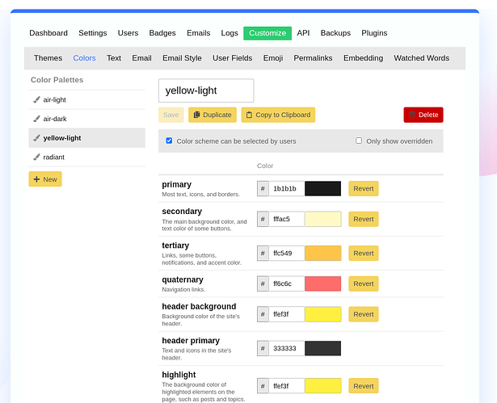](../../../assets/images/178552/71adee20c7d6d2d27cc2592f84da3a1fc15d54b0.png "image")

---

### Post #20 by [bitmage](../../users/bitmage.md)
*Posted: 2024-05-31 23:34*

Oh! I see `tertiary` is defined in `about.json`:
    
    
      "color_schemes": {
        "radiant": {
          "primary": "000000",
          "tertiary": "3977FF",
          "header_primary": "4d4d4d"
        }
      },
    

So I assume this must be where it’s getting the color value. But why would it be pulling from this if I don’t have the “radiant” color scheme selected?

---

### Post #21 by [nwnuyhs](../../users/nwnuyhs.md)
*Posted: 2024-09-11 20:09*

I think the size and color of these icons can be optimized.

[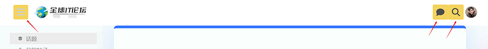](../../../assets/images/178552/cbf75e99e2ac0bf20e59b9d5495c6acf65692c87.png "image")

---

### Post #23 by [Tara_Walton](../../users/Tara_Walton.md)
*Posted: 2026-01-05 02:45*

 meghna:

>  LucasMZReal:
>
>> Are there any plans to make a Dark Mode version of this?
> 
> Not yet, but I’ll look into it. I’ll have to go with different color scheme though.

Any update on a dark mode? I love this theme, but devs get cranky if you take away their dark mode 😆

---
