[🏠 Home](../../index.md) | [📋 Latest](../../latest/index.md) | [🔥 Top](../../top/replies/index.md) | [👥 Users](../../users/index.md)

[Home](../../index.md) » [Theme](../../c/theme/index.md) » :classical_building: Rome, a theme inspired by ancient roman manuscripts

---

# :classical_building: Rome, a theme inspired by ancient roman manuscripts

> **Category:** Theme
> **Author:** melhosseiny
> **Created:** 2021-10-04 11:22

---

### Post #1 by [melhosseiny](../../users/melhosseiny.md)
*Posted: 2021-10-04 11:22*

Rome is a light Discourse theme that feels like an ancient roman manuscript and uses color based on pigments available to an artist of the time.

[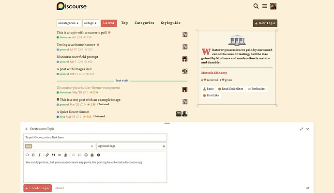](../../../assets/images/205144/9d467b407d6a59b4d54598b34bfa8b9983f1c8d6.jpeg "rome_main")

[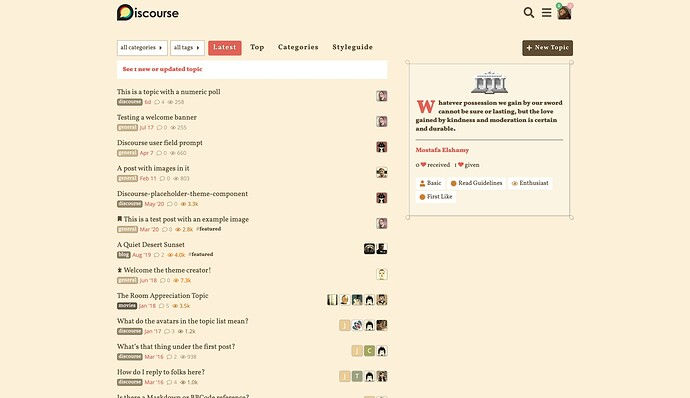](../../../assets/images/205144/25f99889fe590094c6fa30f8766959aae2d3be86.jpeg "rome_topic_list_more")

[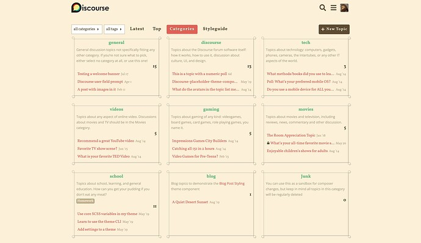](../../../assets/images/205144/a093a0f2fb2792ce2386c80c7c3a895d33a70215.jpeg "rome_categories")

[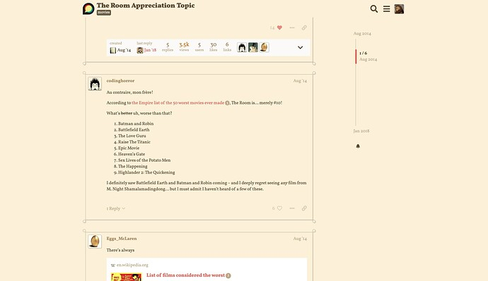](../../../assets/images/205144/33b1c6525239c1b31e2bf16cff496bf72972fccc.jpeg "rome_post")

[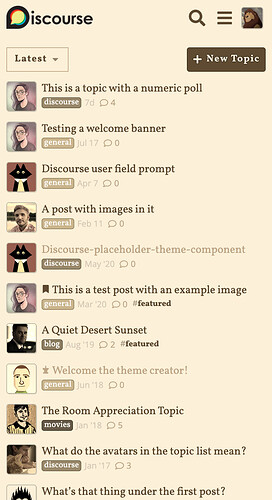](../../../assets/images/205144/5f99440caa21204bd0f6b6f7f758345e8c54fa4c.jpeg "rome_main_mobile")

[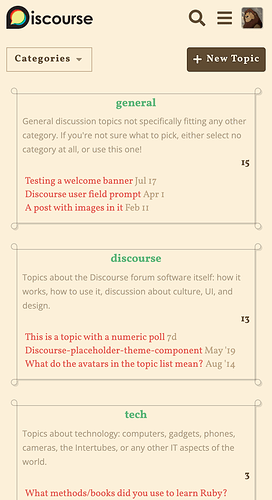](../../../assets/images/205144/bd9cefed9721690a28c4207d95a9ac5dfb3601e6.png "rome_categories_mobile")

This is my second Discourse theme, following [Ghost](https://meta.discourse.org/t/ghost-a-cyberpunk-theme-for-discourse/111806)!

Coming next is a theme setting to make it less tied to history, which might make sense for [Science and Research communities](https://meta.discourse.org/t/discourse-for-science-and-academia/140149).

## Daily quote

I borrowed the sidebar widget from [Fakebook](https://meta.discourse.org/t/fakebook-a-theme-for-social-media-lovers/109079) and replaced the intro with a random daily quote to encourage civilized discourse, fetched from a serverless [Deno](https://deno.com/deploy/) script. I added three quotes by Marcus Aurelius, Alexander the Great (yes, he’s Macedonian ), and Julius Ceasar. Feel free to suggest quotes by creating an issue or pull request at <https://github.com/melhosseiny/rome-quotes>.

## Mood

[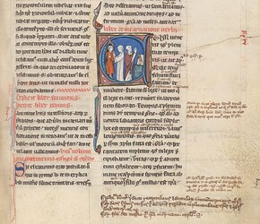](../../../assets/images/205144/3e955ab04c58a1a6b43b727a13df41a9c6053606.jpeg "Screenshot 2021-10-04 at 12.50.13")

  
_Source_ : [Sentences, folio 171r, Peter Lombard](https://g.co/arts/Ffx9S9hkzvGMm31P8) (yes, it’s medieval 😆)

Let me know in the comments if you experience issues or have suggestions!

|  |   
---|---|---  
👓 | **Preview** | <https://theme-creator.discourse.org/theme/melhosseiny/rome>  
🛠️ | **Repository** | [GitHub - melhosseiny/rome: A Discourse theme inspired by ancient roman manuscripts](https://github.com/melhosseiny/rome)  
❓ | **Install Guide** | [How to install a theme or theme component](https://meta.discourse.org/t/how-do-i-install-a-theme-or-theme-component/63682)  
📖 | **New to Discourse Themes?** | [Beginner’s guide to using Discourse Themes](https://meta.discourse.org/t/beginners-guide-to-using-discourse-themes/91966)

---

### Post #2 by [hokod](../../users/hokod.md)
*Posted: 2021-12-12 10:02*

On Mobile and PC, in theme , how can we turn off comment and view number?  
  
[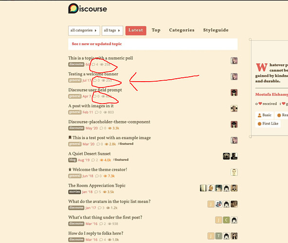](../../../assets/images/205144/f2d62d2f82852031f0f0d432e4020d4e0531d760.jpeg "image")

---

### Post #3 by [JammyDodger](../../users/JammyDodger.md)
*Posted: 2021-12-12 11:16*

My CSS is pretty basic, but you can add a theme component to do that.

If you paste this into the Common tab of a new component that should do it:
    
    
    .topic-list .topic-list-item .main-link .link-bottom-line .views{
        display: none;
    }
    
    .topic-list .topic-list-item .main-link .link-bottom-line .badge-posts {
        display: none;
    }
    

Extra Details

  * Go to `/admin/customize/themes`
  * Click on **install** and then **create new**
  * Give it a name, and select ‘component’.
  * **Create**
  * Add it to your theme
  * Click on the **Edit CSS/HTML** button and paste this into the **Common tab** :

    
    
    .topic-list .topic-list-item .main-link .link-bottom-line .views{
        display: none;
    }
    
    .topic-list .topic-list-item .main-link .link-bottom-line .badge-posts {
        display: none;
    }
    

And save. 👍

---

### Post #4 by [melhosseiny](../../users/melhosseiny.md)
*Posted: 2021-12-12 11:22*

Using [@JammyDodger](/u/jammydodger)’s CSS you will be able to hide comments and views, but curious why you’d like to? I can consider adding a theme setting

---

### Post #5 by [hokod](../../users/hokod.md)
*Posted: 2021-12-12 12:11*

Thank you guys, I fixed it

---

### Post #6 by [Monikas](../../users/Monikas.md)
*Posted: 2024-06-03 21:17*

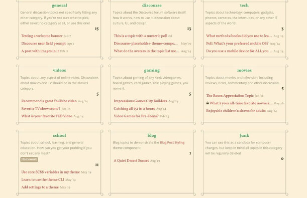  
separate theme-component for this layout?

---

### Post #7 by [Monikas](../../users/Monikas.md)
*Posted: 2024-06-03 21:24*

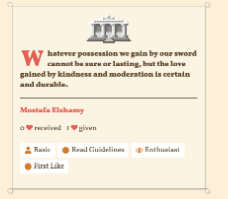  

[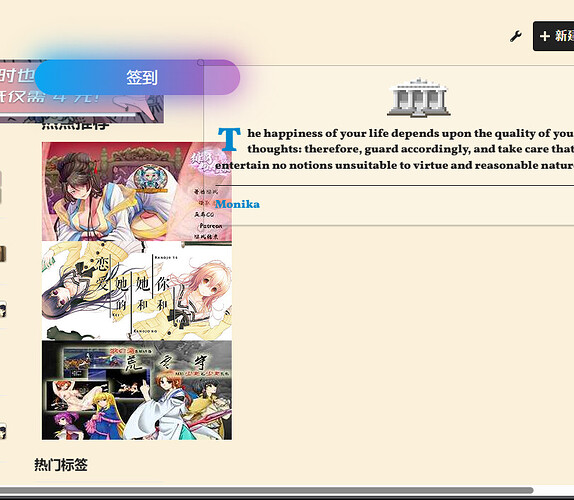](../../../assets/images/205144/26bda0e5e65658ce26a0cdacc25f87e5005b081e.jpeg "image")

Can this be turned off?

---

### Post #8 by [Lilly](../../users/Lilly.md)
*Posted: 2024-06-03 21:27*

 JustMonika:

> separate theme-component for this layout?

it is in admin site settings  

[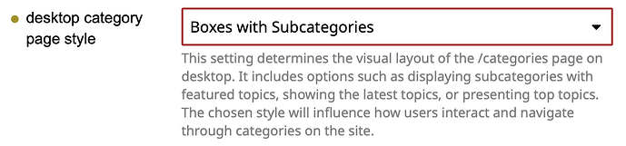](../../../assets/images/205144/25398ec794df999d757468d659ede4ba42d3b3e0.png "Screenshot 2024-06-03 at 2.26.17 PM")

---
