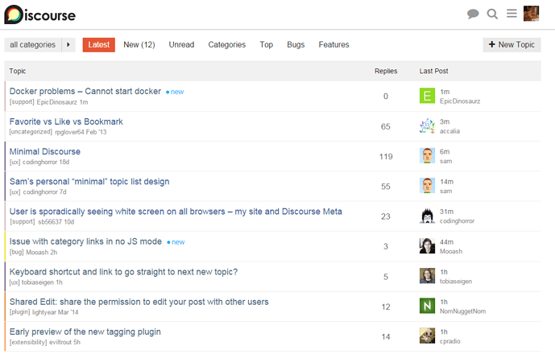
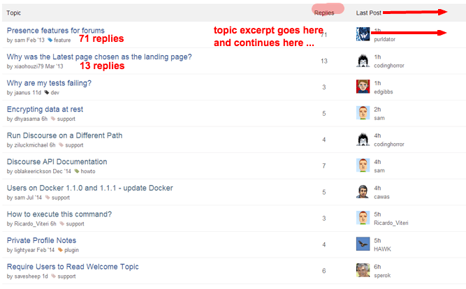
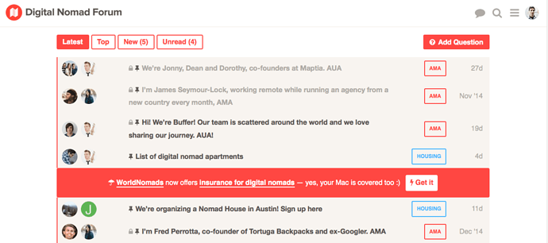
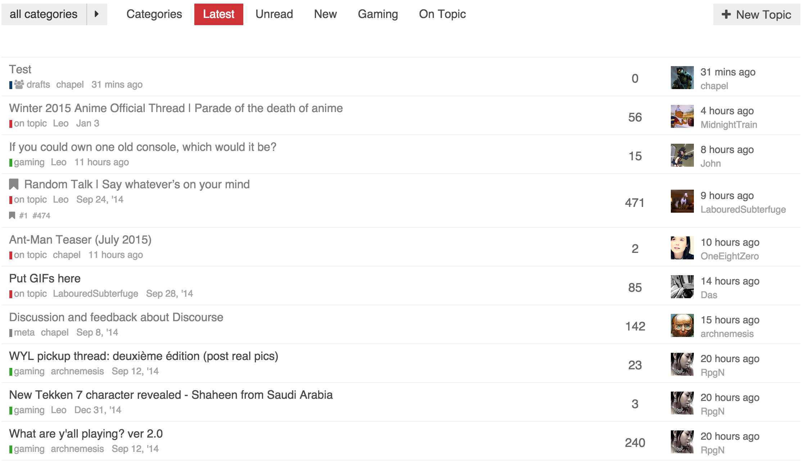
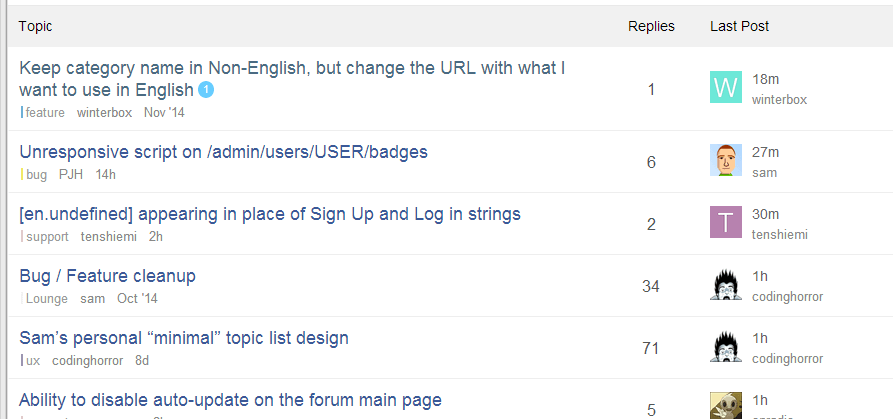
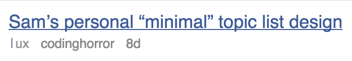
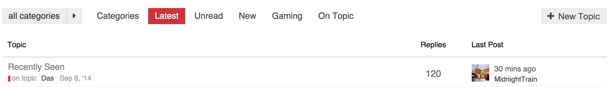
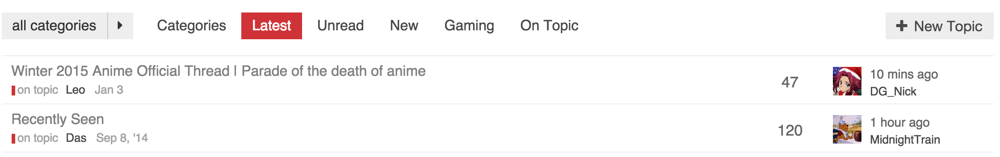
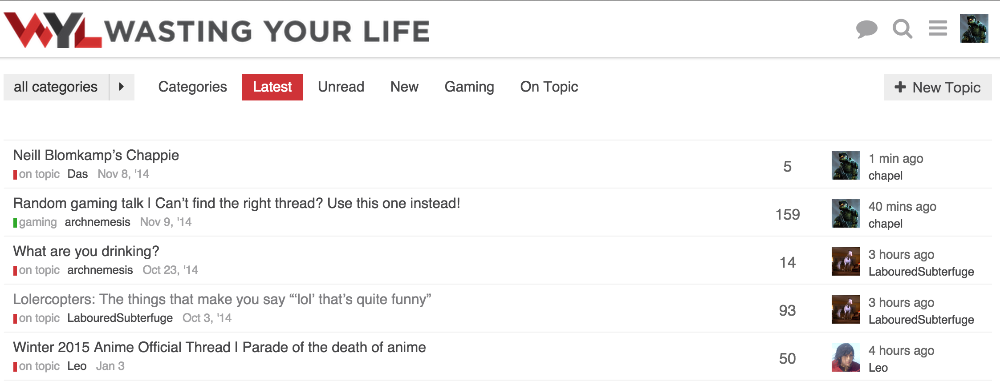
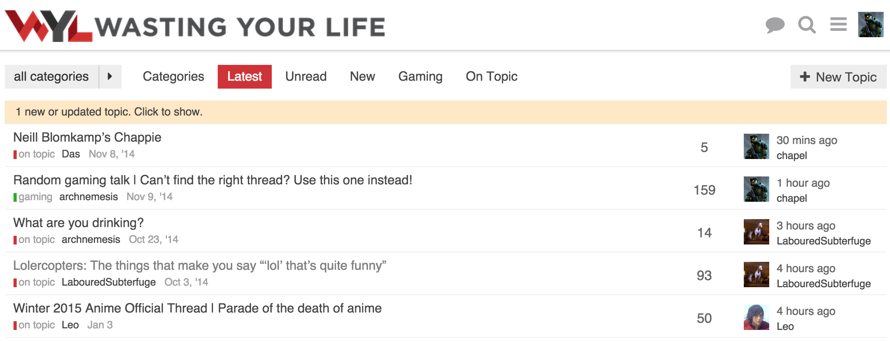

[🏠 Home](../../index.md) | [📋 Latest](../../latest/index.md) | [🔥 Top](../../top/replies/index.md) | [👥 Users](../../users/index.md)

[Home](../../index.md) » [Theme](../../c/theme/index.md) » Sam's Simple Theme

---

# Sam's Simple Theme (Page 2 of 8)

> **Category:** Theme
> **Author:** tonninseteli
> **Created:** 2014-12-31 03:20

[← Previous](23552.md) | **Page 2 of 8** | [Next →](23552-page-3.md)

---

### Post #52 by [tonninseteli](../../users/tonninseteli.md)
*Posted: 2015-01-06 08:40*

Although I have no particular plans, I think this is a lot like what I would want my topic lists to look like once I get around to really customizing them.

I would probably use a bit stronger colours myself, as in darker. I also second reply count number being a point bigger and suggest that you try to scale avatars just enough to fill the row vertically, or scale everything else down accordingly.

I’m wondering about the latest post - once i have scrolled this page down enough not to see the column headers, I somehow think that the avatars and nicknames are in fact starters’ 😄

edit: once I clicked the image to 100% zoom, I’d probably shrink the overall font size one point and cut down the padding/margins by a couple of pixels.

edit2: I really would like to eventually see this sort of minimal layout as a selectable alternative to the default layout. well good mate.
  *[PR]: Pull Request

---

### Post #53 by [JSey](../../users/JSey.md)
*Posted: 2015-01-06 12:21*

[@sam](/u/sam): very cool stuff with the sticky parameter, thanks!

Another stupid question: where can I find the original templates? I was poking around if I can find the original list/topic_list_item (e.g.), but my grep skills failed miserably… can you point me in the right direction? I wanted to make some more subtle adjustments, but for those, I need the original handlebar codes…
  *[PR]: Pull Request

---

### Post #54 by [awesomerobot](../../users/awesomerobot.md)
*Posted: 2015-01-06 17:44*

I really like this [@sam](/u/sam)!

Also not a huge fan of the tag glyph — definitely in favor of the color bars we currently use on category pages

Also agree on separating the date from usernames… dates could be a lighter grey, or the date can be separated by a comma or something simple

  *[PR]: Pull Request

---

### Post #55 by [gerhard](../../users/gerhard.md)
*Posted: 2015-01-06 18:15*

How sticky should this be? Looks like it works only till the end of the session.
  *[PR]: Pull Request

---

### Post #56 by [rumpelsepp](../../users/rumpelsepp.md)
*Posted: 2015-01-06 21:27*

Fully agree with [@codinghorror](/u/codinghorror).
  *[PR]: Pull Request

---

### Post #57 by [sam](../../users/sam.md)
*Posted: 2015-01-07 01:41*

An interesting observation regarding, “I have this issue in theory vs in practice”

I started using this design exclusively on meta, and just now fixed incorrect avatars for last posters.

Its one of those issues that in practice is critical, but in “theoretical” reviews is often missed.
  *[PR]: Pull Request

---

### Post #58 by [mcwumbly](../../users/mcwumbly.md)
*Posted: 2015-01-07 02:17*

[@sam](/u/sam), for your consideration:

  *[PR]: Pull Request

---

### Post #59 by [chapel](../../users/chapel.md)
*Posted: 2015-01-07 03:04*

I like the changes overall, and am trying it on my install to see how it goes.

It breaks the categories view as well as affects the suggested topics module.

 sam:

> I started using this design exclusively on meta, and just now fixed incorrect avatars for last posters.

Is this the issue where for some threads it shows the wrong avatar? Because I have that currently, but don’t see any updates to the code in the first post.
  *[PR]: Pull Request

---

### Post #60 by [sam](../../users/sam.md)
*Posted: 2015-01-07 03:06*

The suggested topics change is by-design, but the categories do look quite bad, will get that fixed.

Sorry, will sync the code up shortly.

**edit** updated now.
  *[PR]: Pull Request

---

### Post #61 by [chapel](../../users/chapel.md)
*Posted: 2015-01-07 03:22*

Thanks!

I see you’re setting up some stuff for likes columns?

One thing I noticed and which I had to fix to get working was this:
    
    
    
    
    
    
    
    
  *[PR]: Pull Request

---

### Post #72 by [charles](../../users/charles.md)
*Posted: 2015-01-07 21:28*

Enjoyed reading through this topic and liking the minimal designs by [@sam](/u/sam) and [@chapel](/u/chapel)

Do visitors really care about the categories, author, date? It seems the only time it’s relevant is when someone is reading and have interest in the topic otherwise can’t see why it can’t look like the current ‘suggested topics’ layout with just the topic title.
  *[PR]: Pull Request

---

### Post #73 by [codinghorror](../../users/codinghorror.md)
*Posted: 2015-01-08 00:30*

This is _really_ good. Following on from [@mcwumbly](/u/mcwumbly)’s comment (also very insightful, I realized while reading it that putting avatars on the left in the topic list gives a “talk bubble” effect to the title that I had not considered… also symmetric with posts too) I think you could suppress the header as well!

Hopefully we can ship one or more of these topic list layouts as choices out of the box at some later date… part of the mythical setup wizard.
  *[PR]: Pull Request

---

### Post #74 by [sam](../../users/sam.md)
*Posted: 2015-01-08 01:26*

A bit more tweaking

  *[PR]: Pull Request

---

### Post #75 by [chapel](../../users/chapel.md)
*Posted: 2015-01-08 01:36*

The main difference at this point is the topic title font size and the `td` height which I have compressed more. Mainly because I wanted to optimized information density due to one of my staffs complaint about seeing less topics per “page”.

[@sam](/u/sam) any progress on the category page? Thinking of tackling it tonight when I get home.
  *[PR]: Pull Request

---

### Post #76 by [sam](../../users/sam.md)
*Posted: 2015-01-08 01:38*

Sure, feel free to tackle it! not sure what to do here, the funny thing about the category page is that I never use it so its kind of low priority for me.
  *[PR]: Pull Request

---

### Post #77 by [chapel](../../users/chapel.md)
*Posted: 2015-01-08 01:46*

 sam:

> the funny thing about the category page is that I never use it

I actually don’t like it (as far as using it). I prefer latest tbh.

My community which is used to older forum software asked for the category view be the homepage, and ultimately it was such a small change. So I see the category view more than I would if I had it setup exactly how I would personally like it.
  *[PR]: Pull Request

---

### Post #78 by [chapel](../../users/chapel.md)
*Posted: 2015-01-08 03:52*

Looks like there is potentially a bug in the server code in regards to who is the original poster when the original post is edited.

Interestingly enough, the edit history only shows [@codinghorror](/u/codinghorror) editing the post once, and it was the first edit. I checked, and it isn’t an issue with ordering, as the first user in the array returned is [@codinghorror](/u/codinghorror) and he is listed as the original poster.
  *[PR]: Pull Request

---

### Post #79 by [sam](../../users/sam.md)
*Posted: 2015-01-08 03:54*

This is not a bug, its by-somewhat-hard-to-explain-design

[@codinghorror](/u/codinghorror) split off the topic from another topic so he is considered the “creator” of the topic, despite post #1 being mine.

I do agree its confusing and kind of wish we had a way to override this.

**edit**

Actually there is a workaround, admin wrench, select first post, change ownership to sam.
  *[PR]: Pull Request

---

### Post #80 by [chapel](../../users/chapel.md)
*Posted: 2015-01-08 04:22*

I see, well in a way that makes sense.
  *[PR]: Pull Request

---

### Post #81 by [tonninseteli](../../users/tonninseteli.md)
*Posted: 2015-01-08 08:05*

 sam:

> the funny thing about the category page is that I never use it so its kind of low priority for me.

I just prefer it for consistency. It’s good to have something static. My users and I are all new to Discourse and loving it, but somehow it feels good to have a routine. A safe place to get started.

Sometimes I feel that there was something I was supposed to make a topic of, and then when I see the categories they remind me. I like the little things in life.

 codinghorror:

> This is really good.

damn straight.

 sam:

> A bit more tweaking

Maybe double the size of those category bars? Lighter colors seem to disappear to the background.

 sam:

> This is not a bug, its by-somewhat-hard-to-explain-design

Actually that makes perfect sense, but I if something can be made configurable, it should.

In an ideal situation the first person to derail will split the topic BEFORE the second person, and even in the case of the second person to derail splitting the topic it’s still not a lost cause, and if it’s absolutely necessary to change ownership of a topic, it’s not biggie when having enough moderators around.

edit: man I love quoting in discourse.
  *[PR]: Pull Request

---

### Post #82 by [sam](../../users/sam.md)
*Posted: 2015-01-08 08:09*

 tonninseteli:

> Lighter colors seem to disappear to the background.

That is actually my intention, will live with it for a bit and see how I feel.
  *[PR]: Pull Request

---

### Post #83 by [chapel](../../users/chapel.md)
*Posted: 2015-01-08 08:14*

On my variation I use the standard category helper which by default has a fatter color bar as you can see in my screenshot. I am not 100% sold on the fat one, but the thin one is also not right either. Between the two though, I prefer the fat one, if only to be consistent with its usage elsewhere on the site.
  *[PR]: Pull Request

---

### Post #84 by [tonninseteli](../../users/tonninseteli.md)
*Posted: 2015-01-08 10:42*

 sam:

> That is actually my intention, will live with it for a bit and see how I feel.

I suggest you try it with different shades of (lighter, as you prefer :)) gray, it could work?
  *[PR]: Pull Request

---

### Post #85 by [JSey](../../users/JSey.md)
*Posted: 2015-01-08 19:04*

 sam:

> A bit more tweaking

This should definitely be the new default design. The other one can be shipped as optional - code named “clown barf” or similar… 😉
  *[PR]: Pull Request

---

### Post #86 by [BCHK](../../users/BCHK.md)
*Posted: 2015-01-08 19:10*

 sam:

> I have been thinking about this a lot, and decided to take a shot at a “minimal” front page customisation.

Sam - Just wanted to congratulate you on this effort. Its very hard to make things simple - but this is much needed. I’ve been working with a developer on the same issue - so this is a welcome development.

> "As the late Steve Jobs once explained, “When you start looking at a problem and it seems really simple, you don’t really understand the complexity of the problem. And your solutions are way too oversimplified. Then you get into the problem, and you see it’s really complicated. And you come up with all these convoluted solutions….That’s where most people stop.” Not Apple. It keeps on plugging away. “The really great person will keep on going,” said Jobs, “and find…the key underlying principle of the problem and come up with a beautiful, elegant solution that works.”

 [Harvard Business Review – 4 Jun 12](https://hbr.org/2012/06/customers-dont-want-more-featu "12:59PM - 04 June 2012")

### [Customers Don’t Want More Features](https://hbr.org/2012/06/customers-dont-want-more-featu)

There is a common myth about product development: the more features we put into a product, the more customers will like it. Product-development teams seem to believe that adding features creates value for customers and subtracting them destroys it....
  *[PR]: Pull Request

---

### Post #87 by [BCHK](../../users/BCHK.md)
*Posted: 2015-01-08 19:12*

 chapel:

> the funny thing about the category page is that I never use it

No - I don’t use it either. I think its probably rarely used in general.
  *[PR]: Pull Request

---

### Post #88 by [downey](../../users/downey.md)
*Posted: 2015-01-08 20:08*

 sam:

> That is actually my intention, will live with it for a bit and see how I feel.

I know I must sound like a broken record, but please please please let’s not mess up and provide way too low color contrast in any new UI’s. (I realize category colors can be chosen but things disappearing into the background does not make an accessible UI.) Those with less-than-perfect vision (and W3C standards adherents) thank you all. 😛
  *[PR]: Pull Request

---

### Post #89 by [sam](../../users/sam.md)
*Posted: 2015-01-09 01:18*

Keep in mind, this is **my** design which is very focused around me for now. If we ship a second theme (which I think we will some time next year) we will make sure to account for that or at least add a “high contrast switch”
  *[PR]: Pull Request

---

### Post #90 by [sam](../../users/sam.md)
*Posted: 2015-01-09 01:19*

The table header style is starting to get on my nerves, too much grey there, is there a better style you can think of?
  *[PR]: Pull Request

---

### Post #91 by [chapel](../../users/chapel.md)
*Posted: 2015-01-09 02:16*

I was thinking that as well. It stands out too much against the list.

I like the subdued look of the default header, I wonder if we changed it to be more like the default table header.

Something like this?

  *[PR]: Pull Request

---

### Post #92 by [mcwumbly](../../users/mcwumbly.md)
*Posted: 2015-01-09 02:18*

I like that better, but I wonder if its necessary to have it at all?

 mcwumbly:

> One of the small touches here that I think really helps make it feel cleaner is the lack of the header. It makes it feel much less like a stodgy old table.
  *[PR]: Pull Request

---

### Post #93 by [chapel](../../users/chapel.md)
*Posted: 2015-01-09 02:21*

To a certain degree I agree with you. I just wonder though if for people less accustomed to forum software would be confused as far as what the last two columns are.

We could get away with having replies be `120 replies` for instance.

Keep in mind that it is there for more than as a visual heading, you can click them to resort the list of topics.
  *[PR]: Pull Request

---

### Post #94 by [sam](../../users/sam.md)
*Posted: 2015-01-09 02:25*

Also you would lose the sorting ability which can be handy
  *[PR]: Pull Request

---

### Post #95 by [codinghorror](../../users/codinghorror.md)
*Posted: 2015-01-09 02:49*

Questionable in a 3 column view which already defaults to sorting by 1 of those 3 columns…

You could put the reply glyph next to the reply number, I guess. But to me the number’s meaning is obvious.
  *[PR]: Pull Request

---

### Post #96 by [chapel](../../users/chapel.md)
*Posted: 2015-01-09 03:17*

Hmm, will have to try it out to see how it feels tbh.
  *[PR]: Pull Request

---

### Post #97 by [sam](../../users/sam.md)
*Posted: 2015-01-09 07:21*

Workflow wise, are you aware we “live refresh” css as you muck with it.

I open up one window on customization and keep the editor maximised (there is a maximise button top right)

And another window with the site. It makes mucking with CSS a breeze.
  *[PR]: Pull Request

---

### Post #98 by [chapel](../../users/chapel.md)
*Posted: 2015-01-09 07:29*

Yep, figured that out working with customizations.
  *[PR]: Pull Request

---

### Post #99 by [thangngoc89](../../users/thangngoc89.md)
*Posted: 2015-01-09 09:17*

I really this design. I think that overwrite ember template is better then use javascript to move things around
  *[PR]: Pull Request

---

### Post #100 by [chapel](../../users/chapel.md)
*Posted: 2015-01-10 06:50*

This is what I am running now. I have moved the thread list down to accommodate the update alert.

**No alert**

**Alert**  

This allows the update alert to pop in without shifting anything down.

Functionality wise, I am fine without the table header, but visually it feels like something is missing. That could be just myself being used to tables on forums and how they normally look.
  *[PR]: Pull Request

---

### Post #101 by [Kasper](../../users/Kasper.md)
*Posted: 2015-01-10 14:32*

It would be great that at some point, as admin, you can choose one of those different topic list designs out of some menu.

Or maybe even better, let the users choose, in some setting, how they want the topic list to look.

Btw what CSS do you use for your latest design [@chapel](/u/chapel) ?
  *[PR]: Pull Request

---

[← Previous](23552.md) | **Page 2 of 8** | [Next →](23552-page-3.md)
