[🏠 Home](../../index.md) | [📋 Latest](../../latest/index.md) | [🔥 Top](../../top/replies/index.md) | [👥 Users](../../users/index.md)

[Home](../../index.md) » [Theme](../../c/theme/index.md) » Sam's Simple Theme

---

# Sam's Simple Theme (Page 4 of 8)

> **Category:** Theme
> **Author:** 19eighties
> **Created:** 2014-12-31 03:20

[← Previous](23552-page-3.md) | **Page 4 of 8** | [Next →](23552-page-5.md)

---

### Post #152 by [19eighties](../../users/19eighties.md)
*Posted: 2015-02-03 19:01*

There may be something to giving the OP some “credit” for starting the topic by putting their avatar on the very left and then having on the very right the last participant One end may kind of balance the other.
  *[PR]: Pull Request

---

### Post #153 by [sam](../../users/sam.md)
*Posted: 2015-02-06 06:32*

Been playing with my design today:

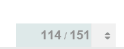

I really hate our greenish color there, nothing else in the design as that color.

Also I prefer square category style throughout so I added that.

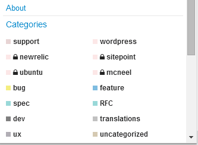

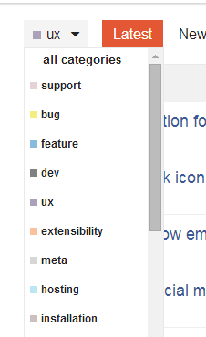

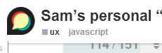

I find the lines a tad disjoint from the category word. Note colors look washed out cause I am suppressing them with opacity.

Updating the first post with the current style.
  *[PR]: Pull Request

---

### Post #154 by [riking](../../users/riking.md)
*Posted: 2015-02-06 07:17*

Progress bar looks too close to white for me here, (it’s blending with white background) can you turn up the saturation a tad?

Also probably destroying the accessibility specs
  *[PR]: Pull Request

---

### Post #155 by [sam](../../users/sam.md)
*Posted: 2015-02-06 07:21*

What I committed for the main theme is VERY close to the scheme slack use and is a factor of tertiary/secondary color, not a weird combo with the success color. Probably best open a new topic on this if you wish.

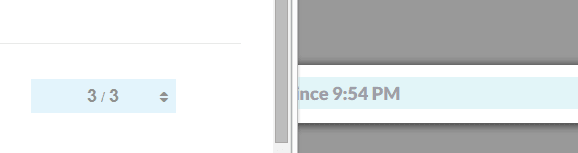

This is really night and day:

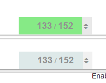

Note: the color is a hint, the numbers communicate the same thing anyway.
  *[PR]: Pull Request

---

### Post #156 by [riking](../../users/riking.md)
*Posted: 2015-02-06 07:25*

Very much day and day for me:

[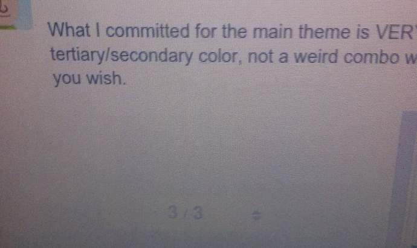](../../../assets/images/23552/197d3dd1a8b1644d72855d63e37099af5dc762df.jpg "camera pic.jpg")
  *[PR]: Pull Request

---

### Post #157 by [sam](../../users/sam.md)
*Posted: 2015-02-06 07:30*

Ill revert the main theme for now, till [@awesomerobot](/u/awesomerobot) looks at it, but really no idea where there green is coming from. its odd
  *[PR]: Pull Request

---

### Post #158 by [Mittineague](../../users/Mittineague.md)
*Posted: 2015-02-06 07:34*

I’m used to the green, but I’m _not_ a big fan of it.

 riking:

> Also probably destroying the accessibility specs

From  
<http://webaim.org/resources/contrastchecker/>

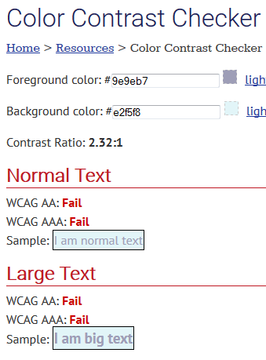
  *[PR]: Pull Request

---

### Post #159 by [sam](../../users/sam.md)
*Posted: 2015-02-06 07:36*

going with this in my theme for now:

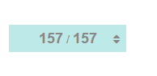

but leaving core alone for now. I can’t be doing these kind of changes so close to release, and [@awesomerobot](/u/awesomerobot) can look at this anyway.
  *[PR]: Pull Request

---

### Post #160 by [riking](../../users/riking.md)
*Posted: 2015-02-06 07:38*

You got the check backwards… the blue is foreground on white.

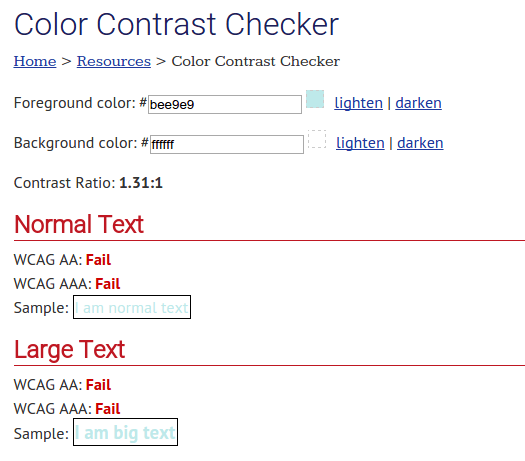

“Destroying” seems appropriate.

 sam:

> I can’t be doing these kind of changes so close to release

Restraint is good 🙂
  *[PR]: Pull Request

---

### Post #161 by [sam](../../users/sam.md)
*Posted: 2015-02-06 07:41*

HA that is totally unrelated never had those colors

and this sort of passes:

[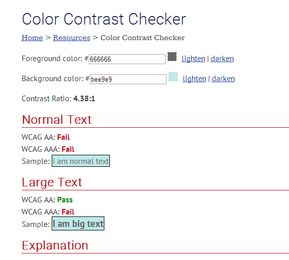](../../../assets/images/23552/238a1d76ee104f39b3d10c29e56160c1f4fd0acd.png "Pasted image")

which at least is not green
  *[PR]: Pull Request

---

### Post #162 by [riking](../../users/riking.md)
*Posted: 2015-02-06 07:42*

Fixed my screenshot, it was still about 1.3.
  *[PR]: Pull Request

---

### Post #163 by [sam](../../users/sam.md)
*Posted: 2015-02-06 07:57*

Also … by the way

[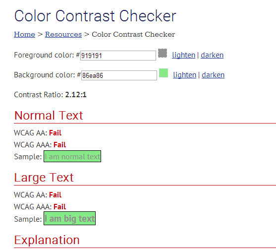](../../../assets/images/23552/55c801f25479da3aeab6089ca23e5af6188bb017.png "Pasted image")

Just sayin’

[@Mittineague](/u/mittineague) you will notice I actually improved contrast with my initial change … anyway we can leave this for now
  *[PR]: Pull Request

---

### Post #164 by [riking](../../users/riking.md)
*Posted: 2015-02-06 08:14*

My complaint was about the contrast vs the all-white background of the page, not the fill color vs the text color! **The green/blue was the foreground; white was the background**.

[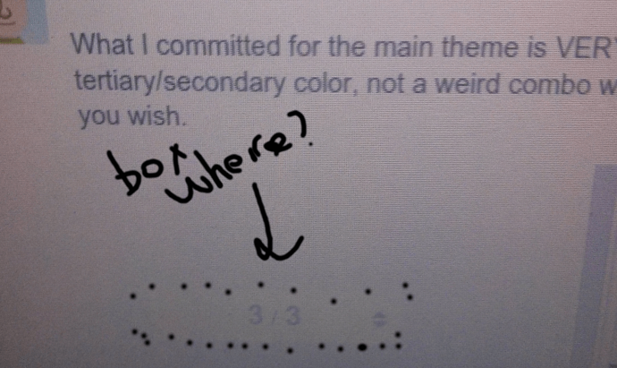](../../../assets/images/23552/a7de68fb6518a527f19200e8328e615c54a2b68e.png "Pasted image")
  *[PR]: Pull Request

---

### Post #165 by [sam](../../users/sam.md)
*Posted: 2015-02-09 06:32*

[@mcwumbly](/u/mcwumbly) any thoughts on any of my recent changes?
  *[PR]: Pull Request

---

### Post #166 by [rumpelsepp](../../users/rumpelsepp.md)
*Posted: 2015-02-09 07:55*

 sam:

> any thoughts on any of my recent changes?

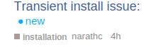

Currently the vertical alignment of the category, the username und the rel. time has some problems.
  *[PR]: Pull Request

---

### Post #167 by [sam](../../users/sam.md)
*Posted: 2015-02-09 07:56*

will see if I can sort that out, getting square badge style right has been really hard for me cc [@awesomerobot](/u/awesomerobot)
  *[PR]: Pull Request

---

### Post #168 by [chapel](../../users/chapel.md)
*Posted: 2015-02-09 08:03*

I’ve made some more changes.

[ 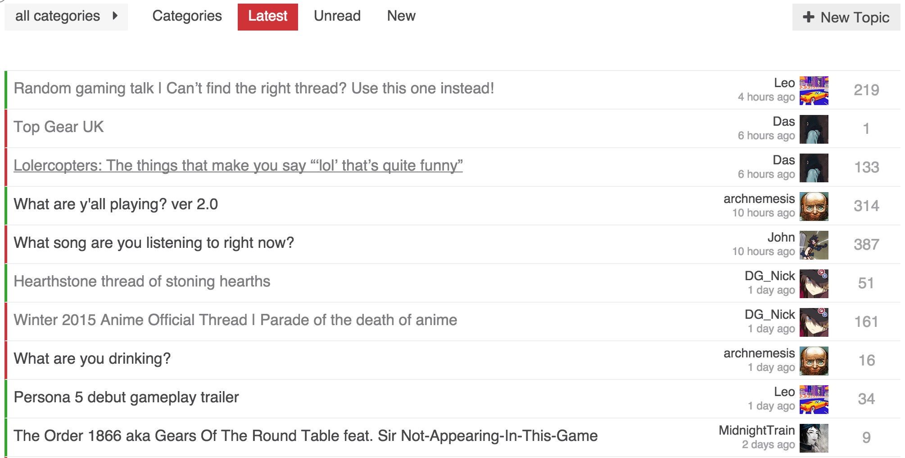 ](../../../assets/images/23552/Screenshot%202015-02-08%2023.52.23.png)

Left of topic title has category color bar. Our forum has only two main categories (`on topic` and `gaming`) so the colors are very helpful, but the name is not as important. I could see adding the category as a column if you had enough to warrant it.

I moved the replies to the far right. One thing I wanted is consistent positioning. Having replies be on the left of the last poster info, meant replies would shift around depending on the length of a users name. It also meant inconsistent whitespace.

I completely removed any of the info that was under the topic title. I prefer the cleaner look, but having everything on a single line except for the last poster looks a bit odd to me. Somewhat of an impasse because I can’t think of something better.

As always, still experimenting. Any feedback is welcome.
  *[PR]: Pull Request

---

### Post #169 by [chapel](../../users/chapel.md)
*Posted: 2015-02-09 08:05*

I had the same issue. It was there regardless of the square or not. Something to do with the markup of the category badges.
  *[PR]: Pull Request

---

### Post #170 by [sam](../../users/sam.md)
*Posted: 2015-02-09 08:06*

I got to figure out how to fix this … its real tricky but I really love my square style.
  *[PR]: Pull Request

---

### Post #171 by [chapel](../../users/chapel.md)
*Posted: 2015-02-09 08:07*

I do prefer the square style. Can you add it as one of the options in the category style setting?
  *[PR]: Pull Request

---

### Post #172 by [sam](../../users/sam.md)
*Posted: 2015-02-09 08:13*

Not until I can figure out the CSS 😉
  *[PR]: Pull Request

---

### Post #173 by [chapel](../../users/chapel.md)
*Posted: 2015-02-09 08:16*

[@sam](/u/sam) What do **you** think of some of the things I’ve done to my variation of your style?

Curious since it wouldn’t have been possible if you hadn’t taken the time to create this first. Wanted to also think you for creating it, and sharing it with us all.
  *[PR]: Pull Request

---

### Post #174 by [sam](../../users/sam.md)
*Posted: 2015-02-09 08:23*

I like the colors you used in your forum and general styling, also appreciate the extra removal of info, though prefer to keep my creator stuff for now.

I feel the reply count is a bit “weak” in color could be a bit stronger.  
The bar is an interesting concept but feels a bit loud to me.

Flipping the columns around is fine, I do see that adding a level of balance to the design. I would have to live with it a bit to make a final call.

I am no a huge fan of removing the heading, I did mute them way down on my design.
  *[PR]: Pull Request

---

### Post #175 by [chapel](../../users/chapel.md)
*Posted: 2015-02-09 08:46*

Completely understand about the creator info, on here I see it being a bit more important.

I’ve found I don’t miss the heading. The only downside is I had to add special styling for the new posts alert. It does mean there is an odd space between the topic list and the top buttons, where as the heading would provide that spacing without feeling odd.

Decided to play with it a bit and tone down the category colors, and use the primary color for the replies.

[ 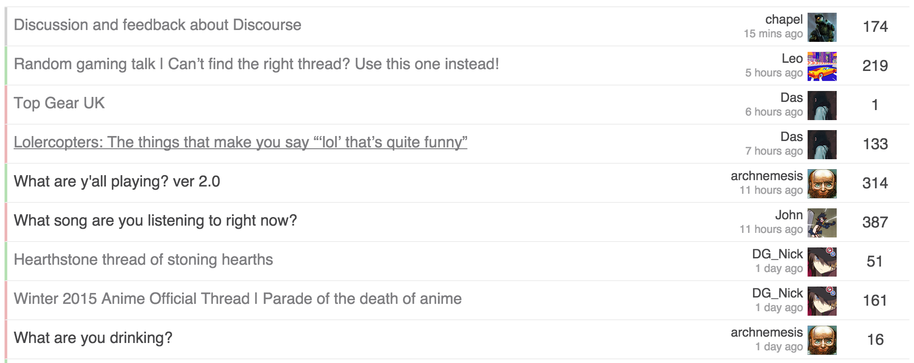 ](../../../assets/images/23552/Screenshot%202015-02-09%2000.34.50.png)

I also felt the category color on the left was a bit strong. After the changes, they still are easy to recognize, but much less strong.
  *[PR]: Pull Request

---

### Post #176 by [Mohammad](../../users/Mohammad.md)
*Posted: 2015-02-09 10:52*

I would still prefer the existing design which looks neat and clean. This minimal design will take us back to somewhat front-end interface designs of already existing forum platforms.

Default discourse design is best but you can surely propose themes for it
  *[PR]: Pull Request

---

### Post #177 by [sam](../../users/sam.md)
*Posted: 2015-02-09 11:20*

Changing discourse default design to my personal use design is not on the cards
  *[PR]: Pull Request

---

### Post #178 by [mcwumbly](../../users/mcwumbly.md)
*Posted: 2015-02-09 15:16*

I never use the hamburger category menu, but I do appreciate the consistency with using the square badge design throughout. I prefer it to the default slim-bar, so hopefully you can sort out the alignment issues. I’m glad [@chapel](/u/chapel) did the experiment with the full bar because I’ve always thought that’d be a good way to go. … but after seeing both I like the square better right now.

Toning down the progress bar is a good call. I’m not sure about the particular color. I think it might be better going with a little less blue in it.

I think you have it right with the layout of last poster / replies. Still not a fan of the reversal [@chapel](/u/chapel) did there.

I still feel like the creator / created info is just noise…
  *[PR]: Pull Request

---

### Post #179 by [chapel](../../users/chapel.md)
*Posted: 2015-02-09 22:17*

 mcwumbly:

> I think you have it right with the layout of last poster / replies. Still not a fan of the reversal [@chapel](/u/chapel) did there.

Is it that you don’t like avatar on the right of the text or even the replies on the right?
  *[PR]: Pull Request

---

### Post #180 by [mcwumbly](../../users/mcwumbly.md)
*Posted: 2015-02-10 03:28*

I think what bothers me mainly is the avatar being on the right of the text.
  *[PR]: Pull Request

---

### Post #181 by [DeanMarkTaylor](../../users/DeanMarkTaylor.md)
*Posted: 2015-02-10 03:54*

This…

 mcwumbly:

> I think what bothers me mainly is the avatar being on the right of the text.

And also - placing “the number” next to the Avatar creates some kind of context between the two that doesn’t really exist:  
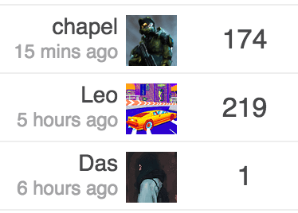
  *[PR]: Pull Request

---

### Post #182 by [chapel](../../users/chapel.md)
*Posted: 2015-02-10 07:14*

After looking at it a while, it did always feel _off_.

[ 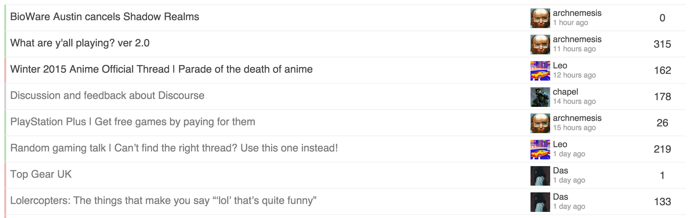 ](../../../assets/images/23552/Screenshot%202015-02-09%2023.10.10.png)

Thinking of adding the table header back, as that adds some visual continuity from top down.
  *[PR]: Pull Request

---

### Post #183 by [rumpelsepp](../../users/rumpelsepp.md)
*Posted: 2015-02-10 08:23*

That becomes nice now as well. 👍 One suggestion: I think the avatars need a little bit more margin on the right.
  *[PR]: Pull Request

---

### Post #184 by [chapel](../../users/chapel.md)
*Posted: 2015-02-16 02:18*

[ 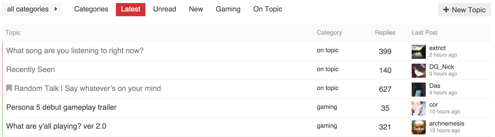 ](../../../assets/images/23552/Screenshot%202015-02-15%2018.16.22.png)

Still playing around with it. I think the last post is good, and adding the header I feel grounds the columns better.

Still torn on the color bar and/or the category column.

Honestly the default meta category bar, or even the square just don’t look great to me. Not sure what to do otherwise though.
  *[PR]: Pull Request

---

### Post #185 by [ronteras](../../users/ronteras.md)
*Posted: 2015-02-16 14:18*

Personally I like [this version](https://meta.discourse.org/t/sams-personal-minimal-topic-list-design/23552/145) the most. But it’s just me.
  *[PR]: Pull Request

---

### Post #186 by [meglio](../../users/meglio.md)
*Posted: 2015-02-22 03:32*

So, after all, how do I apply the theme - i.e. where is the final version maintained?
  *[PR]: Pull Request

---

### Post #187 by [chapel](../../users/chapel.md)
*Posted: 2015-02-22 12:20*

I will post my latest style later today. I’ll put it in a Github gist so that it is easier to track, that and it will have better versioning.
  *[PR]: Pull Request

---

### Post #188 by [chapel](../../users/chapel.md)
*Posted: 2015-02-23 00:28*

Here it is:

<https://gist.github.com/chapel/66cb4361b0109f15b48b>
  *[PR]: Pull Request

---

### Post #189 by [meglio](../../users/meglio.md)
*Posted: 2015-02-25 12:05*

Thanks, and what about Sam’s original theme? Where is the latest version held?

**UPD.** Tried to apply CSS and SCRIPT from the very first post of this topic, but the topics list and the categories page seem broken:

[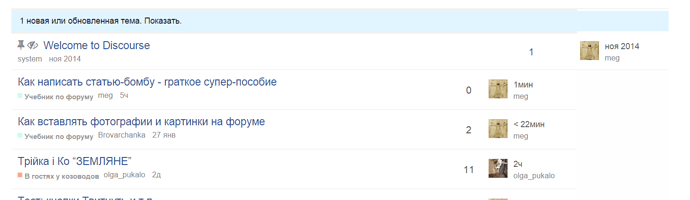](../../../assets/images/23552/512b07c25b915760be3b57ef7ce06d518d6ba219.png "77.png")

* * *

[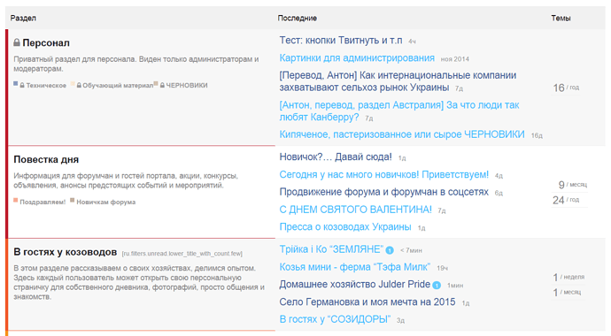](../../../assets/images/23552/960fc0da31c96fa76021930ee28bc144d6659408.png "78 \(2\).png")
  *[PR]: Pull Request

---

### Post #190 by [chapel](../../users/chapel.md)
*Posted: 2015-03-01 02:26*

So I had to fix those in mine before it diverged.

You can remove the `colspan` from `main-link`.
    
    
    <td class='main-link clearfix' colspan="{{titleColSpan}}">
    

into
    
    
    <td class='main-link clearfix'>
    

For category page, if you notice in mine, I surrounded all topic list styles with `.topic-list:not(.categories)` to make sure it didn’t affect the category page.
  *[PR]: Pull Request

---

### Post #191 by [sam](../../users/sam.md)
*Posted: 2015-03-05 07:19*

heads up, we just made some structure changes to categories, [@chapel](/u/chapel) your theme may need some adjustments as is mine
  *[PR]: Pull Request

---

### Post #192 by [chapel](../../users/chapel.md)
*Posted: 2015-03-05 07:34*

Do you have commits or details on what has changed?
  *[PR]: Pull Request

---

### Post #193 by [sam](../../users/sam.md)
*Posted: 2015-03-05 07:46*

[github.com/discourse/discourse](https://github.com/discourse/discourse/commit/2ee201b67f6f606b4e4936233859401e878d1e56)

####  [rebuilding the category badge css](https://github.com/discourse/discourse/commit/2ee201b67f6f606b4e4936233859401e878d1e56)

committed 03:15AM - 05 Mar 15 UTC

[ +102 -199 ](https://github.com/discourse/discourse/commit/2ee201b67f6f606b4e4936233859401e878d1e56)
  *[PR]: Pull Request

---

### Post #194 by [downey](../../users/downey.md)
*Posted: 2015-03-05 15:23*

[@awesomerobot](/u/awesomerobot) changing the header category color from `$header-primary` color to `$primary` made our categories invisible. 😦 had to put this back manually in customizations for now:
    
    
    header .title-wrapper .bar .badge-category { color: $header-primary !important; }
    
  *[PR]: Pull Request

---

### Post #195 by [sam](../../users/sam.md)
*Posted: 2015-03-05 20:07*

Quick update, we rolled this back and [@awesomerobot](/u/awesomerobot) will be revisiting it soon.
  *[PR]: Pull Request

---

### Post #196 by [awesomerobot](../../users/awesomerobot.md)
*Posted: 2015-03-06 01:11*

ah, yes! I forgot that the header has its own primary/secondary variables 😵

[github.com/discourse/discourse](https://github.com/discourse/discourse/pull/3256)

####  [header bar badge fix](https://github.com/discourse/discourse/pull/3256)

`master` ← `awesomerobot:master`

closed 06:01PM - 06 Mar 15 UTC

[  awesomerobot ](https://github.com/awesomerobot)

[ +3 -0 ](https://github.com/discourse/discourse/pull/3256/files)
  *[PR]: Pull Request

---

### Post #197 by [awesomerobot](../../users/awesomerobot.md)
*Posted: 2015-03-06 18:53*

I made some more changes and resubmitted the whole thing, some customizations using the box style of category will have to edit a few lines of CSS, but the structure/organization of category styles is much better.

[github.com/discourse/discourse](https://github.com/discourse/discourse/pull/3257)

####  [re-rebuilding the category badge css](https://github.com/discourse/discourse/pull/3257)

`master` ← `awesomerobot:master`

merged 06:54PM - 06 Mar 15 UTC

[  awesomerobot ](https://github.com/awesomerobot)

[ +114 -197 ](https://github.com/discourse/discourse/pull/3257/files)

This will still require some customization edits for themes using the box style […](https://github.com/discourse/discourse/pull/3257)of categories, but it should be minimized a bit. The CSS structure is much stronger and more organized, and font/size changes shouldn't break the layout. \- Custom widths (static, e.g. width: 150px) should be applied to the wrapper (.box) \- Custom padding (variable, e.g. padding: 5px) should be applied to the innermost span (.badge-category) :crocodile: :palm_tree:
  *[PR]: Pull Request

---

### Post #198 by [DavidGNavas](../../users/DavidGNavas.md)
*Posted: 2015-03-18 10:45*

Thanks to [@chapel](/u/chapel) for sharing his customizations ☀️

Is there a way to isolate the code that make the category bars coloured?

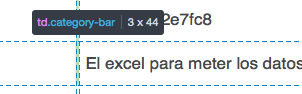

The css part would be something like this:
    
    
    $color1: #30A92A;
    $category-opacity: 0.3;
    
    .category-bar {
        margin: 0 !important;
        padding: 0 !important;
        width: 2px;
        
        .category-meta & {
            background-color: rgba($color1, $category-opacity);
        }
    }
    

…but i tried different combinations on the header part and i can’t get this to work…
  *[PR]: Pull Request

---

### Post #199 by [chapel](../../users/chapel.md)
*Posted: 2015-03-19 00:58*

 DavidGNavas:

> Is there a way to isolate the code that make the category bars coloured?

Not sure what you mean?
  *[PR]: Pull Request

---

### Post #201 by [sam](../../users/sam.md)
*Posted: 2015-03-20 01:31*

I just updated my theme to allow for the structure changes made when we added the bullet category style, it also made CSS smaller.
  *[PR]: Pull Request

---

### Post #202 by [chapel](../../users/chapel.md)
*Posted: 2015-03-21 23:31*

Cool. I’ll take a look and see if any of it will fit with my work.

I had already done quite a bit of changes, so I’m thinking we need to figure out the future of custom themes and [how they can be consumed/managed](../../../assets/images/23552/728ae6b9f2fd9343a99a59323e0c062c62356295_2_1035x267.jpg).

How much interest is there in supporting something in core for this, including a way to keep them up to date? It could work as a plugin now that most of the plugin hooks exist to create it.
  *[PR]: Pull Request

---

[← Previous](23552-page-3.md) | **Page 4 of 8** | [Next →](23552-page-5.md)
