[🏠 Home](../../index.md) | [📋 Latest](../../latest/index.md) | [🔥 Top](../../top/replies/index.md) | [👥 Users](../../users/index.md)

[Home](../../index.md) » [Theme](../../c/theme/index.md) » Sam's Simple Theme

---

# Sam's Simple Theme (Page 5 of 8)

> **Category:** Theme
> **Author:** sphism
> **Created:** 2014-12-31 03:20

[← Previous](23552-page-4.md) | **Page 5 of 8** | [Next →](23552-page-6.md)

---

### Post #203 by [sphism](../../users/sphism.md)
*Posted: 2015-03-24 04:03*

I’ve been working on styling a client’s discourse site this week and Sam’s minimal UI is working out so well for it. Thanks [@sam](/u/sam) it’s rally awesome, I think you’d really like what we’ve managed to with the look of the site… I’ll see if I can post screen shots
  *[PR]: Pull Request

---

### Post #205 by [dbm](../../users/dbm.md)
*Posted: 2015-03-29 21:39*

Hello kind people,

Question; is it possible to bring back in minimal theme heatmap colors for posts and add column views?

To look like this Views | Replies | Last Post (Columns image preview below) with activated heatmap (Post colors). Thanks for help

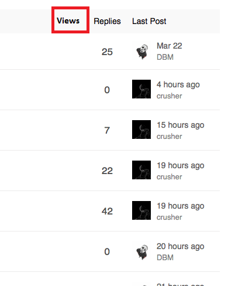

This is the header code;
    
    
    
    
    
    
    
    

Anyone? 😛
  *[PR]: Pull Request

---

### Post #206 by [sphism](../../users/sphism.md)
*Posted: 2015-04-07 00:01*

 dbm:

> data-template-name=‘list/topic_list_item.raw’

If you have a look in Discourse and find the templates that are being overridden, eg data-template-name=‘list/ **topic_list_item**.raw’ then you can see what the original templates look like.

Then you can find any parts that are missing and merge them back into the _Sam’s UI_ template overrides.

Sorry I can’t be more specific, but that should help
  *[PR]: Pull Request

---

### Post #207 by [d3zorg](../../users/d3zorg.md)
*Posted: 2015-04-29 13:46*

It looks perfect, but a lil bug overthere:

When username ‘too long’, it becomes like on the picture. Any workaround for this?  

[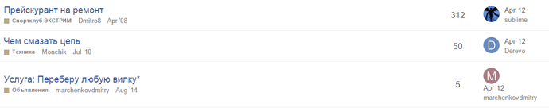](../../../assets/images/23552/473671a358fe08c48cc6b72039946d89d91e5bbd.png "Pasted image")
  *[PR]: Pull Request

---

### Post #208 by [JoeK](../../users/JoeK.md)
*Posted: 2015-04-30 20:49*

[@d3zorg](/u/d3zorg) You can solve that with CSS. Depending on what you want to achieve, you can use:

`
    
    
    .topic-list td.posters {  
    
    white-space: nowrap;  
    
    }

`

This will force no line-breaks, so the long name will simply overflow past the container’s right edge.

Or you could also play around with this setting:  
`
    
    
      text-wrap: ellipsis

`

which will apend “…” to any overflowing text instead of wrapping it to the next line. [See here](http://www.w3schools.com/cssref/css3_pr_text-overflow.asp).
  *[PR]: Pull Request

---

### Post #209 by [sam](../../users/sam.md)
*Posted: 2015-05-05 14:08*

I just added partial heatmapping (only hot)

[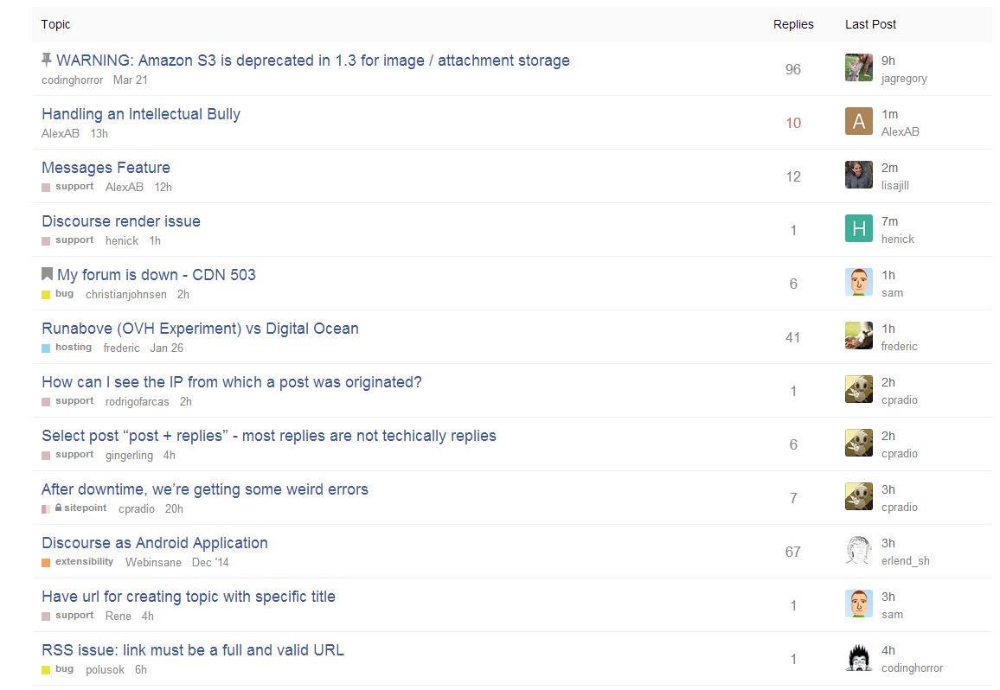](../../../assets/images/23552/9f3cb3f85a22d73b3d9fa8fb8794cce8cef8163a.png "Pasted image")

I find that too many colors distract me in the theme, but highlighting the hottest conversations does have some benefit.
  *[PR]: Pull Request

---

### Post #210 by [chapel](../../users/chapel.md)
*Posted: 2015-05-06 06:07*

Have you updated your code with this? I was looking into this the other day but got side tracked since it wasn’t working as expected.
  *[PR]: Pull Request

---

### Post #211 by [sam](../../users/sam.md)
*Posted: 2015-05-07 02:27*

Just updated it now … sorry for the delay
  *[PR]: Pull Request

---

### Post #212 by [sam](../../users/sam.md)
*Posted: 2015-05-08 00:07*

[@eviltrout](/u/eviltrout) my theme is pretty broken now, I think the list item template override is not longer taking, how do I fix?
  *[PR]: Pull Request

---

### Post #213 by [eviltrout](../../users/eviltrout.md)
*Posted: 2015-05-08 17:58*

Ah that could be because I changed it to the preferred ember style of using dashes instead of underscores. So `topic-list-item` should fix it.
  *[PR]: Pull Request

---

### Post #214 by [chapel](../../users/chapel.md)
*Posted: 2015-05-10 06:11*

Interestingly, I just upgraded to latest and my override didn’t break. Though I am having issues with the suggested topics showing user info sometimes and I am not sure why.

I think it might have to do with the model/data store changes?

[ 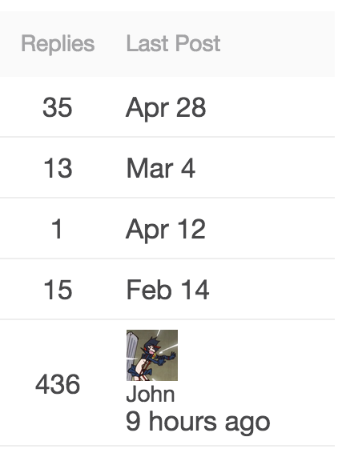 ](../../../assets/images/23552/Screenshot%202015-05-09%2023.10.53.png)
  *[PR]: Pull Request

---

### Post #215 by [ky_metro](../../users/ky_metro.md)
*Posted: 2015-05-14 02:15*

[@sam](/u/sam), can you please update the original post (header code, first line):
    
    
    <script type='text/x-handlebars' data-template-name='list/topic_list_item.raw'>
    

to
    
    
    <script type='text/x-handlebars' data-template-name='list/topic-list-item.raw'>
    

Thanks!
  *[PR]: Pull Request

---

### Post #216 by [chapel](../../users/chapel.md)
*Posted: 2015-05-19 05:40*

[@sam](/u/sam) affects yours as well

[ 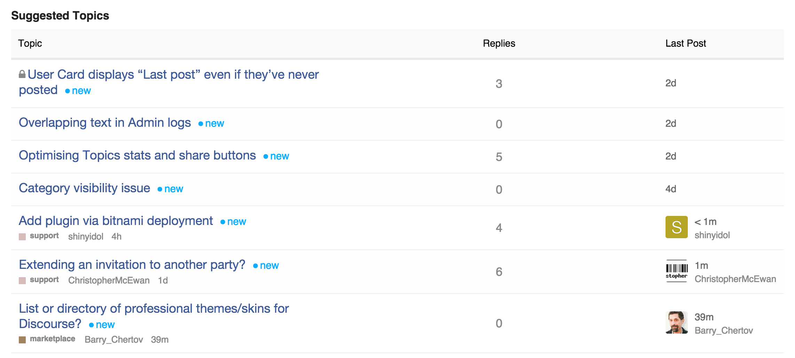 ](../../../assets/images/23552/Screenshot%202015-05-18%2022.39.50.png)
  *[PR]: Pull Request

---

### Post #217 by [Maya_Leshkowitz](../../users/Maya_Leshkowitz.md)
*Posted: 2015-08-26 19:25*

this would be a great addition! did anyone try to do something like adding excerpts?
  *[PR]: Pull Request

---

### Post #218 by [Oskar](../../users/Oskar.md)
*Posted: 2015-09-05 10:33*

I implemented the styles and templates from the first post but they remove some (new?) Discourse features like batch editing topics in a category. The small burger to the left here is now missing:

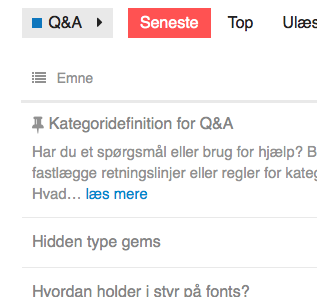

How can I see the original templates to copy it back in or is there a better approach?
  *[PR]: Pull Request

---

### Post #219 by [Fabio_Machado_de_Oli](../../users/Fabio_Machado_de_Oli.md)
*Posted: 2015-09-20 22:05*

[@sam](/u/sam), are there any plans of supporting column customizations, so we can change, hide or add just one column from the topic list?
  *[PR]: Pull Request

---

### Post #220 by [sam](../../users/sam.md)
*Posted: 2015-09-20 22:17*

Hiding columns is trivial, just use CSS, we are pretty customizable as it is, we may split up some rendering chunks a bit more
  *[PR]: Pull Request

---

### Post #221 by [sam](../../users/sam.md)
*Posted: 2015-11-23 23:49*

I just updated the theme to support:

<https://meta.discourse.org/t/deprecating-es6-compatibility-layer/35821>
  *[PR]: Pull Request

---

### Post #222 by [chapel](../../users/chapel.md)
*Posted: 2015-12-16 05:49*

I did the same, after the work you did in general to core I really just had to remove a bunch of code and only one custom property was added to the topic list view.
  *[PR]: Pull Request

---

### Post #223 by [ljpp](../../users/ljpp.md)
*Posted: 2015-12-21 07:36*

So I updated one [small side project](http://cd-rw.org/) to the beta branch, and applied [@sam](/u/sam)’s Minimal 1:1. Now I am wondering, arent the avatars supposed to be square? Still getting round. I can see the 3px rounding in the CSS, but it doesn’t seem to cut it.
  *[PR]: Pull Request

---

### Post #224 by [Oskar](../../users/Oskar.md)
*Posted: 2015-12-21 20:22*

[@sam](/u/sam) would it be possible to export this customisation as a gist or something? Would make it easier to reference and see when there are updates. As this is pretty great!
  *[PR]: Pull Request

---

### Post #225 by [ljpp](../../users/ljpp.md)
*Posted: 2015-12-25 21:43*

{{raw "topic-list-header-column" sortable='true' number='true' order='posts' forceName='Replies'}}
      {{raw "topic-list-header-column" sortable='true' order='activity' forceName='Last Post'}}

[@sam](/u/sam), is there a way to make these work with localization? Our forum defaults to Finnish, but tech savvy people generally prefer English. One of these user groups is going to get these labels in a wrong language, depending on what I have there as a hard coded solution.
  *[PR]: Pull Request

---

### Post #226 by [sam](../../users/sam.md)
*Posted: 2015-12-26 00:20*

It is tricky, we would need a core change for that
  *[PR]: Pull Request

---

### Post #227 by [Fred_vom_Jupiter](../../users/Fred_vom_Jupiter.md)
*Posted: 2016-03-09 12:47*

how can is Use the kind of Styling for only **one** category?
  *[PR]: Pull Request

---

### Post #228 by [Tom_Newsom](../../users/Tom_Newsom.md)
*Posted: 2016-03-09 14:54*

preface every selector with .categoryname, so instead of
    
    
    .topic-list td {
        padding-bottom: 10px;
    }
    

you have
    
    
    .categoryname .topic-list td {
        padding-bottom: 10px;
    }
    

you can discover the .categoryname of a category by viewing the topic list in that category and inspect the source. The main `<body>` tag for that page will have a class like “category-foobar”

EDIT: Ah I missed that there was custom JS. That’s outside my knowledge I’m afraid!
  *[PR]: Pull Request

---

### Post #229 by [Fred_vom_Jupiter](../../users/Fred_vom_Jupiter.md)
*Posted: 2016-03-09 15:24*

Thanks for your answer Tom 🙂 I found the body tag `<body class="docked category-features-vorschlagen">`

But I want to use [@sam](/u/sam)’s style just for one category. But if I paste the code inside my custom `</head>` it changes the style of every category. Is there a possibility to handle this?
  *[PR]: Pull Request

---

### Post #230 by [Mittineague](../../users/Mittineague.md)
*Posted: 2016-03-09 21:30*

 Fred_vom_Jupiter:

> But if I paste the code inside my custom </head> it changes the style of every category.

It sounds like you used the “docked” selector instead of only the category specific selector.
  *[PR]: Pull Request

---

### Post #231 by [pfaffman](../../users/pfaffman.md)
*Posted: 2016-03-09 23:30*

## Is there a way to turn on showTopicPostBadges?

 sam:

> 
>     {{#if controller.showTopicPostBadges}}
>         {{raw "topic-post-badges" unread=topic.unread newPosts=topic.displayNewPosts unseen=topic.unseen url=topic.lastUnreadUrl}}
>       {{/if}}
>     

[This post](https://meta.discourse.org/t/showoplikes-how-to-enable/37213/11) got me to where I could imagine answering this question, and I did manage to turn on showOpLikes, but I don’t see shopTopicPostBadges anywhere in the serializers.
  *[PR]: Pull Request

---

### Post #232 by [sam](../../users/sam.md)
*Posted: 2016-03-09 23:52*

 Fred_vom_Jupiter:

> But I want to use [@sam](/u/sam)’s style just for one category.

This is in the, can be done but extremely complicated department and would probably require some core changes.
  *[PR]: Pull Request

---

### Post #233 by [Pad_Pors](../../users/Pad_Pors.md)
*Posted: 2016-03-27 10:57*

i just want to use the category part of this topic-list, that’s to show the categories in a de-emphasize way beneath the topic (with the same style you used in the main image, i.e. using tag image as the visualization.

would you mind guiding me which part of the code to use?

p.s: i used the shared code, and everything has been implemented but not the category part! don’t know why.

thanks in advance,
  *[PR]: Pull Request

---

### Post #234 by [Overmind](../../users/Overmind.md)
*Posted: 2016-06-05 04:30*

 Pad_Pors:

> i used the shared code, and everything has been implemented but not the category part! don’t know why.

Just tested it and noticed the same. Categories don’t show up on /latest anymore. Using the preview here or on another site. Probably a bug from a recent update or is it not added to the OP [@sam](/u/sam)?

Edit: Also seems that it breaks the moderation tools. (Hides them, even if forced, still hides the check boxes for example inside a category to mass edit threads.)
  *[PR]: Pull Request

---

### Post #239 by [probus](../../users/probus.md)
*Posted: 2016-06-28 08:59*

The avatars and usernames of last poster are missing from Suggested topics list when using this theme:

[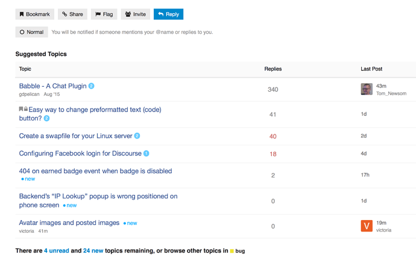](../../../assets/images/23552/460fe43431a811f439c94b2e610eecddad0277d0.png "Näyttökuva 2016-06-28 kello 11.49.19.png")

Steps to reproduce:

  1. Open [Sam's Simple Theme - #239 by probus](https://meta.discourse.org/t/sams-personal-minimal-topic-list-design/23552/239?preview-style=589a2b8f-237f-4408-b86b-2d5f158b22b6)
  2. Notice the (all/some/none) missing info. Change to private tab/different browser if necessary.

Is there an easy way to fix this? Should I open a [bug](/c/bug/1) [feature](/c/feature/2) or [support](/c/support/6) topic? This affects every site that uses some variation of the minimal theme that I know of.
  *[PR]: Pull Request

---

### Post #240 by [JSey](../../users/JSey.md)
*Posted: 2016-07-05 20:37*

Hm… I’m getting a `Error: Could not find module discourse/views/topic-list-item`\- both here on Meta, and on my own site. I rely on the part

`(function(){ var TopicListItemView = require('discourse/views/topic-list-item').default; TopicListItemView.reopen({`  
…which does not work any more on the latest beta. Does anyone have any insight in this? Grepping around did not produce any useable `TopicListView` or `ShowCategory` methods.
  *[PR]: Pull Request

---

### Post #241 by [sam](../../users/sam.md)
*Posted: 2016-07-05 21:41*

Yeah just change the word view to component
  *[PR]: Pull Request

---

### Post #242 by [ky_metro](../../users/ky_metro.md)
*Posted: 2016-09-25 18:31*

Theme appears to be broken with the last few updates. Any clues?
  *[PR]: Pull Request

---

### Post #243 by [sam](../../users/sam.md)
*Posted: 2016-09-28 09:20*

Confirmed, I will have a look at sorting this out
  *[PR]: Pull Request

---

### Post #244 by [sam](../../users/sam.md)
*Posted: 2016-09-28 10:11*

The theme is actually fine, the issue is that our transpiler changed so you need to invalidate a cache.

[@eviltrout](/u/eviltrout) will fix it so it happens automatically, but in the mean time just add a space into the HEAD section with all the customizations and save, then it will work.
  *[PR]: Pull Request

---

### Post #245 by [eviltrout](../../users/eviltrout.md)
*Posted: 2016-09-28 11:27*

Oops, fixed that here:

[github.com/discourse/discourse](https://github.com/discourse/discourse/commit/a69b897545a3a7d21414d3b8957a0a20bfe2af28)

####  [FIX: Bump the compiler version - the path to `raw-handlebars` changed.](https://github.com/discourse/discourse/commit/a69b897545a3a7d21414d3b8957a0a20bfe2af28)

committed 11:26AM - 28 Sep 16 UTC

[ 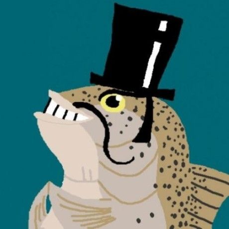 eviltrout ](https://github.com/eviltrout)

[ +1 -1 ](https://github.com/discourse/discourse/commit/a69b897545a3a7d21414d3b8957a0a20bfe2af28)
  *[PR]: Pull Request

---

### Post #246 by [DanteZii](../../users/DanteZii.md)
*Posted: 2016-12-11 16:47*

me too 🙂
  *[PR]: Pull Request

---

### Post #247 by [plyoung](../../users/plyoung.md)
*Posted: 2017-02-19 09:34*

This is awesome. Helps a lot since I have the Sidebar Blocks plugin enabled.
  *[PR]: Pull Request

---

### Post #248 by [Mooash](../../users/Mooash.md)
*Posted: 2017-03-22 04:08*

On mobile the topic description seems to bleed outside the view port due to:
    
    
    .topic-list .topic-excerpt {
        padding-right: 0;
        width: 120%;
    }
    
  *[PR]: Pull Request

---

### Post #249 by [sam](../../users/sam.md)
*Posted: 2017-04-18 19:32*

This should no longer be the case case the theme explicitly only defines desktop behavior.
  *[PR]: Pull Request

---

### Post #250 by [Mooash](../../users/Mooash.md)
*Posted: 2017-04-18 23:30*

Sweet! Any chance of getting an export for the theme or are all the sections above up to date?

**Edit:** NVM, just found the GitHub repo.
  *[PR]: Pull Request

---

### Post #251 by [sam](../../users/sam.md)
*Posted: 2017-05-17 19:54*

Now that we have native themes, perhaps you can share your theme via a github repo?
  *[PR]: Pull Request

---

### Post #252 by [sam](../../users/sam.md)
*Posted: 2017-06-06 13:28*

I just added tags, so be sure to pull latest.

[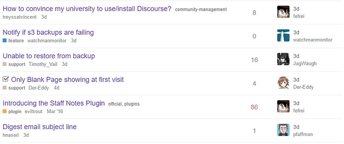](../../../assets/images/23552/d4777ac90d64ba842b6e6cca3ee1c7f36a2f648d.png "image.png")

I experimented with a few positions and feel this works best for me.
  *[PR]: Pull Request

---

### Post #253 by [alehandrof](../../users/alehandrof.md)
*Posted: 2017-06-07 15:34*

I really like this theme, but it doesn’t honor the `prioritize username in ux` setting. I have it deselected, but this theme’s topic list still shows me usernames instead of full names.
  *[PR]: Pull Request

---

### Post #254 by [smaffulli](../../users/smaffulli.md)
*Posted: 2017-06-19 19:43*

I love this theme too but I have found out that when it’s enabled I can’t see the menu for bulk actions.

This is what I see with a ‘full’ Material theme  

[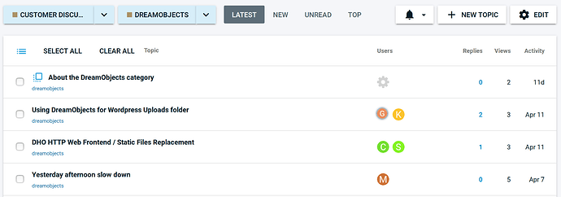](../../../assets/images/23552/2ea7e866568d74341c7d929a9d9a92f71d242f86.png "image.png")

but I don’t see a way to enable the bulk selection with minimal:

[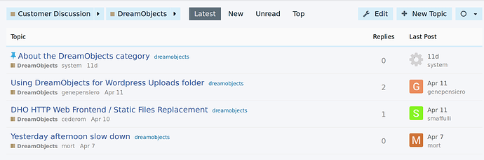](../../../assets/images/23552/7e70f52d60545e0bb15da0e3f858f049f216a9a6.png "image.png")

Am I missing something?
  *[PR]: Pull Request

---

### Post #255 by [sam](../../users/sam.md)
*Posted: 2017-06-19 19:46*

Nope, just a bug in the theme I should get fixed 🐛
  *[PR]: Pull Request

---

### Post #256 by [smaffulli](../../users/smaffulli.md)
*Posted: 2017-06-30 18:07*

[@sam](/u/sam) any idea of when you may have time to fix it? Or any pointers to what may need adjusting, I may be able to do this myself 🙂 I would like to put this in production but I can’t if it hides important management features.
  *[PR]: Pull Request

---

### Post #257 by [sam](../../users/sam.md)
*Posted: 2017-06-30 18:50*

Sorry about the delay, fixed per:

<https://github.com/SamSaffron/discourse-simple-theme/commit/74f5e0dc426b8eed181ac5843e97d97d276ca94d>
  *[PR]: Pull Request

---

[← Previous](23552-page-4.md) | **Page 5 of 8** | [Next →](23552-page-6.md)
