[🏠 Home](../../index.md) | [📋 Latest](../../latest/index.md) | [🔥 Top](../../top/replies/index.md) | [👥 Users](../../users/index.md)

[Home](../../index.md) » [Theme](../../c/theme/index.md) » Sam's Simple Theme

---

# Sam's Simple Theme (Page 6 of 8)

> **Category:** Theme
> **Author:** Pawel_Kosiorek
> **Created:** 2014-12-31 03:20

[← Previous](23552-page-5.md) | **Page 6 of 8** | [Next →](23552-page-7.md)

---

### Post #258 by [Pawel_Kosiorek](../../users/Pawel_Kosiorek.md)
*Posted: 2017-07-12 19:03*

Hi!  
Something very weird happened to my minimal theme 😉  
Do you have any idea how to fix it?  
Cheers!  

[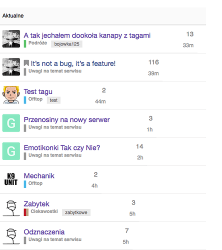](../../../assets/images/23552/a2a6ca55152c10ace475284f8bf0a8a92812d37a.png "image.png")
  *[PR]: Pull Request

---

### Post #259 by [Stranik](../../users/Stranik.md)
*Posted: 2017-07-12 19:17*

Probably, need a website to see where css. As a rule, it is sufficient to add a fixed column width or set the width in percent.
  *[PR]: Pull Request

---

### Post #260 by [sam](../../users/sam.md)
*Posted: 2017-07-12 19:18*

Yeah this is a bug in the theme, [pr-welcome](/tag/pr-welcome) to fix it.
  *[PR]: Pull Request

---

### Post #261 by [Pawel_Kosiorek](../../users/Pawel_Kosiorek.md)
*Posted: 2017-07-12 19:21*

I’m more backend-Linux-bash-script person than CSS guru 😉 But thanks for hint, I’ll try to figure it out.
  *[PR]: Pull Request

---

### Post #262 by [Justin_Veenema](../../users/Justin_Veenema.md)
*Posted: 2017-08-30 18:37*

 codinghorror:

> I beg to differ! Lots of info there.
> 
>   1. Size, if < 5 avatars then it’s a limited discussion, if 2 it’s “get a room you two”, if 1 it’s a topic nobody replied to
> 
>   2. Noobiness. Lots of letter avatars? Drive-by participants, probably.
> 
>   3. Recognition. I know the kinds of topics I can expect from certain folks here and sometimes I am excited (or… not excited…) when I see who started the topic or posted last.
> 
>   4. It’s also faster to recognize avatars than name words for me.
> 
>   5. These are my peeps. My people. I need to see them. It’s like Cheers, you want to go to the place where everyone knows your … avatar
> 
> 

I fully agree with this [@codinghorror](/u/codinghorror). For me, seeing that a large number of people are chiming in makes me get major FOMO. What are they talking about? What am I missing?

In fact, we just switched our homepage to the **Category / Latest Topics** view, but the thing that I’m _really_ missing from the **Latest** view is how activity is displayed in the form of avatars.

[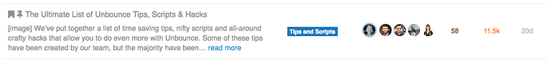](../../../assets/images/23552/4e11e7fe54691e18b122b414a8e72b47b79e8d37.png "14 PM")

I tried to make a mock-up of my dream layout, but I’m not sure if I’m communicating the idea well enough. We might end up hiring a dev to help us make this change, but I’d love to hear from others on what they think.

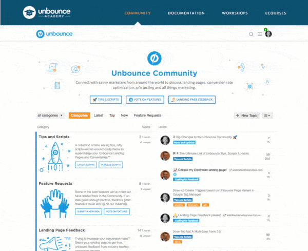
  *[PR]: Pull Request

---

### Post #264 by [ljpp](../../users/ljpp.md)
*Posted: 2018-01-15 08:31*

This totally depends on your community. For us the avatars on the index page are just clown vomit.

The reason is that 99% of the topics on our would have the maximum number of avatars shown. This produces a wide and colorful column to the middle of the screen, which has too much weight against a natural white background, and adds very little information as all topics are popular - everybody jumps to every topic. Very different to the user behavior that we see for example here.

One way to look at it is the topics/posts ratio. Here at Meta there are **160** new topics and **2.8k** posts for the last 7 days. On our community there are only **22** topics but **4.1k** posts for the same period.

The avatars do work on small and growing communities, as it makes the front page look busy / active.
  *[PR]: Pull Request

---

### Post #265 by [Stranik](../../users/Stranik.md)
*Posted: 2018-06-06 07:58*

Do not know where to add, I want to share. In this example, you can see how to change the individual elements in the design. I do not know how true this approach is.

**Add:**

PLAGIN/assets/javascripts/discourse/helpers/catid-img.js.es6
    
    
    import { registerUnbound } from 'discourse-common/lib/helpers';
    
    var get = Em.get,
        escapeExpression = Handlebars.Utils.escapeExpression;
    
    export function categoryBadgeHTML(category, opts) {
      opts = opts || {};
    
      let categoryID = escapeExpression(get(category, 'id'));
      let img = Discourse.Category.findById(categoryID).uploaded_logo.url;
      let categoryName = escapeExpression(get(category, 'name'));
      let url = opts.url ? opts.url : Discourse.getURL("/c/") + Discourse.Category.slugFor(category); 
     
      return ``;
    }
    
    export function categoryLinkHTML(category, options) {
      var categoryOptions = {};
      return new Handlebars.SafeString(categoryBadgeHTML(category, categoryOptions));
    }
    
    registerUnbound('catid-img', categoryLinkHTML);
    
    

**Add:**

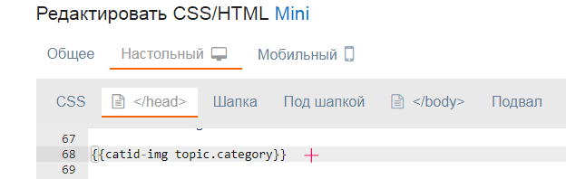
    
    
    {{catid-img topic.category}}
    

The output of category icons:

[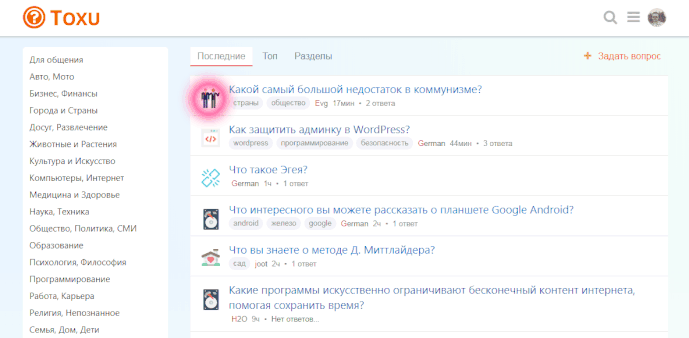](../../../assets/images/23552/1f1a5fa59c0ea7f08fd096aa02bdfd7e0d4c3222.gif "Toxu.gif")

P.S. perhaps this can be done in another way, more easier, but it is easier for me to add 1 file to the plugin.
  *[PR]: Pull Request

---

### Post #266 by [anon36484860](../../users/anon36484860.md)
*Posted: 2018-06-22 10:23*

How can we contribute translations to the theme?
  *[PR]: Pull Request

---

### Post #267 by [Tungki_Reza_Prasakti](../../users/Tungki_Reza_Prasakti.md)
*Posted: 2018-06-28 20:27*

How to fix this, i already disable the Topic List Preview plugin but still same as picture below

[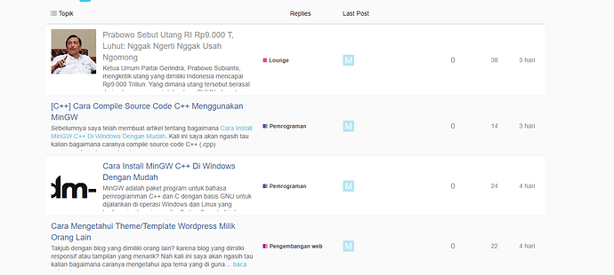](../../../assets/images/23552/805a768c6061487b6ab26baf0d488ca240406921.png "aye.png")

Replies Last Post are on wrong section, and view count still visible
  *[PR]: Pull Request

---

### Post #268 by [anon36484860](../../users/anon36484860.md)
*Posted: 2018-11-13 17:21*

[@sam](/u/sam)

 anon36484860:

> How can we contribute translations to the theme?

pushing this 🙂

 Tungki_Reza_Prasakti:

> Replies Last Post are on wrong section, and view count still visible

the same issue appeared for me today. My discourse runs on 2.1.3.
  *[PR]: Pull Request

---

### Post #269 by [Johani](../../users/Johani.md)
*Posted: 2018-11-14 05:00*

 anon36484860:

> the same issue appeared for me today. My discourse runs on 2.1.3.

Do you use the Topic List Previews plugin on your install?
  *[PR]: Pull Request

---

### Post #270 by [anon36484860](../../users/anon36484860.md)
*Posted: 2018-11-14 05:53*

In fact I do  
Just disabled it in the settings, but that didn’t help.
  *[PR]: Pull Request

---

### Post #271 by [Johani](../../users/Johani.md)
*Posted: 2018-11-14 06:12*

The template from the plugin is loaded even if the plugin is disabled in the settings. So, you don’t get the template modifications that this component adds, but you get the CSS, which is why you end up with the broken layout.
  *[PR]: Pull Request

---

### Post #272 by [anon36484860](../../users/anon36484860.md)
*Posted: 2018-11-14 15:41*

So there is no workaround to use Topic List Previews plugin with Sam’s Theme?
  *[PR]: Pull Request

---

### Post #274 by [EricF](../../users/EricF.md)
*Posted: 2019-01-23 00:29*

I can’t for the life of me figure out how to install this as the default for my community. Seems like it would be in the admin panel, under “customize” and “Themes”, but can’t find it. Anyone have any tips?

[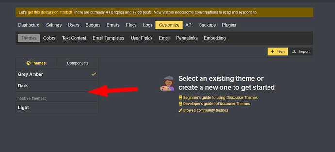](../../../assets/images/23552/305e92b2a5bf44d8fc6752523d1aab662ee4dc45.png "image.png")
  *[PR]: Pull Request

---

### Post #275 by [awesomerobot](../../users/awesomerobot.md)
*Posted: 2019-01-23 01:23*

The buttons are over here

[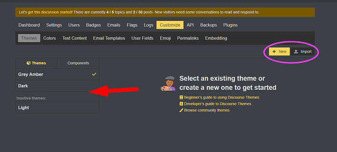](../../../assets/images/23552/ca2a315351e6397038d0cf4624364dc9603069f8.png "305e92b2a5bf44d8fc6752523d1aab662ee4dc45.png")
  *[PR]: Pull Request

---

### Post #276 by [EricF](../../users/EricF.md)
*Posted: 2019-01-23 16:49*

Thanks for the help. When I add a new one, I’m not seeing Sam’s theme anywhere

[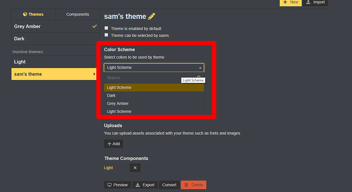](../../../assets/images/23552/ffee03fcda5315f637c2802399f6b1543aeb0e63.png "image.png")

Am I supposed to be importing here? If so, how can I find the url to the repository for sam’s theme?

[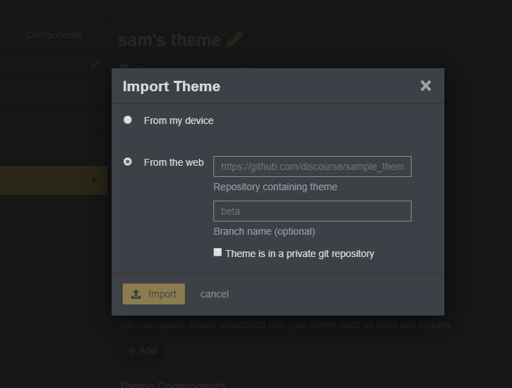](../../../assets/images/23552/30ad9df53cbc1c2a2da5594a0126e65d7ee3904b.png "image.png")
  *[PR]: Pull Request

---

### Post #277 by [awesomerobot](../../users/awesomerobot.md)
*Posted: 2019-01-23 16:52*

Yes, you need to import it. The URL is in the original post at the top of this topic.
  *[PR]: Pull Request

---

### Post #278 by [EricF](../../users/EricF.md)
*Posted: 2019-01-23 17:15*

Is this the url to add? [GitHub - discourse/discourse-simple-theme: Sam's simple discourse theme](https://github.com/SamSaffron/discourse-simple-theme)
  *[PR]: Pull Request

---

### Post #280 by [awesomerobot](../../users/awesomerobot.md)
*Posted: 2019-01-25 18:34*

Yep, that’s the one (you could just try it and find out, nothing bad happens if you use the wrong URL you just get an error).
  *[PR]: Pull Request

---

### Post #281 by [Steven](../../users/Steven.md)
*Posted: 2019-05-13 12:55*

Hello [@sam](/u/sam), is it ok if I use parts of your theme to do a theme component ?

I played with this this weekend and I think I can do a theme component for those interested
  *[PR]: Pull Request

---

### Post #282 by [sam](../../users/sam.md)
*Posted: 2019-05-13 22:57*

Sure the license allows it 🙂 [discourse-simple-theme/LICENSE.txt at main · discourse/discourse-simple-theme · GitHub](https://github.com/discourse/discourse-simple-theme/blob/master/LICENSE.txt)

What are you looking to change?
  *[PR]: Pull Request

---

### Post #283 by [Steven](../../users/Steven.md)
*Posted: 2019-05-13 23:03*

I wanted to create a theme component who can work on a majority of themes, because I didn’t really know how to edit the topic-list-item.raw.hbs, I used your work as a base.

I used two parts of your theme, the last post column and the author of the topic under the title, and I put back the views column and compatibility with featured link. I played with a few things here and there. I’ll present my theme component very soon.

To be sure, I wanted to ask for your permission, but I should have read the license 

Thanks
  *[PR]: Pull Request

---

### Post #284 by [javi618](../../users/javi618.md)
*Posted: 2019-06-24 13:51*

Hi [@sam](/u/sam)

I´m starting to using your theme in my new forum. I have a problem in desktop version (not happens in mobile version).

When I activate the feature “topic featured link enabled” the source url is not showing in the topic title. It´s strange, in mobile is showing perfectly, like in the default Discourse theme.

Any idea what can I do to fix it?

Default theme, you can see [elperiodico.com](http://elperiodico.com) and [xataka.com](http://xataka.com) as sources:

[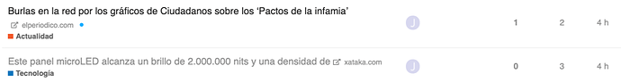](../../../assets/images/23552/c66af912d8945a5de4bc89f1792f0db97ba1c429.png "image.png")

Sam´s Simple theme, the links to the original sources are gone:

[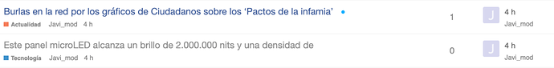](../../../assets/images/23552/cfd7e6317376725cb416f678cb36fd658272d772.png "image.png")

Thanks in advance
  *[PR]: Pull Request

---

### Post #285 by [Steven](../../users/Steven.md)
*Posted: 2019-06-24 19:10*

You can edit the theme in the `Header` section

And replace it all with this:
    
    
    
    
    
    
    
    

Haven’t tried it, but it should work
  *[PR]: Pull Request

---

### Post #286 by [javi618](../../users/javi618.md)
*Posted: 2019-06-24 20:12*

Thanks [@Steven](/u/steven), I´ll try it!
  *[PR]: Pull Request

---

### Post #287 by [Cécile_Savoie](../../users/Cécile_Savoie.md)
*Posted: 2019-06-24 20:45*

 sam:

> A very cool thing is that this is all achieved using the customize menu.

Awesome thanks for specifying this!
  *[PR]: Pull Request

---

### Post #288 by [javi618](../../users/javi618.md)
*Posted: 2019-06-25 06:51*

 Steven:

> Haven’t tried it, but it should work

It´s working nice, thanks [@Steven](/u/steven)
  *[PR]: Pull Request

---

### Post #289 by [jrgong](../../users/jrgong.md)
*Posted: 2019-10-24 09:18*

Hey [@sam](/u/sam)  
I have been trying to get the theme running on my forum

but it doesn’t work, the columns in home page are still same and not like in theme.  
[ 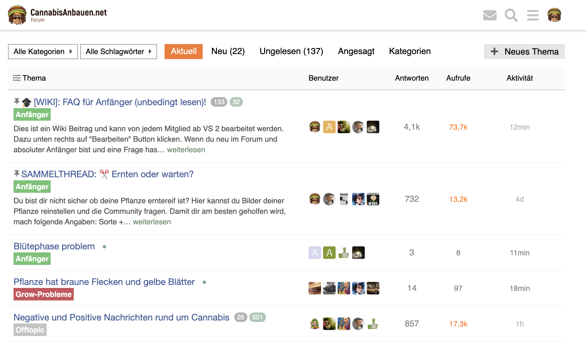 ](https://dl.dropboxusercontent.com/s/tfqq8mbk3s310wj/Screenshot%202019-10-24%2011.17.52.png?dl=0)

how can I debug it and see what prevents it from working?
  *[PR]: Pull Request

---

### Post #290 by [sam](../../users/sam.md)
*Posted: 2019-10-25 03:38*

It is definitely working here. I recommend you upgrade to the latest version of Discourse and install using the official guide.
  *[PR]: Pull Request

---

### Post #291 by [jrgong](../../users/jrgong.md)
*Posted: 2019-10-25 10:30*

The [topic list preview plugin](https://meta.discourse.org/t/topic-list-previews/101646/) caused some issue. After uninstalling it, it works. Even disabling it didn’t help.

[@sam](/u/sam) how can I translate the theme’s parts? I didn’t find the entries in site_texts
  *[PR]: Pull Request

---

### Post #292 by [sam](../../users/sam.md)
*Posted: 2019-10-25 20:32*

Oh, not yet, I need to restructure a bit for that
  *[PR]: Pull Request

---

### Post #293 by [Pad_Pors](../../users/Pad_Pors.md)
*Posted: 2019-10-26 10:51*

the topic list in the Spotify community, is very similar to the Sam’s personal minimal topic list, and even much more minimal. The comment icon next to the number of replies makes it more consistent, as well.

[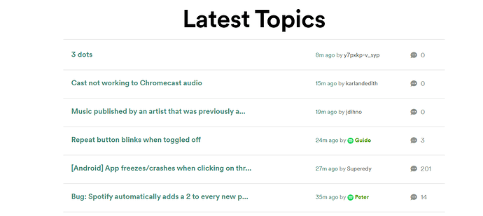](../../../assets/images/23552/df17719300538980711add0be7ed0261075025c9.png "image.png")

added it here for inspiration.
  *[PR]: Pull Request

---

### Post #294 by [Webinsane](../../users/Webinsane.md)
*Posted: 2019-11-04 19:44*

Bit different approach. I had few hours last night and jumped into Discourse theming. This is just a simple design.

I might continue and fix few things…I see today there are too many colors…like like hipster style, but in general would like to have a forum design that fits small/startup businesses so less forumish looking 🙂

[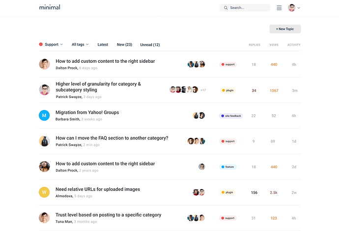](../../../assets/images/23552/c116a051eaa3cd152bf6d2c9934916373cc4c485.png "minimal%20discourse")
  *[PR]: Pull Request

---

### Post #295 by [jrgong](../../users/jrgong.md)
*Posted: 2019-11-04 21:59*

That amazing? Any plans to make it public? 🙂
  *[PR]: Pull Request

---

### Post #296 by [Webinsane](../../users/Webinsane.md)
*Posted: 2019-11-04 23:06*

To be honest I doubt that this will ever come to life. I am full time UX designer now so I have no time for developing anymore. However, I do have tendency to design forums when I have free time 🙂
  *[PR]: Pull Request

---

### Post #297 by [jrgong](../../users/jrgong.md)
*Posted: 2019-11-19 10:00*

[@sam](/u/sam) any chance the replies column will make a comeback? at least as a theme option. 🙂
  *[PR]: Pull Request

---

### Post #298 by [Joshua_Kogan](../../users/Joshua_Kogan.md)
*Posted: 2019-11-19 13:37*

[@webinsane](/u/webinsane), i understand you don’t want to commit to further development, but can what you’ve done so far be shared? It really looks clean/awesome!
  *[PR]: Pull Request

---

### Post #299 by [sam](../../users/sam.md)
*Posted: 2019-11-19 23:10*

I am afraid part of this being “personal” is that it is my prefs… so I think best you can do here is just fork it and make your own theme. I don’t mean to be mean hear, but I want to avoid options on my personal theme.
  *[PR]: Pull Request

---

### Post #300 by [Canapin](../../users/Canapin.md)
*Posted: 2019-11-20 20:50*

If I do such a modification, will be be overwritten by future updates?
  *[PR]: Pull Request

---

### Post #301 by [jrgong](../../users/jrgong.md)
*Posted: 2019-11-22 09:12*

[@sam](/u/sam) Is it intended that for topics made from URLs the external link is hidden in topic list view? In my case they are not displayed on home page for this topic:  
 [Cannabisanbauen.net Forum – 21 Nov 19](https://forum.cannabisanbauen.net/t/testbericht-mars-hydro-tsw-2000-die-ultimative-low-budget-led-grow-lampe/7920/11 "03:00PM - 21 November 2019")

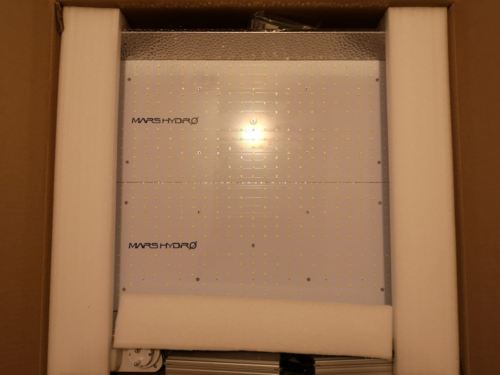

### [Testbericht: Mars Hydro TSW 2000 - Die Ultimative Low Budget LED Grow Lampe?](https://forum.cannabisanbauen.net/t/testbericht-mars-hydro-tsw-2000-die-ultimative-low-budget-led-grow-lampe/7920/11)

Seit Ende 2019 hat Mars Hydro die neue TS-Serie auf dem Markt. Der Hersteller ist vor allem bekannt für Low Budget LED Pflanzenlampen. Unser Foren-Moderator Skome223 hat das Modell TSW 2000 genauer unter die Lupe genommen. Viel Spaß mit dem...
  *[PR]: Pull Request

---

### Post #302 by [Webinsane](../../users/Webinsane.md)
*Posted: 2019-12-09 22:01*

[@Joshua_Kogan](/u/joshua_kogan) Sorry for the late reply. I think there was a misunderstanding as this is just a draft design. No actual code behind it. If there is interest I can continue designing and open source the Figma file to a possible developer(s).

That said there is lots of work left:

  1. Style guides
  2. Components
  3. Topic view
  4. Profile pages
  5. Category view
  6. and more

Even thou it looks minimal Discourse is a complex beast 🙂

Sorry [@sam](/u/sam) I should have opened my own personal minimal theme topic 😊
  *[PR]: Pull Request

---

### Post #303 by [Alex_P](../../users/Alex_P.md)
*Posted: 2019-12-11 19:03*

Thanks for the great theme 🙂

Is there any way to add ability to translate “Replies”/“Last Post”? For now I just changed it in the code, but as I understand it’s not recommended because the changes will be lost if the theme updates.
  *[PR]: Pull Request

---

### Post #304 by [knewt](../../users/knewt.md)
*Posted: 2019-12-12 11:19*

[@sam](/u/sam) really like this theme, but wondering if there’s something I can change on my end to make it work well with the dark colour palette?
  *[PR]: Pull Request

---

### Post #305 by [Alex_P](../../users/Alex_P.md)
*Posted: 2019-12-12 15:24*

Yeah, I am also interested in this, just asked a similar question here:

 [How to make a theme with different color palettes?](https://meta.discourse.org/t/how-to-make-a-theme-with-different-color-palettes/135769) [support](/c/support/6)

> I installed this theme [Sam's personal "minimal" topic list design](https://meta.discourse.org/t/sams-personal-minimal-topic-list-design/23552), it uses light colors by default. I want to allow users to use it with dark colors. What is the best way to achieve this? Do I need to somehow install it two times and set different color palettes? Or there are better ways? 
  *[PR]: Pull Request

---

### Post #306 by [sam](../../users/sam.md)
*Posted: 2019-12-12 22:51*

 Alex_P:

> Is there any way to add ability to translate “Replies”/“Last Post”?

There is now, I just made it localizable and pushed a fix.
  *[PR]: Pull Request

---

### Post #307 by [jrgong](../../users/jrgong.md)
*Posted: 2020-01-21 10:21*

I have a similar issue where by default the theme looks like this in Dark Mode (via [this switcher](https://meta.discourse.org/t/theme-switcher-component/113460)):

[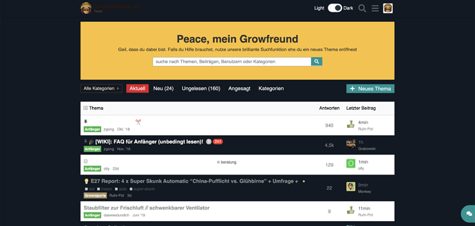](../../../assets/images/23552/c5e68bbbfb69633c2030e40a61c47e39b532e10d.png "Screenshot 2020-01-21 at 14.19.25")
  *[PR]: Pull Request

---

### Post #308 by [Pad_Pors](../../users/Pad_Pors.md)
*Posted: 2020-04-03 17:36*

the avatar of the last user replied, is not shown in this theme anymore:

[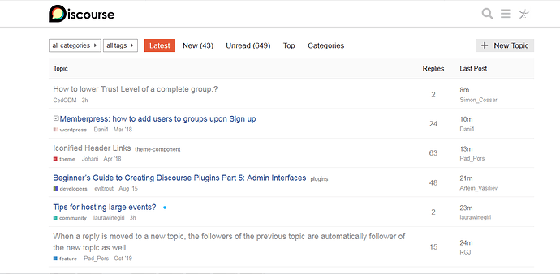](../../../assets/images/23552/08a1cfbc180644ce99dd958e21378ffe2df91455.png "image")

I wonder if it’s by intention or it’s a simple bug. either case, in my opinion, the theme was more beautiful with the avatars.
  *[PR]: Pull Request

---

### Post #309 by [Steven](../../users/Steven.md)
*Posted: 2020-04-03 19:14*

It’s a little bug, it will be fixed soon.

If you want to fix it until then, you just need to edit the theme and in the Desktop > Header part, change the code with this

_((edited, upgrade the component now))_

You’ll still be able to upgrade the theme after this change
  *[PR]: Pull Request

---

### Post #310 by [sam](../../users/sam.md)
*Posted: 2020-04-04 03:05*

Thanks bookmarked and set a reminder for Monday

EDIT: fix is merged thanks [@Steven](/u/steven)!
  *[PR]: Pull Request

---

[← Previous](23552-page-5.md) | **Page 6 of 8** | [Next →](23552-page-7.md)
