[🏠 Home](../../index.md) | [📋 Latest](../../latest/index.md) | [🔥 Top](../../top/replies/index.md) | [👥 Users](../../users/index.md)

[Home](../../index.md) » [Theme](../../c/theme/index.md) » Sam's Simple Theme

---

# Sam's Simple Theme (Page 7 of 8)

> **Category:** Theme
> **Author:** jrgong
> **Created:** 2014-12-31 03:20

[← Previous](23552-page-6.md) | **Page 7 of 8** | [Next →](23552-page-8.md)

---

### Post #311 by [jrgong](../../users/jrgong.md)
*Posted: 2020-04-14 20:16*

Hey guys

what change do I have to make in the header to get the excerpt for featured topics back?

Also my avatars are gone from topic list after I updated the theme component:  
 [Forum | Cannabisanbauen.net](https://forum.cannabisanbauen.net/) 

### [Forum | Cannabisanbauen.net](https://forum.cannabisanbauen.net/)

Grow Community von CannabisAnbauen.net. Alles rund um Leidenschaft von Cannabis Anbau
  *[PR]: Pull Request

---

### Post #312 by [sam](../../users/sam.md)
*Posted: 2020-04-14 22:36*

My guess is that you are running a fork, latest has the avatars.
  *[PR]: Pull Request

---

### Post #313 by [jrgong](../../users/jrgong.md)
*Posted: 2020-04-14 23:44*

Just checked, my theme’s source link points to `https://github.com/discourse/discourse-simple-theme.git`  
Also just re-installed it from the source link again, same issue on theme preview
  *[PR]: Pull Request

---

### Post #314 by [sam](../../users/sam.md)
*Posted: 2020-04-14 23:55*

Maybe update discourse to latest ?
  *[PR]: Pull Request

---

### Post #315 by [jrgong](../../users/jrgong.md)
*Posted: 2020-04-15 00:10*

I am on 2.4.1. Are you referring to 2.5 beta?
  *[PR]: Pull Request

---

### Post #316 by [Steven](../../users/Steven.md)
*Posted: 2020-04-15 00:24*

Yes the change in the avatar was in the version 2.5.0 beta 2.
  *[PR]: Pull Request

---

### Post #317 by [jrgong](../../users/jrgong.md)
*Posted: 2020-04-15 10:09*

Ah I see. Just scrolled up and [found your temporary fix](https://meta.discourse.org/t/sams-personal-minimal-topic-list-design/23552/309).

[@Steven](/u/steven) can you tell me what part in that header code to adjust to bring back the excerpt of pinned topics again?
  *[PR]: Pull Request

---

### Post #318 by [Steven](../../users/Steven.md)
*Posted: 2020-04-15 10:49*

There already is a excerpt reference, so you might want to delete line 16 first
    
    
      {{raw "list/topic-excerpt" topic=model}}
    

Then, I would add this
    
    
      {{#if expandPinned}}
        {{raw "list/topic-excerpt" topic=topic}}
      {{/if}}
    

Right after this
    
    
    {{raw "list/action-list" topic=topic postNumbers=topic.liked_post_numbers className="likes" icon="heart"}}
       

    

So just before the `</td>`

If you use the old header code, that should look like this
    
    
    
    
    
    
    
    
  *[PR]: Pull Request

---

### Post #319 by [jrgong](../../users/jrgong.md)
*Posted: 2020-04-15 11:10*

 Steven:

> If you want to fix it until then, you just need to edit the theme and in the Desktop > Header part, change the code with this

I just added this code to the theme’s Header part, yet avatars still don’t show up. Am I missing something?

 Steven:

> If you use the old header code, that should look like this

Tried this code as well, avatars not showing up. Even tried [safe mode](https://meta.discourse.org/t/53504?silent=true) and disabled all plugins

 sam:

> Oh, not yet, I need to restructure a bit for that

FYI: the conflict with Topic List Previews prevented the excerpts to be displayed even with the code provided
  *[PR]: Pull Request

---

### Post #320 by [Steven](../../users/Steven.md)
*Posted: 2020-04-15 13:35*

I edited my previous post, I got confused with all the different versions.

The code you added was for the newest version of Discourse. If I understand correctly, you need a to edit the header for a old version of Discourse, so I changed my last post with a version for a version previous than 2.5.0 b2

It would be easier to upgrade Discourse tho, lots of cool new features 😁
  *[PR]: Pull Request

---

### Post #321 by [jrgong](../../users/jrgong.md)
*Posted: 2020-04-15 20:11*

 Steven:

> It would be easier to upgrade Discourse tho, lots of cool new features 😁

Which I am looking forward to 😉

yet I prefer to stay on stable 😉

Thx for the update!
  *[PR]: Pull Request

---

### Post #322 by [jrgong](../../users/jrgong.md)
*Posted: 2020-05-01 08:49*

[@sam](/u/sam) Are there any plans to make the theme component compatible with [Topic List Previews](https://meta.discourse.org/t/topic-list-previews/101646) plugin anytime soon?
  *[PR]: Pull Request

---

### Post #323 by [sam](../../users/sam.md)
*Posted: 2020-05-01 23:23*

No specific plans to do so
  *[PR]: Pull Request

---

### Post #324 by [b481](../../users/b481.md)
*Posted: 2020-05-21 01:03*

How would I add a “users” column between the thread title and reply count with the name and/or avatar of the user who started each respective thread? Could it be done using the the customize function or the theme creator?
  *[PR]: Pull Request

---

### Post #325 by [Mevo](../../users/Mevo.md)
*Posted: 2020-08-07 18:03*

I was usually using “Sam’s simple theme” (which I like very much) here on meta. Seems to bug since yesterday on my end !? I tried on a fresh install of a different browser (firefox instead of chrome), and the problem seems identical. I don’t have the upper banner, only a few topics appearing, and clicking on one doesn’t work. Everything seems fine with another theme.
  *[PR]: Pull Request

---

### Post #326 by [Johani](../../users/Johani.md)
*Posted: 2020-08-07 19:43*

It should be fixed now. Thanks for reporting the issue [@Mevo](/u/mevo) 👍
  *[PR]: Pull Request

---

### Post #330 by [b481](../../users/b481.md)
*Posted: 2020-08-17 04:09*

Is there any way one could put in the username of the topic starter below the topic title on mobile as it is on desktop on mobile?

Mobile:

[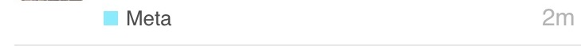](../../../assets/images/23552/d38cdd00368958548369145dd11bf5c1b69747e2.jpeg "IMG_5113")

Desktop:

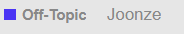
  *[PR]: Pull Request

---

### Post #331 by [Alex_P](../../users/Alex_P.md)
*Posted: 2021-01-05 16:55*

Looks like the theme is not compatible with Dark schemes 😦 and thus with [Automatic Dark Mode color scheme switching](https://meta.discourse.org/t/automatic-dark-mode-color-scheme-switching/161593)

[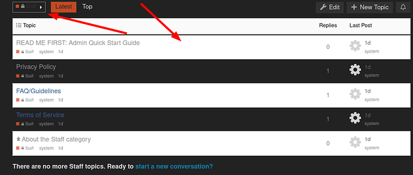](../../../assets/images/23552/163233f83203dbea5c9e1b5e9e1ef2bc43b6694c.png "image")
  *[PR]: Pull Request

---

### Post #332 by [pmusaraj](../../users/pmusaraj.md)
*Posted: 2021-01-06 01:05*

I have updated the theme to improve dark mode compatibility, you should see an improvement after pulling the latest changes.
  *[PR]: Pull Request

---

### Post #333 by [Alex_P](../../users/Alex_P.md)
*Posted: 2021-01-06 07:51*

Thanks 🙂

But the category names are still broken.

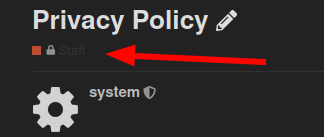  
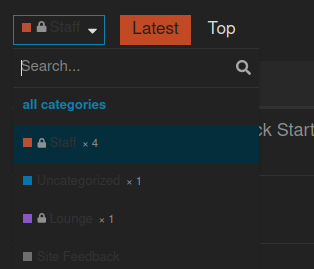
  *[PR]: Pull Request

---

### Post #334 by [pmusaraj](../../users/pmusaraj.md)
*Posted: 2021-01-06 13:55*

The category badges should be fixed now, too.
  *[PR]: Pull Request

---

### Post #335 by [Alex_P](../../users/Alex_P.md)
*Posted: 2021-01-06 14:09*

The color of unread topics is a bit hard to read:

Default theme:  

[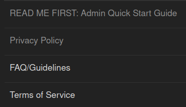](../../../assets/images/23552/b8379b638fc4815198ac2c2f89c1b89a3bf5388d.png "image")

This theme:  

[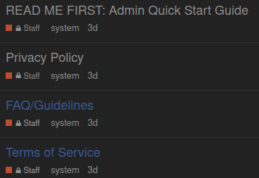](../../../assets/images/23552/4c1b3762cbdd35d25137b865fb0bc3a7bba6a701.png "image")

Probably need to un-hardcode this:

[github.com/discourse/discourse-simple-theme](https://github.com/discourse/discourse-simple-theme/blob/ce745784e99f57d19cdff7411f102260f3add303/desktop/desktop.scss#L10)

#### [desktop/desktop.scss](https://github.com/discourse/discourse-simple-theme/blob/ce745784e99f57d19cdff7411f102260f3add303/desktop/desktop.scss#L10)

[`ce745784e`](https://github.com/discourse/discourse-simple-theme/blob/ce745784e99f57d19cdff7411f102260f3add303/desktop/desktop.scss#L10)
    
    
          
    
    
              
        1. .topic-list > tbody > tr:nth-child(odd) {
    
              
        2.   background-color: var(--secondary);
    
              
        3. }
    
              
        4. 
              
        5. .topic-list > tbody tr:not(.last-visit):not(.topic-list-item-separator) td {
    
              
        6.   border-bottom: 1px solid var(--primary-low);
    
              
        7. }
    
              
        8. 
              
        9. .topic-list a.title:not(.badge-notification) {
    
              
        10.   color: #3b5998;
    
              
        11.   font-weight: normal;
    
              
        12.   font-family: "Helvetica Neue", Helvetica, Arial, Utkal, sans-serif;
    
              
        13.   font-size: 18px;
    
              
        14. }
    
              
        15. 
              
        16. .topic-list a.title:not(.badge-notification):hover {
    
              
        17.   text-decoration: underline;
    
              
        18. }
    
              
        19. 
              
        20. .topic-list .creator,
    
          
    
        
  *[PR]: Pull Request

---

### Post #336 by [Alex_P](../../users/Alex_P.md)
*Posted: 2021-05-13 17:13*

hm, looks like something is broken after recent update.

Now openning a topic from the list results in loading completely new page instead of just loading the topic with loading indicator etc. So it is a bit confusing because for a second it is unclear whether the click worked, and the editor window is lost, so it is difficult to add quotes from other topics etc.
  *[PR]: Pull Request

---

### Post #337 by [Johani](../../users/Johani.md)
*Posted: 2021-05-13 17:19*

There was a bug related to this introduced a few days ago, but has since been fixed.

Can you please check if your site is on the latest?

`/admin/upgrade`
  *[PR]: Pull Request

---

### Post #338 by [Alex_P](../../users/Alex_P.md)
*Posted: 2021-05-13 17:21*

oh, cool 🙂

Yeah, it is not latest  
2.7.0.beta8 ( [ f002c58a30 ](https://github.com/discourse/discourse/commits/f002c58a30efece0b517e07f28b9c37223167d8f) )
  *[PR]: Pull Request

---

### Post #339 by [Johani](../../users/Johani.md)
*Posted: 2021-05-13 17:29*

The fix for the bug I mentioned was added a couple of days after your most recent upgrade. Can you please try upgrading again and let me know if the issue persists?
  *[PR]: Pull Request

---

### Post #340 by [Alex_P](../../users/Alex_P.md)
*Posted: 2021-05-14 05:16*

Yeah, seems to work fine after upgrade.

I wonder though why this issue was occurring only in this theme, others had this [auto-route](https://github.com/discourse/discourse/pull/12999/files) thing too but somehow were working fine. 
  *[PR]: Pull Request

---

### Post #341 by [Alex_P](../../users/Alex_P.md)
*Posted: 2021-05-25 15:52*

 Alex_P:

> The color of unread topics is a bit hard to read:

Submitted a PR fixing this

[github.com/discourse/discourse-simple-theme](../../../assets/images/23552/460fe43431a811f439c94b2e610eecddad0277d0_2_1035x642.png)

####  [Fix topic link color in dark mode](../../../assets/images/23552/460fe43431a811f439c94b2e610eecddad0277d0_2_1035x642.png)

`main` ← `programmersforum-reborn:fix-dark-scheme-link-color`

merged 09:13PM - 14 Jun 21 UTC

[  AlexP11223 ](https://github.com/AlexP11223)

[ +6 -1 ](https://github.com/discourse/discourse-simple-theme/pull/4/files)

As shown [here](https://meta.discourse.org/t/sams-personal-minimal-topic-list-de[…](../../../assets/images/23552/460fe43431a811f439c94b2e610eecddad0277d0_2_1035x642.png)sign/23552/335?u=alex_p), dark blue link color is not very readable on dark background. So this PR adds a custom property in `color_definitions` switching to the color scheme primary color when in dark mode. We should keep the original color in light mode because it was one of the features of this theme.
  *[PR]: Pull Request

---

### Post #342 by [jlzy](../../users/jlzy.md)
*Posted: 2021-08-12 17:08*

Theme is significantly different in topic views since update… Please help!!!
  *[PR]: Pull Request

---

### Post #343 by [awesomerobot](../../users/awesomerobot.md)
*Posted: 2021-08-12 17:29*

can you be more specific about what has changed? do you have a screenshot?
  *[PR]: Pull Request

---

### Post #344 by [jlzy](../../users/jlzy.md)
*Posted: 2021-08-12 22:07*

Yes, here is what it looked like before the update:

[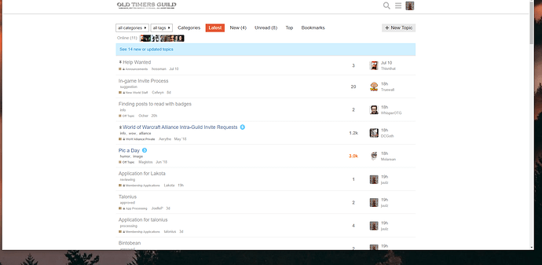](../../../assets/images/23552/a6af1be3087aaaf549f6b7bed0a03c3744c92907.png "2021-08-12")

Now it looks like this:

[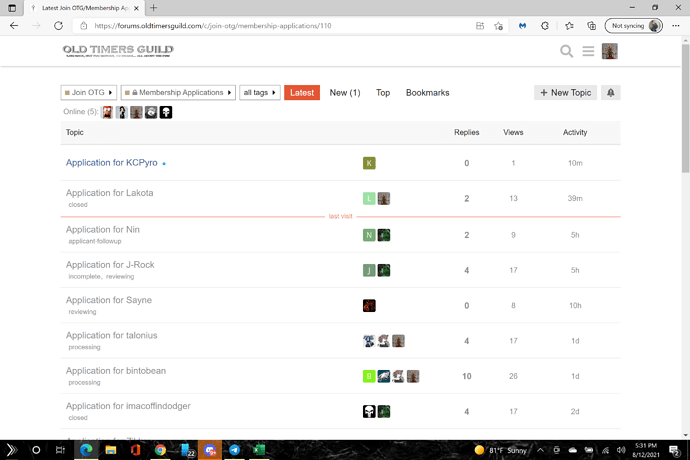](../../../assets/images/23552/221095e3c09abdd1d0b4d62cbb7be2127e20d65e.png "2021-08-12 \(2\)")
  *[PR]: Pull Request

---

### Post #345 by [awesomerobot](../../users/awesomerobot.md)
*Posted: 2021-08-13 14:12*

hmm that’s strange… the theme works fine here on Meta…

[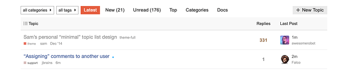](../../../assets/images/23552/eb179d903d1cf6d8e3cf6d010aeff5fdf78abe0a.png "Screen Shot 2021-08-13 at 10.13.33 AM")

I don’t see any console errors on your site… did you edit the theme at all? if you install another copy of it does it have the same issue?
  *[PR]: Pull Request

---

### Post #346 by [thisnthat](../../users/thisnthat.md)
*Posted: 2021-08-13 15:06*

A quick look shows that [REFACTOR: Update structure, fix for ember-cli (#5) · discourse/discourse-simple-theme@0482a6c · GitHub](https://github.com/discourse/discourse-simple-theme/commit/0482a6c24d49e5d35f338038f6fb1ac443e15709) may have changed the way that page is formatted on Aug 10th.
  *[PR]: Pull Request

---

### Post #347 by [awesomerobot](../../users/awesomerobot.md)
*Posted: 2021-08-13 15:12*

That refactored the theme structure, and fixed an issue with our ember-cli updates, but shouldn’t have changed anything about the layout (it’s also working as expected on our theme creator site: [Discourse Theme Creator](https://theme-creator.discourse.org/theme/awesomerobot/simple)).
  *[PR]: Pull Request

---

### Post #348 by [thisnthat](../../users/thisnthat.md)
*Posted: 2021-08-13 15:28*

I found the problem, looks like those changes conflicted with a component that was in place which resulted int he changes to the displayed format.

Thank you
  *[PR]: Pull Request

---

### Post #349 by [Frully](../../users/Frully.md)
*Posted: 2021-11-21 23:56*

I’m running into a similar issue with most recent update - updated everything at once so not sure if it was theme, another component, or discourse itself:  
Discourse 2.8.0.beta8  
10a57825c8

Theme updated November 21 (can’t find version number) ‘up to date’.

Now, read, and unread all show as ‘unread’ secondary blue on desktop, but work correctly on mobile:  
Desktop:  

[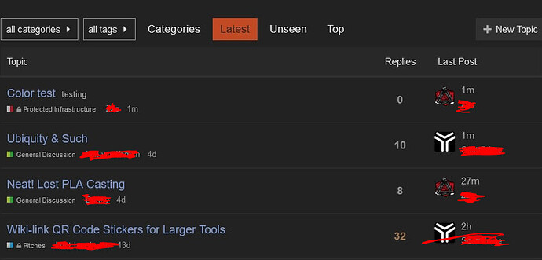](../../../assets/images/23552/598affe5e9d58c996e71caad03137580d654d1b5.jpeg "image")

Mobile:  

[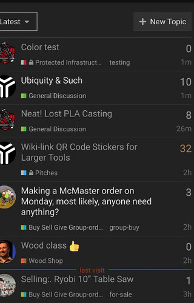](../../../assets/images/23552/b694e39fd8c5fea905d1c71cb2d1a60641a4fabe.jpeg "image")

Same on various iterations of light, medium, dark schemes that we’ve made…the ‘categories+latest’ main page 2 column layout seems correct with brighter bold unread, and muted unbold read topics; but the ‘latest’ listing is all bold tertiary all the time.

[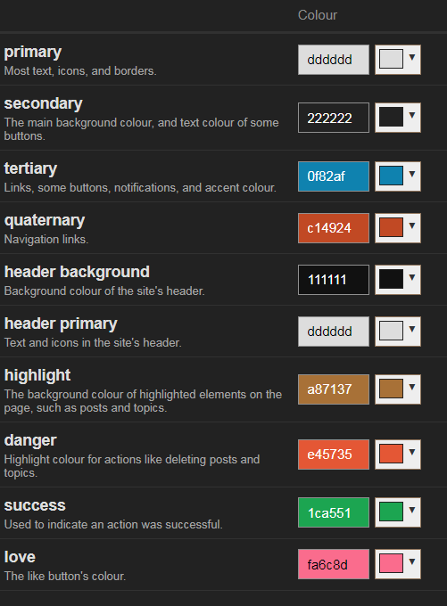](../../../assets/images/23552/8bb9d916681234fa36138567eb9827586bf12fe0.png "image")

Using preview on other themes (default, and others) seems to show the correct behaviour.  

[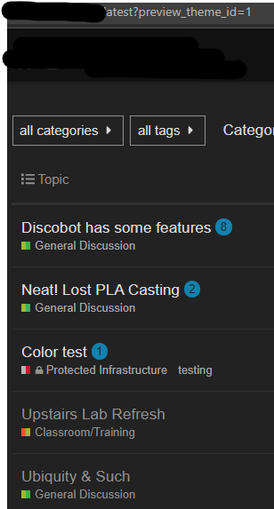](../../../assets/images/23552/cdb9c17f4c54e43b0b510c95e150740a1a4fcf40.png "image")
  *[PR]: Pull Request

---

### Post #350 by [Alex_P](../../users/Alex_P.md)
*Posted: 2021-12-25 22:30*

Did you solve this issue?

The same for me, everything is shown like unread, other themes work fine.
  *[PR]: Pull Request

---

### Post #351 by [Alex_P](../../users/Alex_P.md)
*Posted: 2021-12-26 10:38*

Looking into DevTools, seems like this rule from `app/assets/stylesheets/common/base/_topic-list.scss` somehow disappears when using this theme

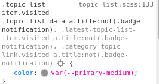
  *[PR]: Pull Request

---

### Post #352 by [Alex_P](../../users/Alex_P.md)
*Posted: 2021-12-26 15:01*

ah, looks like `topic-list-data` is missing here.

[github.com/discourse/discourse-simple-theme](https://github.com/discourse/discourse-simple-theme/blob/0482a6c24d49e5d35f338038f6fb1ac443e15709/javascripts/discourse/templates/list/topic-list-item.hbr#L11)

#### [javascripts/discourse/templates/list/topic-list-item.hbr](https://github.com/discourse/discourse-simple-theme/blob/0482a6c24d49e5d35f338038f6fb1ac443e15709/javascripts/discourse/templates/list/topic-list-item.hbr#L11)

[`0482a6c24`](https://github.com/discourse/discourse-simple-theme/blob/0482a6c24d49e5d35f338038f6fb1ac443e15709/javascripts/discourse/templates/list/topic-list-item.hbr#L11)
    
    
          
    
    
              
        1. {{~raw-plugin-outlet name="topic-list-before-columns"}}
    
              
        2. 
              
        3. {{#if bulkSelectEnabled}}
    
              
        4.   <td class="bulk-select">
    
              
        5.     <label for="bulk-select-{{topic.id}}">
    
              
        6.       <input type="checkbox" class="bulk-select" id="bulk-select-{{topic.id}}">
    
              
        7.     </label>
    
              
        8.   </td>
    
              
        9. {{/if}}
    
              
        10. 
              
        11. <td class='main-link clearfix'>
    
              
        12.   {{~raw-plugin-outlet name="topic-list-before-status"}}
    
              
        13.   {{raw "topic-status" topic=topic}}
    
              
        14.   {{~topic-link topic class="raw-link raw-topic-link"}}
    
              
        15.   {{~#if showTopicPostBadges}}
    
              
        16.     {{~raw "topic-post-badges" unreadPosts=topic.unread_posts unseen=topic.unseen url=topic.lastUnreadUrl newDotText=newDotText}}
    
              
        17.   {{~/if}}
    
              
        18.   {{discourse-tags topic mode="list" tagsForUser=tagsForUser}}
    
              
        19.   {{#if expandPinned}}
    
              
        20.     {{raw "list/topic-excerpt" topic=topic}}
    
              
        21.   {{/if}}
    
          
    
        

Submitted PR.

[github.com/discourse/discourse-simple-theme](../../../assets/images/23552/728ae6b9f2fd9343a99a59323e0c062c62356295_2_1035x267.jpg)

####  [add topic-list-data class](../../../assets/images/23552/728ae6b9f2fd9343a99a59323e0c062c62356295_2_1035x267.jpg)

`main` ← `programmersforum-reborn:fix-missing-class`

closed 02:42PM - 29 Dec 21 UTC

[  AlexP11223 ](https://github.com/AlexP11223)

[ +1 -1 ](https://github.com/discourse/discourse-simple-theme/pull/7/files)

without it the CSS rule for visited topics is not applied https://meta.discours[…](../../../assets/images/23552/728ae6b9f2fd9343a99a59323e0c062c62356295_2_1035x267.jpg)e.org/t/sams-personal-minimal-topic-list-design/23552/351?u=alex_p
  *[PR]: Pull Request

---

### Post #353 by [Frully](../../users/Frully.md)
*Posted: 2021-12-27 14:49*

I had not - thank you very much for looking into this 🙂
  *[PR]: Pull Request

---

### Post #354 by [Alex_P](../../users/Alex_P.md)
*Posted: 2021-12-29 14:40*

Seems to be fixed in [DEV: Prep for pre-topic-list-refactor (#6) · discourse/discourse-simple-theme@b305d81 · GitHub](https://github.com/discourse/discourse-simple-theme/commit/b305d81431520e6964d92d2606579db83c640e06)
  *[PR]: Pull Request

---

### Post #355 by [Frully](../../users/Frully.md)
*Posted: 2021-12-30 00:47*

verified the pr was committed in my install - works like a charm 🙂
  *[PR]: Pull Request

---

### Post #356 by [rahim123](../../users/rahim123.md)
*Posted: 2023-02-01 04:36*

Hi, thanks very much for this traditional theme, it’s much closer to what my migrated legacy forum users would expect!

There appears to be a small bug in the “Suggested Topics” list when clicking on the avatar of the last post user; the user profile briefly appears for a few milliseconds and then disappears.
  *[PR]: Pull Request

---

### Post #357 by [rahim123](../../users/rahim123.md)
*Posted: 2023-02-04 18:04*

Hi there, another bug is that the cog button doesn’t appear for bulk actions with Sam’s Simple Theme (it does with the Discourse default one):

[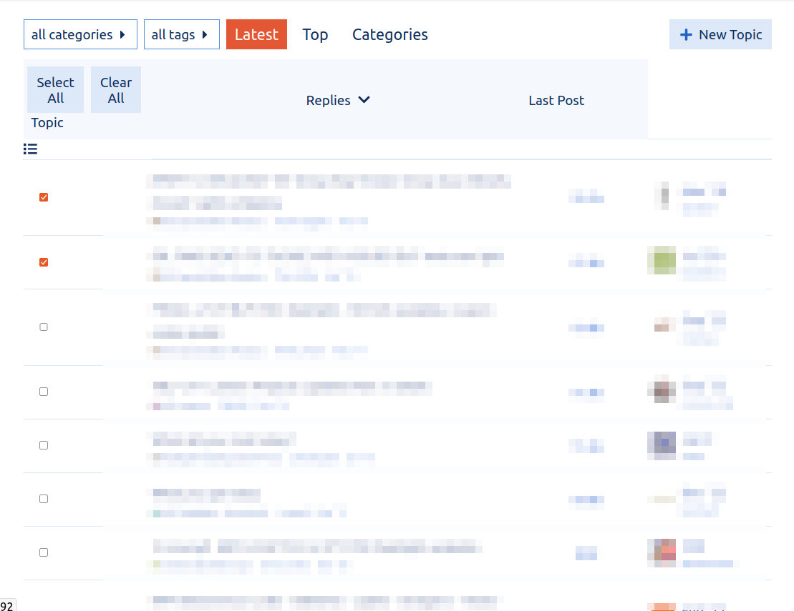](../../../assets/images/23552/e08fbcbee8228f0dde48bf65cd9568a2b1f0e322.png "Screenshot from 2023-02-04 13-01-22")
  *[PR]: Pull Request

---

### Post #359 by [rahim123](../../users/rahim123.md)
*Posted: 2023-03-10 22:26*

Hi there, are pull requests being accepted for this theme? I submitted a PR a few days ago with a simple 2 line fix for a fairly significant bug that is breaking links to user profiles.
  *[PR]: Pull Request

---

### Post #361 by [jordan.vidrine](../../users/jordan.vidrine.md)
*Posted: 2023-03-20 11:53*

This PR has been merged. Thank you for the fix 👍
  *[PR]: Pull Request

---

### Post #364 by [rahim123](../../users/rahim123.md)
*Posted: 2023-11-01 23:42*

Hi there, one of the biggest improvements in this theme is the elimination of the `posters` column from topic lists, and it simply shows the original poster and the latest poster. However, this paradigm falls apart in the list of private message topics. When the user is both the starter and the latest poster in a PM topic there is no indication of who the other recipient(s) is/are. So it feels like specifically for the PM topics list the default Discourse theme’s `posters` avatars column needs to be used. Is there a clean way for me to add it back with a theme component until this gets fixed in the official code of Sam’s Simple Theme? Thanks!
  *[PR]: Pull Request

---

### Post #365 by [rahim123](../../users/rahim123.md)
*Posted: 2023-11-20 03:41*

I’m pretty sure that this is a new regression, in desktop browser mode the latest poster avatar pops up partially off-screen:

[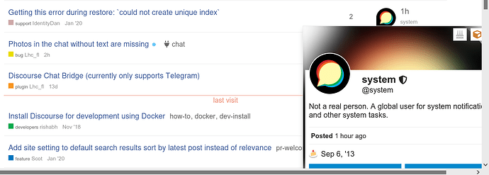](../../../assets/images/23552/c37a822086ccef5c26815279bdbab100eb32bce2.png "image")
  *[PR]: Pull Request

---

### Post #366 by [Arkshine](../../users/Arkshine.md)
*Posted: 2023-11-20 05:16*

Hm, I’m unable to reproduce 

As a side note, this user card modal is from this theme component: [Usercard Redesign Experiment](https://meta.discourse.org/t/usercard-redesign-experiment/254353)
  *[PR]: Pull Request

---

### Post #367 by [rahim123](../../users/rahim123.md)
*Posted: 2023-11-20 13:27*

[@Arkshine](/u/arkshine) Hi, appreciate the reply. I think it happens when the zoom level is higher. I first noticed the issue on Firefox, where I have the default zoom set to 110%, and also `layout.css.devPixelsPerPx` set to `1.1` . But I can also reproduce it with Chromium’s default settings by just zooming in a bit (it appears to only happen when the browser is maximized):

[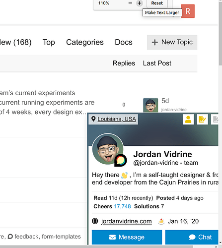](../../../assets/images/23552/b3ff40f3e4fad84875fd01e7d7de8f698367e1a5.png "image")

 Arkshine:

> As a side note, this user card modal is from this theme component: [Usercard Redesign Experiment ](https://meta.discourse.org/t/usercard-redesign-experiment/254353)

Ah, ok. I think I’ll cross-post this issue there. It seems like the usercard component should take care of its own CSS to avoid appearing off-screen. But the issue is complicated by Sam’s Simple Theme, which has the user card closer to the right edge.
  *[PR]: Pull Request

---

[← Previous](23552-page-6.md) | **Page 7 of 8** | [Next →](23552-page-8.md)
