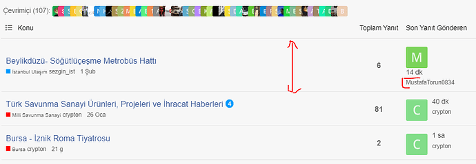
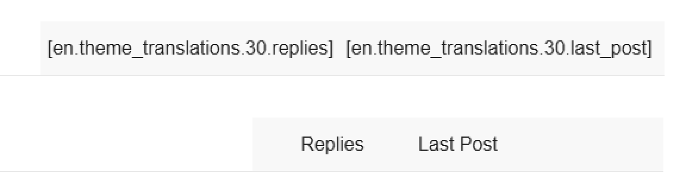
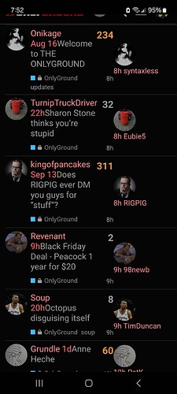
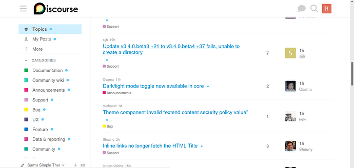
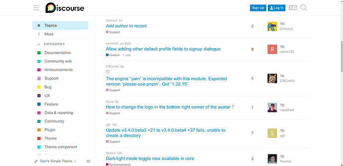

[🏠 Home](../../index.md) | [📋 Latest](../../latest/index.md) | [🔥 Top](../../top/replies/index.md) | [👥 Users](../../users/index.md)

[Home](../../index.md) » [Theme](../../c/theme/index.md) » Sam's Simple Theme

---

# Sam's Simple Theme (Page 8 of 8)

> **Category:** Theme
> **Author:** Ahmed26
> **Created:** 2014-12-31 03:20

[← Previous](23552-page-7.md) | **Page 8 of 8** | Next →

---

### Post #368 by [Ahmed26](../../users/Ahmed26.md)
*Posted: 2024-03-20 21:11*

How can you make avatars square in mobile view?
  *[PR]: Pull Request

---

### Post #369 by [Arkshine](../../users/Arkshine.md)
*Posted: 2024-03-20 21:26*

You can add the following CSS in a new theme component:
    
    
    img.avatar {
      border-radius: 3px;
    }
    

  

  *[PR]: Pull Request

---

### Post #370 by [Ahmed26](../../users/Ahmed26.md)
*Posted: 2024-03-21 09:47*

When the username is long, the image is distorted. How can we find a solution to this?  

  *[PR]: Pull Request

---

### Post #371 by [Ahmed26](../../users/Ahmed26.md)
*Posted: 2024-03-21 14:22*

Adjustment button in frame not visible  

  *[PR]: Pull Request

---

### Post #372 by [unknown_error](../../users/unknown_error.md)
*Posted: 2024-10-23 20:45*

It looks like the category headers for this theme are missing translations:

Possibly related to [DEV: Fix locale file location (#19) · discourse/discourse-simple-theme@62ca149 · GitHub](https://github.com/discourse/discourse-simple-theme/commit/62ca1494bd68c2a40eaac1603aa59412d6057792)?
  *[PR]: Pull Request

---

### Post #373 by [Jaypes](../../users/Jaypes.md)
*Posted: 2024-11-01 04:38*

I have just updated this on my self hosted and noticed the same  

  *[PR]: Pull Request

---

### Post #374 by [gaoxue](../../users/gaoxue.md)
*Posted: 2024-11-01 05:48*

very helpful!@_@
  *[PR]: Pull Request

---

### Post #375 by [scog](../../users/scog.md)
*Posted: 2024-11-06 17:05*

Can also confirm the latest update does not contain appropriate theme translations.

  *[PR]: Pull Request

---

### Post #376 by [bryce](../../users/bryce.md)
*Posted: 2024-11-07 03:54*

Thanks for the reports, [@Jaypes](/u/jaypes) and [@scog](/u/scog). A fix was merged earlier and I’ve just updated the theme. Looks like it worked!

")
  *[PR]: Pull Request

---

### Post #377 by [Jaypes](../../users/Jaypes.md)
*Posted: 2024-11-07 04:10*

I can confirm this has been fixed in the latest update. Many thanks!
  *[PR]: Pull Request

---

### Post #378 by [Onikage](../../users/Onikage.md)
*Posted: 2024-12-02 04:15*

The latest update seems to have caused a lot of clutter on mobile.  
I don’t believe I have any components which would cause this to happen.

Anyone else encounter the same?  

  *[PR]: Pull Request

---

### Post #380 by [kokmok](../../users/kokmok.md)
*Posted: 2024-12-02 09:13*

Same here. As I remember, the theme was not applied to the mobile version.
  *[PR]: Pull Request

---

### Post #381 by [awesomerobot](../../users/awesomerobot.md)
*Posted: 2024-12-02 15:33*

Thanks for reporting it, this should be fixed now if you update again.
  *[PR]: Pull Request

---

### Post #382 by [Onikage](../../users/Onikage.md)
*Posted: 2024-12-03 02:19*

Awesome - thank you very much!
  *[PR]: Pull Request

---

### Post #383 by [rahim123](../../users/rahim123.md)
*Posted: 2025-02-07 14:03*

Hi there, with the upgrade to 3.4.0 unfortunately Sam’s Simple Theme is a bit of a mess:

Is moving the `op-data` to the top an intentional change? It seemed much more compact and space-efficient the way it was before.

I should also just mention that I am very thankful for Sam’s Simple Theme. When I migrated my large forum to Discourse my users absolutely _hated_ the default Discourse theme, but they found Sam’s Simple Theme layout much more acceptable, so thanks for creating and maintaining it, it’s a key component for me to make Discourse viable.
  *[PR]: Pull Request

---

### Post #384 by [awesomerobot](../../users/awesomerobot.md)
*Posted: 2025-02-13 19:23*

Thanks for the feedback! I’ve adjusted this to put the metadata on the same line again and fixed the icon wrapping issues
  *[PR]: Pull Request

---

### Post #385 by [rahim123](../../users/rahim123.md)
*Posted: 2025-02-14 00:20*

Awesome [@awesomerobot](/u/awesomerobot) , thanks so much!  
I don’t suppose there’s any way the fix could be backported to the `stable` branch? I would just apply your CSS changes to a custom theme component, but I see that there are also changes to `original-post-date.gjs` .
  *[PR]: Pull Request

---

### Post #386 by [rahim123](../../users/rahim123.md)
*Posted: 2025-02-17 18:34*

I don’t quite understand why I’m not getting the updated version from the `main` branch of [GitHub - discourse/discourse-simple-theme: Sam's simple discourse theme](http://github.com/discourse/discourse-simple-theme). The theme updater hasn’t found any new versions and I still have the layout issue.

[github.com/discourse/discourse-simple-theme](https://github.com/discourse/discourse-simple-theme/commit/ec851944f34ec35ee3e2f8041371648bc1ad0dcd)

####  [DEV: Pin version for Discourse <3.5.0.beta1-dev (#28)](https://github.com/discourse/discourse-simple-theme/commit/ec851944f34ec35ee3e2f8041371648bc1ad0dcd)

committed 06:48PM - 05 Feb 25 UTC

[  davidtaylorhq ](https://github.com/davidtaylorhq)

[ +1 -0 ](https://github.com/discourse/discourse-simple-theme/commit/ec851944f34ec35ee3e2f8041371648bc1ad0dcd)

Check, I’m on Discourse [v3.4.0 +4](https://github.com/discourse/discourse/commit/cbe0dca792a3ae789ebd69ba2f8b9ac333cab026)

[github.com/discourse/discourse-simple-theme](https://github.com/discourse/discourse-simple-theme/commit/a61b5da56ad20a5e7e8ffdc0765acf7520263c22)

####  [DEV: Bump dependencies and fix linting (#29)](https://github.com/discourse/discourse-simple-theme/commit/a61b5da56ad20a5e7e8ffdc0765acf7520263c22)

committed 05:50PM - 06 Feb 25 UTC

[  davidtaylorhq ](https://github.com/davidtaylorhq)

[ +744 -588 ](https://github.com/discourse/discourse-simple-theme/commit/a61b5da56ad20a5e7e8ffdc0765acf7520263c22)

Is it a dependency issue?
  *[PR]: Pull Request

---

### Post #387 by [awesomerobot](../../users/awesomerobot.md)
*Posted: 2025-02-17 18:41*

 rahim123:

> Check, I’m on Discourse [v3.4.0 +4](https://github.com/discourse/discourse/commit/cbe0dca792a3ae789ebd69ba2f8b9ac333cab026)

Versions less than 3.5.0.beta1-dev are pinned to a previous commit, because commits after it are incompatible with previous versions. So unfortunately you won’t get new commits until you update Discourse.
  *[PR]: Pull Request

---

[← Previous](23552-page-7.md) | **Page 8 of 8** | Next →
