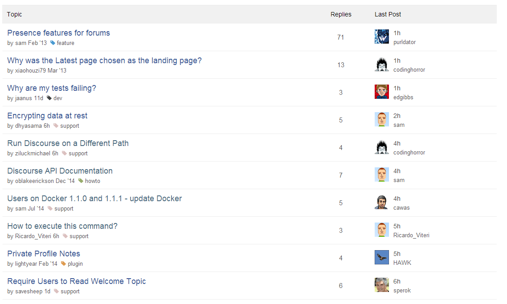
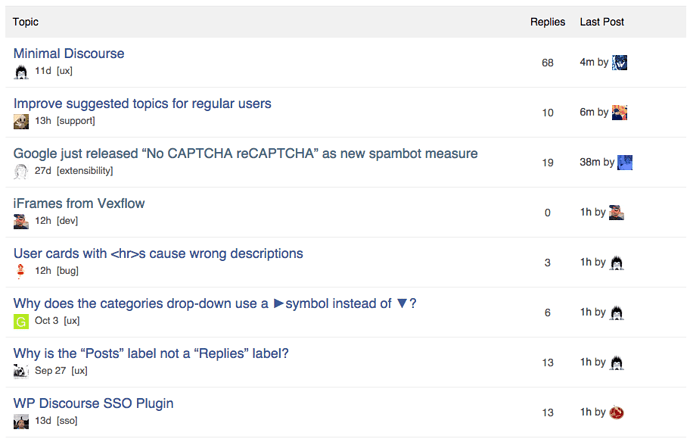
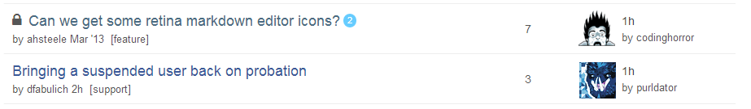
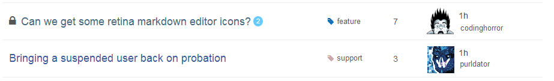
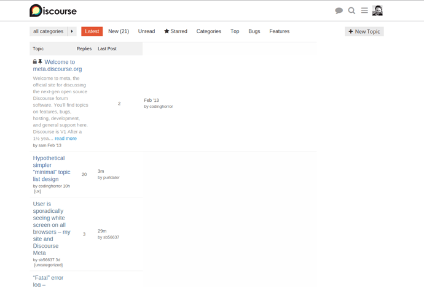

[🏠 Home](../../index.md) | [📋 Latest](../../latest/index.md) | [🔥 Top](../../top/replies/index.md) | [👥 Users](../../users/index.md)

[Home](../../index.md) » [Theme](../../c/theme/index.md) » Sam's Simple Theme

---

# Sam's Simple Theme (Page 1 of 8)

> **Category:** Theme
> **Author:** Discourse
> **Created:** 2014-12-31 03:20

← Previous | **Page 1 of 8** | [Next →](23552-page-2.md)

---

### Post #1 by [Discourse](../../users/Discourse.md)
*Posted: 2014-12-30 01:40*

|  |   
---|---|---  
 | **Summary** |  **Sam’s Simple Theme** creates a “minimal” topic list design  
👓 | **Preview** | [Preview on Discourse Theme Creator](https://discourse.theme-creator.io/theme/Discourse/sams-simple-theme)  
🛠️ | **Repository Link** | <https://github.com/discourse/discourse-simple-theme>  
📖 | **New to Discourse Themes?** | [Beginner’s guide to using Discourse Themes](https://meta.discourse.org/t/beginners-guide-to-using-discourse-themes/91966)  
  
Install this theme

>  As this is an [official](/tag/official) theme maintained by the Discourse team, [Support](/c/support/6) issues, [Bug](/c/bug/1) reports, [UX](/c/ux/9) suggestions, and requests for [Dev](/c/dev/7) advice can be made in the respective categories here on Meta, and tagged with the appropriate theme tag. Click on a link below to get one started. 👍
> 
> ` [❓ **Support**](https://meta.discourse.org/new-topic?category_id=6&tags=sams-simple-theme "Ask for support on configuring and using Sam's Simple Theme") ` ` [🐛 **Bug**](https://meta.discourse.org/new-topic?category_id=1&tags=sams-simple-theme "A bug report means something is broken, preventing normal/typical use of the theme") ` ` [👀 **UX**](https://meta.discourse.org/new-topic?category_id=9&tags=sams-simple-theme "Discussion about the user interface of Sam's SimpleTheme, and how features are presented \(including language and UI elements\)") ` ` [ **Dev**](https://meta.discourse.org/new-topic?category_id=7&tags=sams-simple-theme "Advice on how to customise this theme for your site")`

###  Features

I have been thinking about this a lot, and decided to take a shot at a “minimal” front page customisation.

To select this theme here on Meta head to your profile: <https://meta.discourse.org/my/preferences> and select the theme. (remember to click save)

Here is a list of things I did

  * Remove Views
  * Remove Star
  * Get rid of avatar images use names instead
  * De-emphasize categories
  * Use more “traditional color” for topic link
  * Use replies instead of posts

Some conclusions from my experiment:

  * I think “Replies” is much more natural than column name than “Posts”, technically its simply “Posts - 1”, however its a far clearer concept to convey and it _correctly_ calls attention to Topics with only 1 posts, cause 0 is a number that stands out.

  * Long term I think we should offer a “less loud” category style, the current rainbow of colors puts categories in a far more important bucket than the content, categorization feels secondary to title to me.

  * I feel the sea of avatars is a bit loud, not recommending changing it right away but I think it does add a lot of busyness to our front page

  * For me the more traditional topic title colors work better, I find they catch the eye and call attention to the title nicely

  * The simplified design is definitely a lot more “boring”, but I find working through very long lists easier with it.

  * I am really not sure about zebra striping anymore, I think its actually causing more harm than good, the subtle line works way better in my simplified design

  * Star should go, its just adding noise for almost no gain

  * I am not going to get into an “ago” argument again, but for the simplified design I would have preferred “1 hour ago” as opposed to “1h” the extra verbiage would have added clarity and there is room above the name.

I don’t think the “simple design” is **better** than our current design, I just think it is different, and perhaps more familiar to existing forum users. It packs less information.

Interestingly the “simple design” does not work at all any wider than 850px or so, which calls out to a need for some sort of auxiliary column to complement it (with faq or shoutbox or ads or whatever).

A very cool thing is that this is all achieved using the customize menu.

###  PRE-REQ

Select category style bullet in site settings.

###  Settings

Translation | Default  
---|---  
replies | Replies  
last_post | Last Post  
likes | Likes  
  
  

>  **Hosted by us?** Themes are available to use on our Standard, Business, and Enterprise plans.

> Last edited by [@JammyDodger](/u/jammydodger) 2024-06-17T13:37:19Z
> 
> Check documentPerform check on document: 
  *[PR]: Pull Request

---

### Post #2 by [alefattorini](../../users/alefattorini.md)
*Posted: 2014-12-30 10:45*

Great work [@sam](/u/sam) sounds good! I really like it
  *[PR]: Pull Request

---

### Post #3 by [purldator](../../users/purldator.md)
*Posted: 2014-12-31 00:17*

I really like the changes. You went back to some sort of square one, but it helps to see it in a minimal way so things can be re-added but carefully considered.

My suggestions would be to color the [categories] with css as the same color/style for the drop down in the upper left so there’s visual cues with the associated category colors already established. For the names, maybe we could take a page from the OP meta bar and style it in a similar fashion so avatars still can be seen, since most use the avatar as a quicker visual cue than text. Like this:

That way there’s only _two avatars_ to each topic list item. _The OP and the last reply._ Instead of what we have now which includes five avatars instead of just two. Not to mention the OP meta bar already has this information (who has participated in the discussion so far).
  *[PR]: Pull Request

---

### Post #4 by [codinghorror](../../users/codinghorror.md)
*Posted: 2014-12-31 00:48*

It’s good, but you’ve gone from being avatar heavy to being text heavy in kind of a nonsensical way. People process images (particularly of faces) much faster than names so I think most of all I’d recommend replacing the user names with images, would be less text to process.
  *[PR]: Pull Request

---

### Post #5 by [purldator](../../users/purldator.md)
*Posted: 2014-12-31 01:25*

> People process images (particularly of faces) much faster than names so I think most of all I’d recommend replacing the user names with images, would be less text to process.

Yes, that is the gist of [my reply](https://meta.discourse.org/t/minimal-discourse/23288/67), I am glad you agree. Same for category colors. I think those should come back as well for the same reason. Otherwise, I like [@sam](/u/sam)’s edits. It’s a nice re-start to add things as absolutely necessary.
  *[PR]: Pull Request

---

### Post #6 by [zogstrip](../../users/zogstrip.md)
*Posted: 2014-12-31 01:31*

> It’s good, but you’ve gone from being avatar heavy to being text heavy in kind of a nonsensical way. People process images (particularly of faces) much faster than names so I think most of all I’d recommend replacing the user names with images, would be less text to process.

Here’s a [quick try](https://meta.discourse.org/?preview-style=ab0d551a-aa4b-4590-82b2-f13859205808) at adding avatars 

  *[PR]: Pull Request

---

### Post #7 by [sam](../../users/sam.md)
*Posted: 2014-12-31 01:34*

I would retain the usernames here, not entirely sure I want the avatar for creator, but regardless usernames should stay.
  *[PR]: Pull Request

---

### Post #8 by [purldator](../../users/purldator.md)
*Posted: 2014-12-31 01:42*

For what it’s worth, I used [@sam](/u/sam)’s screenshot and did a little shopping:

You can also style the OP meta the same way as another column next to that.
  *[PR]: Pull Request

---

### Post #9 by [codinghorror](../../users/codinghorror.md)
*Posted: 2014-12-31 02:17*

I personally, I much prefer the avatars to usernames – if you are shooting for minimalism that is the way. Also, the word **by** does not need to be repeated over and over on the page, and can be removed.
  *[PR]: Pull Request

---

### Post #10 by [mcwumbly](../../users/mcwumbly.md)
*Posted: 2014-12-31 02:33*

Taking off from [@purldator](/u/purldator)’s mockup:

  * A little color for the categories via an fa-tag icon.
  * Remove OP name and timestamp from under the topic titles so they are easier to scan

  *[PR]: Pull Request

---

### Post #11 by [sam](../../users/sam.md)
*Posted: 2014-12-31 02:43*

I like what you did with categories, but removing op is a step too far imo, also avatar seems a bit big to me.
  *[PR]: Pull Request

---

### Post #12 by [Mittineague](../../users/Mittineague.md)
*Posted: 2014-12-31 02:54*

To interject for some clarification, we are talking _optional_ CSS etc. here and _not_ changes to the Core?
  *[PR]: Pull Request

---

### Post #13 by [sam](../../users/sam.md)
*Posted: 2014-12-31 02:59*

> Not that we can’t have both, eventually

To me a huge goal here is to make stuff more extensible, ultimately I do not think the “simple” design should replace what we have now. I do think we need to cull out stars and quieten down categories in our default view, but ultimately there are different types of consumers for Discourse with different needs.

As you simplify, you lose information, which may be desirable to some communities and not desirable for others.

If a community say moved from years on phpbb or what not to Discourse it may make sense for them to use a “simple” design. If a company has a need for an aux column it may make sense to use a “simple” design. Long term I hope the “wizard” you use to setup Discourse allows you to select between a few themes that cater to different groups.
  *[PR]: Pull Request

---

### Post #14 by [purldator](../../users/purldator.md)
*Posted: 2014-12-31 03:03*

> I like what you did with categories[/quote]
> 
> For me personally, I’d rather have the “button” styling back. But that’s easily fixable with custom CSS.
>
>> but removing op is a step too far imo
> 
> Agreed. That is why I mentioned to style the OP meta info the same as the last reply in my markup example from your screenshot.
> 
> [quote] also avatar seems a bit big to me.

That’s my doing and mostly the shop’ was meant as a proof of concept, not so much a solid final draft. I’d be okay any which way the avatar’s size may become in the end.
  *[PR]: Pull Request

---

### Post #15 by [sam](../../users/sam.md)
*Posted: 2014-12-31 03:03*

Its a mish-mash topic now, which is kind of confusing to everyone.

The default core changes being discussed are:

Merge star and bookmark, do away with stars in topic list  
Replies vs. Posts ([also here](https://meta.discourse.org/t/why-is-the-posts-label-not-a-replies-label/20524/15))  
Quieten down categories  
Color choices

But ultimately there are 2 distinct views being discussed here,

  1. A minimal view
  2. Our default view

  *[PR]: Pull Request

---

### Post #16 by [sam](../../users/sam.md)
*Posted: 2014-12-31 03:06*

> But that’s easily fixable with custom CSS.

Thing is that it is not, colors are hardcoded into a style tag on an element, styling categories now is very hard and requires patching of discourse core.
  *[PR]: Pull Request

---

### Post #18 by [purldator](../../users/purldator.md)
*Posted: 2014-12-31 03:21*

Interesting, didn’t know that. Hmmn.

I do hope there might be a howto in the near future on ways to go about editing the theme’s hardcode ‘gracefully’ without breaking it in the future with an update to the core. I think if users are given a push in the right direction on how to hack the theme to their liking, then there might be less of a brouhaha with people requesting the removal or addition of elements on the current ui, such as was the original topic at hand. (And if there is a definitive howto on this, I need to find it!)

EDIT: Just noticed [@abarker](/u/abarker)’s reply in the original thread, which is stating the same. (requoting here as ref for this new thread)

> I think that the focus should be shifted from “how should we change the UI?” to “let’s make the UI easier to customize”. Back when the Likes column was removed, there were a lot of complaints, and [@codinghorror](/u/codinghorror) and [@sam](/u/sam) promised that there would be a customization interface post-v1 so that the Likes column could be brought back, if desired. Work on that instead. Once that’s done, it will make this kind of thing arbitrary. Admins will be able to make these kind of decisions for their own sites, and topics like this will be pointless.
  *[PR]: Pull Request

---

### Post #19 by [tonninseteli](../../users/tonninseteli.md)
*Posted: 2014-12-31 12:00*

 purldator:

> I think that the focus should be shifted from “how should we change the UI?” to “let’s make the UI easier to customize”.

I second this too. Even though I understand and respect the goals behind discourse UI design, the looks are something there can never be a strong consensus on because Discourse is in my opinion already very refined and quite spot on.

While codinghorror sees the minimalistic view as less readable and prefers avatars over usernames, I personally think the small avatars are nothing but irritating noise, and some people might argue that avatars should not be used at all while others might want more and even bigger ones.

My professional opinion is, despite sounding shallow or giving the impression that “i’m not getting it”, these issues are effectively matters of taste, so making customization easier also brings the prime ideas of Discourse closer to both admins and users that are not yet comfortable with Discourse.
  *[PR]: Pull Request

---

### Post #20 by [anon21958287](../../users/anon21958287.md)
*Posted: 2014-12-31 12:44*

 sam:

> I feel the sea of avatars is a bit loud, not recommending changing it right away but I think it does add a lot of busyness to our front page

I think replacing them with names makes things just as busy, just in a different way. A wall of color looks better to my eyes than a wall of text.
  *[PR]: Pull Request

---

### Post #21 by [alefattorini](../../users/alefattorini.md)
*Posted: 2014-12-31 12:47*

 sam:

> . Long term I hope the “wizard” you use to setup Discourse allows you to select between a few themes that cater to different groups.

I do think this is a Great idea 😉 more more adaptable
  *[PR]: Pull Request

---

### Post #22 by [purldator](../../users/purldator.md)
*Posted: 2014-12-31 13:19*

 tonninseteli:

> so making customization easier also brings the prime ideas of Discourse closer to both admins and users that are not yet comfortable with Discourse.

**Spot. On.** This is why I haven’t deployed and mucked neck-deep in Discourse yet. I **really** want to use Discourse, but right now I feel that I am unable to make any subtle changes I need without having a problem down the line if I need to update my server’s instance.

The UI, as is, is great. I know [@codinghorror](/u/codinghorror) already mentioned that the default theme needs to be perfect since it’s going to be the _only_ theme for a lot of users. I also have seen that the devs are very passionate about some aspects of the ui and that changing them in the core is out of the question.

While yes, the Minimal Discourse edits proved a good point, I truly think only a few elements need to be removed. I specifically speak of the stars and the 5-avatar line in the topic listings. Everything else I think should stay and I think my little mock up from [@sam](/u/sam)’s initial screenshot with a bit of minor tweaking should replace that 5-avatar bar in each topic listing entry.. Maybe others might think differently about these opinions but as it is, there’s plenty of Discourse instances live on the net and I haven’t seen one instance where any other drastic changes were made that would suggest a certain ui feature is probably best to apply to core. The stars is one example of this. No one used the feature and many hid the stars with CSS. That’s been established.

I can also see that technical debt is trying to be avoided by making sure the default UI is solid. But I think this might be a case of paying too much attention to the proverbial bike shed. I experience this in traditional art as “knowing when to stop”. You keep looking at something on your drawing or painting and then go “well, damn, I see this mistake here…” and you keep doing that and picking out new things to change that were trivial in the long run. The original artwork becomes overworked and ruined. One could say the removal of the likes from the topic listings is one example of this.

As [@tonninseteli](/u/tonninseteli) said, this is now a case of personal tastes which can easily be solved by taking this final default ui and making it customizable. In fact, I can count on the latest topic listing a nice sizable sample of discussions that would be completely moot if easier theme/ui customization was available. Even some of my own threads are ui-related and could be solved with easier ui editing capabilities.

Any bugs in the existing ui elements should of course be handled. That I am not contesting.

Any kind of suggestions to cosmetically change the current ui that are not related to serious bugs should probably be deferred until more ui customization options are available.

I do wish to say I am grateful for all the dedication and determination from the devs and contributors and bug testers.
  *[PR]: Pull Request

---

### Post #23 by [rumpelsepp](../../users/rumpelsepp.md)
*Posted: 2014-12-31 13:24*

The initial mockup seems to be broken in Chrome.

The **new** tab works correctly.
  *[PR]: Pull Request

---

### Post #24 by [sam](../../users/sam.md)
*Posted: 2014-12-31 14:20*

An important few points here that seems to have been lost in “design discussion” is

  1. I made the front page faster (which is part of the goals for our next release)
  2. I demonstrated an involved customisation that people can muck around with **today** on Discourse instances
  3. I cleaned up said extension (look at edit history)  
a. automatic template registration  
b. view model for raw templates  
c. consistent style

My goal is to make Discourse faster and more extensible both of which are happening. It takes time to nail down extension points and styles but I quite like my oddball design for my own use and can keep probably keep it alive long term for my own use. Which makes Discourse better and more extensible for everyone.

You can muck with my template on your own instance and play with whatever designs you want, which is the point here.
  *[PR]: Pull Request

---

### Post #25 by [purldator](../../users/purldator.md)
*Posted: 2014-12-31 14:25*

 sam:

> I demonstrated an involved customisation that people can muck around with today on Discourse instances  
>  I cleaned up said extension (look at edit history) a. automatic template registration b. view model for raw templatesc. consistent style

I did not know that. I am glad to hear it was already finished or there’s at least a stable version of it ready for using. Thank you _very_ much and I do apologize if my reply above sounded demanding or nagging.
  *[PR]: Pull Request

---

### Post #26 by [sam](../../users/sam.md)
*Posted: 2014-12-31 14:38*

boomzilla:

> I think replacing them with names makes things just as busy, just in a different way. A wall of color looks better to my eyes than a wall of text.

I think the crux of the issue is that my perfect interface to Discourse is different to what others ideal interface is. We ship a “default” that is a “one size fits all” which [@codinghorror](/u/codinghorror) makes all the final calls on.

We ship _today_ a site customisation section that lets discourse admins adjust to taste.

We will never be able to get to a global agreement of what the “ideal” minimal design is, but I can, in theory, have a theme that I own and maintain that is my “ideal” minimal design.
  *[PR]: Pull Request

---

### Post #27 by [anon21958287](../../users/anon21958287.md)
*Posted: 2014-12-31 14:57*

 sam:

> I think the crux of the issue is that my perfect interface to Discourse is different to what others ideal interface is.

Totally agree. The reason I brought it up was that I’ve seen several cases where people asked for or implemented removing something that they thought made something too busy or ugly or whatever, and I’ve disagreed or thought it made things worse.

So I like to make sure I speak up when I see it happening. If nothing else, it’s a minor bump to possibly slow things down by considering that something isn’t a universally held whatever.
  *[PR]: Pull Request

---

### Post #28 by [tonninseteli](../../users/tonninseteli.md)
*Posted: 2014-12-31 15:17*

 sam:

> You can muck with my template on your own instance and play with whatever designs you want, which is the point here.

I forgot to mention that your minimal layout was a very welcome resource for me as I am looking into adjusting the stylesheets to somewhat similar results. I will most likely do so as soon as I have wrestled this flu, which is partly the reason for my derailing, sorry about that… 😷

As you said, the Custom CSS feature works just like it should and is very powerful. I would simply focus on documenting and commenting the CSS sources or writing a brief reference document instead of developing a wizard to customize site appearance.

I haven’t really been looking into the CSS for more than a few hours, but many of the trivial changes have been frustratingly difficult to track down and implement just by myself.

Edit: Visual finish of a forum might not be what discourse is about, but Discourse is still very appealing to several audiences that value, at least to some extent, appearance over perfect ergonomics, such as designers and online gaming communities, of which latter are the ones most likely in my opinion to benefit from Discourse’s features.
  *[PR]: Pull Request

---

### Post #29 by [codinghorror](../../users/codinghorror.md)
*Posted: 2014-12-31 19:24*

 purldator:

> I truly think only a few elements need to be removed. I specifically speak of the stars and the 5-avatar line in the topic listings

This is easily changeable with CSS. In fact it already happens, see what happens when you view a topic list with a portrait iPad or similar. (Or make your browser very narrow by dragging the edges with a mouse.) That is all CSS as well.

Stars are definitely coming out, in fact now that we finally made the call, I wonder what is taking [@sam](/u/sam) so long to remove them 😉
  *[PR]: Pull Request

---

### Post #30 by [Mittineague](../../users/Mittineague.md)
*Posted: 2014-12-31 19:31*

 codinghorror:

> I wonder what is taking [@sam](/u/sam) so long to remove them

I might be missing some, but this should do it.
    
    
    span.starred, a.star, button.star { display: none }
    
  *[PR]: Pull Request

---

### Post #31 by [purldator](../../users/purldator.md)
*Posted: 2014-12-31 21:29*

 codinghorror:

> Stars are definitely coming out, in fact now that we finally made the call, I wonder what is taking [@sam](/u/sam) so long to remove them

Glad to hear this! 😃 Though I admit I am not the type to do a display:none and wash my hands of it. When I do that, I am merely hiding it but the feature/function still exists in the core itself. I prefer things under the hood to reflect. This is a pedantic notion and I understand that. My finickiness will be the end of me one of these days.
  *[PR]: Pull Request

---

### Post #32 by [Mittineague](../../users/Mittineague.md)
*Posted: 2014-12-31 21:41*

My main concern was being able to easily find where one left off reading. But as that isn’t going to be a problem (because I know I’ll need to click the topic title) I’m fine with the decision.

[https://meta.discourse.org/t/minimal-discourse/23288/98?u=mittineague](https://meta.discourse.org/t/minimal-discourse/23288/98)

[https://meta.discourse.org/t/minimal-discourse/23288/99?u=mittineague](https://meta.discourse.org/t/minimal-discourse/23288/99)
  *[PR]: Pull Request

---

### Post #33 by [tomportante](../../users/tomportante.md)
*Posted: 2014-12-31 23:17*

One of the obvious truths I was reminded of - years ago as I watched a child go through a school system - is that different people learn stuff differently. It was a lesson useful years later to creating Powerpoint slides: some like pure text, some appreciate diagrams, and others like Steve-Jobs-esque evocative backgrounds with few words. My bias? I like this particular minimalist look because it helps me get work done more quickly: I get the names for topics, whether there’s been any response, and the poster’s (replier’s) names. For me, it’s the important information I need to process what’s happening and judge what to do next – without a string of visually distracting avatars.
  *[PR]: Pull Request

---

### Post #34 by [JBert](../../users/JBert.md)
*Posted: 2015-01-01 12:16*

 sam:

> Star should go, its just adding noise for almost no gain

 sam:

> The default core changes being discussed are:
> 
> Merge star and bookmark, do away with stars in topic list

This is disingenuous, it completely burries the functionality. I also wonder how this would alter the topic view, as right now you can click the star in the title and get the current topic starred.

Compare this to GMail: when they added the “Important” marker, they added it back, front and center; each time it can be clicked to toggle the state. They even added a “Mark as (not) important” in the “e-mail thread actions” menu so that it would be more discoverable.

With this new design, it seems you would need to click the topic (and read some posts if there are any new unread ones because AFAICT you can’t go straight to #1 from the topic list), use the post counter to go to “Top” and bookmark that first post. This does make it feel like jumping through hoops…
  *[PR]: Pull Request

---

### Post #35 by [JSey](../../users/JSey.md)
*Posted: 2015-01-01 12:51*

[@sam](/u/sam), is there anything I have to add besides the CSS and HTML header?

I wanted to fiddle around with your code, but when I try, the only thing I get is this error in the console:
    
    
    Error: Template named "list/topic_list_item" already exists.
  *[PR]: Pull Request

---

### Post #36 by [sam](../../users/sam.md)
*Posted: 2015-01-03 09:41*

You got to be running latest …
  *[PR]: Pull Request

---

### Post #37 by [vulkanino](../../users/vulkanino.md)
*Posted: 2015-01-03 14:30*

 sam:

> Here is a list of things I did

  1. Remove Views  
Agreed

  2. Remove Star  
Agreed. Remove the lock and the pin also?

  3. Get rid of avatar images use names instead  
I disagree. Avatars are super fast to “read”.

  4. De-emphasize categories  
Agreed.

  5. Use more “traditional color” for topic link  
Agreed.

  6. Use replies instead of posts  
Agreed.

Also you’ve removed the zebra stripes and I do agree.
  *[PR]: Pull Request

---

### Post #38 by [JSey](../../users/JSey.md)
*Posted: 2015-01-03 18:40*

 sam:

> You got to be running latest …

Great - works like a charm. This helps greatly to fiddle around with the default template - without having to dig into the built-in handlebar templates! I really feel like this should ship with Discourse by default…

Is there any overview over the hooks you can use or overwrite to create your own template like this?
  *[PR]: Pull Request

---

### Post #39 by [loopback0](../../users/loopback0.md)
*Posted: 2015-01-03 21:30*

 sam:

> Remove Views

No. These are useful, with maybe the exception of Top. They represent different things which are useful to have split out.

 sam:

> Remove Star

I’d rather this didn’t happen as being able to track if something is both starred and unread or new is useful. Maybe have a poll, see who agrees across the customer base?

 sam:

> Get rid of avatar images use names instead

Please don’t. Even _over there_ where avatars change more frequently, it’s a much easier way of quickly seeing who the top contributors (and OP/LP) are without worrying about it. This is useful to me. TLDR on this and the next point - images/colours are easier to distinguish at a glance than words.

 sam:

> De-emphasize categories

The colours of the categories helps split them out without paying any real attention to the text of the label after a while. Again, I find this useful.

 sam:

> Use replies instead of posts

1 post vs 0 replies just seems like semantics to me. Maybe this makes a difference to some, worth a poll?

  
There are actually somethings that Discourse gets right compared to other forum software, and some of them are listed here as candidates for removal. Please, please, please either leave them be and let people who don't want them remove them with CSS, or make them admin options on a per-site basis. Don't just make them disappear.
  *[PR]: Pull Request

---

### Post #40 by [SneakySly](../../users/SneakySly.md)
*Posted: 2015-01-03 21:54*

 sam:

> I do think we need to cull out stars

Yes please! Stars have been pointless from the start.
  *[PR]: Pull Request

---

### Post #41 by [sam](../../users/sam.md)
*Posted: 2015-01-03 21:58*

Keep in mind, this is **my** design we are talking about for **my** personal use, not a global change, as the title says … a hypothetical simpler minimal design.

The only thing on the table at the moment is removal of stars from the topic lists which reduces visual clutter and unification of stars / bookmarks
  *[PR]: Pull Request

---

### Post #42 by [loopback0](../../users/loopback0.md)
*Posted: 2015-01-03 22:13*

 sam:

> Keep in mind, this is my design we are talking about for my personal use, not a global change, as the title says … a hypothetical simpler minimal design.

Fair enough, was just making sure my concerns were at least logged. I’ve since seen the other topics but didn’t want to duplicate.
  *[PR]: Pull Request

---

### Post #43 by [geek](../../users/geek.md)
*Posted: 2015-01-04 17:38*

This is really great, it will soon make its way to HTG as well (with a few modifications)

I was just thinking that I like the mobile topic list a lot better than the desktop one, went looking and found this topic. Thanks!

What would be really nice would be to use this in about 2/3 the current width of the desktop topic list, and then add a navigation sidebar to the right with all the categories. Navigation to sections would be a lot more intuitive, I think.
  *[PR]: Pull Request

---

### Post #44 by [JSey](../../users/JSey.md)
*Posted: 2015-01-04 18:14*

 sam:

> Keep in mind, this is my design we are talking about for my personal use, not a global change, as the title says … a hypothetical simpler minimal design.

Although I risk to go utterly OT here: is there a way to offer the users one or several designs they could choose in their preferences? Planned feature? Plugin material? Far out?

I think this could be a nice touch if you could check a box for a design to make it “public”, one being the default, and the other ones can be configured per-user in their preferences. The style= link is nice for testing, but not that convenient…
  *[PR]: Pull Request

---

### Post #45 by [sam](../../users/sam.md)
*Posted: 2015-01-04 20:47*

I recommend holding off till the end of the week, I am in the midst of unifying the 2 places we render topic lists.
  *[PR]: Pull Request

---

### Post #46 by [sam](../../users/sam.md)
*Posted: 2015-01-04 20:48*

 JSey:

> is there a way to offer the users one or several designs they could choose in their preferences? Planned feature? Plugin material? Far out?

probably “ninja-super-secret” material, will not be built into the UI for quite a while. so nice ui for it will be plugin material.
  *[PR]: Pull Request

---

### Post #47 by [sam](../../users/sam.md)
*Posted: 2015-01-06 04:32*

I just updated my extension to support my latest round of refactoring and gave it a bit of a facelift

In particular we now have the last poster avatar and a deemphasized category style.

I am quite liking this category style, I don’t feel it gets in the way too much

cc [@awesomerobot](/u/awesomerobot)
  *[PR]: Pull Request

---

### Post #48 by [codinghorror](../../users/codinghorror.md)
*Posted: 2015-01-06 04:56*

Pretty cool!

  * reply count number should be bigger
  * not a fan of the “tag” glyph I think a color bar is cleaner and less noisy
  * might want to vary color between user and date in the left hand column (black vs. grey or something)

  *[PR]: Pull Request

---

### Post #49 by [mcwumbly](../../users/mcwumbly.md)
*Posted: 2015-01-06 05:36*

I like it, but I still find the line of text underneath the title distracting. It makes it harder for me to parse the list of topics titles.

I get that you didn’t like removing them completely as I’d suggested earlier, but that said, we don’t even have the created time in the list today… do you really find that problematic?

Also, the categories were easier for me to scan when they were in their own column, though I do like the de-emphasized colors.
  *[PR]: Pull Request

---

### Post #50 by [sam](../../users/sam.md)
*Posted: 2015-01-06 07:05*

Honestly the only way to tweak these kind of things is live with them.

I added a super secret param so you can **stick** a site customisation, so for example:  
`https://meta.discourse.org/?preview-style=589a2b8f-237f-4408-b86b-2d5f158b22b6&sticky=true` makes my theme sticky for me, so I can live with it for a bit and see how it goes.

To disable either delete cookies or simply go to `https://meta.discourse.org/?preview-style=`
  *[PR]: Pull Request

---

### Post #51 by [codinghorror](../../users/codinghorror.md)
*Posted: 2015-01-06 07:12*

Remember, this is mostly just Sam playing with his topic list customization support which also made topic lists 2x faster along the way! 

The whole issue of “2 rows per topic” vs “1 row per topic” layouts is a preference in itself. But I agree, if we decided topic start date is not important enough to show at all in the 1 row layout, then I doubt it should appear in a 2 row layout, either.
  *[PR]: Pull Request

---

← Previous | **Page 1 of 8** | [Next →](23552-page-2.md)
