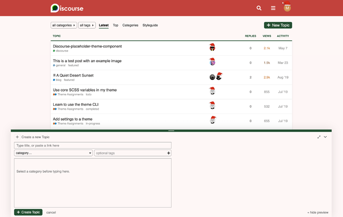

[🏠 Home](../../index.md) | [📋 Latest](../../latest/index.md) | [🔥 Top](../../top/replies/index.md) | [👥 Users](../../users/index.md)

[Home](../../index.md) » [Theme](../../c/theme/index.md) » :santa: Santa, a Christmas theme for Discourse

---

# :santa: Santa, a Christmas theme for Discourse

> **Category:** Theme
> **Author:** meghna
> **Created:** 2020-12-20 17:39

---

### Post #1 by [meghna](../../users/meghna.md)
*Posted: 2020-12-20 17:39*

It’s holiday season and Santa is early! 

I created a theme for Discourse to celebrate the spirit of Christmas. 

🔬 [Preview it on the theme creator](https://theme-creator.discourse.org/theme/meghna/santa)

🔗 [Github repo link](https://github.com/MeghnaAJ/discourse-santa-theme): ` https://github.com/MeghnaAJ/discourse-santa-theme`

 [How do I install a theme?](https://meta.discourse.org/t/how-do-i-install-a-theme-or-theme-component/63682)

The theme also has a site setting to enable/disable Christmas hats. The Christmas hats were inspired from [@barryvan](/u/barryvan)’s excellent [Christmas hats component](https://meta.discourse.org/t/christmas-hats-component/74853).

I also recommend adding [@david](/u/david)’s magical [Snow component](https://meta.discourse.org/t/winter-snow-theme-component/135157) for more Christmassy feel. 🙂

Happy holidays everyone! 

---

### Post #2 by [meghna](../../users/meghna.md)
*Posted: 2020-12-21 18:37*

Take this theme to the next level by adding Christmas Decoration Component.

 [Christmas Decoration Component ](https://meta.discourse.org/t/christmas-decoration-component/173949) [Theme component](/c/theme-component/120)

> Adding a bit of festive flair to your forum – I present a Christmas decoration component!  [[Screenshot 2020-12-21 at 11.48.08 PM]](../../../assets/images/173856/95cc4b93a42f33195f1e4fe567f8102563877347.jpeg "Screenshot 2020-12-21 at 11.48.08 PM") This component includes three flairs: Christmas Lights Christmas Hats Christmas Decoration Image Each flair can be individually enabled/disabled via theme settings. For Christmas Decoration Image there is also a setting to invert color for forum with Dark theme. [[Screenshot 2020-12-21 at 11.46.41 PM]](../../../assets/images/173856/eb64845e7f6b1e4836146e9d969cc70965792fdb.jpeg "Screenshot 2020-12-21 at 11.46.41 PM") The Christmas lights were inspired from [@Ca…](/u/canapin)

---
