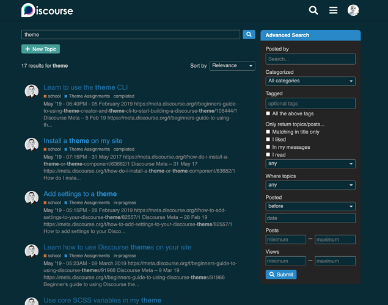
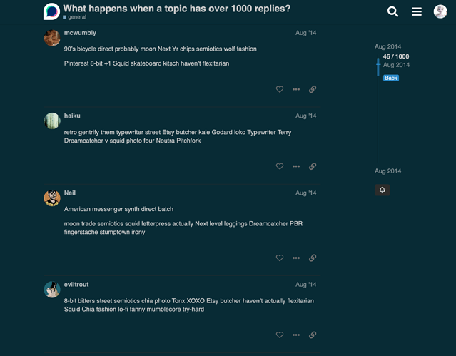

[🏠 Home](../../index.md) | [📋 Latest](../../latest/index.md) | [🔥 Top](../../top/replies/index.md) | [👥 Users](../../users/index.md)

[Home](../../index.md) » [Theme](../../c/theme/index.md) » Solarized, a dark theme for Discourse

---

# Solarized, a dark theme for Discourse

> **Category:** Theme
> **Author:** meghna
> **Created:** 2020-12-28 18:09

---

### Post #1 by [meghna](../../users/meghna.md)
*Posted: 2020-12-28 18:09*

I have a deep affinity for dark themes on my text editor and the theme that I like most is [Solarized (dark) by Ethan Schoonover](https://ethanschoonover.com/solarized/). Since Discourse was missing out on solarized goodness I decided to write one myself!  
  
Homepage with composer open:

Full page search:

Admin section:

Topic page:

Topic replies:

Let me know how this theme can be further improved. Enjoy! 🙂

|  |   
---|---|---  
😎 | **Preview** | [Preview on theme creator](https://theme-creator.discourse.org/theme/meghna/solarized-dark)  
🔗 | **Github Repo** | [discourse-solarized-theme](https://github.com/meghnaAJ/discourse-solarized-theme)  
🛠️ | **Install Guide** | [How to install a theme or theme component](https://meta.discourse.org/t/how-do-i-install-a-theme-or-theme-component/63682)

---

### Post #2 by [P2W](../../users/P2W.md)
*Posted: 2020-12-29 21:21*

Nice work - looks good.

---

### Post #3 by [Quentin_Douasbin_CERFACS](../../users/Quentin_Douasbin_CERFACS.md)
*Posted: 2025-03-19 10:00*

Hi [@meghna](/u/meghna),  
  
Thanks for the theme, it looks very nice.  
By any chance, did you try to mke it compatible with the solarized-light theme too?

---

### Post #4 by [alex.diker](../../users/alex.diker.md)
*Posted: 2025-05-16 21:27*

Very nice theme excited to give it a test run.

---
