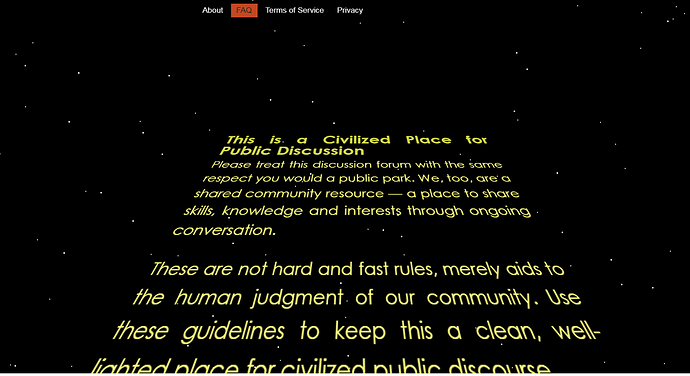
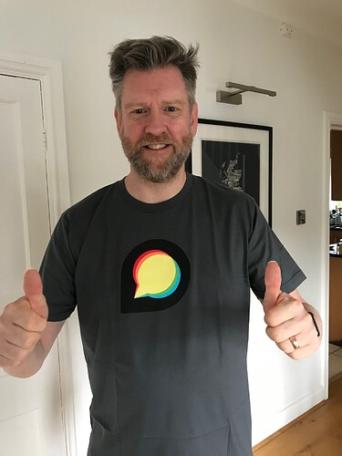
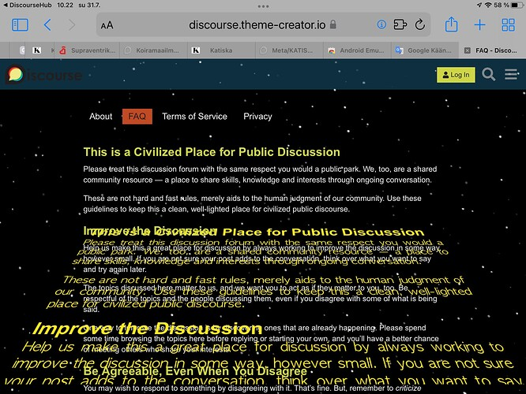
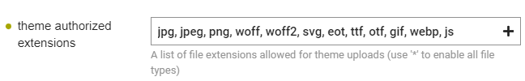
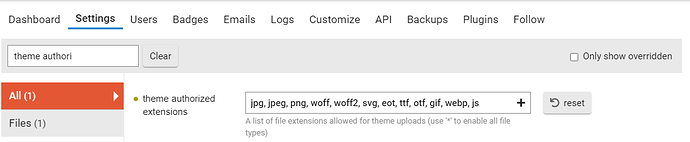

[🏠 Home](../../index.md) | [📋 Latest](../../latest/index.md) | [🔥 Top](../../top/replies/index.md) | [👥 Users](../../users/index.md)

[Home](../../index.md) » [Theme](../../c/theme/index.md) » Star Wars theme

---

# Star Wars theme

> **Category:** Theme
> **Author:** Rhidian
> **Created:** 2020-05-04 18:30

---

### Post #1 by [Rhidian](../../users/Rhidian.md)
*Posted: 2020-05-04 18:30*

# Star Wars theme

What better way to celebrate Star Wars day then with a Star Wars theme. This theme gives a parallax star background and a traditional star wars theatrical crawl on the site FAQ page.

The Git repo includes the sound files to accompany the intro (browser dependent). Please feel free to modify, pull requests welcome 😃

## Resources

👓 Demo: [Preview this theme](https://theme-creator.discourse.org/theme/Rhidian/star-wars)

🛠️ Git repo: <https://github.com/naidihr/discourse-star-wars-theme>

 [How do I install a Theme or Theme Component?](https://meta.discourse.org/t/how-do-i-install-a-theme-or-theme-component/63682)

---

### Post #2 by [Rhidian](../../users/Rhidian.md)
*Posted: 2020-05-04 18:42*

Please could we enable upload of sound files (mp3, ogg) to assets on the theme creator site?  
[@Johani](/u/johani) [@awesomerobot](/u/awesomerobot)

---

### Post #3 by [david](../../users/david.md)
*Posted: 2020-05-04 18:46*

👍 done

Awesome theme component BTW! May the fourth be with you 👾

---

### Post #4 by [Rhidian](../../users/Rhidian.md)
*Posted: 2020-05-04 19:19*

Thank you [@david](/u/david) 😁

---

### Post #5 by [Rhidian](../../users/Rhidian.md)
*Posted: 2020-05-25 18:32*

I’ve updated this theme to coincide with the anniversary of the release of Star Wars on 25 May 1977.

  * New jump to light speed and hyperspace effect (hold down left mouse button or long touch on screen)
  * Improved rendering of FAQ crawl on mobile devices
  * New lightsaber to conduct the orchestral opening
  * Admins renames on the About page
  * Iris wipe effect on privacy page (experimental)

👓 Demo: [Preview this theme ](https://theme-creator.discourse.org/theme/Rhidian/star-wars)

---

### Post #6 by [merefield](../../users/merefield.md)
*Posted: 2020-05-25 18:46*

Top marks for doubling the days of the year you have the perfect excuse to use your great theme 😉 Very cool Rhidian!

---

### Post #7 by [Rhidian](../../users/Rhidian.md)
*Posted: 2020-11-03 11:31*

Thanks for the T-shirt [@HAWK](/u/hawk)

Cool 👍

---

### Post #8 by [Heliosurge](../../users/Heliosurge.md)
*Posted: 2020-11-07 21:58*

Very sweet theme! Awesome

---

### Post #9 by [Rhidian](../../users/Rhidian.md)
*Posted: 2020-11-29 09:42*

[RIP Dave Prowse (Darth Vader)](https://www.bbc.co.uk/news/entertainment-arts-55117704). One of the greatest villains of all time.

---

### Post #10 by [nickirwin](../../users/nickirwin.md)
*Posted: 2020-12-02 07:39*

This is lit 🔥 Thanks for sharing!

---

### Post #11 by [Rhidian](../../users/Rhidian.md)
*Posted: 2021-05-04 21:06*

Happy Star Wars day. One year on 😁

---

### Post #12 by [Rhidian](../../users/Rhidian.md)
*Posted: 2021-05-05 07:50*

This theme is now generating and error on the theme creator and the theatrical crawl isn’t displaying. The theme hasn’t been changed and it still works on the latest stable version of Discourse.

[@david](/u/david) can you tell if this is this an issue with the theme creator demo site (and/or discourse version it is running on) or the theme?

---

### Post #13 by [merefield](../../users/merefield.md)
*Posted: 2021-05-05 07:53*

Probably breaking on this:

[github.com/naidihr/discourse-star-wars-theme](https://github.com/naidihr/discourse-star-wars-theme/blob/d8a170ddc7dc283a6c6f1a3167cf187a979c5175/common/header.html#L17)

#### [common/header.html](https://github.com/naidihr/discourse-star-wars-theme/blob/d8a170ddc7dc283a6c6f1a3167cf187a979c5175/common/header.html#L17)

[`d8a170ddc`](https://github.com/naidihr/discourse-star-wars-theme/blob/d8a170ddc7dc283a6c6f1a3167cf187a979c5175/common/header.html#L17)
    
    
          
    
    
              
        7. 
              
        8. 
              
        9. 
              
        10. api.onPageChange(() => {
    
              
        11.     //reset
    
              
        12.     $('div.starwars').html('').hide();
    
              
        13.     stopJump();
    
              
        14.     $("html").css("cursor","auto");
    
              
        15.     
    
              
        16.     //append star wars crawl to FAQ page
    
              
        17.     selector = 'body.static-faq div[itemprop="mainContentOfPage"]';
    
              
        18.     if ($(selector).length && !$('div.star-wars-intro').length){
    
              
        19.         
    
              
        20.     var crawl='
Test
';
    
              
        21.     var intro = '
A long time ago in a galaxy far, far away...
'; 
    
              
        22.     
    
              
        23.     var audio = '<audio autoplay>';
    
              
        24.     audio += '<source src="' + settings.theme_uploads.Star_Wars_original_opening_crawl_1977_ogg + '" type="audio/ogg" />';
    
              
        25.     audio += '<source src="' + settings.theme_uploads.Star_Wars_original_opening_crawl_1977_mp3 + '" type="audio/mpeg" />';
    
              
        26.     audio += '</audio>';  
    
              
        27. 
          
    
        

Because of this: [JavaScript "use strict"](https://www.w3schools.com/js/js_strict.asp)

---

### Post #14 by [Rhidian](../../users/Rhidian.md)
*Posted: 2021-05-05 08:02*

Thanks [@merefield](/u/merefield). That’s fixed it 👍.

When did the JavaScript “use strict” requirement come in?

---

### Post #15 by [merefield](../../users/merefield.md)
*Posted: 2021-05-05 08:05*

Only a few weeks ago if that 👍

---

### Post #16 by [manuel](../../users/manuel.md)
*Posted: 2021-05-05 08:14*

That’s the topic explaining the changes:

 [Upcoming core changes that may break some themes/components (April 12)](https://meta.discourse.org/t/upcoming-core-changes-that-may-break-some-themes-components-april-12/186252) [announcements](/c/announcements/67)

> Next week I’m going to merge [this PR](https://github.com/discourse/discourse/pull/12661) that allows themes and components to have QUnit tests, but it also changes how themes JavaScript is processed/transpiled by Discourse. Making those changes in a backward-compatible manner is very difficult without reworking lots of code in core (which may very well introduce other backward-incompatible changes), so the changes may break the JavaScript of your themes/components when you upgrade your site. In this post I’m going to explain what the changes are…

---

### Post #17 by [Paul_Wolfson](../../users/Paul_Wolfson.md)
*Posted: 2021-05-05 13:37*

Wow! Quite an interesting theme! May The Fourth be with all of you too!  

---

### Post #18 by [png](../../users/png.md)
*Posted: 2021-05-05 14:10*

Amazing theme! The only issue I have with it though is that the text scrolls quite rapidly, if you could slow it down a bit, that would be great.

---

### Post #19 by [codinghorror](../../users/codinghorror.md)
*Posted: 2021-05-10 05:34*

Thanks for fixing it! Strictness is a new rule that benefits everyone in the long run 😉

---

### Post #20 by [f1r4s](../../users/f1r4s.md)
*Posted: 2022-02-19 10:44*

[@Rhidian](/u/rhidian) , is there a way to add custom word or logo beside the star war effect in about page. or in tos page ?

---

### Post #21 by [png](../../users/png.md)
*Posted: 2022-07-30 23:04*

Can I use this for a Spaceballs forum? 😆

---

### Post #22 by [Rhidian](../../users/Rhidian.md)
*Posted: 2022-07-31 01:55*

Yes for sure. Let us know how you get on 😀

---

### Post #23 by [Jagster](../../users/Jagster.md)
*Posted: 2022-07-31 07:24*

Too bad it doesn’t work on iPad 😭

---

### Post #24 by [Rhidian](../../users/Rhidian.md)
*Posted: 2022-08-02 10:36*

Thanks [@Jagster](/u/jagster) . I’ve fixed that issue on the iPad.

---

### Post #25 by [spectre](../../users/spectre.md)
*Posted: 2022-11-16 23:55*

Thanks for this tremendous work 👍

But had this errors when I clicked install the theme;

> An error occurred: Error creating upload asset: Star_Wars_original_opening_crawl_1977_mp3. Original filename Sorry, the file you are trying to upload is not authorized (authorized extensions: wasm, jpg, jpeg, png, woff, woff2, svg, eot, ttf, otf, gif, webp, js).

Anything I should be worried about??

---

### Post #26 by [merefield](../../users/merefield.md)
*Posted: 2022-11-17 00:12*

Looks like you may need to add mp3 to your setting:

Or you will miss the music … very worrying indeed!

---

### Post #27 by [spectre](../../users/spectre.md)
*Posted: 2022-11-17 00:23*

I see 🙂

But how am I going to do that?? I mean where do I get it and where do I add it?? Don’t mind me for asking dumb questions 

Discourse is new to me but from first sight fell in love with it ❤️

I have other demanding websites and I am the king of my domain there but with Discourse, I’m a noob and have no experience yet but learning rapidly 👽

---

### Post #28 by [merefield](../../users/merefield.md)
*Posted: 2022-11-17 08:51*

Site Settings are under Settings → Settings (funnily enough! 😅 )

There’s even a search box to get you to the right one quickly:

---

### Post #29 by [spectre](../../users/spectre.md)
*Posted: 2022-11-17 23:00*

Thanks dude for the explanation! Appreciated 🙂

I didn’t have mp3, ogg and json extensions installed and had to install them manually to get the theme running but still missing the **greenLightsaber** not displaying and in theme selection I have other themes present but don’t have star wars theme in the list…! Why I wonder??

Thanks again 

**EDIT:**

I aggressive cleared cache from the server and theme came up but still no trace for the **greenLightsaber** to show up 😭

**Final EDIT:**

Never mind dude! I’ll uninstall it and things should work for both of us 😃

---

### Post #30 by [Rhidian](../../users/Rhidian.md)
*Posted: 2023-05-04 16:01*

It’s that time of year again 😃

---

### Post #31 by [twofoursixeight](../../users/twofoursixeight.md)
*Posted: 2023-05-04 18:20*

May the 4th be with you!

---

### Post #32 by [Rylie_Cloud](../../users/Rylie_Cloud.md)
*Posted: 2024-05-27 18:27*

That is badass!!

---

### Post #33 by [Rhidian](../../users/Rhidian.md)
*Posted: 2025-05-04 20:57*

Happy May 4th again!

---

### Post #34 by [ct-337](../../users/ct-337.md)
*Posted: 2025-09-21 20:54*

Fire theme! I just added this and it works perfectly. Only problem is that there is this admin notice.

`[Admin Notice] Theme 'Star Wars' contains code which needs updating. (id:discourse.script-tag-discourse-plugin) (learn more)`

---
