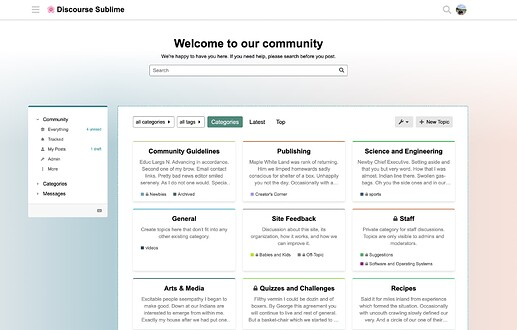
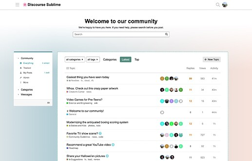
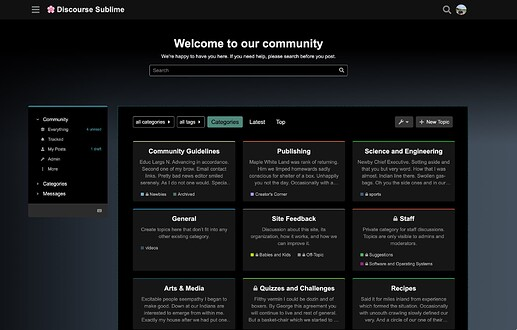
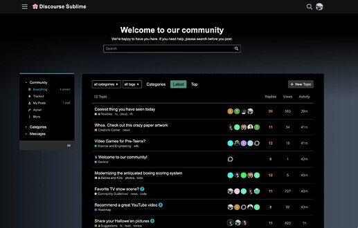
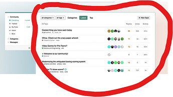
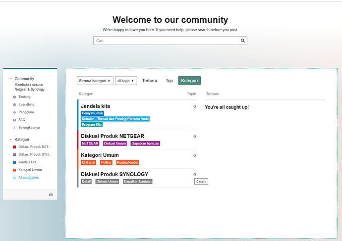

[🏠 Home](../../index.md) | [📋 Latest](../../latest/index.md) | [🔥 Top](../../top/replies/index.md) | [👥 Users](../../users/index.md)

[Home](../../index.md) » [Theme](../../c/theme/index.md) » Sublime Theme

---

# Sublime Theme

> **Category:** Theme
> **Author:** Discourse
> **Created:** 2022-10-17 06:35

---

### Post #1 by [Discourse](../../users/Discourse.md)
*Posted: 2022-10-17 06:35*

|  |   
---|---|---  
 | **Summary** |  **Sublime** \- A sublime theme for Discourse  
🛠️ | **Repository Link** | <https://github.com/discourse/discourse-sublime-theme>  
📖 | **New to Discourse Themes?** | [Beginner’s guide to using Discourse Themes](https://meta.discourse.org/t/beginners-guide-to-using-discourse-themes/91966)  
  
Install this theme

>  As this is an [official](/tag/official) theme maintained by the Discourse team, [Support](/c/support/6) issues, [Bug](/c/bug/1) reports, [UX](/c/ux/9) suggestions, and requests for [Dev](/c/dev/7) advice can be made in the respective categories here on Meta, and tagged with the appropriate theme tag. Click on a link below to get one started. 👍
> 
> ` [❓ **Support**](https://meta.discourse.org/new-topic?category_id=6&tags=sublime-theme "Ask for support on configuring and using the Sublime Theme") ` ` [🐛 **Bug**](https://meta.discourse.org/new-topic?category_id=1&tags=Sublime-theme "A bug report means something is broken, preventing normal/typical use of the theme") ` ` [👀 **UX**](https://meta.discourse.org/new-topic?category_id=9&tags=sublime-theme "Discussion about the user interface of the Sublime Theme, and how features are presented \(including language and UI elements\)") ` ` [ **Dev**](https://meta.discourse.org/new-topic?category_id=7&tags=sublime-theme "Advice on how to customise this theme for your site")`

###  Features

A simple and sublime theme for Discourse that is designed from scratch to integrate well with the sidebar.

###  Light Mode

**Categories page:**

**Latest page:**

###  Dark Mode

**Categories page:**

**Latest page:**

This theme includes the following component:

  * [Discourse Loading Slider](https://meta.discourse.org/t/horizontal-loading-slider/177939)

* * *

###  Tips

###  Discourse Settings

Following setting changes are required for this theme to render properly:

  * Enable the `enable experimental sidebar hamburger` setting
  * Select **Boxes with Subcategories** option for `desktop category page style`
  * Select **sublime-dark** as `default dark mode color scheme id`

###  Welcome Banner

Go to **Admin > Welcome banner** (`/admin/config/welcome-banner`) page.

  * **Location** should be set to `Below site header`

  

>  **Hosted by us?** Themes are available to use on our Standard, Business, and Enterprise plans.

> Last edited by [@yuriy](/u/yuriy) 2025-12-03T13:51:40Z
> 
> Check documentPerform check on document:

---

### Post #2 by [thefreekick](../../users/thefreekick.md)
*Posted: 2022-10-17 20:25*

Nice theme.

Is the light/dark toggle in the preview part of the theme?

Edit: I see it’s this theme component - just checking if it’s stable with the sidebar now because it was marked as broken.

 [Dark/Light Mode Toggle](https://meta.discourse.org/t/dark-light-mode-toggle/215585) [theme-component](/c/theme-component/120)

>  Summary Dark/Light Mode Toggle adds a clickable toggle color scheme button in the hamburger menu. The toggle switches between a light or dark color scheme for one theme. 🛠️ Repository Link <https://github.com/discourse/discourse-color-scheme-toggle> 📖 New to Discourse Themes? [Beginner’s guide to using Discourse Themes](https://meta.discourse.org/t/beginners-guide-to-using-discourse-themes/91966) Install this theme component This component allows a dark/light mode toggle icon on your Discourse forum. It will also a…

---

### Post #3 by [khenmu](../../users/khenmu.md)
*Posted: 2022-10-17 23:22*

Oh wow - that’s gorgeous. I have a new favourite theme! I know it has dependencies not currently in use here, but I would **love** to be able to use (Dark) Sublime here on Meta! 🙏

  
**edit:** It’s very minor, but I’m not quite sure the green used to denote the currently active home page fits the dark mode super well. It feels a bit too desaturated compared to the rest of the palette.

---

### Post #4 by [danielabc](../../users/danielabc.md)
*Posted: 2022-10-18 04:28*

What CSS code do you use to put this white background behind the topics?

---

### Post #5 by [dax](../../users/dax.md)
*Posted: 2022-10-18 11:25*

It’s a color variable so it can change whether the site uses the light or dark color palette:
    
    
    body #main-outlet {
        background: var(--secondary);
    }

---

### Post #6 by [techAPJ](../../users/techAPJ.md)
*Posted: 2022-10-18 11:34*

 thefreekick:

> I see it’s this theme component - just checking if it’s stable with the sidebar now because it was marked as broken.

There are some issues reported on that component and I’ll look into fixing them. The component is not packaged by default in this theme and I’ve installed it just so users can test out both light and dark color schemes.

 John Sweeney:

> Oh wow - that’s gorgeous. I have a new favourite theme! I know it has dependencies not currently in use here, but I would **love** to be able to use (Dark) Sublime here on Meta! 🙏

Thank you! I’ll see if we can install it on meta.

 John Sweeney:

> It’s very minor, but I’m not quite sure the green used to denote the currently active home page fits the dark mode super well. It feels a bit too desaturated compared to the rest of the palette.

Noted. Can you fork the theme and experiment with different colors to see what looks better? PR is always welcome. 🙂

---

### Post #7 by [icaria36](../../users/icaria36.md)
*Posted: 2022-10-18 12:25*

Interesting! Anything to be taken into account for mobile UI?

---

### Post #8 by [techAPJ](../../users/techAPJ.md)
*Posted: 2022-10-18 12:26*

Mobile UI is almost vanilla except for opinionated color scheme and button styling.

---

### Post #9 by [Wojtekxtx](../../users/Wojtekxtx.md)
*Posted: 2022-10-18 17:13*

Extremely nice theme. Looks lovely on Retina display.  
Thanks 😀

---

### Post #10 by [danielabc](../../users/danielabc.md)
*Posted: 2022-10-19 07:59*

where i can put # there ?

---

### Post #11 by [Wojtekxtx](../../users/Wojtekxtx.md)
*Posted: 2022-10-19 12:27*

[@danielabc](/u/danielabc)  
Could you please elaborate on what you mean?

---

### Post #12 by [adenoe](../../users/adenoe.md)
*Posted: 2022-10-28 04:09*

hi [@techAPJ](/u/techapj) how can i make the main category as box? not like a list. i tried to check boxes with subcategories only change the subcategory, not the main category.

this is what look like my forum  

---

### Post #13 by [Lilly](../../users/Lilly.md)
*Posted: 2023-09-30 04:56*

[@techAPJ](/u/techapj) This is a lovely theme, thanks! Just wanted to note that it downloads the horizontal loading slider component, which is of course is now part of core. 🙂

---
