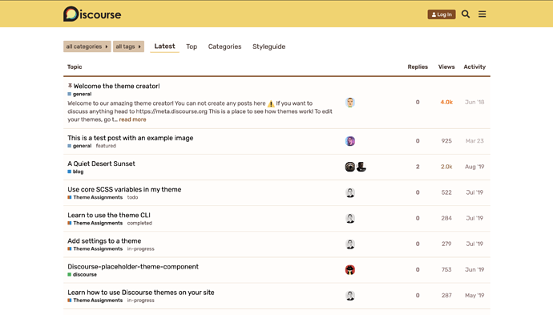
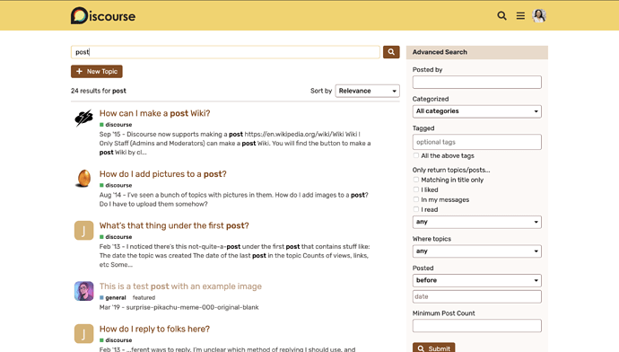

[🏠 Home](../../index.md) | [📋 Latest](../../latest/index.md) | [🔥 Top](../../top/replies/index.md) | [👥 Users](../../users/index.md)

[Home](../../index.md) » [Theme](../../c/theme/index.md) » Sunflower, A discourse theme

---

# Sunflower, A discourse theme

> **Category:** Theme
> **Author:** akachinonyerem
> **Created:** 2020-05-07 06:17

---

### Post #1 by [akachinonyerem](../../users/akachinonyerem.md)
*Posted: 2020-05-07 06:17*

Sunflowers are known for being cheery and lifting spirits. In this tough time, I wanted to create something that would bring cheer. I hope you find this useful too. The theme supports both desktop and mobile styles.

 [Preview on theme creator](https://theme-creator.discourse.org/theme/akachinonyerem/sunflower-theme)

🔗 [Github link](https://github.com/akachinonyerem/sunflower-theme)

 [How to install a theme](https://meta.discourse.org/t/how-do-i-install-a-theme-or-theme-component/63682)

 If you spot any bugs, please let me know below.

Thank you 

  

---

### Post #2 by [ondrej](../../users/ondrej.md)
*Posted: 2020-05-07 11:06*

Really nice theme! Thanks for sharing. Just a thing I noticed that the staff colour is hardly visible with a white background.  
Thanks again 😉

---

### Post #3 by [akachinonyerem](../../users/akachinonyerem.md)
*Posted: 2020-05-07 15:56*

HI! [@ondrej](/u/ondrej)

How/where can I find the staff colour?

---

### Post #4 by [ondrej](../../users/ondrej.md)
*Posted: 2020-05-07 16:41*

Hi, image below hope it helps.

---
