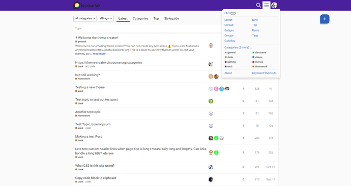
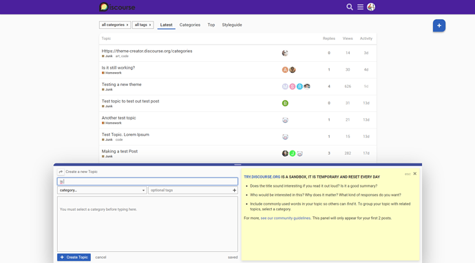
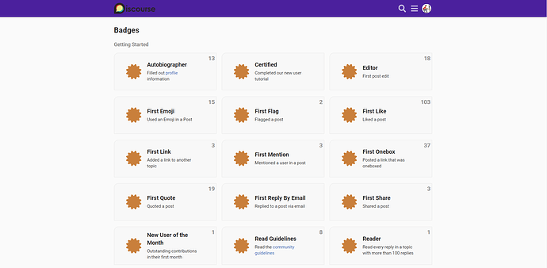
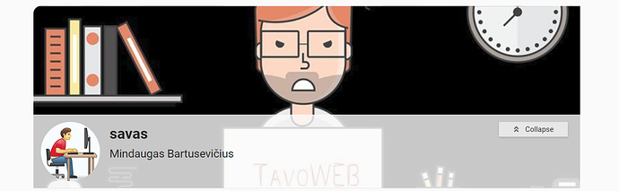
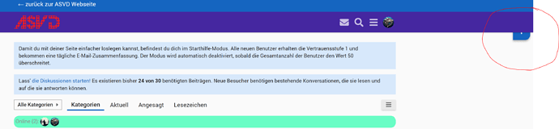

[🏠 Home](../../index.md) | [📋 Latest](../../latest/index.md) | [🔥 Top](../../top/replies/index.md) | [👥 Users](../../users/index.md)

[Home](../../index.md) » [Theme](../../c/theme/index.md) » TavoWEB theme for Discourse

---

# TavoWEB theme for Discourse

> **Category:** Theme
> **Author:** savas
> **Created:** 2019-02-22 15:02

---

### Post #1 by [savas](../../users/savas.md)
*Posted: 2019-02-22 15:02*

 To get this theme, import it from [GitHub - tavoweb/TavoWEB-theme: TavoWEB Theme for Discourse](https://github.com/tavoweb/TavoWEB-theme)
    
    
    https://github.com/tavoweb/TavoWEB-theme
    

### Live preview

 [Theme Creator](https://discourse.theme-creator.io/theme/savas/tavoweb) 

### ['TavoWEB Theme' by @savas](https://discourse.theme-creator.io/theme/savas/tavoweb)

A customization for Discourse shared on Discourse Theme Creator

### Some previews

  

  

  

  

  

  

### Compatible

Discourse quick messages Plugin [Quick Messages Plugin](https://meta.discourse.org/t/quick-messages-plugin/39188)  
//custom style added

Who’s Online Plugin (discourse-whos-online) [Discourse Who's Online](https://meta.discourse.org/t/whos-online-plugin-discourse-whos-online/52345)  
//custom style added

Easy Footer [Easy Responsive Footer](https://meta.discourse.org/t/easy-responsive-footer/95818)  
//custom style added

### Install guide

I know everyone knows how but for those who forget ..  
[How to install a theme or theme component ](https://meta.discourse.org/t/how-do-i-install-a-theme-or-theme-component/63682)

---

### Post #2 by [Lagger_Gandalf](../../users/Lagger_Gandalf.md)
*Posted: 2019-03-09 14:47*

Hi Mindaugas

I’ve noticed a Padding issue, when using the [Brand Header](https://meta.discourse.org/t/brand-header-theme-component/77977) Component:  

---

### Post #3 by [savas](../../users/savas.md)
*Posted: 2019-03-13 19:40*

Fixed problem thanx for info 🙂

---
