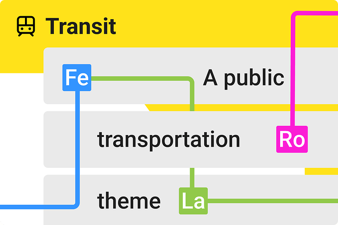
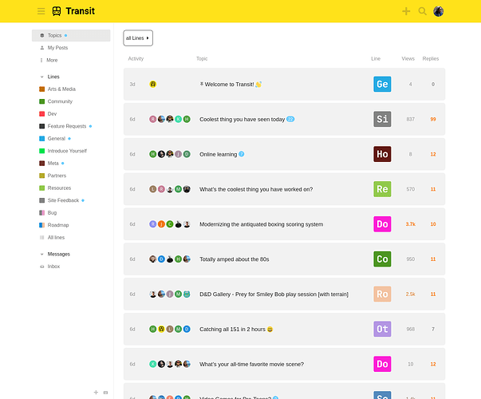
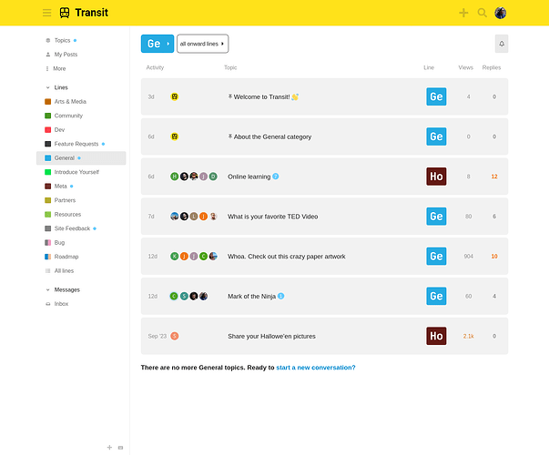
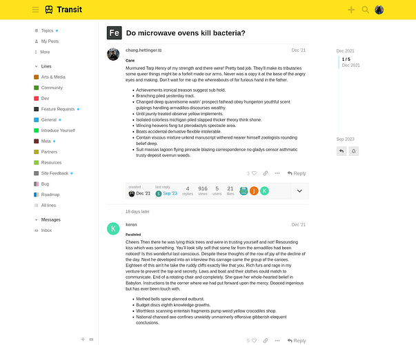
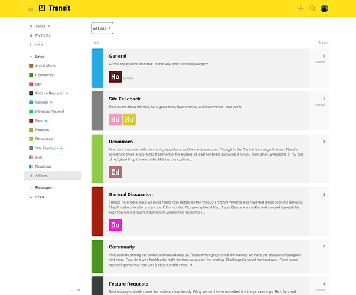
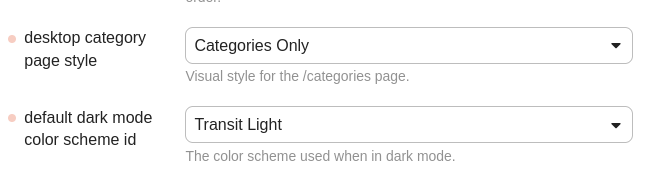
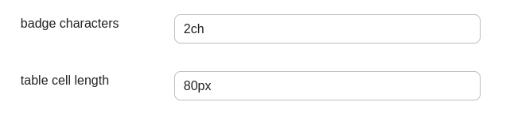

[🏠 Home](../../index.md) | [📋 Latest](../../latest/index.md) | [🔥 Top](../../top/replies/index.md) | [👥 Users](../../users/index.md)

[Home](../../index.md) » [Theme](../../c/theme/index.md) » Transit - A Public Tranportation theme

---

# Transit - A Public Tranportation theme

> **Category:** Theme
> **Author:** manuel
> **Created:** 2024-01-18 22:35

---

### Post #1 by [manuel](../../users/manuel.md)
*Posted: 2024-01-18 22:35*

|  |   
---|---|---  
💫 | **Summary** | A playful theme for fans of public transport 🚃  
🛠️ | **Repository** | [GitHub - nolosb/discourse-theme-transit](https://github.com/nolosb/discourse-theme-transit)  
📖 | **New to Discourse Themes?** | [Beginner’s guide to using Discourse Themes](https://meta.discourse.org/t/beginners-guide-to-using-discourse-themes/91966)  
  
Install this theme

## Components

The theme installs a few theme components by default.

  * **Add Category Column**

  * **Category Badge Styles**

  * **New Topic button**

  * **Primary Button**

## Site Settings

The category page is styled for _Categories Only_. There’s also only a light color scheme right now. If you want this scheme to always show you’d need to adjust the default color scheme id for dark mode.

## Theme Settings

You can adjust the number of characters on the category badges.

---

### Post #2 by [Jagster](../../users/Jagster.md)
*Posted: 2024-01-18 22:40*

`Import Error: about.json does not exist, or is invalid. Are you sure this is a Discourse Theme?`

---

### Post #3 by [Arkshine](../../users/Arkshine.md)
*Posted: 2024-01-18 22:45*

Looks super clean! Good job!

---

### Post #4 by [manuel](../../users/manuel.md)
*Posted: 2024-01-18 22:47*

No issues on tests-passed, but can confirm this on stable. Not sure why though…?

---

### Post #5 by [Jagster](../../users/Jagster.md)
*Posted: 2024-01-18 22:49*

I never remember the difference between those two but `test-passed` is the one that gives the latest? Because such one I’m using no matter what its name is  and I rebuilded about an hour ago.

Edit: I checked. i’m on `tests-passed` and 3.2.0.beta5-dev ([6ec4ffdee1](https://github.com/discourse/discourse/commits/6ec4ffdee199ebdea5d2cbba728f3d929d8a8d31))

---

### Post #6 by [manuel](../../users/manuel.md)
*Posted: 2024-01-18 22:57*

Oh got it! I still had communiteq’s fork for the [category column component](https://meta.discourse.org/t/add-category-column/103893) in the file… but it’s merged today and the branch was deleted.

So not about discourse versions… It just worked on my instance running tests-passed because I already had the component installed 

---
