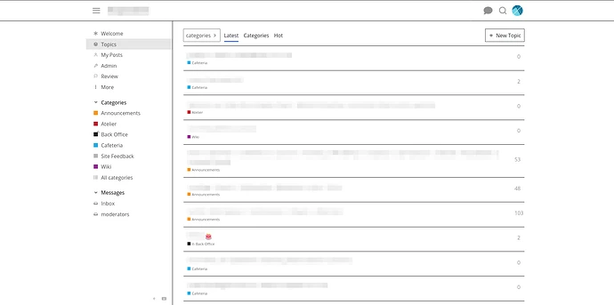

[🏠 Home](../../index.md) | [📋 Latest](../../latest/index.md) | [🔥 Top](../../top/replies/index.md) | [👥 Users](../../users/index.md)

[Home](../../index.md) » [Theme](../../c/theme/index.md) » Very Modest Theme

---

# Very Modest Theme

> **Category:** Theme
> **Author:** mononym
> **Created:** 2024-09-06 23:34

---

### Post #1 by [mononym](../../users/mononym.md)
*Posted: 2024-09-06 23:34*

|  |   
---|---|---  
ℹ️ | **Summary** | A most minimal theme for Discourse.  
👓 | **Preview** | [Theme Creator](https://discourse.theme-creator.io/theme/mononym/very-modest-theme)  
🛠️ | **Repository** | [Codeberg.org/mononym/discourse-very-modest-theme](https://codeberg.org/mononym/discourse-very-modest-theme)  
 | **License** | [GNU Affero General Public License v3.0 or later](https://www.gnu.org/licenses/agpl-3.0.txt)  
❓ | **Install Guide** | [How to install a theme or theme component](https://meta.discourse.org/t/how-do-i-install-a-theme-or-theme-component/63682)  
📖 | **New to Discourse Themes?** | [Beginner’s guide to using Discourse Themes](https://meta.discourse.org/t/beginners-guide-to-using-discourse-themes/91966)  
☕ | **Donate** | [Ko-fi](https://ko-fi.com/eupalinos)  
🚀 | **In use** | [Eupalinos](https://eupalinos.eu/)  
  
This theme is designed to be simple and unobtrusive, with a focus on readability and ease of use. It aims to provide a stylish clean and distraction-free interface.

Achieve full minimalism with the following settings:

Setting | Value  
---|---  
logo | ‘’  
logo_small | ‘’  
categories_topics | ‘0’  
suggested_topics | ‘0’  
top_menu | latest|new|unread|categories|hot  
post_menu | reply|like|edit|bookmark|delete|admin|read|flag  
post_menu_hidden_items | ‘’  
enable_badges | ‘false’  
base_font | open_sans  
heading_font | roboto_mono  
prioritize_username_in_ux | ‘false’  
enable_user_directory | ‘false’  
show_pinned_excerpt_mobile | ‘false’  
show_pinned_excerpt_desktop | ‘false’  
display_name_on_posts | ‘true’  
email_accent_bg_color | “#3d3846”  
email_link_color | “#000000”  
external_system_avatars_url | [https://api.dicebear.com/6.x/shapes/svg?seed={username}](https://api.dicebear.com/6.x/shapes/svg?seed=%7Busername%7D)  
enable_powered_by_discourse | ‘false’  
tagging_enabled | ‘false’  
chat_separate_sidebar_mode | always  
presence_enabled | ‘false’  
  
Acknowledgement:

 [Modest, a minimal theme for Discourse](https://meta.discourse.org/t/modest-a-minimal-theme-for-discourse/181150) [Theme](/c/theme/61)

> This aims to be an ultra-minimal theme for Discourse. Various elements of the UI has been removed in favour of simplicity. Some of the removed elements: Homepage (topic list) posters avatar column Homepage (topic list) views column Composer preview pane Composer toolbar Topic map Topic footer buttons Topic timeline footer controls Homepage: [[Screenshot 2021-02-25 at 11.18.21 PM]](../../../assets/images/325384/34d7aedc86d5bc682c08ef81116bed76931270fb.png "Screenshot 2021-02-25 at 11.18.21 PM") Homepage with composer open: [[Screenshot 2021-02-26 at 11.31.59 AM]](../../../assets/images/325384/830f6a3bd48d096e63b78e80b0af8c4789407eb8.png "Screenshot 2021-02-26 at 11.31.59 AM") Topic page: [[Screenshot 2021-02-25 at …](../../../assets/images/325384/0c5b033b0eab6ac85179227614c56005002091cb.jpeg "Screenshot 2021-02-25 at 11.28.46 PM")

---

### Post #2 by [mononym](../../users/mononym.md)
*Posted: 2025-08-23 15:43*

**Bonus**

Here’s an elegant font combo which can be added as a theme component:
    
    
    @import url(https://fonts.bunny.net/css?family=space-grotesk:300,400,500,600,700|victor-mono:700|work-sans:100,100i,200,200i,300,300i,400,400i,500,500i,600,600i,700,700i,800,800i,900,900i);
    
    :root {
        --font-family: 'Work Sans', sans-serif;
        --heading-font-family: 'Space Grotesk', sans-serif;
        --base-font-size-smallest: 14px;
        --base-font-size-smaller: 15px;
        --base-font-size: 17px;
        --base-font-size-larger: 19px;
        --base-font-size-largest: 21px;
        letter-spacing: .02em;
    }
    
    #site-text-logo {
        font-family: 'Victor Mono', monospace;
        font-weight: 700;
        letter-spacing: .15em;
    }

---
