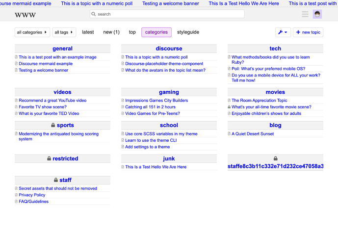
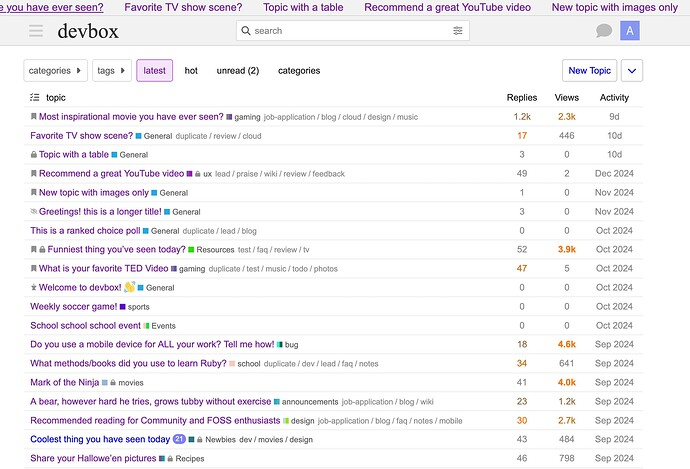
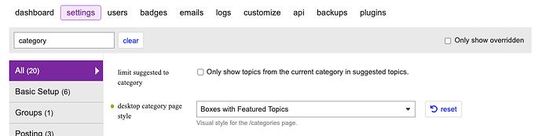
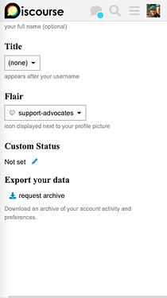
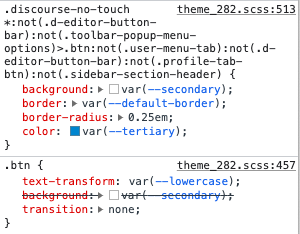
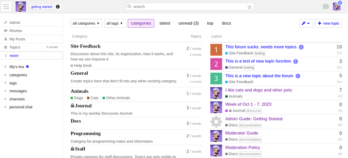

[🏠 Home](../../index.md) | [📋 Latest](../../latest/index.md) | [🔥 Top](../../top/replies/index.md) | [👥 Users](../../users/index.md)

[Home](../../index.md) » [Theme](../../c/theme/index.md) » 🌐 www theme

---

# 🌐 www theme

> **Category:** Theme
> **Author:** Discourse
> **Created:** 2022-12-03 04:42

---

### Post #1 by [Discourse](../../users/Discourse.md)
*Posted: 2022-12-03 04:42*

|  |   
---|---|---  
ℹ️ | **Summary** | A theme featuring brutalist web aesthetics.  
🛠️ | **Repository** | [GitHub - discourse/www-theme](https://github.com/discourse/www-theme)  
❓ | **Install Guide** | [How to install a theme or theme component](https://meta.discourse.org/t/how-do-i-install-a-theme-or-theme-component/63682)  
📖 | **New to Discourse Themes?** | [Beginner’s guide to using Discourse Themes](https://meta.discourse.org/t/beginners-guide-to-using-discourse-themes/91966)  
 | **Preview** | [Theme Creator](https://discourse.theme-creator.io/theme/awesomerobot/www-theme)  
  
Install this theme

Internet blue, tight line heights, Arial x Times New Roman, marquees…I am excited to share this theme inspired by aesthetics of the brutal web and platforms such as craigslist and Wikipedia. 😃

Designed for a large quantity of topics.

### Screenshots

")

  

")

### Notes

  * Option to turn on/off the global marquee fetching the latest updated topics.
  * Remember to select **“Boxes with Featured Topics”** in the Admin CP 

  * Includes the [Header Search component](https://meta.discourse.org/t/header-search/194093)

### To-do

  * Pull more than 3 topics per category for boxes with featured topics view
  * Optimizing other category views + mobile
  * Dark mode!
  * …

More customizations to be made, but all comments and feedback welcome! 😄

---

### Post #2 by [Jagster](../../users/Jagster.md)
*Posted: 2022-12-03 07:09*

I tried and it was not for me — matter of taste and no biggie. But I couldn’t switch back to another theme because in my settings was one very important button missing: save 😉

---

### Post #3 by [carson](../../users/carson.md)
*Posted: 2022-12-03 07:26*

Thanks for trying it! Is your save button missing? 

---

### Post #4 by [Jagster](../../users/Jagster.md)
*Posted: 2022-12-03 07:34*

Yes.

Well, I should try if it was because I changed theme from footer of the sidebar and that option was missing too. Or if it came from some component. But… I’m just now drinking my first coffee of the morning 😉

I’ll dig in further if I’m the only one.

And… beta14, iPad and the Hub.

---

### Post #5 by [agemo](../../users/agemo.md)
*Posted: 2022-12-03 14:47*

This is Awesome to have! 👍

---

### Post #6 by [agemo](../../users/agemo.md)
*Posted: 2022-12-03 15:32*

If you expedite a basic dark-mode as next iteration that would be extra-awsome.

Then I can stick with this theme 24/7.

The condensed listing is great!

---

### Post #7 by [Don](../../users/Don.md)
*Posted: 2023-02-05 12:52*

Hey Carson, Thanks for the theme this is cool 

 Jakke Flemming:

> But I couldn’t switch back to another theme because in my settings was one very important button missing: save 😉

I can repro this. However the buttons are there only not visible.   

It seems the theme button modifications is restricted to the `.discourse-no-touch` class which only works on non-touchscreen devices.

On touchscreen devices only the `.btn` custom style active which change the button background to `var(--secondary)` so the button color and background is same on `.btn-primary` as the page background and the default `.btn-primary` button has no border so it won’t be visible. This is happening with all `.btn-primary` button.

The other button types are same but the default color is different and the icon also visible so those buttons _visible_.

---

### Post #8 by [th21](../../users/th21.md)
*Posted: 2023-03-05 23:44*

Do you have the plan to make the marquee a separate theme component? If it could show topics with a specific tag that will be great.

---

### Post #12 by [Ahmed26](../../users/Ahmed26.md)
*Posted: 2023-06-27 09:38*

very nice theme how can i do text color edits ?

---

### Post #13 by [Canapin](../../users/Canapin.md)
*Posted: 2023-06-27 10:19*

Hey Ahmed26,

There’s no setting for that in the theme, and it doesn’t seem to change much when you change the selected color palette. So, your best way to go would be to create a new component to override the theme’s colors.

There’s a guide about how to do CSS changes here:

 [Make CSS changes on Your Site](https://meta.discourse.org/t/make-css-changes-on-your-site/168101) [Site Management](/c/documentation/site-management/53)

> Want to make some CSS changes on your Discourse site but not sure where to start? You’ve come to the right place! 👍 You only need to read this topic if you’re very new to CSS. If you already know how to write and add CSS to your Discourse site, then you will most likely not need to read this topic. We’ll cover a few subjects. We’ll start with a brief introduction of what CSS is and some terms that you need to know. We will then move on to how you can add CSS to your Discourse site. Final…

---

### Post #14 by [yu_miao](../../users/yu_miao.md)
*Posted: 2023-07-25 16:22*

I think this theme is really cool, and I like it a lot. However, there are some minor issues. The login button is missing on the mobile version, and the category icons are not working. I really hope this theme can continue to develop.

---

### Post #15 by [TDJS95](../../users/TDJS95.md)
*Posted: 2023-08-20 23:50*

Loving this theme.

---

### Post #16 by [denvergeeks](../../users/denvergeeks.md)
*Posted: 2023-09-30 03:37*

This is… ohh… sooooo… retroooooo I LOVE IT!!!

---

### Post #17 by [Frankz](../../users/Frankz.md)
*Posted: 2023-10-04 20:10*

Is there a sidebar for the theme?

---

### Post #18 by [Lilly](../../users/Lilly.md)
*Posted: 2023-10-04 20:14*

[@Frankz](/u/frankz) There is. 🙂  
The screenshots in the OP could probably use an update with the navigation sidebar menu.

---
