[🏠 Home](../../index.md) | [📋 Latest](../../latest/index.md) | [🔥 Top](../../top/replies/index.md) | [👥 Users](../../users/index.md)

[Home](../../index.md) » [Theme](../../c/theme/index.md) » Zeronoise Theme

---

# Zeronoise Theme

> **Category:** Theme
> **Author:** Discourse
> **Created:** 2020-12-01 00:21

---

### Post #1 by [Discourse](../../users/Discourse.md)
*Posted: 2020-12-01 00:21*

|  |   
---|---|---  
 | **Summary** |  **Zeronoise** focusses on having **clear color accents** and **subtly differentiated content areas** trying to create a pleasant reading experience.  
👓 | **Preview** | [Preview on Discourse Theme Creator](https://discourse.theme-creator.io/theme/Discourse/zeronoise-theme)  
🛠️ | **Repository Link** | <https://github.com/discourse/zeronoise>  
📖 | **New to Discourse Themes?** | [Beginner’s guide to using Discourse Themes](https://meta.discourse.org/t/beginners-guide-to-using-discourse-themes/91966)  
  
Install this theme

>  As this is an [official](/tag/official) theme maintained by the Discourse team, [Support](/c/support/6) issues, [Bug](/c/bug/1) reports, [UX](/c/ux/9) suggestions, and requests for [Dev](/c/dev/7) advice can be made in the respective categories here on Meta, and tagged with the appropriate theme tag. Click on a link below to get one started. 👍
> 
> ` [❓ **Support**](https://meta.discourse.org/new-topic?category_id=6&tags=zernoise-theme "Ask for support on configuring and using the Zeronoise Theme") ` ` [🐛 **Bug**](https://meta.discourse.org/new-topic?category_id=1&tags=zeronoise-theme "A bug report means something is broken, preventing normal/typical use of the theme") ` ` [👀 **UX**](https://meta.discourse.org/new-topic?category_id=9&tags=zeronoise-theme "Discussion about the user interface of the Zeronoise Theme, and how features are presented \(including language and UI elements\)") ` ` [ **Dev**](https://meta.discourse.org/new-topic?category_id=7&tags=zeronoise-theme "Advice on how to customise this theme for your site")`

###  Features

Hello Meta! I’ve built a theme for discourse focusing on having **clear color accents** and **subtly differentiated content areas** trying to create a pleasant reading experience.

[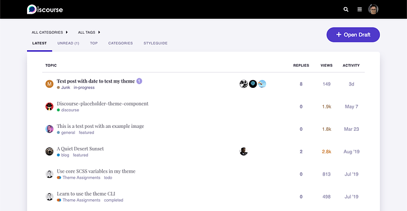](../../../assets/images/171809/59ef5cfb844585033e09f9621a536a7bfd42ad6b.png "zeronoise example")

In the desktop version I also moved the topic creator avatar to the left side of the title In order to give it a higher hierarchy in the design.

It was also fun to play with serif fonts and in the end “Playfair Display” really gives a character (hehe) to the theme.

Another fun thing is that, since the theme header is black, you can play with some aspects of the logo through Theme Settings (color inversion, hue rotation and brightness).

I hope you enjoy it, use it and fork it 💯!

[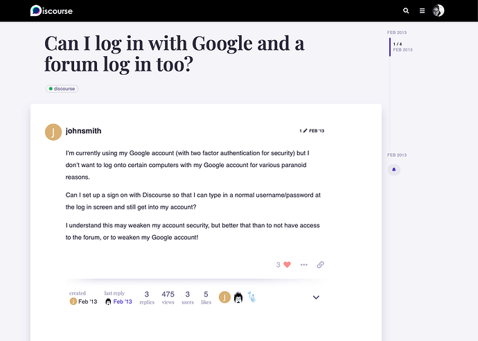](../../../assets/images/171809/fbb270983db6a01f1f368ef3c9f05f9fc5bc9739.png "100288928-60e40980-2f3d-11eb-8261-14dae619f103")

[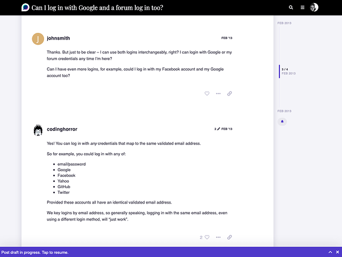](../../../assets/images/171809/d1c76c1ccbba0dc1d5a137d4a1c7d6a022ebbc90.png "100288929-617ca000-2f3d-11eb-9a77-f6455fa19c26")

###  Settings

Name | Description  
---|---  
logo invert colors |   
logo hue rotation | Specify a value in degrees to change the color of your logo. If you don’t know what this is you could leave it in 0 or google ‘css filter hue rotation’  
logo brightness | Set the amount of brightness you want to add to your logo (if you want to make it darker, set a negative number)  
  
##  Credits

Created by [@ruidovisual](/u/ruidovisual)

  

>  **Hosted by us?** Themes are available to use on our Standard, Business, and Enterprise plans.

> Last edited by [@JammyDodger](/u/jammydodger) 2024-06-17T13:43:50Z
> 
> Check documentPerform check on document:

---

### Post #2 by [anon82467725](../../users/anon82467725.md)
*Posted: 2020-12-01 00:37*

Wow! Beautiful theme! Many of the elements should honestly be baked into [Material Theme](https://meta.discourse.org/t/daemonite-material-theme/64521), but both themes are awesome. Great job! 👍

---

### Post #3 by [thegurjyot](../../users/thegurjyot.md)
*Posted: 2020-12-01 15:48*

This theme actually looks good. Will definitely try this on my website.

---

### Post #4 by [Eduardo_Braga](../../users/Eduardo_Braga.md)
*Posted: 2021-02-01 14:33*

[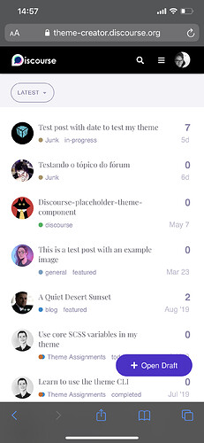](../../../assets/images/171809/5a1312abc629302fb50cfaa4da28bade258d55c6.jpeg "image")

new topic is a component?

---

### Post #5 by [Karthikk_Vijay](../../users/Karthikk_Vijay.md)
*Posted: 2021-03-05 12:07*

Honestly this is one of the best looking themes I have found! Thank you so much 🙂

I just need one help, if it’s not too much trouble [@ruidovisual](/u/ruidovisual) 🙂

  * I am a complete noob with all this, so forgive my naivety. I have managed to fork your file and change the colour themes. I need to change the font and I see I can do that by importing my own font family inside the variable SCSS?
  * What I am not able to figure is how to set two different fonts, one for the titles, headers etc., and the other for the body.

It will be so great if you could help me out here, I know this might be totally out of scope but it would certainly help a lot 🙂

---

### Post #6 by [ruidovisual](../../users/ruidovisual.md)
*Posted: 2021-03-06 04:37*

Hey Karthikk! I’m glad you like the theme : )

The easiest way would be to define a font-family for the body (I think doing it in `common.scss` would be the best):
    
    
    body {
      font-family: 'The Name of your Font Family', [FALLBACKS];
    } 
    

I don’t know if you are adding your own fonts or picking up some google fonts, but, I would advise that you pick a family from the google catalog.

Remember to replace `[FALLBACKS]` with your fallbacks depending on what type of font you’ve chosen, you can see more on font-family fallbacks [here](https://css-tricks.com/css-basics-fallback-font-stacks-robust-web-typography/)

About changing the font for titles and headers, I think that’s the part that you already figured out, but as a reminder, besides from importing it you need to declare it [in the line 116 of variables.scss](https://github.com/discourse/zeronoise/blob/2f5d5736a6515165f714127ffe97addcd054dba3/scss/variables.scss#L116)

Hope it helps! have a nice weekend : )

---

### Post #7 by [ruidovisual](../../users/ruidovisual.md)
*Posted: 2021-03-06 04:41*

You mean a custom component for the theme? in this case the answer is no. It’s there with `position: fixed` See [line 36 of mobile.scss](https://github.com/discourse/zeronoise/blob/2f5d5736a6515165f714127ffe97addcd054dba3/mobile/mobile.scss#L36)

Have a nice weekend and thank you for your patience : )

---

### Post #8 by [Matze](../../users/Matze.md)
*Posted: 2021-03-06 22:38*

Very nice theme! I can’t wait building a new theme for our discourse based upon zeronoise.  
Thank you for sharing!

---

### Post #9 by [Zup](../../users/Zup.md)
*Posted: 2021-03-22 07:28*

excellent theme. high on my personal like list. 🙂

would be even more interesting if font could be optionally same as whatever was chosen in the wizard.

---

### Post #10 by [daemon](../../users/daemon.md)
*Posted: 2021-03-28 16:47*

Hi [@ruidovisual](/u/ruidovisual) ,

I like your Theme a lot.

Is it possible to change the purple color to red? Can you release a red version of your theme?

I tried it myself but after that I lost the Theme effects and it wasn’t red. 😁

---

### Post #11 by [Karthikk_Vijay](../../users/Karthikk_Vijay.md)
*Posted: 2021-04-06 10:43*

[@ruidovisual](/u/ruidovisual) Thanks for the explanation, I have figure out how to change the fonts, thanks to you!

I am now playing around with my own light and dark version of the theme. I am using the Color Palettes to achieve this, as I wish to stay away from CSS as much as possible.

I have managed to tweak almost everything except these two elements :

  1. The status bar below the post has a special effect in your theme and I am not able to control it with the Color Palette. How do I tweak this using CSS? Which part do I target?  

[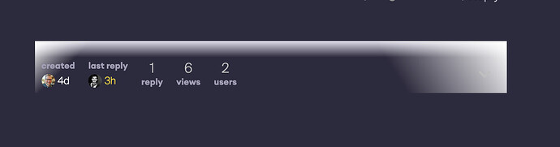](../../../assets/images/171809/9485d79b2303c77aeda0434b687b109837ea8eab.jpeg "image")

  2. The bar on top of all topics in the separate category view stays white no matter what colour I set in the palette 

Would be great if you could help me with these 🙂

P.S. This is my Color Palette for your reference : 

[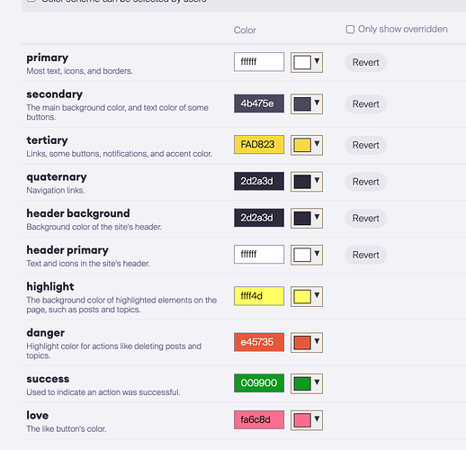](../../../assets/images/171809/cd3a576a59e2a9f53d9f251b78a3d08e2f435d8b.png "image")

---

### Post #12 by [Iceman](../../users/Iceman.md)
*Posted: 2021-05-06 11:23*

Great theme.

One question, has anyone been able to make it work with “Box-type” Categories? They just get random shapes and the text remains white.

---

### Post #13 by [png](../../users/png.md)
*Posted: 2021-05-07 15:52*

This is extremely clean and modern. The community makes the best themes ever!

---

### Post #14 by [KevinBlandy](../../users/KevinBlandy.md)
*Posted: 2021-05-21 07:14*

Hi,This theme looks great  
However, there seems to be some problems with the style in the Chinese forum.

## zeronoise theme

[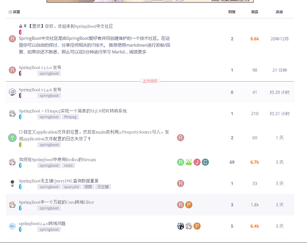](../../../assets/images/171809/eb998157c49b526563f20822e086ee4045a6714a.png "image")

## default theme

[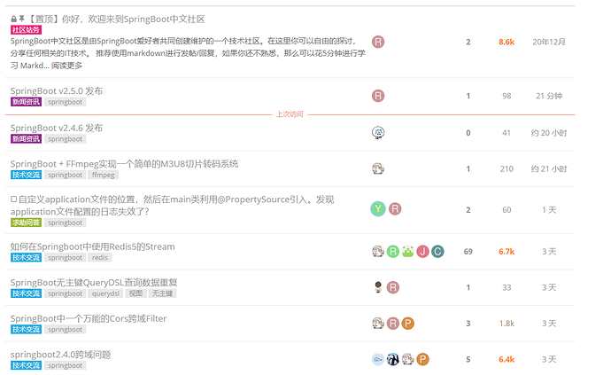](../../../assets/images/171809/8a49e200a40c70f10336d58d9976417c66c0fb11.png "image")

---

### Post #15 by [png](../../users/png.md)
*Posted: 2021-06-22 16:23*

Probably a formatting issue with Chinese characters

---

### Post #16 by [marthasimmons](../../users/marthasimmons.md)
*Posted: 2022-03-12 08:12*

First of all, thank you very much for this beautiful theme [@ruidovisual](/u/ruidovisual) . I have been using it for my community forum for almost 2 months now.

I have one question. Is it possible to remove the navigation dropdown on mobile?  

Thanks in advance.

---

### Post #17 by [diabolicvincent](../../users/diabolicvincent.md)
*Posted: 2022-06-26 14:20*

Thanks for this theme, loving it so far! One of the most pleasant discourse-styles I have yet seen 🙂

Only one issue: When performing mass operations in a category, the checkboxes do not appear, thus I can’t select multiple topics. This is really bugging me and I am unable to regularly use the theme, due to this issue. Could this be fixed? <3

---

### Post #18 by [RGJ](../../users/RGJ.md)
*Posted: 2022-09-26 10:51*

 Kevin Blandy:

> However, there seems to be some problems with the style in the Chinese forum.

This does not have anything to do with Chinese characters, it is an issue with the `category style` “box” setting.

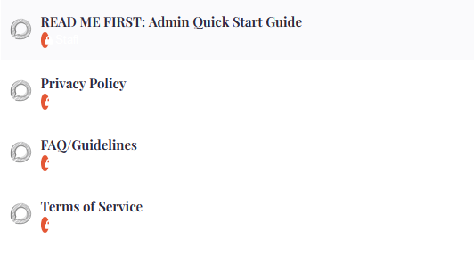
    
    
    .badge {
      &-category-bg,  /* <------ bad!! */
      &-wrapper.bullet &-category-parent-bg,
      &-wrapper.bullet &-category-parent-bg + &-category-bg {
        border-radius: 50%;
        width: 9px;
      }
    

To resolve this, apply this as a theme component
    
    
    .badge {
      &-wrapper.bar &-category-bg,
      &-wrapper.bar &-category-parent-bg,
      &-wrapper.bar &-category-parent-bg + &-category-bg {
         border-radius: 0%;
      }
      &-wrapper.box &-category-bg,
      &-wrapper.box &-category-parent-bg,
      &-wrapper.box &-category-parent-bg + &-category-bg {
        border-radius: 0%;
        width: 100%;
      }
    }

---

### Post #21 by [bosal](../../users/bosal.md)
*Posted: 2022-11-23 19:43*

Love the theme but… 😉

Could you help me or fix this print view as it’s not usable:

  * title should be small
  * the border with shadow should not be visible

[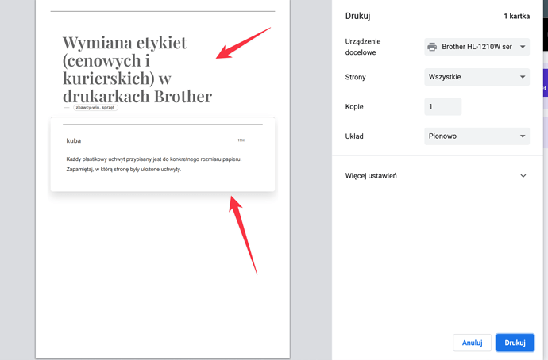](../../../assets/images/171809/7e4c249b9e20bd3555c1a2ae291a39743f899d48.png "CleanShot 2022-11-19 at 14.15.52@2x")

Also the topic selection doesn’t work

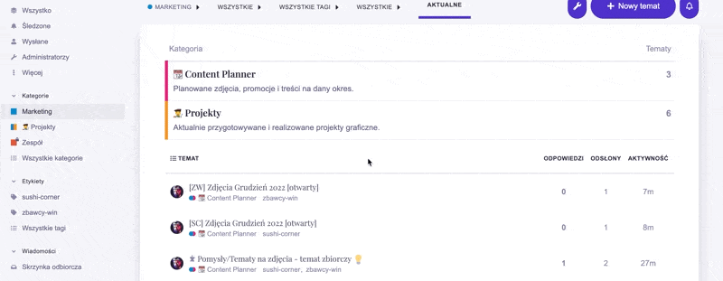

Also, how can I globally change the font to this theme ?

---

### Post #22 by [bquast](../../users/bquast.md)
*Posted: 2023-02-03 19:46*

Very impressive, thank you very much.

Will deploy now, hopefully more to contribute soon 🙂

---

### Post #23 by [bquast](../../users/bquast.md)
*Posted: 2023-02-05 13:39*

Is it correct that using this (any) theme disables theme components?

I have the **table builder** theme component installed, but when I use **zeronoise** it seems to be disabled.

Thanks!

---

### Post #24 by [JammyDodger](../../users/JammyDodger.md)
*Posted: 2023-02-05 16:29*

You would need to attach the theme component to each theme from the component’s setting page. 👍

---

### Post #25 by [bquast](../../users/bquast.md)
*Posted: 2023-02-05 18:37*

Thank you, I did not know that. Pardon the ignorance

EDIT: thank you [@JammyDodger](/u/jammydodger) that worked

---

### Post #26 by [bquast](../../users/bquast.md)
*Posted: 2023-02-24 17:12*

Hi there all,

I have another question:

> How can I hide the shadows / paper moving over background

I understand that this goes against the idea of the theme, I just want to have a look.

Thanks,  
Bastiaan

---

### Post #27 by [twofoursixeight](../../users/twofoursixeight.md)
*Posted: 2023-02-24 19:21*

This theme looks nice and easy on the eyes. I have suggested this onto the forum that i usually use.

---

### Post #28 by [bquast](../../users/bquast.md)
*Posted: 2023-02-25 00:16*

Is it true that on mobile it looks like this?

[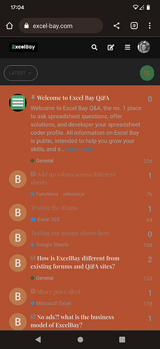](../../../assets/images/171809/8a4a7b0b4b4600b87fbcc58bc7687f5dfa68f9fd.png "Screenshot_20230224-170449")

I have this on two different setups with 2 different color themes

---

### Post #29 by [teknik](../../users/teknik.md)
*Posted: 2024-02-15 18:26*

My absolute favorite theme I’ve found but this and many other themes I’ve tried have this weird red issue in mobile please help me fix it! 🙏

[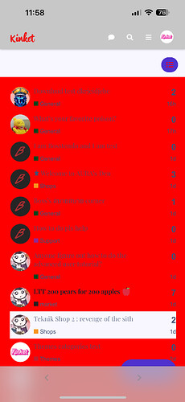](../../../assets/images/171809/9e6b28d27d59ebef519bcc4b81a97794e25a5553.jpeg "IMG_5318")

---
